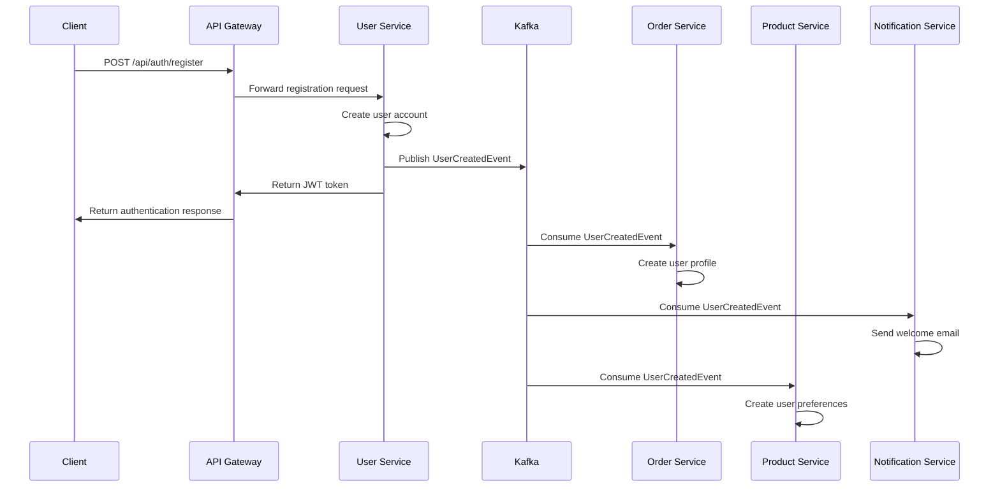
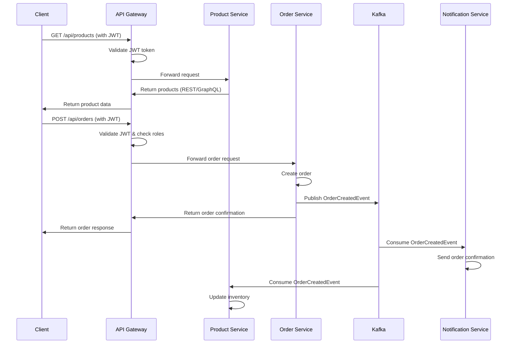

# Microservices Architecture - Complete Technical Documentation

## Table of Contents
1. [Eureka Server - Service Discovery](#eureka-server---service-discovery)2 Gateway - Centralized Routing](#api-gateway---centralized-routing)
3e - Authentication & Authorization](#user-service---authentication--authorization)
4. [Product Service - Product Catalog](#product-service---product-catalog)5. [Order Service - Order Management](#order-service---order-management)
6. [Kafka Integration - Asynchronous Communication](#kafka-integration---asynchronous-communication)
7. [Architecture Patterns & Best Practices](#architecture-patterns--best-practices)
8. [Testing Strategy](#testing-strategy)
9. [Deployment & Operations](#deployment--operations)

---

## Eureka Server - Service Discovery

### What is Eureka Server?

Eureka Server is a **Service Registry** and **Service Discovery** component in Netflix's microservices architecture. It acts as a central registry where all microservices register themselves and discover other services dynamically.

### Core Architecture Role

Eureka Server serves as the **central nervous system** of the microservices architecture:

1. **Service Registration**: All microservices register their instances with Eureka
2. **Service Discovery**: Services can find and communicate with each other through Eureka
3. **Health Monitoring**: Automatic health checks for registered services
4. **Load Balancing**: Supports client-side load balancing across multiple instances

### Why is Eureka Necessary?

In a microservices architecture, services need to communicate with each other. Without service discovery:

- **Hard-coded URLs**: Services would need to know exact hostnames and ports
- **Manual Configuration**: Every service change requires configuration updates
- **No Load Balancing**: No automatic distribution of load across instances
- **No Health Monitoring**: No way to detect failed services

Eureka solves these problems by providing:
- **Dynamic Service Discovery**: Services find each other automatically
- **Automatic Load Balancing**: Distributes requests across healthy instances
- **Health Monitoring**: Automatically removes unhealthy services
- **High Availability**: Multiple Eureka instances can be deployed

### How Eureka Works

#### 1. Service Registration Process

```java
@SpringBootApplication
@EnableDiscoveryClient  // Enables Eureka client
public class UserServiceApplication {
    public static void main(String) {
        SpringApplication.run(UserServiceApplication.class, args);
    }
}
```

**Registration Flow:**
1. **Service Startup**: Service starts and reads Eureka configuration
2ka Client Creation**: Spring creates Eureka client automatically3gistration Request**: Service sends registration to Eureka server
4. **Instance Registration**: Eureka stores service instance information5artbeat**: Service sends periodic heartbeats (every 30 seconds by default)

#### 2. Service Discovery Process

```java
@Autowired
private DiscoveryClient discoveryClient;

public List<ServiceInstance> getServiceInstances(String serviceName) {
    return discoveryClient.getInstances(serviceName);
}
```

**Discovery Flow:**
1. **Service Request**: Service needs to call another service2 **Eureka Query**: Service queries Eureka for target service instances
3. **Instance Selection**: Eureka returns list of available instances
4. **Load Balancing**: Client-side load balancer selects instance5 **Service Call**: Service makes HTTP call to selected instance

### Eureka Configuration

#### Server Configuration (application.yml)

```yaml
server:
  port:8761  # Default Eureka port

spring:
  application:
    name: eureka-server

eureka:
  client:
    register-with-eureka: false  # Server doesnt register itself
    fetch-registry: false        # Server doesnt fetch registry
  server:
    wait-time-in-ms-when-sync-empty:0  enable-self-preservation: true      # Prevents service eviction
    eviction-interval-timer-in-ms: 10lth check interval
```

**Key Configuration Properties:**

- `register-with-eureka: false`: Eureka server doesntregister itself as a client
- `fetch-registry: false`: Server doesn't fetch registry from other instances
- `enable-self-preservation: true`: Prevents services from being evicted during network issues
- `eviction-interval-timer-in-ms: 10How often to check for unhealthy services

#### Client Configuration (in each service)

```yaml
eureka:
  client:
    service-url:
      defaultZone: http://localhost:8761/eureka/
    enabled: true
  instance:
    prefer-ip-address: true
    lease-renewal-interval-in-seconds: 30
    lease-expiration-duration-in-seconds: 90
```

**Client Configuration Properties:**

- `service-url.defaultZone`: Eureka server URL
- `prefer-ip-address: true`: Use IP address instead of hostname
- `lease-renewal-interval-in-seconds:30 How often to send heartbeats
- `lease-expiration-duration-in-seconds: 90`: How long to wait before marking service as down

### Health Check Mechanism

#### How Eureka Monitors Service Health

1. **Heartbeat Monitoring**:
   - Services send heartbeats every 30onds (configurable)
   - Eureka expects heartbeats within the lease expiration duration
   - If no heartbeat received, service is marked as DOWN
2**Health Check Endpoints**:
   - Eureka uses Spring Boot Actuator health endpoints
   - `/actuator/health` endpoint provides service health status
   - Health checks are performed automatically

3. **Self-Preservation Mode**:
   - Prevents services from being evicted during network issues
   - If more than 85es are unavailable, self-preservation kicks in
   - Services are not evicted even if they dont send heartbeats

#### Health Check Configuration

```yaml
management:
  endpoints:
    web:
      exposure:
        include: health,info,metrics
  endpoint:
    health:
      show-details: always
```

### Eureka Dashboard

#### What the Dashboard Shows

1 **System Status**:
   - Environment: Development/Production
   - Data Center: Default
   - Current Time: Server timestamp
   - Uptime: How long server has been running

2. **Instance Information**:
   - Service Name: Name of registered service
   - Instance ID: Unique identifier for each instance
   - Status: UP/DOWN/OUT_OF_SERVICE
   - Health Check URL: Health endpoint URL
   - Last Updated: Last heartbeat timestamp

3. **Service Registry**:
   - Total number of services
   - Total number of instances
   - Instance count per service
   - Service metadata

#### Dashboard Features

- **Real-time Updates**: Dashboard updates automatically
- **Instance Details**: Click on service to see instance details
- **Health Status**: Visual indicators for service health
- **Metadata**: Service configuration and metadata
- **REST API**: Programmatic access to registry information

### Service Registration Details

#### What Information is Registered

```json[object Object]instanceId": user-service:8081,
  tName": "localhost",
  "app":USER-SERVICE",
  ipAddr": 192.1680.10.10, status": "UP",
 overriddenStatus": UNKNOWN,  port:[object Object]   $": 881
   @enabled: ue"
  },
securePort": {
    $443
    @enabled": "false"
  },
 countryId": 1,
 dataCenterInfo:[object Object]    @class": "com.netflix.appinfo.InstanceInfo$DefaultDataCenterInfo,   name": "MyOwn"
  },
  leaseInfo": {
    renewalIntervalInSecs":30    durationInSecs": 90,registrationTimestamp:16409952000,
    "lastRenewalTimestamp:16409952300evictionTimestamp:0serviceUpTimestamp: 1640995200000  },
 metadata": [object Object]  management.port: 8081 },
homePageUrl": http://localhost:8081,
  statusPageUrl": http://localhost:8081/actuator/info",
 healthCheckUrl": http://localhost:8081actuator/health,vipAddress":user-service",
 secureVipAddress":user-service",isCoordinatingDiscoveryServer": "false",
  "lastUpdatedTimestamp": 16409952300lastDirtyTimestamp": 164099520000,
  actionType:ADDED"
}
```

### Load Balancing with Eureka

#### Client-Side Load Balancing

Eureka enables client-side load balancing through Spring Cloud LoadBalancer:

```java
@LoadBalanced
@Bean
public RestTemplate restTemplate() {
    return new RestTemplate();
}

// Usage
@Service
public class OrderService[object Object]    @Autowired
    private RestTemplate restTemplate;
    
    public ProductDto getProduct(Long productId) [object Object]  // Automatically load balanced across product-service instances
        return restTemplate.getForObject(
         http://product-service/api/products/" + productId, 
            ProductDto.class
        );
    }
}
```

#### Load Balancing Strategies

1 **Round Robin** (Default): Distributes requests evenly
2. **Weighted Round Robin**: Assigns weights to instances
3. **Least Connections**: Routes to instance with fewest connections
4. **Random**: Randomly selects instances

### High Availability

#### Eureka Server Clustering

For production environments, deploy multiple Eureka servers:

```yaml
# Eureka Server 1eureka:
  client:
    service-url:
      defaultZone: http://eureka-server-2:8762eka/,http://eureka-server-3:8763/eureka/

# Eureka Server 2eureka:
  client:
    service-url:
      defaultZone: http://eureka-server-1:8761eka/,http://eureka-server-3:8763/eureka/

# Eureka Server 3eureka:
  client:
    service-url:
      defaultZone: http://eureka-server-1:8761eka/,http://eureka-server-2:8762/eureka/
```

#### Peer-to-Peer Communication

- Eureka servers communicate with each other
- Registry information is replicated across all instances
- If one server fails, others continue to serve requests
- Clients can connect to any Eureka server

### Security Considerations

#### Development Environment
- No authentication required
- Dashboard accessible to all
- Self-preservation enabled

#### Production Environment
- Enable authentication and authorization
- Secure dashboard access with Spring Security
- Configure proper network security
- Use HTTPS for all communication
- Implement proper logging and monitoring

### Monitoring and Troubleshooting

#### Key Metrics to Monitor
1gistration Metrics**:
   - Number of registered services
   - Registration success/failure rates
   - Service discovery latency

2. **Health Metrics**:
   - Service health status
   - Heartbeat success rates
   - Eviction rates3erformance Metrics**:
   - Response times
   - Memory usage
   - CPU utilization

#### Common Issues and Solutions1rvice Not Registering**:
   - Check Eureka server URL
   - Verify network connectivity
   - Check service configuration2rvice Not Discoverable**:
   - Verify service is registered
   - Check service name consistency
   - Verify load balancer configuration
3*Health Check Failures**:
   - Check actuator endpoints
   - Verify health check configuration
   - Check service dependencies

### Dependencies and Setup

#### Required Dependencies

```xml
<dependency>
    <groupId>org.springframework.cloud</groupId>
    <artifactId>spring-cloud-starter-netflix-eureka-server</artifactId>
</dependency>
<dependency>
    <groupId>org.springframework.boot</groupId>
    <artifactId>spring-boot-starter-actuator</artifactId>
</dependency>
```

#### Spring Cloud Version

```xml
<properties>
    <spring-cloud.version>20230ring-cloud.version>
</properties>
```

### Integration with Other Components

#### API Gateway Integration

The API Gateway uses Eureka for service discovery:

```yaml
spring:
  cloud:
    gateway:
      discovery:
        locator:
          enabled: true
          lower-case-service-id: true
      routes:
        - id: user-service
          uri: lb://user-service  # Load balanced URI
          predicates:
            - Path=/api/users/**
```

#### Service-to-Service Communication

Services use Eureka to find each other:

```java
@Autowired
private DiscoveryClient discoveryClient;

public String callProductService(Long productId) {
    List<ServiceInstance> instances = discoveryClient.getInstances("product-service");
    if (!instances.isEmpty())[object Object]   ServiceInstance instance = instances.get(0        String url = "http://" + instance.getHost() + :+ instance.getPort() + /api/products/" + productId;
        return restTemplate.getForObject(url, String.class);
    }
    throw new RuntimeException("Product service not available");
}
```

### Best Practices

#### 1. Service Naming
- Use consistent naming conventions
- Use lowercase with hyphens (kebab-case)
- Avoid special characters

#### 2. Configuration Management
- Externalize configuration
- Use environment-specific properties
- Implement proper secret management

#### 3Checks
- Implement comprehensive health checks
- Include dependency health (database, external services)
- Set appropriate timeouts

#### 4. Monitoring
- Set up alerts for service failures
- Monitor registration patterns
- Track performance metrics

#### 5. Security
- Implement authentication for production
- Use HTTPS for all communication
- Regular security audits

### Testing Eureka

#### Unit Testing

```java
@SpringBootTest
@AutoConfigureTestDatabase
class EurekaServerApplicationTests[object Object]    
    @Test
    void contextLoads() {
        // Verify application starts successfully
    }
    
    @Test
    void eurekaServerStarts() {
        // Verify Eureka server is running
    }
}
```

#### Integration Testing

```java
@SpringBootTest(webEnvironment = SpringBootTest.WebEnvironment.RANDOM_PORT)
class ServiceRegistrationTest[object Object]    
    @Test
    void serviceRegistersWithEureka()[object Object]   // Test service registration
    }
    
    @Test
    void serviceDiscoveryWorks()[object Object]   // Test service discovery
    }
}
```

### Production Deployment

#### Docker Deployment

```dockerfile
FROM openjdk:17-jre-slim
COPY target/eureka-server-10jar app.jar
EXPOSE 8761
ENTRYPOINT [java",-jar",/app.jar"]
```

#### Kubernetes Deployment

```yaml
apiVersion: apps/v1
kind: Deployment
metadata:
  name: eureka-server
spec:
  replicas:3elector:
    matchLabels:
      app: eureka-server
  template:
    metadata:
      labels:
        app: eureka-server
    spec:
      containers:
      - name: eureka-server
        image: eureka-server:100    ports:
        - containerPort: 8761      env:
        - name: SPRING_PROFILES_ACTIVE
          value: production
```

---

## API Gateway - Centralized Routing & Cross-Cutting Concerns

### What is API Gateway?

API Gateway acts as the **single entry point** for all client requests in a microservices architecture. It serves as the **traffic controller** and **security boundary** for your entire microservices ecosystem, providing centralized routing, load balancing, authentication, and cross-cutting concerns.

### Why API Gateway is Essential

In a microservices architecture without an API Gateway:

- **Multiple Entry Points**: Clients need to know all service endpoints
- **Security Complexity**: Each service handles authentication/authorization
- **Cross-Cutting Concerns**: Rate limiting, logging, monitoring duplicated
- **Client Complexity**: Clients must implement service discovery and load balancing
- **Protocol Translation**: No unified interface for different protocols

API Gateway solves these problems by providing:
- **Single Entry Point**: One URL for all client requests
- **Centralized Security**: Authentication and authorization at the gateway
- **Cross-Cutting Concerns**: Rate limiting, logging, monitoring in one place
- **Protocol Translation**: REST, GraphQL, gRPC support
- **Client Simplification**: Clients only need to know the gateway URL

### Core Responsibilities

1. **Request Routing**: Routes requests to appropriate microservices
2. **Load Balancing**: Distributes load across service instances
3. **Authentication**: Validates JWT tokens and handles authorization
4**Rate Limiting**: Prevents abuse and ensures fair usage5 **CORS**: Handles cross-origin requests
6. **Circuit Breaker**: Provides fault tolerance
7. **Request/Response Transformation**: Modifies requests and responses8**Monitoring & Logging**: Centralized observability
9. **API Versioning**: Manages multiple API versions
10ttling**: Controls request flow

## Request Routing Strategies

### 1. Path-Based Routing

**Basic Path Routing:**
```yaml
spring:
  cloud:
    gateway:
      routes:
        - id: user-service
          uri: lb://user-service
          predicates:
            - Path=/api/users/**
          filters:
            - StripPrefix=1        
        - id: product-service
          uri: lb://product-service
          predicates:
            - Path=/api/products/**
          filters:
            - StripPrefix=1
```

**Advanced Path Routing with Multiple Predicates:**
```yaml
spring:
  cloud:
    gateway:
      routes:
        - id: user-service-v1
          uri: lb://user-service-v1
          predicates:
            - Path=/api/v1/users/**
            - Method=GET,POST
            - Header=X-API-Version, v1
          filters:
            - StripPrefix=3
            - AddRequestHeader=X-Source, gateway
        
        - id: user-service-v2
          uri: lb://user-service-v2
          predicates:
            - Path=/api/v2/users/**
            - Method=GET,POST,PUT,DELETE
            - Header=X-API-Version, v2
          filters:
            - StripPrefix=3
            - AddRequestHeader=X-Source, gateway
```

### 2. Header-Based Routing

**Content-Type Routing:**
```yaml
spring:
  cloud:
    gateway:
      routes:
        - id: json-api
          uri: lb://json-service
          predicates:
            - Header=Content-Type, application/json
        
        - id: xml-api
          uri: lb://xml-service
          predicates:
            - Header=Content-Type, application/xml
```

**Custom Header Routing:**
```yaml
spring:
  cloud:
    gateway:
      routes:
        - id: premium-users
          uri: lb://premium-service
          predicates:
            - Header=X-User-Tier, premium
        
        - id: standard-users
          uri: lb://standard-service
          predicates:
            - Header=X-User-Tier, standard
```

### 3 Parameter Routing

**Parameter-Based Routing:**
```yaml
spring:
  cloud:
    gateway:
      routes:
        - id: search-by-name
          uri: lb://search-service
          predicates:
            - Query=name
        
        - id: search-by-category
          uri: lb://category-service
          predicates:
            - Query=category
```

### 4. Weight-Based Routing (A/B Testing)

**Traffic Splitting:**
```yaml
spring:
  cloud:
    gateway:
      routes:
        - id: service-a
          uri: lb://service-a
          predicates:
            - Weight=group1, 8        
        - id: service-b
          uri: lb://service-b
          predicates:
            - Weight=group1, 2
```

## Load Balancing Strategies

### 1. Client-Side Load Balancing with Eureka Integration

**How API Gateway and Eureka Work Together:**

The API Gateway uses Eureka for service discovery and then applies client-side load balancing. Here's the complete flow:

```yaml
# API Gateway Configuration with Eureka Integration
spring:
  cloud:
    gateway:
      discovery:
        locator:
          enabled: true
          lower-case-service-id: true
      routes:
        - id: user-service
          uri: lb://user-service  # lb:// prefix enables load balancing via Eureka
          predicates:
            - Path=/api/users/**
        - id: product-service
          uri: lb://product-service
          predicates:
            - Path=/api/products/**
        - id: order-service
          uri: lb://order-service
          predicates:
            - Path=/api/orders/**

# Eureka Client Configuration in API Gateway
eureka:
  client:
    service-url:
      defaultZone: http://localhost:8761/eureka/
    enabled: true
  instance:
    prefer-ip-address: true
```

**Service Discovery and Load Balancing Flow:**
```java
@Component
public class EurekaLoadBalancerIntegration {
    
    @Autowired
    private DiscoveryClient discoveryClient;
    
    @Autowired
    private LoadBalancerClient loadBalancerClient;
    
    public Mono<String> routeRequest(String serviceName, String path) {
        // 1. Discover service instances from Eureka
        List<ServiceInstance> instances = discoveryClient.getInstances(serviceName);
        
        if (instances.isEmpty()) {
            return Mono.error(new ServiceNotFoundException("No instances found for " + serviceName));
        }
        
        // 2. Apply load balancing algorithm
        ServiceInstance selectedInstance = loadBalancerClient.choose(serviceName);
        
        // 3equest to selected instance
        return webClient.get()
            .uri(selectedInstance.getUri() + path)
            .retrieve()
            .bodyToMono(String.class);
    }
}
```

**Custom Load Balancer Configuration:**
```java
@Configuration
public class LoadBalancerConfig[object Object]    
    @Bean
    @LoadBalanced
    public WebClient.Builder loadBalancedWebClientBuilder() {
        return WebClient.builder();
    }
    
    @Bean
    public ReactorLoadBalancerExchangeFilterFunction loadBalancerExchangeFilterFunction(
            ReactorServiceInstanceLoadBalancer loadBalancer) {
        return new ReactorLoadBalancerExchangeFilterFunction(loadBalancer);
    }
    
    @Bean
    public ServiceInstanceListSupplier serviceInstanceListSupplier() {
        return new DiscoveryClientServiceInstanceListSupplier(discoveryClient);
    }
}
```

###2lancing Algorithms

**Round Robin (Default):**
```java
@Bean
public ReactorServiceInstanceLoadBalancer roundRobinLoadBalancer(
        Environment environment,
        LoadBalancerClientFactory loadBalancerClientFactory)[object Object]
    String name = environment.getProperty(LoadBalancerClientFactory.PROPERTY_NAME);
    return new RoundRobinLoadBalancer(
        loadBalancerClientFactory.getLazyProvider(name, ServiceInstanceListSupplier.class),
        name
    );
}
```

**Weighted Round Robin:**
```java
@Component
public class WeightedRoundRobinLoadBalancer implements ReactorServiceInstanceLoadBalancer [object Object]
    private final Map<String, Integer> weights = Map.of(
      service-a", 3,
        service-b",1
    );
    
    @Override
    public Mono<Response<ServiceInstance>> choose(Request request) {
        // Implementation for weighted round robin
        return Mono.just(new DefaultResponse(selectedInstance));
    }
}
```

**Least Connections:**
```java
@Component
public class LeastConnectionsLoadBalancer implements ReactorServiceInstanceLoadBalancer [object Object]
    private final Map<String, AtomicInteger> connectionCounts = new ConcurrentHashMap<>();
    
    @Override
    public Mono<Response<ServiceInstance>> choose(Request request) {
        return serviceInstanceListSupplier.get()
            .next()
            .map(serviceInstances ->[object Object]           ServiceInstance selected = serviceInstances.getInstances()
                    .stream()
                    .min(Comparator.comparing(instance -> 
                        connectionCounts.getOrDefault(instance.getInstanceId(), new AtomicInteger(0)).get()))
                    .orElse(null);
                
                if (selected != null) {
                    connectionCounts.computeIfAbsent(selected.getInstanceId(), k -> new AtomicInteger(0)).incrementAndGet();
                }
                
                return new DefaultResponse(selected);
            });
    }
}
```

### 3. Health-Aware Load Balancing

**Health Check Integration:**
```yaml
spring:
  cloud:
    loadbalancer:
      health-check:
        initial-delay: 0
        interval:25    cache:
        enabled: true
        ttl: 35s
        capacity:256`

**Custom Health Check:**
```java
@Component
public class CustomHealthCheckLoadBalancer implements ReactorServiceInstanceLoadBalancer {
    
    @Override
    public Mono<Response<ServiceInstance>> choose(Request request) {
        return serviceInstanceListSupplier.get()
            .next()
            .map(serviceInstances ->[object Object]              List<ServiceInstance> healthyInstances = serviceInstances.getInstances()
                    .stream()
                    .filter(this::isHealthy)
                    .collect(Collectors.toList());
                
                if (healthyInstances.isEmpty()) {
                    return new EmptyResponse();
                }
                
                // Apply load balancing algorithm to healthy instances
                ServiceInstance selected = applyLoadBalancingAlgorithm(healthyInstances);
                return new DefaultResponse(selected);
            });
    }
    
    private boolean isHealthy(ServiceInstance instance) {
        try[object Object]         WebClient webClient = WebClient.create();
            return webClient.get()
                .uri(instance.getUri() +/actuator/health)
                .retrieve()
                .bodyToMono(String.class)
                .map(response -> response.contains("UP"))
                .block(Duration.ofSeconds(5));
        } catch (Exception e) {
            return false;
        }
    }
}
```

## Rate Limiting Implementation

### 1. Token Bucket Algorithm

**Token Bucket Implementation:**
```java
@Component
public class TokenBucketRateLimiter [object Object]
    private final Map<String, TokenBucket> buckets = new ConcurrentHashMap<>();
    private final int capacity;
    private final int refillRate;
    
    public TokenBucketRateLimiter(@Value("${rate.limit.capacity:10}") int capacity,
                                 @Value("${rate.limit.refill-rate:10})int refillRate) {
        this.capacity = capacity;
        this.refillRate = refillRate;
    }
    
    public boolean allowRequest(String key) {
        TokenBucket bucket = buckets.computeIfAbsent(key, k -> new TokenBucket(capacity, refillRate));
        return bucket.tryConsume(1}
    
    private static class TokenBucket[object Object]     private final int capacity;
        private final int refillRate;
        private int tokens;
        private long lastRefillTime;
        
        public TokenBucket(int capacity, int refillRate) [object Object]            this.capacity = capacity;
            this.refillRate = refillRate;
            this.tokens = capacity;
            this.lastRefillTime = System.currentTimeMillis();
        }
        
        public synchronized boolean tryConsume(int tokens)[object Object]            refill();
            if (this.tokens >= tokens)[object Object]              this.tokens -= tokens;
                return true;
            }
            return false;
        }
        
        private void refill() [object Object]          long now = System.currentTimeMillis();
            long timePassed = now - lastRefillTime;
            int tokensToAdd = (int) (timePassed /100te);
            
            if (tokensToAdd > 0)[object Object]            tokens = Math.min(capacity, tokens + tokensToAdd);
                lastRefillTime = now;
            }
        }
    }
}
```

###2liding Window Rate Limiting

**Sliding Window Implementation:**
```java
@Component
public class SlidingWindowRateLimiter [object Object]
    private final Map<String, Queue<Long>> requestTimestamps = new ConcurrentHashMap<>();
    private final int windowSize;
    private final int maxRequests;
    
    public SlidingWindowRateLimiter(@Value("${rate.limit.window-size:60}") int windowSize,
                                   @Value(${rate.limit.max-requests:100}) int maxRequests) {
        this.windowSize = windowSize;
        this.maxRequests = maxRequests;
    }
    
    public boolean allowRequest(String key) {
        long currentTime = System.currentTimeMillis();
        Queue<Long> timestamps = requestTimestamps.computeIfAbsent(key, k -> new ConcurrentLinkedQueue<>());
        
        // Remove timestamps outside the window
        while (!timestamps.isEmpty() && currentTime - timestamps.peek() > windowSize * 10[object Object]        timestamps.poll();
        }
        
        if (timestamps.size() < maxRequests)[object Object]        timestamps.offer(currentTime);
            return true;
        }
        
        return false;
    }
}
```

### 3. Rate Limiting by User/Service

**User-Based Rate Limiting:**
```java
@Component
public class UserRateLimiter [object Object]
    private final TokenBucketRateLimiter rateLimiter;
    
    public UserRateLimiter(TokenBucketRateLimiter rateLimiter) {
        this.rateLimiter = rateLimiter;
    }
    
    public boolean allowRequest(ServerHttpRequest request) {
        String userId = extractUserId(request);
        if (userId == null) {
            return rateLimiter.allowRequest("anonymous");
        }
        
        return rateLimiter.allowRequest("user:" + userId);
    }
    
    private String extractUserId(ServerHttpRequest request) {
        String token = request.getHeaders().getFirst(Authorization");
        if (token != null && token.startsWith("Bearer)) {
            // Extract user ID from JWT token
            return extractUserIdFromToken(token.substring(7));
        }
        return null;
    }
}
```

**Service-Based Rate Limiting:**
```yaml
spring:
  cloud:
    gateway:
      routes:
        - id: user-service
          uri: lb://user-service
          predicates:
            - Path=/api/users/**
          filters:
            - name: RequestRateLimiter
              args:
                redis-rate-limiter.replenishRate: 10             redis-rate-limiter.burstCapacity: 20               key-resolver: "#{@userKeyResolver}
```

### 4. Rate Limiting Configuration

**Different Limits for Different Endpoints:**
```yaml
rate:
  limit:
    endpoints:
      /api/users/profile:
        requests-per-minute: 60
        burst-capacity: 10
      /api/products:
        requests-per-minute:100
        burst-capacity: 20
      /api/orders:
        requests-per-minute: 30
        burst-capacity:5``

## Circuit Breaker Implementation

### 1uit Breaker States

**Circuit Breaker State Machine:**
```java
public enum CircuitBreakerState[object Object]    CLOSED,     // Normal operation
    OPEN,       // Failing, requests blocked
    HALF_OPEN   // Testing if service recovered
}

@Component
public class CircuitBreaker [object Object]   private CircuitBreakerState state = CircuitBreakerState.CLOSED;
    private int failureCount = 0rivate int successCount = 0;
    private long lastFailureTime = 0;
    
    private final int failureThreshold;
    private final int successThreshold;
    private final long timeout;
    
    public CircuitBreaker(@Value(${circuit.breaker.failure-threshold:5}") int failureThreshold,
                         @Value(${circuit.breaker.success-threshold:3}") int successThreshold,
                         @Value(${circuit.breaker.timeout:60000) long timeout) {
        this.failureThreshold = failureThreshold;
        this.successThreshold = successThreshold;
        this.timeout = timeout;
    }
    
    public boolean allowRequest() [object Object]     switch (state) [object Object]           case CLOSED:
                return true;
            case OPEN:
                if (System.currentTimeMillis() - lastFailureTime > timeout) {
                    state = CircuitBreakerState.HALF_OPEN;
                    return true;
                }
                return false;
            case HALF_OPEN:
                return true;
            default:
                return false;
        }
    }
    
    public void recordSuccess()[object Object]      failureCount = 0;
        if (state == CircuitBreakerState.HALF_OPEN) {
            successCount++;
            if (successCount >= successThreshold)[object Object]             state = CircuitBreakerState.CLOSED;
                successCount =0         }
        }
    }
    
    public void recordFailure()[object Object]      failureCount++;
        lastFailureTime = System.currentTimeMillis();
        
        if (state == CircuitBreakerState.CLOSED && failureCount >= failureThreshold) {
            state = CircuitBreakerState.OPEN;
        } else if (state == CircuitBreakerState.HALF_OPEN) {
            state = CircuitBreakerState.OPEN;
            successCount = 0;
        }
    }
}
```

### 2. Resilience4gration

**Circuit Breaker Configuration:**
```yaml
resilience4j:
  circuitbreaker:
    configs:
      default:
        sliding-window-size: 10    minimum-number-of-calls:5      failure-rate-threshold:50     wait-duration-in-open-state: 5s
        permitted-number-of-calls-in-half-open-state: 3
        automatic-transition-from-open-to-half-open-enabled: true
        record-exceptions:
          - java.io.IOException
          - java.util.concurrent.TimeoutException
          - java.net.SocketTimeoutException
    instances:
      user-service:
        base-config: default
        failure-rate-threshold:30     wait-duration-in-open-state:10   product-service:
        base-config: default
        failure-rate-threshold:40     wait-duration-in-open-state:8```

**Circuit Breaker Usage:**
```java
@Component
public class CircuitBreakerService [object Object]
    private final CircuitBreaker userServiceCircuitBreaker;
    private final CircuitBreaker productServiceCircuitBreaker;
    
    public CircuitBreakerService(CircuitBreakerRegistry circuitBreakerRegistry) {
        this.userServiceCircuitBreaker = circuitBreakerRegistry.circuitBreaker("user-service");
        this.productServiceCircuitBreaker = circuitBreakerRegistry.circuitBreaker("product-service); }
    
    public Mono<String> callUserService(String userId) {
        return userServiceCircuitBreaker.run(
            () -> webClient.get()
                .uri("/api/users/" + userId)
                .retrieve()
                .bodyToMono(String.class),
            throwable -> Mono.just("User service unavailable")
        );
    }
    
    public Mono<String> callProductService(String productId) {
        return productServiceCircuitBreaker.run(
            () -> webClient.get()
                .uri(/api/products/" + productId)
                .retrieve()
                .bodyToMono(String.class),
            throwable -> Mono.just("Product service unavailable")
        );
    }
}
```

### 3. Fallback Mechanisms

**Fallback Strategies:**
```java
@Component
public class FallbackService[object Object]  
    public Mono<String> userServiceFallback(Throwable throwable) {
        return Mono.just([object Object]
                status": "service_unavailable,
              message": "User service is temporarily unavailable,
              fallback_data": {
              user_id": "unknown",
                    username": "guest"
                }
            }
           ); }
    
    public Mono<String> productServiceFallback(Throwable throwable) {
        return Mono.just([object Object]
                status": "service_unavailable,
          message": "Product service is temporarily unavailable,
              fallback_data": {
                 product_id": "unknown",
                  name": "Product Unavailable",
               price0                }
            }
           ); }
    
    public Mono<String> cacheFallback(String key, Throwable throwable) {
        // Return cached data if available
        return cacheService.get(key)
            .switchIfEmpty(Mono.just("No cached data available));
    }
}
```

## Request/Response Transformation

### 1. Request Transformation

**Header Modification:**
```java
@Component
public class RequestTransformationFilter implements GlobalFilter {
    
    @Override
    public Mono<Void> filter(ServerWebExchange exchange, GatewayFilterChain chain) {
        ServerHttpRequest request = exchange.getRequest();
        
        // Add correlation ID
        String correlationId = UUID.randomUUID().toString();
        ServerHttpRequest modifiedRequest = request.mutate()
            .header("X-Correlation-ID, correlationId)
            .header("X-Request-Timestamp", String.valueOf(System.currentTimeMillis()))
            .header("X-Gateway-Source, eway")
            .build();
        
        return chain.filter(exchange.mutate().request(modifiedRequest).build());
    }
}
```

**Request Body Transformation:**
```java
@Component
public class RequestBodyTransformationFilter implements GlobalFilter {
    
    @Override
    public Mono<Void> filter(ServerWebExchange exchange, GatewayFilterChain chain) {
        if (exchange.getRequest().getMethod() == HttpMethod.POST) {
            return DataBufferUtils.join(exchange.getRequest().getBody())
                .flatMap(dataBuffer -> {
                    String body = dataBuffer.toString(StandardCharsets.UTF_8);
                    
                    // Transform request body
                    String transformedBody = transformRequestBody(body);
                    
                    DataBuffer newBuffer = exchange.getResponse().bufferFactory()
                        .wrap(transformedBody.getBytes(StandardCharsets.UTF_8));
                    
                    ServerHttpRequest modifiedRequest = exchange.getRequest().mutate()
                        .body(Mono.just(newBuffer))
                        .build();
                    
                    return chain.filter(exchange.mutate().request(modifiedRequest).build());
                });
        }
        
        return chain.filter(exchange);
    }
    
    private String transformRequestBody(String body) {
        // Add additional fields or modify existing ones
        ObjectMapper mapper = new ObjectMapper();
        try [object Object]          JsonNode node = mapper.readTree(body);
            ObjectNode modifiedNode = (ObjectNode) node;
            modifiedNode.put("transformed_at", System.currentTimeMillis());
            modifiedNode.put(gateway_version", "1.0            return mapper.writeValueAsString(modifiedNode);
        } catch (Exception e) {
            return body;
        }
    }
}
```

### 2. Response Transformation

**Response Header Modification:**
```java
@Component
public class ResponseTransformationFilter implements GlobalFilter {
    
    @Override
    public Mono<Void> filter(ServerWebExchange exchange, GatewayFilterChain chain) {
        return chain.filter(exchange)
            .then(Mono.fromRunnable(() ->[object Object]            ServerHttpResponse response = exchange.getResponse();
                response.getHeaders().add(X-Response-Time", 
                    String.valueOf(System.currentTimeMillis() - 
                        Long.parseLong(exchange.getRequest().getHeaders()
                            .getFirst("X-Request-Timestamp"))));
                response.getHeaders().add(X-Gateway-Processed", "true");
            }));
    }
}
```

**Response Body Transformation:**
```java
@Component
public class ResponseBodyTransformationFilter implements GlobalFilter {
    
    @Override
    public Mono<Void> filter(ServerWebExchange exchange, GatewayFilterChain chain) {
        return chain.filter(exchange)
            .then(Mono.fromRunnable(() ->[object Object]                // Transform response body if needed
                String responseBody = getResponseBody(exchange);
                if (responseBody != null) {
                    String transformedBody = transformResponseBody(responseBody);
                    setResponseBody(exchange, transformedBody);
                }
            }));
    }
    
    private String transformResponseBody(String body) {
        ObjectMapper mapper = new ObjectMapper();
        try [object Object]          JsonNode node = mapper.readTree(body);
            ObjectNode modifiedNode = (ObjectNode) node;
            modifiedNode.put(gateway_processed", true);
            modifiedNode.put("response_timestamp", System.currentTimeMillis());
            return mapper.writeValueAsString(modifiedNode);
        } catch (Exception e) {
            return body;
        }
    }
}
```

## Monitoring and Observability

### 1. Metrics Collection

**Micrometer Integration:**
```yaml
management:
  endpoints:
    web:
      exposure:
        include: health,info,metrics,prometheus
  metrics:
    export:
      prometheus:
        enabled: true
    tags:
      application: api-gateway
      environment: ${spring.profiles.active}
```

**Custom Metrics:**
```java
@Component
public class GatewayMetrics [object Object]
    private final MeterRegistry meterRegistry;
    private final Counter requestCounter;
    private final Timer requestTimer;
    private final Gauge activeConnections;
    
    public GatewayMetrics(MeterRegistry meterRegistry) {
        this.meterRegistry = meterRegistry;
        this.requestCounter = Counter.builder("gateway.requests.total")
            .description("Total number of requests")
            .register(meterRegistry);
        this.requestTimer = Timer.builder(gateway.request.duration")
            .description("Request duration")
            .register(meterRegistry);
        this.activeConnections = Gauge.builder("gateway.connections.active")
            .description("Active connections")
            .register(meterRegistry, this, GatewayMetrics::getActiveConnections);
    }
    
    public void recordRequest(String service, String method, int statusCode)[object Object]    requestCounter.increment(Tags.of(
            service", service,
            methodethod,
          status", String.valueOf(statusCode)
        ));
    }
    
    public Timer.Sample startTimer() {
        return Timer.start(meterRegistry);
    }
    
    public void stopTimer(Timer.Sample sample, String service) {
        sample.stop(Timer.builder(gateway.request.duration")
            .tag(service", service)
            .register(meterRegistry));
    }
    
    private double getActiveConnections() {
        // Implementation to get active connections
        return 0;
    }
}
```

### 2. Distributed Tracing

**Sleuth Integration:**
```yaml
spring:
  sleuth:
    sampler:
      probability: 10
    propagation:
      type: B3
    messaging:
      kafka:
        streams:
          enabled: false
```

**Custom Trace Headers:**
```java
@Component
public class TracingFilter implements GlobalFilter {
    
    @Override
    public Mono<Void> filter(ServerWebExchange exchange, GatewayFilterChain chain) {
        String traceId = exchange.getRequest().getHeaders().getFirst("X-Trace-ID");
        if (traceId == null) {
            traceId = UUID.randomUUID().toString();
        }
        
        ServerHttpRequest modifiedRequest = exchange.getRequest().mutate()
            .header("X-Trace-ID", traceId)
            .header("X-Span-ID,UUID.randomUUID().toString())
            .build();
        
        return chain.filter(exchange.mutate().request(modifiedRequest).build());
    }
}
```

## Security Implementation

### 1. JWT Authentication

**JWT Validation Filter:**
```java
@Component
public class JwtAuthenticationFilter implements GlobalFilter [object Object]
    private final JwtUtil jwtUtil;
    private final List<String> publicEndpoints = Arrays.asList(
      /api/auth/login",
 /api/auth/register",
       /actuator/health"
    );
    
    public JwtAuthenticationFilter(JwtUtil jwtUtil) [object Object]      this.jwtUtil = jwtUtil;
    }
    
    @Override
    public Mono<Void> filter(ServerWebExchange exchange, GatewayFilterChain chain) {
        String path = exchange.getRequest().getPath().toString();
        
        // Skip authentication for public endpoints
        if (isPublicEndpoint(path)) {
            return chain.filter(exchange);
        }
        
        String token = extractToken(exchange.getRequest());
        if (token != null && jwtUtil.validateToken(token)) {
            // Add user information to headers
            String userId = jwtUtil.getUserIdFromToken(token);
            String userRole = jwtUtil.getUserRoleFromToken(token);
            
            ServerHttpRequest modifiedRequest = exchange.getRequest().mutate()
                .header("X-User-Id", userId)
                .header("X-User-Role", userRole)
                .header(X-Authenticated", "true)
                .build();
            
            return chain.filter(exchange.mutate().request(modifiedRequest).build());
        }
        
        return unauthorized(exchange);
    }
    
    private boolean isPublicEndpoint(String path) {
        return publicEndpoints.stream().anyMatch(path::startsWith);
    }
    
    private String extractToken(ServerHttpRequest request) {
        String authHeader = request.getHeaders().getFirst(Authorization");
        if (authHeader != null && authHeader.startsWith("Bearer)) {            return authHeader.substring(7);
        }
        return null;
    }
    
    private Mono<Void> unauthorized(ServerWebExchange exchange) [object Object]      exchange.getResponse().setStatusCode(HttpStatus.UNAUTHORIZED);
        return exchange.getResponse().setComplete();
    }
}
```

### 2. Role-Based Authorization

**Authorization Filter:**
```java
@Component
public class RoleAuthorizationFilter implements GlobalFilter [object Object]
    private final Map<String, List<String>> endpointRoles = Map.of(
       /api/users/admin", List.of("ADMIN"),
        /api/products/manage", List.of("ADMIN", "MANAGER),      /api/orders/all", List.of("ADMIN", "MANAGER"),
 /api/users/profile, List.of(USER,ADMIN", MANAGER)
    );
    
    @Override
    public Mono<Void> filter(ServerWebExchange exchange, GatewayFilterChain chain) {
        String path = exchange.getRequest().getPath().toString();
        String userRole = exchange.getRequest().getHeaders().getFirst("X-User-Role");
        
        if (endpointRoles.containsKey(path)) [object Object]       List<String> requiredRoles = endpointRoles.get(path);
            if (userRole == null || !requiredRoles.contains(userRole))[object Object]            return forbidden(exchange);
            }
        }
        
        return chain.filter(exchange);
    }
    
    private Mono<Void> forbidden(ServerWebExchange exchange) [object Object]      exchange.getResponse().setStatusCode(HttpStatus.FORBIDDEN);
        return exchange.getResponse().setComplete();
    }
}
```

## Performance Optimization

### 1. Caching Strategies

**Response Caching:**
```java
@Component
public class ResponseCachingFilter implements GlobalFilter [object Object]
    private final Cache<String, String> responseCache;
    
    public ResponseCachingFilter() {
        this.responseCache = Caffeine.newBuilder()
            .maximumSize(10)
            .expireAfterWrite(Duration.ofMinutes(5))
            .build();
    }
    
    @Override
    public Mono<Void> filter(ServerWebExchange exchange, GatewayFilterChain chain) {
        String cacheKey = generateCacheKey(exchange.getRequest());
        
        // Check cache for GET requests
        if (exchange.getRequest().getMethod() == HttpMethod.GET) {
            String cachedResponse = responseCache.getIfPresent(cacheKey);
            if (cachedResponse != null)[object Object]            return writeCachedResponse(exchange, cachedResponse);
            }
        }
        
        return chain.filter(exchange)
            .then(Mono.fromRunnable(() ->[object Object]                // Cache successful GET responses
                if (exchange.getRequest().getMethod() == HttpMethod.GET &&
                    exchange.getResponse().getStatusCode() == HttpStatus.OK) {
                    String responseBody = getResponseBody(exchange);
                    if (responseBody != null) {
                        responseCache.put(cacheKey, responseBody);
                    }
                }
            }));
    }
    
    private String generateCacheKey(ServerHttpRequest request) {
        return request.getMethod() +: + request.getURI().getPath() + ": +           request.getHeaders().getFirst("X-User-Id");
    }
}
```

### 2Connection Pooling

**WebClient Configuration:**
```java
@Configuration
public class WebClientConfig[object Object]    
    @Bean
    public WebClient webClient() {
        HttpClient httpClient = HttpClient.create()
            .option(ChannelOption.CONNECT_TIMEOUT_MILLIS,50         .responseTimeout(Duration.ofSeconds(10))
            .doOnConnected(conn -> conn
                .addHandlerLast(new ReadTimeoutHandler(10))
                .addHandlerLast(new WriteTimeoutHandler(10)));
        
        return WebClient.builder()
            .clientConnector(new ReactorClientHttpConnector(httpClient))
            .build();
    }
}
```

## Real-World API Gateway Examples

###1. Netflix Zuul

**Netflix's Original API Gateway:**
- **Scale**: Handles billions of requests per day
- **Features**: Dynamic routing, monitoring, security
- **Architecture**: Multi-region deployment with failover

### 2. Amazon API Gateway

**AWS Managed API Gateway:**
- **Features**: REST and WebSocket APIs
- **Integration**: Lambda, EC2, ECS
- **Security**: AWS IAM, Cognito, API keys
- **Monitoring**: CloudWatch integration

###3. Kong Gateway

**Open-Source API Gateway:**
- **Plugin Architecture**: Extensible with plugins
- **Performance**: Built on Nginx
- **Features**: Rate limiting, authentication, logging
- **Deployment**: Docker, Kubernetes, bare metal

### 4. Google Cloud Endpoints

**GooglesAPI Management:**
- **OpenAPI Support**: Swagger/OpenAPI specification
- **Security**: API keys, OAuth 2.0Firebase Auth
- **Monitoring**: Stackdriver integration
- **Developer Portal**: Built-in API documentation

### Configuration and Setup

#### Gateway Routes

```yaml
spring:
  cloud:
    gateway:
      routes:
        - id: user-service
          uri: lb://user-service
          predicates:
            - Path=/api/users/**,/api/auth/**
          filters:
            - RewritePath=/api/(?<segment>.*), /${segment}
            - CircuitBreaker=name=user-service-circuit-breaker,fallbackUri=forward:/fallback/user-service
        
        - id: product-service
          uri: lb://product-service
          predicates:
            - Path=/api/products/**
          filters:
            - RewritePath=/api/(?<segment>.*), /${segment}
            - CircuitBreaker=name=product-service-circuit-breaker,fallbackUri=forward:/fallback/product-service
        
        - id: order-service
          uri: lb://order-service
          predicates:
            - Path=/api/orders/**
          filters:
            - RewritePath=/api/(?<segment>.*), /${segment}
            - CircuitBreaker=name=order-service-circuit-breaker,fallbackUri=forward:/fallback/order-service
```

#### JWT Authentication Filter

```java
@Component
public class JwtAuthenticationFilter implements GlobalFilter {
    
    @Override
    public Mono<Void> filter(ServerWebExchange exchange, GatewayFilterChain chain) {
        ServerHttpRequest request = exchange.getRequest();
        
        // Skip authentication for public endpoints
        if (isPublicEndpoint(request.getPath().toString())) {
            return chain.filter(exchange);
        }
        
        // Extract and validate JWT token
        String token = extractToken(request);
        if (validateToken(token)) {
            // Add user info to headers for downstream services
            ServerHttpRequest modifiedRequest = request.mutate()
                .header("X-User-Id", getUserIdFromToken(token))
                .header("X-User-Role, getUserRoleFromToken(token))
                .build();
            
            return chain.filter(exchange.mutate().request(modifiedRequest).build());
        }
        
        return unauthorized(exchange);
    }
}
```

### Load Balancing Integration

The API Gateway integrates with Eureka for service discovery and load balancing:

```yaml
eureka:
  client:
    service-url:
      defaultZone: http://localhost:8761/eureka/

spring:
  cloud:
    gateway:
      discovery:
        locator:
          enabled: true
          lower-case-service-id: true
```

### Circuit Breaker Implementation

```yaml
resilience4j:
  circuitbreaker:
    configs:
      default:
        sliding-window-size: 10    minimum-number-of-calls:5      failure-rate-threshold:50     wait-duration-in-open-state: 5s
        permitted-number-of-calls-in-half-open-state: 3
```

---

## User Service - Authentication & Authorization

### Core Functionality

The User Service handles user management, authentication, and authorization:

1. **User Registration**: Create new user accounts
2. **User Authentication**: Login with credentials
3. **JWT Token Generation**: Generate and validate JWT tokens4Profile Management**: Retrieve and update user information

### Security Implementation

#### JWT Token Generation

```java
@Component
public class JwtUtil[object Object]
    
    @Value("${jwt.secret}")
    private String secret;
    
    @Value("${jwt.expiration}")
    private Long expiration;
    
    public String generateToken(UserDetails userDetails) {
        Map<String, Object> claims = new HashMap<>();
        return createToken(claims, userDetails.getUsername());
    }
    
    private String createToken(Map<String, Object> claims, String subject) [object Object]
        return Jwts.builder()
            .setClaims(claims)
            .setSubject(subject)
            .setIssuedAt(new Date(System.currentTimeMillis()))
            .setExpiration(new Date(System.currentTimeMillis() + expiration))
            .signWith(SignatureAlgorithm.HS512, secret)
            .compact();
    }
}
```

#### Password Security

```java
@Component
public class PasswordEncoder [object Object]
    private final BCryptPasswordEncoder encoder = new BCryptPasswordEncoder();
    
    public String encode(String password) {
        return encoder.encode(password);
    }
    
    public boolean matches(String rawPassword, String encodedPassword) {
        return encoder.matches(rawPassword, encodedPassword);
    }
}
```

### API Endpoints

1. **POST /api/auth/register** - User registration
2. **POST /api/auth/login** - User authentication
3. **GET /api/users/profile** - Get user profile (protected)

### Kafka Integration

The User Service publishes events to Kafka for asynchronous communication:

```java
@Service
public class KafkaProducerService {
    
    @Autowired
    private KafkaTemplate<String, Object> kafkaTemplate;
    
    public void publishUserCreatedEvent(UserDto user) {
        kafkaTemplate.send("user-events, ser.created", user);
    }
    
    public void publishUserUpdatedEvent(UserDto user) {
        kafkaTemplate.send("user-events, ser.updated, user);
    }
}
```

---

## Product Service - Product Catalog

### Core Functionality

The Product Service manages the product catalog with both REST and GraphQL APIs:

1. **Product Management**: CRUD operations for products
2. **GraphQL Support**: Flexible querying and mutations
3. **Category Management**: Product categorization
4. **Kafka Integration**: Event publishing for product changes

### GraphQL Implementation

#### Schema Definition

```graphql
type Product[object Object]  id: ID!
    name: String!
    description: String
    price: Float!
    category: ProductCategory!
    stockQuantity: Int!
    createdAt: String!
    updatedAt: String!
}

enum ProductCategory [object Object]   ELECTRONICS
    CLOTHING
    BOOKS
    HOME
    SPORTS
}

type Query[object Object]products: [Product!]!
    product(id: ID!): Product
    productsByCategory(category: ProductCategory!): [Product!]!
}

type Mutation {
    createProduct(input: CreateProductInput!): Product!
    updateProduct(id: ID!, input: UpdateProductInput!): Product!
    deleteProduct(id: ID!): Boolean!
}

input CreateProductInput [object Object]    name: String!
    description: String
    price: Float!
    category: ProductCategory!
    stockQuantity: Int!
}

input UpdateProductInput [object Object]
    name: String
    description: String
    price: Float
    category: ProductCategory
    stockQuantity: Int
}
```

#### GraphQL Resolvers

```java
@Component
public class ProductQueryResolver implements GraphQLQueryResolver {
    
    @Autowired
    private ProductService productService;
    
    public List<Product> products() {
        return productService.getAllProducts();
    }
    
    public Product product(Long id) {
        return productService.getProductById(id);
    }
    
    public List<Product> productsByCategory(ProductCategory category) {
        return productService.getProductsByCategory(category);
    }
}
```

### REST API Endpoints

1. **POST /api/products** - Create product
2. **GET /api/products/{id}** - Get product by ID
3. **GET /api/products** - List all products
4. **PUT /api/products/{id}** - Update product
5. **DELETE /api/products/{id}** - Delete product

### Kafka Integration

```java
@Service
public class KafkaProducerService {
    
    @Autowired
    private KafkaTemplate<String, Object> kafkaTemplate;
    
    public void publishProductCreatedEvent(ProductDto product) {
        kafkaTemplate.send("product-events", product.created", product);
    }
    
    public void publishProductUpdatedEvent(ProductDto product) {
        kafkaTemplate.send("product-events", product.updated", product);
    }
    
    public void publishProductDeletedEvent(Long productId) {
        kafkaTemplate.send("product-events", product.deleted,productId);
    }
}
```

---

## Order Service - Order Management

### Core Functionality

The Order Service handles order processing and management:

1. **Order Creation**: Create new orders with multiple items2 Status Management**: Track order status (PENDING, CONFIRMED, SHIPPED, DELIVERED)
3**Order History**: Retrieve order history for users
4. **Kafka Integration**: Consume events from other services

### Order Processing Flow

1. **Order Creation**: User creates order with product items
2. **Inventory Check**: Verify product availability
3. **Order Confirmation**: Confirm order and update status
4. **Event Publishing**: Publish order events to Kafka
5. **Status Updates**: Track order through various statuses

### Kafka Event Consumption

```java
@Service
public class KafkaConsumerService[object Object]    @KafkaListener(topics = "user-events", groupId = "order-service-group)public void handleUserEvents(String message) {
        // Handle user events (user created, updated, etc.)
    }
    
    @KafkaListener(topics =product-events", groupId = "order-service-group)public void handleProductEvents(String message) {
        // Handle product events (product updated, deleted, etc.)
    }
}
```

### Order Status Management

```java
public enum OrderStatus {
    PENDING,      // Order created, waiting for confirmation
    CONFIRMED,    // Order confirmed, payment received
    SHIPPED,      // Order shipped to customer
    DELIVERED,    // Order delivered to customer
    CANCELLED     // Order cancelled
}
```

### API Endpoints

1. **POST /api/orders** - Create new order
2. **GET /api/orders/{id}** - Get order by ID
3. **GET /api/orders** - List all orders
4. **PUT /api/orders/{id}/status** - Update order status
5. **GET /api/orders/user/{userId}** - Get users order history

---

## Kafka Integration - Asynchronous Communication

### Why Kafka?

Kafka provides **asynchronous communication** between microservices, enabling:

1. **Loose Coupling**: Services don't need to know about each other
2. **Scalability**: Handle high-volume event processing
3. **Reliability**: Persistent message storage
4. **Real-time Processing**: Immediate event propagation

### Event-Driven Architecture

#### Event Types

1 **User Events**:
   - `user.created` - New user registered
   - `user.updated` - User profile updated
   - `user.deleted` - User account deleted

2. **Product Events**:
   - `product.created` - New product added
   - `product.updated` - Product information updated
   - `product.deleted` - Product removed
3. **Order Events**:
   - `order.created` - New order placed
   - `order.status.updated` - Order status changed
   - `order.cancelled` - Order cancelled

### Kafka Configuration

#### Producer Configuration

```yaml
spring:
  kafka:
    producer:
      bootstrap-servers: localhost:9092    key-serializer: org.apache.kafka.common.serialization.StringSerializer
      value-serializer: org.springframework.kafka.support.serializer.JsonSerializer
```

#### Consumer Configuration

```yaml
spring:
  kafka:
    consumer:
      bootstrap-servers: localhost:9092 group-id: service-group-id
      auto-offset-reset: earliest
      key-deserializer: org.apache.kafka.common.serialization.StringDeserializer
      value-deserializer: org.springframework.kafka.support.serializer.JsonDeserializer
```

### Event Publishing

```java
@Service
public class KafkaProducerService {
    
    @Autowired
    private KafkaTemplate<String, Object> kafkaTemplate;
    
    public void publishEvent(String topic, String eventType, Object payload) {
        kafkaTemplate.send(topic, eventType, payload);
    }
}
```

### Event Consumption

```java
@Service
public class KafkaConsumerService[object Object]    @KafkaListener(topics = "user-events", groupId =service-group)public void handleUserEvents(String message) {
        // Process user events
    }
    
    @KafkaListener(topics =product-events", groupId =service-group)public void handleProductEvents(String message) {
        // Process product events
    }
}
```

---

## Architecture Patterns & Best Practices

### 1. Service Discovery Pattern

**Problem**: How do services find each other in a distributed system?
**Solution**: Use a service registry (Eureka) where services register themselves and discover others.

**Benefits**:
- Dynamic service discovery
- Automatic load balancing
- Health monitoring
- High availability

### 2. API Gateway Pattern

**Problem**: How to provide a single entry point for all client requests?
**Solution**: Use an API Gateway that routes requests to appropriate services.

**Benefits**:
- Centralized routing
- Authentication and authorization
- Rate limiting
- CORS handling
- Circuit breaker implementation

### 3it Breaker Pattern

**Problem**: How to handle service failures gracefully?
**Solution**: Use circuit breakers to prevent cascading failures.

**States**:
- **Closed**: Normal operation
- **Open**: Service is failing, requests are blocked
- **Half-Open**: Testing if service has recovered

### 4. Event-Driven Architecture

**Problem**: How to enable loose coupling between services?
**Solution**: Use asynchronous messaging (Kafka) for service communication.

**Benefits**:
- Loose coupling
- Scalability
- Reliability
- Real-time processing

###5S Pattern (Command Query Responsibility Segregation)

**Problem**: How to optimize read and write operations separately?
**Solution**: Separate read and write models.

**Implementation**:
- Commands: Modify data (POST, PUT, DELETE)
- Queries: Retrieve data (GET)
- Different models for read and write operations

###6. Saga Pattern

**Problem**: How to maintain data consistency across multiple services?
**Solution**: Use distributed transactions with compensating actions.

**Implementation**:
- Choreography: Services communicate via events
- Orchestration: Central coordinator manages transactions

---

## Testing Strategy

###1Unit Testing

Test individual components in isolation:

```java
@ExtendWith(MockitoExtension.class)
class UserServiceTest[object Object]    
    @Mock
    private UserRepository userRepository;
    
    @Mock
    private PasswordEncoder passwordEncoder;
    
    @InjectMocks
    private UserService userService;
    
    @Test
    void createUser_Success()[object Object]      // Test user creation
    }
    
    @Test
    void createUser_DuplicateEmail_ThrowsException()[object Object] // Test duplicate email handling
    }
}
```

### 2. Integration Testing

Test service integration with dependencies:

```java
@SpringBootTest(webEnvironment = SpringBootTest.WebEnvironment.RANDOM_PORT)
@AutoConfigureTestDatabase
class UserControllerIntegrationTest {
    
    @Autowired
    private TestRestTemplate restTemplate;
    
    @Test
    void registerUser_Success()[object Object]      // Test user registration endpoint
    }
    
    @Test
    void loginUser_Success()[object Object]      // Test user login endpoint
    }
}
```

### 3. Contract Testing

Test service contracts using Pact:

```java
@ExtendWith(PactConsumerTestExt.class)
class UserServiceContractTest[object Object]    @Pact(consumer = "user-service")
    public RequestResponsePact createPact(PactDslWithProvider builder) {
        return builder
            .given("user exists")
            .uponReceiving("a request for user")
            .path("/api/users/1")
            .method(GET")
            .willRespondWith()
            .status(200
            .body(new PactDslJsonBody()
                .stringType("id", "1)
                .stringType("name", "John Doe)
                .stringType("email",john@example.com"))
            .toPact();
    }
}
```

### 4. End-to-End Testing

Test complete user journeys:

```java
@SpringBootTest(webEnvironment = SpringBootTest.WebEnvironment.RANDOM_PORT)
class EndToEndTest[object Object]    
    @Test
    void completeOrderFlow() {
        //1ister user
        // 2te product
        // 3. Create order
        // 4. Verify order status
    }
}
```

---

## Deployment & Operations

### 1. Docker Containerization

#### Dockerfile Example

```dockerfile
FROM openjdk:17-jre-slim
COPY target/service-10jar app.jar
EXPOSE 8080
ENTRYPOINT [java",-jar",/app.jar"]
```

#### Docker Compose

```yaml
version:3.8services:
  eureka-server:
    build: ./eureka-server
    ports:
      - "8761:8761
    environment:
      - SPRING_PROFILES_ACTIVE=docker
  
  api-gateway:
    build: ./api-gateway
    ports:
      - "8080:8080 depends_on:
      - eureka-server
  
  user-service:
    build: ./user-service
    ports:
      - "8081:8081 depends_on:
      - eureka-server
      - kafka
  
  product-service:
    build: ./product-service
    ports:
      - "8082:8082 depends_on:
      - eureka-server
      - kafka
  
  order-service:
    build: ./order-service
    ports:
      - "8083:8083 depends_on:
      - eureka-server
      - kafka
  
  kafka:
    image: confluentinc/cp-kafka:latest
    ports:
      - "9092:9092
    environment:
      KAFKA_ZOOKEEPER_CONNECT: zookeeper:2181    KAFKA_ADVERTISED_LISTENERS: PLAINTEXT://localhost:9092
```

### 2. Kubernetes Deployment

#### Deployment YAML

```yaml
apiVersion: apps/v1
kind: Deployment
metadata:
  name: eureka-server
spec:
  replicas:3elector:
    matchLabels:
      app: eureka-server
  template:
    metadata:
      labels:
        app: eureka-server
    spec:
      containers:
      - name: eureka-server
        image: eureka-server:100    ports:
        - containerPort: 8761      env:
        - name: SPRING_PROFILES_ACTIVE
          value: "kubernetes       livenessProbe:
          httpGet:
            path: /actuator/health
            port: 8761
          initialDelaySeconds: 30     periodSeconds: 10
        readinessProbe:
          httpGet:
            path: /actuator/health
            port: 8761
          initialDelaySeconds: 5     periodSeconds: 5
```

#### Service YAML

```yaml
apiVersion: v1
kind: Service
metadata:
  name: eureka-server
spec:
  selector:
    app: eureka-server
  ports:
  - port: 8761   targetPort: 8761
  type: ClusterIP
```

###3itoring and Observability

#### Health Checks

```yaml
management:
  endpoints:
    web:
      exposure:
        include: health,info,metrics,prometheus
  endpoint:
    health:
      show-details: always
  health:
    eureka:
      enabled: true
```

#### Metrics Collection

```yaml
management:
  metrics:
    export:
      prometheus:
        enabled: true
    tags:
      application: ${spring.application.name}
      environment: ${spring.profiles.active}
```

#### Logging

```yaml
logging:
  level:
    com.microservices: INFO
    org.springframework.cloud.netflix.eureka: WARN
  pattern:
    console:%d{yyyy-MM-dd HH:mm:ss} [%thread] %-5evel %logger{36- %msg%n"
```

###4. CI/CD Pipeline

#### GitHub Actions Example

```yaml
name: Build and Deploy

on:
  push:
    branches: [ main ]

jobs:
  build:
    runs-on: ubuntu-latest
    
    steps:
    - uses: actions/checkout@v2  
    - name: Set up JDK 17
      uses: actions/setup-java@v2
      with:
        java-version: '17'
        distribution: adopt
    - name: Build with Maven
      run: mvn clean install
    
    - name: Build Docker images
      run: |
        docker build -t eureka-server:latest ./eureka-server
        docker build -t api-gateway:latest ./api-gateway
        docker build -t user-service:latest ./user-service
        docker build -t product-service:latest ./product-service
        docker build -t order-service:latest ./order-service
    
    - name: Deploy to Kubernetes
      run: |
        kubectl apply -f k8s/
```

### 5. Security Best Practices

#### Network Security
1 **Service Mesh**: Use Istio for advanced networking
2. **Network Policies**: Restrict pod-to-pod communication
3. **TLS/SSL**: Encrypt all communication4 **API Security**: Implement proper authentication and authorization

#### Secret Management

```yaml
apiVersion: v1
kind: Secret
metadata:
  name: jwt-secret
type: Opaque
data:
  jwt-secret: <base64oded-secret>
```

#### RBAC (Role-Based Access Control)

```yaml
apiVersion: rbac.authorization.k8s.io/v1
kind: Role
metadata:
  namespace: default
  name: service-role
rules:
- apiGroups: ["]
  resources: ["pods", "services"]
  verbs: ["get",list", "watch"]
```

---

## Real-World Service Discovery Examples

### 1. Netflix Microservices Architecture

**Netflix's Original Implementation:**
- **Eureka**: Originally developed by Netflix for their microservices platform
- **Scale**: Handles thousands of service instances
- **Use Cases**: Movie recommendations, user preferences, billing services
- **Health Checks**: Custom health indicators for database connectivity, external API dependencies

**Netflix Architecture Pattern:**
```
Client → API Gateway → Eureka → Service Instances
                ↓
        Load Balancer (Ribbon)
                ↓
        Circuit Breaker (Hystrix)
```

###2 Service Discovery

**Uber's Approach:**
- **Ringpop**: Custom service discovery solution
- **Consistent Hashing**: For load distribution
- **Gossip Protocol**: For peer-to-peer communication
- **Health Checks**: Multi-dimensional health scoring

**Uber's Health Check Strategy:**
```python
# Example of Uber's health check approach
class HealthChecker:
    def check_health(self, service):
        score = 0
        # Database connectivity (30%)
        if self.check_database():
            score += 30
        # External API health (25%)
        if self.check_external_apis():
            score += 25    # Memory usage (20%)
        if self.check_memory_usage():
            score += 20
        # Response time (25%)
        if self.check_response_time():
            score +=25      return score >= 80  # 80threshold
```

### 3. Amazon's Service Discovery

**AWS Service Discovery:**
- **AWS Cloud Map**: Managed service discovery
- **DNS-based**: Uses DNS for service resolution
- **Health Checks**: Route 53health checks
- **Auto Scaling**: Automatic instance management

**AWS Health Check Configuration:**
```yaml
# AWS Cloud Map health check
HealthCheckConfig:
  Type: HTTP
  ResourcePath: /health
  FailureThreshold: 3
  SuccessThreshold: 1
  TimeoutSeconds: 5
  IntervalSeconds: 30
```

### 4. Google's Service Discovery

**Google's Approach:**
- **Borg**: Internal container orchestration
- **Kubernetes**: Open-source version of Borg
- **Service Mesh**: Istio for advanced service discovery
- **Health Checks**: Liveness and readiness probes

## Health Check Protocols and Standards

### 1. HTTP Health Checks

**Standard HTTP Health Endpoints:**
```http
GET /health HTTP/1.1
Host: service.example.com

Response:
HTTP/1.100-Type: application/json
[object Object] status": "UP,components:[object Object]database:[object Object]
    status": "UP",
 details": {
     connection":active"
      }
    },
   disk:[object Object]
    status": "UP",
 details:[object Object]
       free: 2.5GB",
      total:10GB"
      }
    }
  }
}
```

### 2. TCP Health Checks

**TCP Connection Testing:**
```python
import socket

def tcp_health_check(host, port, timeout=5):
    try:
        sock = socket.socket(socket.AF_INET, socket.SOCK_STREAM)
        sock.settimeout(timeout)
        result = sock.connect_ex((host, port))
        sock.close()
        return result == 0
    except Exception:
        return False
```

### 3. gRPC Health Check Protocol

**gRPC Health Check Service:**
```protobuf
syntax =proto3";
package grpc.health.v1
service Health {
  rpc Check(HealthCheckRequest) returns (HealthCheckResponse);
  rpc Watch(HealthCheckRequest) returns (stream HealthCheckResponse);
}

message HealthCheckRequest [object Object]  string service = 1;
}

message HealthCheckResponse {
  enum ServingStatus[object Object]
    UNKNOWN = 0
    SERVING = 1
    NOT_SERVING =2   SERVICE_UNKNOWN = 3;
  }
  ServingStatus status = 1;
}
```

### 4. Kubernetes Health Check Protocols

**Liveness Probe:**
```yaml
livenessProbe:
  httpGet:
    path: /health/live
    port: 880nitialDelaySeconds: 30
  periodSeconds: 10
  timeoutSeconds: 5
  failureThreshold: 3
**Readiness Probe:**
```yaml
readinessProbe:
  httpGet:
    path: /health/ready
    port: 880nitialDelaySeconds: 5
  periodSeconds: 5
  timeoutSeconds: 3
  failureThreshold: 3
```

### 5. Heartbeat Protocols

**Eureka Heartbeat Protocol:**
```java
// Eureka client heartbeat
@Scheduled(fixedRate = 300030econds
public void sendHeartbeat() {
    try {
        eurekaClient.renew();
        log.info("Heartbeat sent successfully");
    } catch (Exception e) {
        log.error("Heartbeat failed", e);
    }
}
```

**Consul Heartbeat Protocol:**
```json
[object Object]
ID": "service-1,
  me":user-service",
Address": 192.168.1.100,
 Port": 880,
Check: {
  HTTP: http://192.1680.1100:880th,
  Interval": "30s",
   Timeout": "5s,
    DeregisterCriticalServiceAfter":90
}
```

## Service Discovery in Other Platforms

### 1. Kubernetes Service Discovery

**Kubernetes Native Service Discovery:**

**Service Types:**
```yaml
# ClusterIP (Internal)
apiVersion: v1
kind: Service
metadata:
  name: user-service
spec:
  type: ClusterIP
  selector:
    app: user-service
  ports:
  - port: 80   targetPort: 8080

# LoadBalancer (External)
apiVersion: v1
kind: Service
metadata:
  name: user-service-lb
spec:
  type: LoadBalancer
  selector:
    app: user-service
  ports:
  - port: 80   targetPort: 8080NS-based Discovery:**
```bash
# Service discovery via DNS
nslookup user-service.default.svc.cluster.local
# Returns: 10.96.1 Service discovery via environment variables
echo $USER_SERVICE_SERVICE_HOST
echo $USER_SERVICE_SERVICE_PORT
```

**Kubernetes vs Eureka:**
| Feature | Kubernetes | Eureka |
|---------|------------|--------|
| Service Discovery | DNS-based | Client-side |
| Load Balancing | kube-proxy | Client-side |
| Health Checks | Probes | Heartbeats |
| Configuration | YAML manifests | Properties/YAML |
| Scaling | Horizontal Pod Autoscaler | Manual/External |

### 2. Docker Swarm Service Discovery

**Docker Swarm Services:**
```yaml
version:3.8
services:
  user-service:
    image: user-service:latest
    deploy:
      replicas: 3
      update_config:
        parallelism:1
        delay:10    restart_policy:
        condition: on-failure
    networks:
      - app-network

networks:
  app-network:
    driver: overlay
```

**Swarm DNS Discovery:**
```bash
# Service discovery in Swarm
dig user-service
# Returns load-balanced IP addresses
```

###3. HashiCorp Consul

**Consul Service Discovery:**
```json[object Object]  service: {name": "user-service,
    id:user-service-1,
   port": 8080,
  address":1920.1680.10.10
    tags:["api",v1"],
    check:[object Object]   http: http://192.1680.110080,
    interval": 30s",
    timeout:5s
    }
  }
}
```

**Consul Key Features:**
- **Service Mesh**: Connect for service-to-service communication
- **KV Store**: Distributed key-value store
- **ACLs**: Access control lists
- **Multi-Datacenter**: Cross-datacenter service discovery

### 4. Apache ZooKeeper

**ZooKeeper Service Registration:**
```java
// ZooKeeper service registration
public class ServiceRegistry [object Object] private ZooKeeper zooKeeper;
    
    public void registerService(String serviceName, String serviceAddress) {
        String path = "/services/" + serviceName;
        try [object Object]
            if (zooKeeper.exists(path, false) == null)[object Object]               zooKeeper.create(path, null, ZooDefs.Ids.OPEN_ACL_UNSAFE, CreateMode.PERSISTENT);
            }
            String servicePath = path + "/+ serviceAddress;
            zooKeeper.create(servicePath, serviceAddress.getBytes(), 
                           ZooDefs.Ids.OPEN_ACL_UNSAFE, CreateMode.EPHEMERAL);
        } catch (Exception e)[object Object]         log.error("Failed to register service", e);
        }
    }
}
```

**ZooKeeper vs Eureka:**
| Feature | ZooKeeper | Eureka |
|---------|-----------|--------|
| Consistency | CP (Consistent) | AP (Available) |
| Service Discovery | Yes | Yes |
| Configuration | Yes | No |
| Leader Election | Yes | No |
| Complexity | High | Low |

### 5. etcd Service Discovery

**etcd Service Registration:**
```bash
# Register service in etcd
etcdctl put /services/user-service/instance-1 [object Object]host":"192168.10.10,8080 Discover services
etcdctl get /services/user-service --prefix
```

**etcd Features:**
- **Distributed**: Highly available key-value store
- **Consistent**: Strong consistency guarantees
- **Watch**: Real-time change notifications
- **TTL**: Automatic key expiration

## Comparison of Service Discovery Solutions

### Feature Matrix

| Solution | Type | Consistency | Health Checks | Load Balancing | Service Mesh |
|----------|------|-------------|---------------|----------------|--------------|
| Eureka | Client-side | AP | Heartbeat | Client-side | No |
| Consul | Server-side | CP | Multiple types | Server-side | Yes (Connect) |
| etcd | Server-side | CP | External | External | No |
| ZooKeeper | Server-side | CP | External | External | No |
| Kubernetes | Platform | CP | Probes | kube-proxy | Yes (Istio) |
| Docker Swarm | Platform | AP | Health checks | Internal | No |

### Use Case Recommendations

**Choose Eureka when:**
- Building Spring Boot microservices
- Need simple, client-side service discovery
- Want AP (Availability) over CP (Consistency)
- Working with Netflix OSS stack

**Choose Consul when:**
- Need strong consistency
- Want built-in service mesh capabilities
- Require KV store functionality
- Multi-datacenter deployment

**Choose Kubernetes when:**
- Using container orchestration
- Need platform-level service discovery
- Want integrated load balancing
- Require automatic scaling

**Choose etcd when:**
- Need distributed configuration store
- Require strong consistency
- Building custom service discovery
- Working with Kubernetes

## Comprehensive Rate Limiting Examples

### Real-World Rate Limiting Implementations

**1. Twitter's Rate Limiting:**
```java
@Component
public class TwitterStyleRateLimiter {
    private final Map<String, RateLimitInfo> userLimits = new ConcurrentHashMap<>();
    
    // Twitter's rate limits:30sts per 15 minutes for authenticated users
    private static final int REQUESTS_PER_WINDOW = 300;
    private static final int WINDOW_SIZE_MINUTES = 15    public boolean allowRequest(String userId, String endpoint) {
        RateLimitInfo info = userLimits.computeIfAbsent(userId, k -> new RateLimitInfo());
        
        long currentTime = System.currentTimeMillis();
        long windowStart = currentTime - (WINDOW_SIZE_MINUTES * 60 * 1000);
        
        // Remove old requests outside the window
        info.requests.removeIf(timestamp -> timestamp < windowStart);
        
        if (info.requests.size() < REQUESTS_PER_WINDOW) [object Object]
            info.requests.add(currentTime);
            return true;
        }
        
        return false;
    }
    
    private static class RateLimitInfo[object Object]     private final List<Long> requests = new ArrayList<>();
    }
}
```

**2. GitHub's Rate Limiting:**
```java
@Component
public class GitHubStyleRateLimiter[object Object]    // GitHub:5000 requests per hour for authenticated users
    private static final int REQUESTS_PER_HOUR =5000    private static final int WINDOW_SIZE_HOURS = 1;
    
    private final Map<String, TokenBucket> buckets = new ConcurrentHashMap<>();
    
    public boolean allowRequest(String userId) {
        TokenBucket bucket = buckets.computeIfAbsent(userId, 
            k -> new TokenBucket(REQUESTS_PER_HOUR, REQUESTS_PER_HOUR / 3600)); // 1 token per second
        return bucket.tryConsume(1);
    }
}
```

**3. Stripe's Rate Limiting:**
```java
@Component
public class StripeStyleRateLimiter {
    // Stripe: Different limits for different endpoints
    private final Map<String, RateLimit> endpointLimits = Map.of(
      /api/payments", new RateLimit(100, 60), // 100 requests per minute
       /api/customers", new RateLimit(25, 60// 25 requests per minute
      /api/webhooks", new RateLimit(1000, 60) //1000equests per minute
    );
    
    public boolean allowRequest(String userId, String endpoint) {
        RateLimit limit = endpointLimits.get(endpoint);
        if (limit == null) {
            return true; // No limit for unknown endpoints
        }
        
        String key = userId + ":" + endpoint;
        return limit.allowRequest(key);
    }
}
```

## Advanced Circuit Breaker Examples

### Real-World Circuit Breaker Implementations

**1flix Hystrix Style:**
```java
@Component
public class HystrixStyleCircuitBreaker {
    private final Map<String, CircuitBreakerState> breakers = new ConcurrentHashMap<>();
    
    public <T> T execute(String commandKey, Supplier<T> command, Supplier<T> fallback)[object Object]        CircuitBreakerState breaker = breakers.computeIfAbsent(commandKey, k -> new CircuitBreakerState());
        
        if (!breaker.allowRequest()) {
            return fallback.get();
        }
        
        try {
            T result = command.get();
            breaker.recordSuccess();
            return result;
        } catch (Exception e) {
            breaker.recordFailure();
            return fallback.get();
        }
    }
    
    private static class CircuitBreakerState[object Object]     private State state = State.CLOSED;
        private int failureCount = 0       private int successCount = 0      private long lastFailureTime = 0;
        
        private static final int FAILURE_THRESHOLD = 5    private static final int SUCCESS_THRESHOLD = 3    private static final long TIMEOUT_MS = 60000;
        
        public boolean allowRequest() {
            switch (state)[object Object]              case CLOSED:
                    return true;
                case OPEN:
                    if (System.currentTimeMillis() - lastFailureTime > TIMEOUT_MS) {
                        state = State.HALF_OPEN;
                        return true;
                    }
                    return false;
                case HALF_OPEN:
                    return true;
                default:
                    return false;
            }
        }
        
        public void recordSuccess() {
            failureCount =0;
            if (state == State.HALF_OPEN)[object Object]           successCount++;
                if (successCount >= SUCCESS_THRESHOLD) {
                    state = State.CLOSED;
                    successCount = 0                }
            }
        }
        
        public void recordFailure() {
            failureCount++;
            lastFailureTime = System.currentTimeMillis();
            
            if (state == State.CLOSED && failureCount >= FAILURE_THRESHOLD)[object Object]             state = State.OPEN;
            } else if (state == State.HALF_OPEN)[object Object]             state = State.OPEN;
                successCount =0         }
        }
        
        private enum State { CLOSED, OPEN, HALF_OPEN }
    }
}
```

**2. Resilience4j Advanced Configuration:**
```yaml
resilience4j:
  circuitbreaker:
    configs:
      default:
        sliding-window-size: 10    minimum-number-of-calls:5      failure-rate-threshold:50     wait-duration-in-open-state: 5s
        permitted-number-of-calls-in-half-open-state: 3
        automatic-transition-from-open-to-half-open-enabled: true
        record-exceptions:
          - java.io.IOException
          - java.util.concurrent.TimeoutException
          - java.net.SocketTimeoutException
        ignore-exceptions:
          - com.example.BusinessException
    instances:
      user-service:
        base-config: default
        failure-rate-threshold:30     wait-duration-in-open-state: 10
        sliding-window-size: 20
      product-service:
        base-config: default
        failure-rate-threshold:40     wait-duration-in-open-state: 8
        sliding-window-size: 15
      order-service:
        base-config: default
        failure-rate-threshold:25     wait-duration-in-open-state: 15
        sliding-window-size:25```

**3. Bulkhead Pattern Implementation:**
```java
@Component
public class BulkheadCircuitBreaker {
    private final Map<String, Semaphore> bulkheads = new ConcurrentHashMap<>();
    private final Map<String, CircuitBreaker> circuitBreakers = new ConcurrentHashMap<>();
    
    public <T> T execute(String serviceName, Supplier<T> command, Supplier<T> fallback) {
        Semaphore bulkhead = bulkheads.computeIfAbsent(serviceName, k -> new Semaphore(10)); // Max 10 concurrent calls
        CircuitBreaker circuitBreaker = circuitBreakers.computeIfAbsent(serviceName, k -> CircuitBreaker.ofDefaults(serviceName));
        
        try [object Object]           if (bulkhead.tryAcquire(5, TimeUnit.SECONDS)) { // Wait up to5onds for semaphore
                try {
                    return circuitBreaker.executeSupplier(command);
                } finally {
                    bulkhead.release();
                }
            } else[object Object]            return fallback.get(); // Bulkhead full
            }
        } catch (Exception e) {
            return fallback.get();
        }
    }
}
```

## Advanced Monitoring and Observability

### Real-World Monitoring Examples

**1. Netflix's Monitoring Approach:**
```java
@Component
public class NetflixStyleMonitoring {
    private final MeterRegistry meterRegistry;
    private final Counter requestCounter;
    private final Timer requestTimer;
    private final Gauge activeConnections;
    private final Counter errorCounter;
    
    public NetflixStyleMonitoring(MeterRegistry meterRegistry) {
        this.meterRegistry = meterRegistry;
        this.requestCounter = Counter.builder("api.requests.total")
            .description("Total API requests")
            .register(meterRegistry);
        this.requestTimer = Timer.builder("api.request.duration")
            .description("Request duration")
            .register(meterRegistry);
        this.activeConnections = Gauge.builder("api.connections.active")
            .description("Active connections")
            .register(meterRegistry, this, NetflixStyleMonitoring::getActiveConnections);
        this.errorCounter = Counter.builder("api.errors.total")
            .description("Total errors")
            .register(meterRegistry);
    }
    
    public void recordRequest(String service, String method, int statusCode, long duration)[object Object]    requestCounter.increment(Tags.of(
            service", service,
            methodethod,
          status", String.valueOf(statusCode)
        ));
        
        requestTimer.record(duration, TimeUnit.MILLISECONDS, Tags.of(service", service));
        
        if (statusCode >= 400
            errorCounter.increment(Tags.of(service", service, "status", String.valueOf(statusCode)));
        }
    }
    
    private double getActiveConnections() {
        // Implementation to get active connections
        return 0;
    }
}
```

**2. Uber's Monitoring Pattern:**
```java
@Component
public class UberStyleMonitoring {
    private final Map<String, SlidingWindowCounter> serviceCounters = new ConcurrentHashMap<>();
    private final Map<String, HealthIndicator> healthIndicators = new ConcurrentHashMap<>();
    
    public void recordServiceCall(String serviceName, long responseTime, boolean success)[object Object]     SlidingWindowCounter counter = serviceCounters.computeIfAbsent(serviceName, 
            k -> new SlidingWindowCounter(60/ 60-second window
        
        counter.increment(success ? "success" : "failure");
        counter.recordValue("response_time, responseTime);
        
        // Update health indicator
        HealthIndicator health = healthIndicators.computeIfAbsent(serviceName, 
            k -> new HealthIndicator());
        health.update(responseTime, success);
    }
    
    public ServiceHealth getServiceHealth(String serviceName) {
        HealthIndicator health = healthIndicators.get(serviceName);
        if (health == null) {
            return ServiceHealth.UNKNOWN;
        }
        return health.getHealth();
    }
    
    private static class SlidingWindowCounter[object Object]     private final int windowSize;
        private final Map<String, Queue<Long>> counters = new ConcurrentHashMap<>();
        
        public SlidingWindowCounter(int windowSize) [object Object]            this.windowSize = windowSize;
        }
        
        public void increment(String key) [object Object]      long currentTime = System.currentTimeMillis();
            Queue<Long> timestamps = counters.computeIfAbsent(key, k -> new ConcurrentLinkedQueue<>());
            
            // Remove old timestamps
            while (!timestamps.isEmpty() && currentTime - timestamps.peek() > windowSize * 1000)[object Object]               timestamps.poll();
            }
            
            timestamps.offer(currentTime);
        }
        
        public void recordValue(String key, long value) {
            // Record numeric values for metrics like response time
            increment(key + ":" + value);
        }
    }
    
    private static class HealthIndicator[object Object]    private double successRate = 1.0    private double avgResponseTime = 0.0       private int totalRequests = 0;
        
        public void update(long responseTime, boolean success) {
            totalRequests++;
            
            // Update success rate
            if (success)[object Object]           successRate = (successRate * (totalRequests - 1) + 1 / totalRequests;
            } else[object Object]           successRate = (successRate * (totalRequests - 1)) / totalRequests;
            }
            
            // Update average response time
            avgResponseTime = (avgResponseTime * (totalRequests - 1 + responseTime) / totalRequests;
        }
        
        public ServiceHealth getHealth() [object Object]       if (successRate < 00.95|| avgResponseTime > 1000)[object Object]            return ServiceHealth.UNHEALTHY;
            } else if (successRate < 00.99|| avgResponseTime > 500)[object Object]            return ServiceHealth.DEGRADED;
            } else[object Object]            return ServiceHealth.HEALTHY;
            }
        }
    }
    
    private enum ServiceHealth[object Object] HEALTHY, DEGRADED, UNHEALTHY, UNKNOWN }
}
```

**3. GooglesSRE Monitoring:**
```java
@Component
public class GoogleSREMonitoring {
    private final Map<String, SLI> serviceLevelIndicators = new ConcurrentHashMap<>();
    private final Map<String, SLO> serviceLevelObjectives = new ConcurrentHashMap<>();
    
    public void recordSLI(String serviceName, String sliName, double value)[object Object]
        SLI sli = serviceLevelIndicators.computeIfAbsent(serviceName + ":" + sliName, 
            k -> new SLI(sliName));
        sli.recordValue(value);
    }
    
    public boolean checkSLO(String serviceName, String sloName)[object Object]
        SLO slo = serviceLevelObjectives.get(serviceName + ":" + sloName);
        if (slo == null) {
            return true;
        }
        
        SLI sli = serviceLevelIndicators.get(serviceName + ": + slo.getSliName());
        if (sli == null) {
            return true;
        }
        
        return slo.evaluate(sli.getCurrentValue());
    }
    
    private static class SLI[object Object]     private final String name;
        private final List<Double> values = new ArrayList<>();
        private final int maxValues = 1000;
        
        public SLI(String name) [object Object]         this.name = name;
        }
        
        public void recordValue(double value) {
            synchronized (values)[object Object]            values.add(value);
                if (values.size() > maxValues) {
                    values.remove(0);
                }
            }
        }
        
        public double getCurrentValue() {
            synchronized (values)[object Object]                if (values.isEmpty()) {
                    return 0.0                }
                return values.stream().mapToDouble(Double::doubleValue).average().orElse(0.0         }
        }
    }
    
    private static class SLO[object Object]     private final String sliName;
        private final double threshold;
        private final String operator; // >, "<", ">=", "<=   
        public SLO(String sliName, double threshold, String operator) [object Object]            this.sliName = sliName;
            this.threshold = threshold;
            this.operator = operator;
        }
        
        public boolean evaluate(double value) {
            switch (operator)[object Object]              case>": return value > threshold;
                case<": return value < threshold;
                case >=: returnvalue >= threshold;
                case <=: returnvalue <= threshold;
                default: return true;
            }
        }
        
        public String getSliName() {
            return sliName;
        }
    }
}
```

## Eureka and API Gateway Integration Deep Dive

### How They Work Together

**1. Service Discovery Flow:**
```java
@Component
public class EurekaGatewayIntegration {
    
    @Autowired
    private DiscoveryClient discoveryClient;
    
    @Autowired
    private LoadBalancerClient loadBalancerClient;
    
    public Mono<String> routeWithEureka(String serviceName, String path) [object Object]
        // Step 1: Query Eureka for service instances
        List<ServiceInstance> instances = discoveryClient.getInstances(serviceName);
        
        if (instances.isEmpty()) {
            return Mono.error(new ServiceNotFoundException("No instances found for " + serviceName));
        }
        
        // Step 2: Apply load balancing
        ServiceInstance selectedInstance = loadBalancerClient.choose(serviceName);
        
        // Step 3equest to selected instance
        return webClient.get()
            .uri(selectedInstance.getUri() + path)
            .retrieve()
            .bodyToMono(String.class)
            .doOnSuccess(response -> log.info("Request successful to {}", selectedInstance.getInstanceId()))
            .doOnError(error -> log.error(Request failed to {}", selectedInstance.getInstanceId(), error));
    }
}
```

**2. Health-Aware Routing:**
```java
@Component
public class HealthAwareEurekaRouting {
    
    @Autowired
    private DiscoveryClient discoveryClient;
    
    public Mono<String> routeToHealthyInstance(String serviceName, String path) {
        return Mono.fromCallable(() -> discoveryClient.getInstances(serviceName))
            .flatMap(instances ->[object Object]                // Filter healthy instances
                List<ServiceInstance> healthyInstances = instances.stream()
                    .filter(this::isHealthy)
                    .collect(Collectors.toList());
                
                if (healthyInstances.isEmpty()) {
                    return Mono.error(new NoHealthyInstanceException("No healthy instances for " + serviceName));
                }
                
                // Apply load balancing to healthy instances only
                ServiceInstance selected = selectInstance(healthyInstances);
                return makeRequest(selected, path);
            });
    }
    
    private boolean isHealthy(ServiceInstance instance) {
        try[object Object]         WebClient webClient = WebClient.create();
            return webClient.get()
                .uri(instance.getUri() +/actuator/health)
                .retrieve()
                .bodyToMono(String.class)
                .map(response -> response.contains("UP"))
                .block(Duration.ofSeconds(5));
        } catch (Exception e) {
            return false;
        }
    }
    
    private ServiceInstance selectInstance(List<ServiceInstance> instances) [object Object]    // Apply round-robin or other algorithm
        int index = (int) (System.currentTimeMillis() % instances.size());
        return instances.get(index);
    }
    
    private Mono<String> makeRequest(ServiceInstance instance, String path) {
        return webClient.get()
            .uri(instance.getUri() + path)
            .retrieve()
            .bodyToMono(String.class);
    }
}
```

**3rcuit Breaker with Eureka:**
```java
@Component
public class EurekaCircuitBreakerIntegration [object Object]
    private final Map<String, CircuitBreaker> circuitBreakers = new ConcurrentHashMap<>();
    private final DiscoveryClient discoveryClient;
    
    public EurekaCircuitBreakerIntegration(DiscoveryClient discoveryClient) [object Object]    this.discoveryClient = discoveryClient;
    }
    
    public Mono<String> callServiceWithCircuitBreaker(String serviceName, String path)[object Object]        CircuitBreaker circuitBreaker = circuitBreakers.computeIfAbsent(serviceName, 
            k -> CircuitBreaker.ofDefaults(serviceName));
        
        return circuitBreaker.run(
            () ->[object Object]              List<ServiceInstance> instances = discoveryClient.getInstances(serviceName);
                if (instances.isEmpty()) {
                    throw new ServiceNotFoundException("No instances available");
                }
                
                ServiceInstance instance = instances.get(0); // Simple selection
                return webClient.get()
                    .uri(instance.getUri() + path)
                    .retrieve()
                    .bodyToMono(String.class);
            },
            throwable ->[object Object]               log.warn("Circuit breaker triggered for[object Object]serviceName, throwable);
                return Mono.just("Service temporarily unavailable);         }
        );
    }
}
```

---

## Microservices Communication Patterns

### Why Microservices Need to Communicate

In a monolithic application, all components run in the same process and communicate through method calls. However, in microservices architecture:

- **Services are isolated**: Each service runs independently
- **Data is distributed**: Each service has its own database
- **Business processes span multiple services**: A single business operation may require multiple services
- **Real-time updates**: Services need to notify each other of changes

### Communication Types

#### 1. Synchronous Communication (Request-Response)

**When to Use:**
- Immediate response required
- Real-time data validation
- Critical business operations
- User-facing operations

**Examples:**
- User authentication
- Payment processing
- Inventory checks
- Order validation

#### 2. Asynchronous Communication (Event-Driven)

**When to Use:**
- Non-critical operations
- Background processing
- Data synchronization
- Notifications and alerts

**Examples:**
- Order status updates
- Email notifications
- Data analytics
- Audit logging

## REST vs GraphQL: Deep Dive

### Why We Need Both REST and GraphQL

#### REST API Characteristics

**Advantages:**
- **Simple and Standard**: HTTP-based, widely understood
- **Caching**: Built-in HTTP caching mechanisms
- **Stateless**: Each request contains all necessary information
- **Scalable**: Can be easily scaled horizontally
- **Tooling**: Excellent tooling and documentation support

**Disadvantages:**
- **Over-fetching**: Client gets more data than needed
- **Under-fetching**: Multiple requests needed for related data
- **Versioning**: API versioning can be complex
- **Fixed Structure**: Limited flexibility in data retrieval

**Use Cases for REST:**
```java
// REST API Example - Product Service
@RestController
@RequestMapping("/api/products")
public class ProductController {
    
    @GetMapping("/{id}")
    public ProductDto getProduct(@PathVariable Long id) {
        // Returns complete product object
        return productService.getProductById(id);
    }
    
    @GetMapping
    public List<ProductDto> getAllProducts(
            @RequestParam(required = false) String category,
            @RequestParam(required = false) Double minPrice,
            @RequestParam(required = false) Double maxPrice) {
        // Returns list of products with filtering
        return productService.getProducts(category, minPrice, maxPrice);
    }
    
    @PostMapping
    public ProductDto createProduct(@RequestBody CreateProductRequest request) {
        return productService.createProduct(request);
    }
}
```

**REST API Response:**
```json
{
  "id": 1,
  "name": "iPhone 15",
  "description": "Latest iPhone model",
  "price": 999.99,
  "category": "ELECTRONICS",
  "stockQuantity": 50,
  "createdAt": "2024-01-15T10:30:00Z",
  "updatedAt": "2024-01-15T10:30:00Z"
}
```

#### GraphQL Characteristics

**Advantages:**
- **Flexible Queries**: Client specifies exactly what data is needed
- **Single Endpoint**: All queries go through one endpoint
- **Strong Typing**: Schema provides clear contract
- **Real-time Updates**: Subscriptions for live data
- **No Over/Under-fetching**: Precise data retrieval

**Disadvantages:**
- **Complexity**: Steeper learning curve
- **Caching**: More complex caching strategies
- **Performance**: N+1 query problems
- **Tooling**: Less mature ecosystem

**Use Cases for GraphQL:**
```graphql
# GraphQL Schema - Product Service
type Product {
  id: ID!
  name: String!
  description: String
  price: Float!
  category: ProductCategory!
  stockQuantity: Int!
  reviews: [Review!]!
  supplier: Supplier!
  createdAt: String!
  updatedAt: String!
}

type Review {
  id: ID!
  rating: Int!
  comment: String!
  user: User!
  createdAt: String!
}

type Supplier {
  id: ID!
  name: String!
  contactEmail: String!
  products: [Product!]!
}

type Query {
  product(id: ID!): Product
  products(
    category: ProductCategory
    minPrice: Float
    maxPrice: Float
    inStock: Boolean
  ): [Product!]!
  productsBySupplier(supplierId: ID!): [Product!]!
}

type Mutation {
  createProduct(input: CreateProductInput!): Product!
  updateProduct(id: ID!, input: UpdateProductInput!): Product!
  deleteProduct(id: ID!): Boolean!
}
```

**GraphQL Query Examples:**
```graphql
# Simple query - only product details
query GetProductBasic($id: ID!) {
  product(id: $id) {
    id
    name
    price
  }
}

# Complex query - product with reviews and supplier
query GetProductWithDetails($id: ID!) {
  product(id: $id) {
    id
    name
    description
    price
    category
    stockQuantity
    reviews {
      id
      rating
      comment
      user {
        id
        username
      }
    }
    supplier {
      id
      name
      contactEmail
    }
  }
}

# Filtered query - products with specific criteria
query GetFilteredProducts($category: ProductCategory, $minPrice: Float) {
  products(category: $category, minPrice: $minPrice) {
    id
    name
    price
    stockQuantity
  }
}
```

### Real-World Scenarios: REST vs GraphQL

#### Scenario 1: E-commerce Product Catalog

**REST Approach:**
```java
// Multiple REST endpoints needed
@GetMapping("/products/{id}")
public ProductDto getProduct(@PathVariable Long id) { ... }

@GetMapping("/products/{id}/reviews")
public List<ReviewDto> getProductReviews(@PathVariable Long id) { ... }

@GetMapping("/products/{id}/supplier")
public SupplierDto getProductSupplier(@PathVariable Long id) { ... }

// Client needs 3 separate requests
// GET /api/products/1
// GET /api/products/1/reviews
// GET /api/products/1/supplier
```

**GraphQL Approach:**
```graphql
# Single query gets all needed data
query GetProductPage($id: ID!) {
  product(id: $id) {
    id
    name
    price
    description
    reviews {
      rating
      comment
      user { username }
    }
    supplier {
      name
      contactEmail
    }
  }
}
```

#### Scenario 2: Mobile App vs Web App

**Mobile App (REST):**
```java
// Mobile app needs minimal data
@GetMapping("/products/{id}")
public ProductSummaryDto getProductSummary(@PathVariable Long id) {
    return new ProductSummaryDto(
        product.getId(),
        product.getName(),
        product.getPrice(),
        product.getStockQuantity() > 0
    );
}
```

**Web App (GraphQL):**
```graphql
# Web app can request detailed data
query GetProductForWeb($id: ID!) {
  product(id: $id) {
    id
    name
    description
    price
    category
    stockQuantity
    reviews {
      rating
      comment
      user { username }
    }
    supplier { name }
    relatedProducts {
      id
      name
      price
    }
  }
}
```

#### Scenario 3: Dashboard with Multiple Data Sources

**REST Approach:**
```java
// Dashboard needs multiple API calls
@GetMapping("/dashboard/stats")
public DashboardStatsDto getDashboardStats() {
    // This would require multiple service calls internally
    return dashboardService.getStats();
}

// Client makes one request, but server does multiple internal calls
```

**GraphQL Approach:**
```graphql
# Single query for dashboard
query GetDashboard {
  userStats {
    totalUsers
    activeUsers
    newUsersThisMonth
  }
  orderStats {
    totalOrders
    pendingOrders
    revenueThisMonth
  }
  productStats {
    totalProducts
    lowStockProducts
    topSellingProducts {
      id
      name
      salesCount
    }
  }
}
```

### Implementation in Our Microservices

#### Product Service with Both REST and GraphQL

```java
@RestController
@RequestMapping("/api/products")
public class ProductController {
    
    @Autowired
    private ProductService productService;
    
    // REST endpoints
    @GetMapping("/{id}")
    public ResponseEntity<ProductDto> getProduct(@PathVariable Long id) {
        ProductDto product = productService.getProductById(id);
        return ResponseEntity.ok(product);
    }
    
    @GetMapping
    public ResponseEntity<List<ProductDto>> getProducts(
            @RequestParam(required = false) String category,
            @RequestParam(required = false) Double minPrice,
            @RequestParam(required = false) Double maxPrice) {
        List<ProductDto> products = productService.getProducts(category, minPrice, maxPrice);
        return ResponseEntity.ok(products);
    }
    
    @PostMapping
    public ResponseEntity<ProductDto> createProduct(@RequestBody @Valid CreateProductRequest request) {
        ProductDto product = productService.createProduct(request);
        return ResponseEntity.status(HttpStatus.CREATED).body(product);
    }
}

// GraphQL Resolvers
@Component
public class ProductQueryResolver implements GraphQLQueryResolver {
    
    @Autowired
    private ProductService productService;
    
    public Product product(Long id) {
        return productService.getProductById(id);
    }
    
    public List<Product> products(String category, Double minPrice, Double maxPrice) {
        return productService.getProducts(category, minPrice, maxPrice);
    }
}

@Component
public class ProductMutationResolver implements GraphQLMutationResolver {
    
    @Autowired
    private ProductService productService;
    
    public Product createProduct(CreateProductInput input) {
        return productService.createProduct(input);
    }
    
    public Product updateProduct(Long id, UpdateProductInput input) {
        return productService.updateProduct(id, input);
    }
}
```

### When to Choose REST vs GraphQL

#### Choose REST When:
- **Simple CRUD operations**: Basic create, read, update, delete
- **Mobile applications**: Limited bandwidth, simple data needs
- **Public APIs**: Third-party integrations
- **Caching is critical**: HTTP caching is well-established
- **Team familiarity**: Team is more comfortable with REST

#### Choose GraphQL When:
- **Complex data relationships**: Multiple related entities
- **Frontend flexibility**: Different UIs need different data
- **Real-time updates**: Subscriptions for live data
- **API consolidation**: Multiple REST APIs to unify
- **Performance optimization**: Reduce over-fetching and under-fetching

---

## Asynchronous Communication with Apache Kafka

### What is Apache Kafka?

Apache Kafka is a **distributed streaming platform** that enables building real-time data pipelines and streaming applications. It's designed for high-throughput, fault-tolerant, and scalable messaging.

### Why Kafka for Microservices?

#### Problems with Synchronous Communication:
- **Tight Coupling**: Services depend on each other's availability
- **Cascading Failures**: One service failure affects others
- **Performance Bottlenecks**: Sequential processing slows down operations
- **Scalability Issues**: Hard to scale individual services independently

#### Kafka Solutions:
- **Loose Coupling**: Services communicate through events
- **Fault Tolerance**: Messages are persisted and replicated
- **High Throughput**: Can handle millions of messages per second
- **Scalability**: Horizontal scaling of producers and consumers

### Kafka Architecture Deep Dive

#### 1. Core Components

**Topics:**
- **What**: Named channels where messages are published
- **Structure**: Log-like data structure with partitions
- **Persistence**: Messages are stored on disk
- **Retention**: Configurable retention period

**Partitions:**
- **What**: Topics are divided into partitions for parallelism
- **Ordering**: Messages within a partition are ordered
- **Parallelism**: Multiple consumers can read from different partitions
- **Replication**: Each partition can have multiple replicas

**Brokers:**
- **What**: Kafka servers that store topics and partitions
- **Cluster**: Multiple brokers form a Kafka cluster
- **Leader**: One broker is the leader for each partition
- **Follower**: Other brokers replicate the leader's data

**Zookeeper:**
- **What**: Distributed coordination service
- **Role**: Manages Kafka cluster metadata
- **Functions**: 
  - Broker registration and discovery
  - Topic configuration management
  - Consumer group coordination
  - Leader election

#### 2. Message Flow: Birth to Consumption

**Step 1: Message Creation (Producer)**
```java
@Component
public class KafkaProducerService {
    
    @Autowired
    private KafkaTemplate<String, Object> kafkaTemplate;
    
    public void publishUserCreatedEvent(UserDto user) {
        // Step 1: Create the message
        UserCreatedEvent event = new UserCreatedEvent(
            user.getId(),
            user.getUsername(),
            user.getEmail(),
            System.currentTimeMillis()
        );
        
        // Step 2: Serialize the message
        String message = objectMapper.writeValueAsString(event);
        
        // Step 3: Send to Kafka
        kafkaTemplate.send("user-events", "user.created", message)
            .addCallback(
                result -> log.info("Message sent successfully to topic: {}", result.getRecordMetadata()),
                ex -> log.error("Failed to send message", ex)
            );
    }
}
```

**Step 2: Message Storage (Kafka Broker)**
```yaml
# Kafka Broker Configuration
broker.id=1
listeners=PLAINTEXT://localhost:9092
log.dirs=/tmp/kafka-logs
num.partitions=3
default.replication.factor=2
min.insync.replicas=1
log.retention.hours=168
log.segment.bytes=1073741824
```

**Step 3: Message Consumption (Consumer)**
```java
@Component
public class KafkaConsumerService {
    
    @KafkaListener(
        topics = "user-events",
        groupId = "order-service-group",
        containerFactory = "kafkaListenerContainerFactory"
    )
    public void handleUserEvents(String message) {
        try {
            // Step 1: Deserialize the message
            UserCreatedEvent event = objectMapper.readValue(message, UserCreatedEvent.class);
            
            // Step 2: Process the event
            processUserCreatedEvent(event);
            
            // Step 3: Commit offset (automatic with auto.offset.reset=earliest)
            log.info("Successfully processed user created event: {}", event.getUserId());
            
        } catch (Exception e) {
            log.error("Error processing user event: {}", message, e);
            // Handle error (retry, dead letter queue, etc.)
        }
    }
    
    private void processUserCreatedEvent(UserCreatedEvent event) {
        // Business logic: Create user profile, send welcome email, etc.
        userProfileService.createProfile(event.getUserId());
        emailService.sendWelcomeEmail(event.getEmail());
    }
}
```

### Kafka Setup and Configuration

#### 1. Docker Compose Setup
```yaml
version: '3.8'
services:
  zookeeper:
    image: confluentinc/cp-zookeeper:latest
    environment:
      ZOOKEEPER_CLIENT_PORT: 2181
      ZOOKEEPER_TICK_TIME: 2000
    ports:
      - "2181:2181"
    volumes:
      - zookeeper-data:/var/lib/zookeeper/data
      - zookeeper-logs:/var/lib/zookeeper/log

  kafka:
    image: confluentinc/cp-kafka:latest
    depends_on:
      - zookeeper
    ports:
      - "9092:9092"
    environment:
      KAFKA_BROKER_ID: 1
      KAFKA_ZOOKEEPER_CONNECT: zookeeper:2181
      KAFKA_ADVERTISED_LISTENERS: PLAINTEXT://localhost:9092
      KAFKA_OFFSETS_TOPIC_REPLICATION_FACTOR: 1
      KAFKA_AUTO_CREATE_TOPICS_ENABLE: 'true'
      KAFKA_DELETE_TOPIC_ENABLE: 'true'
      KAFKA_LOG_RETENTION_HOURS: 168
      KAFKA_LOG_SEGMENT_BYTES: 1073741824
      KAFKA_NUM_PARTITIONS: 3
      KAFKA_DEFAULT_REPLICATION_FACTOR: 1
    volumes:
      - kafka-data:/var/lib/kafka/data

  kafka-ui:
    image: provectuslabs/kafka-ui:latest
    depends_on:
      - kafka
    ports:
      - "8080:8080"
    environment:
      KAFKA_CLUSTERS_0_NAME: local
      KAFKA_CLUSTERS_0_BOOTSTRAPSERVERS: kafka:9092
      KAFKA_CLUSTERS_0_ZOOKEEPER: zookeeper:2181

volumes:
  zookeeper-data:
  zookeeper-logs:
  kafka-data:
```

#### 2. Topic Creation Script
```bash
#!/bin/bash
# create-topics.sh

# Create user events topic
kafka-topics.sh --create \
  --bootstrap-server localhost:9092 \
  --replication-factor 1 \
  --partitions 3 \
  --topic user-events

# Create product events topic
kafka-topics.sh --create \
  --bootstrap-server localhost:9092 \
  --replication-factor 1 \
  --partitions 3 \
  --topic product-events

# Create order events topic
kafka-topics.sh --create \
  --bootstrap-server localhost:9092 \
  --replication-factor 1 \
  --partitions 3 \
  --topic order-events

# Create notification events topic
kafka-topics.sh --create \
  --bootstrap-server localhost:9092 \
  --replication-factor 1 \
  --partitions 3 \
  --topic notification-events
```

#### 3. Spring Boot Configuration
```yaml
# application.yml
spring:
  kafka:
    bootstrap-servers: localhost:9092
    
    # Producer Configuration
    producer:
      key-serializer: org.apache.kafka.common.serialization.StringSerializer
      value-serializer: org.springframework.kafka.support.serializer.JsonSerializer
      acks: all
      retries: 3
      batch-size: 16384
      linger-ms: 1
      buffer-memory: 33554432
      properties:
        spring.json.trusted.packages: "*"
        spring.json.type.mapping: user:com.example.UserCreatedEvent,product:com.example.ProductCreatedEvent
    
    # Consumer Configuration
    consumer:
      group-id: ${spring.application.name}-group
      auto-offset-reset: earliest
      enable-auto-commit: true
      auto-commit-interval: 1000
      key-deserializer: org.apache.kafka.common.serialization.StringDeserializer
      value-deserializer: org.springframework.kafka.support.serializer.JsonDeserializer
      properties:
        spring.json.trusted.packages: "*"
        spring.json.type.mapping: user:com.example.UserCreatedEvent,product:com.example.ProductCreatedEvent
```

### Producer Implementation

#### 1. Basic Producer
```java
@Component
public class KafkaProducerService {
    
    @Autowired
    private KafkaTemplate<String, Object> kafkaTemplate;
    
    @Autowired
    private ObjectMapper objectMapper;
    
    public void publishEvent(String topic, String eventType, Object event) {
        try {
            // Serialize event to JSON
            String message = objectMapper.writeValueAsString(event);
            
            // Send to Kafka with callback
            kafkaTemplate.send(topic, eventType, message)
                .addCallback(
                    result -> {
                        log.info("Message sent successfully to topic: {} partition: {} offset: {}", 
                            result.getRecordMetadata().topic(),
                            result.getRecordMetadata().partition(),
                            result.getRecordMetadata().offset());
                    },
                    ex -> {
                        log.error("Failed to send message to topic: {}", topic, ex);
                        // Handle error (retry, alert, etc.)
                    }
                );
        } catch (Exception e) {
            log.error("Error serializing event for topic: {}", topic, e);
        }
    }
}
```

#### 2. Typed Producer with Event Classes
```java
// Event Classes
public class UserCreatedEvent {
    private Long userId;
    private String username;
    private String email;
    private LocalDateTime createdAt;
    
    // Constructors, getters, setters
}

public class ProductCreatedEvent {
    private Long productId;
    private String name;
    private BigDecimal price;
    private String category;
    private LocalDateTime createdAt;
    
    // Constructors, getters, setters
}

public class OrderCreatedEvent {
    private Long orderId;
    private Long userId;
    private List<OrderItem> items;
    private BigDecimal totalAmount;
    private LocalDateTime createdAt;
    
    // Constructors, getters, setters
}

// Typed Producer Service
@Component
public class TypedKafkaProducerService {
    
    @Autowired
    private KafkaTemplate<String, Object> kafkaTemplate;
    
    public void publishUserCreated(UserCreatedEvent event) {
        kafkaTemplate.send("user-events", "user.created", event);
    }
    
    public void publishUserUpdated(UserUpdatedEvent event) {
        kafkaTemplate.send("user-events", "user.updated", event);
    }
    
    public void publishUserDeleted(UserDeletedEvent event) {
        kafkaTemplate.send("user-events", "user.deleted", event);
    }
    
    public void publishProductCreated(ProductCreatedEvent event) {
        kafkaTemplate.send("product-events", "product.created", event);
    }
    
    public void publishProductUpdated(ProductUpdatedEvent event) {
        kafkaTemplate.send("product-events", "product.updated", event);
    }
    
    public void publishOrderCreated(OrderCreatedEvent event) {
        kafkaTemplate.send("order-events", "order.created", event);
    }
    
    public void publishOrderStatusChanged(OrderStatusChangedEvent event) {
        kafkaTemplate.send("order-events", "order.status.changed", event);
    }
}
```

#### 3. Producer with Partitioning
```java
@Component
public class PartitionedKafkaProducerService {
    
    @Autowired
    private KafkaTemplate<String, Object> kafkaTemplate;
    
    public void publishUserEventWithPartitioning(UserEvent event) {
        // Use user ID as key for consistent partitioning
        String key = String.valueOf(event.getUserId());
        
        kafkaTemplate.send("user-events", key, event)
            .addCallback(
                result -> {
                    log.info("Message sent to partition: {} with key: {}", 
                        result.getRecordMetadata().partition(), key);
                },
                ex -> log.error("Failed to send message", ex)
            );
    }
    
    public void publishOrderEventWithPartitioning(OrderEvent event) {
        // Use order ID as key
        String key = String.valueOf(event.getOrderId());
        
        kafkaTemplate.send("order-events", key, event);
    }
}
```

### Consumer Implementation

#### 1. Basic Consumer
```java
@Component
public class KafkaConsumerService {
    
    @Autowired
    private ObjectMapper objectMapper;
    
    @KafkaListener(
        topics = "user-events",
        groupId = "order-service-group",
        containerFactory = "kafkaListenerContainerFactory"
    )
    public void handleUserEvents(String message, 
                               @Header(KafkaHeaders.RECEIVED_TOPIC) String topic,
                               @Header(KafkaHeaders.RECEIVED_PARTITION) int partition,
                               @Header(KafkaHeaders.OFFSET) long offset) {
        
        log.info("Received message from topic: {} partition: {} offset: {}", topic, partition, offset);
        
        try {
            // Deserialize message
            JsonNode jsonNode = objectMapper.readTree(message);
            String eventType = jsonNode.get("eventType").asText();
            
            switch (eventType) {
                case "user.created":
                    UserCreatedEvent userCreated = objectMapper.treeToValue(jsonNode, UserCreatedEvent.class);
                    handleUserCreated(userCreated);
                    break;
                case "user.updated":
                    UserUpdatedEvent userUpdated = objectMapper.treeToValue(jsonNode, UserUpdatedEvent.class);
                    handleUserUpdated(userUpdated);
                    break;
                case "user.deleted":
                    UserDeletedEvent userDeleted = objectMapper.treeToValue(jsonNode, UserDeletedEvent.class);
                    handleUserDeleted(userDeleted);
                    break;
                default:
                    log.warn("Unknown event type: {}", eventType);
            }
        } catch (Exception e) {
            log.error("Error processing message: {}", message, e);
            // Handle error (retry, dead letter queue, etc.)
        }
    }
    
    private void handleUserCreated(UserCreatedEvent event) {
        log.info("Processing user created event: {}", event.getUserId());
        // Business logic
    }
    
    private void handleUserUpdated(UserUpdatedEvent event) {
        log.info("Processing user updated event: {}", event.getUserId());
        // Business logic
    }
    
    private void handleUserDeleted(UserDeletedEvent event) {
        log.info("Processing user deleted event: {}", event.getUserId());
        // Business logic
    }
}
```

#### 2. Typed Consumer with Multiple Topics
```java
@Component
public class TypedKafkaConsumerService {
    
    // Consumer for user events
    @KafkaListener(
        topics = "user-events",
        groupId = "order-service-group"
    )
    public void handleUserEvents(UserCreatedEvent event) {
        log.info("Received user created event: {}", event.getUserId());
        // Process user created event
    }
    
    @KafkaListener(
        topics = "user-events",
        groupId = "order-service-group"
    )
    public void handleUserUpdated(UserUpdatedEvent event) {
        log.info("Received user updated event: {}", event.getUserId());
        // Process user updated event
    }
    
    // Consumer for product events
    @KafkaListener(
        topics = "product-events",
        groupId = "order-service-group"
    )
    public void handleProductEvents(ProductCreatedEvent event) {
        log.info("Received product created event: {}", event.getProductId());
        // Process product created event
    }
    
    @KafkaListener(
        topics = "product-events",
        groupId = "order-service-group"
    )
    public void handleProductUpdated(ProductUpdatedEvent event) {
        log.info("Received product updated event: {}", event.getProductId());
        // Process product updated event
    }
    
    // Consumer for order events
    @KafkaListener(
        topics = "order-events",
        groupId = "notification-service-group"
    )
    public void handleOrderEvents(OrderCreatedEvent event) {
        log.info("Received order created event: {}", event.getOrderId());
        // Send notification
        notificationService.sendOrderConfirmation(event.getUserId(), event.getOrderId());
    }
}
```

#### 3. Consumer with Error Handling and Retry
```java
@Component
public class RobustKafkaConsumerService {
    
    @KafkaListener(
        topics = "user-events",
        groupId = "order-service-group",
        errorHandler = "kafkaErrorHandler"
    )
    public void handleUserEventsWithRetry(UserCreatedEvent event) {
        try {
            log.info("Processing user created event: {}", event.getUserId());
            
            // Simulate processing time
            Thread.sleep(100);
            
            // Business logic
            userProfileService.createProfile(event.getUserId());
            emailService.sendWelcomeEmail(event.getEmail());
            
            log.info("Successfully processed user created event: {}", event.getUserId());
            
        } catch (Exception e) {
            log.error("Error processing user created event: {}", event.getUserId(), e);
            throw e; // Re-throw to trigger retry
        }
    }
}

@Configuration
public class KafkaErrorHandlerConfig {
    
    @Bean
    public KafkaListenerErrorHandler kafkaErrorHandler() {
        return (message, exception) -> {
            log.error("Error processing message: {}", message.getPayload(), exception);
            
            // Implement custom error handling
            // - Send to dead letter queue
            // - Alert monitoring system
            // - Retry with exponential backoff
            
            return null;
        };
    }
}
```

### Message Format and Serialization

#### 1. JSON Message Format
```json
{
  "eventType": "user.created",
  "eventId": "550e8400-e29b-41d4-a716-446655440000",
  "timestamp": "2024-01-15T10:30:00Z",
  "version": "1.0",
  "data": {
    "userId": 123,
    "username": "john_doe",
    "email": "john@example.com",
    "createdAt": "2024-01-15T10:30:00Z"
  },
  "metadata": {
    "source": "user-service",
    "correlationId": "corr-123",
    "userId": "user-456"
  }
}
```

#### 2. Avro Message Format
```java
// Avro Schema
{
  "type": "record",
  "name": "UserCreatedEvent",
  "namespace": "com.example.events",
  "fields": [
    {"name": "eventId", "type": "string"},
    {"name": "timestamp", "type": "long"},
    {"name": "userId", "type": "long"},
    {"name": "username", "type": "string"},
    {"name": "email", "type": "string"}
  ]
}

// Avro Producer
@Component
public class AvroKafkaProducerService {
    
    @Autowired
    private KafkaTemplate<String, GenericRecord> kafkaTemplate;
    
    public void publishUserCreatedAvro(UserCreatedEvent event) {
        Schema schema = getSchema("UserCreatedEvent");
        GenericRecord record = new GenericData.Record(schema);
        
        record.put("eventId", event.getEventId());
        record.put("timestamp", event.getTimestamp().toEpochMilli());
        record.put("userId", event.getUserId());
        record.put("username", event.getUsername());
        record.put("email", event.getEmail());
        
        kafkaTemplate.send("user-events", record);
    }
}
```

#### 3. Protocol Buffers Message Format
```protobuf
// user_events.proto
syntax = "proto3";

package com.example.events;

message UserCreatedEvent {
  string event_id = 1;
  int64 timestamp = 2;
  int64 user_id = 3;
  string username = 4;
  string email = 5;
}

message ProductCreatedEvent {
  string event_id = 1;
  int64 timestamp = 2;
  int64 product_id = 3;
  string name = 4;
  double price = 5;
  string category = 6;
}
```

### Real-World Kafka Scenarios

#### Scenario 1: E-commerce Order Processing

**Event Flow:**
```java
// 1. User places order
@PostMapping("/orders")
public OrderDto createOrder(@RequestBody CreateOrderRequest request) {
    OrderDto order = orderService.createOrder(request);
    
    // Publish order created event
    OrderCreatedEvent event = new OrderCreatedEvent(
        order.getId(),
        order.getUserId(),
        order.getItems(),
        order.getTotalAmount()
    );
    kafkaProducer.publishOrderCreated(event);
    
    return order;
}

// 2. Inventory service consumes order event
@KafkaListener(topics = "order-events", groupId = "inventory-service-group")
public void handleOrderCreated(OrderCreatedEvent event) {
    // Update inventory
    for (OrderItem item : event.getItems()) {
        inventoryService.reserveStock(item.getProductId(), item.getQuantity());
    }
    
    // Publish inventory updated event
    InventoryUpdatedEvent inventoryEvent = new InventoryUpdatedEvent(event.getOrderId());
    kafkaProducer.publishInventoryUpdated(inventoryEvent);
}

// 3. Payment service processes payment
@KafkaListener(topics = "order-events", groupId = "payment-service-group")
public void handleOrderCreated(OrderCreatedEvent event) {
    // Process payment
    PaymentResult payment = paymentService.processPayment(event.getOrderId(), event.getTotalAmount());
    
    if (payment.isSuccessful()) {
        // Publish payment successful event
        PaymentSuccessfulEvent paymentEvent = new PaymentSuccessfulEvent(event.getOrderId());
        kafkaProducer.publishPaymentSuccessful(paymentEvent);
    } else {
        // Publish payment failed event
        PaymentFailedEvent paymentEvent = new PaymentFailedEvent(event.getOrderId(), payment.getReason());
        kafkaProducer.publishPaymentFailed(paymentEvent);
    }
}

// 4. Notification service sends emails
@KafkaListener(topics = "payment-events", groupId = "notification-service-group")
public void handlePaymentSuccessful(PaymentSuccessfulEvent event) {
    // Send order confirmation email
    emailService.sendOrderConfirmation(event.getOrderId());
}

@KafkaListener(topics = "payment-events", groupId = "notification-service-group")
public void handlePaymentFailed(PaymentFailedEvent event) {
    // Send payment failure notification
    emailService.sendPaymentFailureNotification(event.getOrderId(), event.getReason());
}
```

#### Scenario 2: User Activity Tracking

**Event Flow:**
```java
// 1. User performs actions (login, view product, add to cart)
@PostMapping("/users/{userId}/login")
public void userLogin(@PathVariable Long userId) {
    UserLoginEvent event = new UserLoginEvent(userId, LocalDateTime.now());
    kafkaProducer.publishUserLogin(event);
}

@GetMapping("/products/{productId}")
public ProductDto viewProduct(@PathVariable Long productId, @RequestParam Long userId) {
    ProductViewEvent event = new ProductViewEvent(userId, productId, LocalDateTime.now());
    kafkaProducer.publishProductView(event);
    
    return productService.getProductById(productId);
}

// 2. Analytics service processes user events
@KafkaListener(topics = "user-activity", groupId = "analytics-service-group")
public void handleUserActivity(UserActivityEvent event) {
    // Store in analytics database
    analyticsService.recordUserActivity(event);
    
    // Generate real-time insights
    if (event.getType() == "product.view") {
        recommendationService.updateUserPreferences(event.getUserId(), event.getProductId());
    }
}

// 3. Recommendation service builds user profiles
@KafkaListener(topics = "user-activity", groupId = "recommendation-service-group")
public void handleUserActivity(UserActivityEvent event) {
    // Update user preferences
    recommendationService.updateUserProfile(event);
    
    // Generate personalized recommendations
    List<Product> recommendations = recommendationService.getRecommendations(event.getUserId());
    
    // Publish recommendations event
    RecommendationsGeneratedEvent recEvent = new RecommendationsGeneratedEvent(
        event.getUserId(), recommendations);
    kafkaProducer.publishRecommendationsGenerated(recEvent);
}
```

#### Scenario 3: Microservices Data Synchronization

**Event Flow:**
```java
// 1. User service creates user
@PostMapping("/users")
public UserDto createUser(@RequestBody CreateUserRequest request) {
    UserDto user = userService.createUser(request);
    
    // Publish user created event
    UserCreatedEvent event = new UserCreatedEvent(
        user.getId(), user.getUsername(), user.getEmail());
    kafkaProducer.publishUserCreated(event);
    
    return user;
}

// 2. Order service syncs user data
@KafkaListener(topics = "user-events", groupId = "order-service-group")
public void handleUserCreated(UserCreatedEvent event) {
    // Create user profile in order service
    UserProfile profile = new UserProfile(
        event.getUserId(), event.getUsername(), event.getEmail());
    userProfileRepository.save(profile);
}

// 3. Notification service syncs user data
@KafkaListener(topics = "user-events", groupId = "notification-service-group")
public void handleUserCreated(UserCreatedEvent event) {
    // Create user preferences in notification service
    UserPreferences preferences = new UserPreferences(
        event.getUserId(), true, true, false); // email, sms, push
    userPreferencesRepository.save(preferences);
}

// 4. Analytics service syncs user data
@KafkaListener(topics = "user-events", groupId = "analytics-service-group")
public void handleUserCreated(UserCreatedEvent event) {
    // Create user analytics profile
    UserAnalytics analytics = new UserAnalytics(
        event.getUserId(), LocalDateTime.now());
    userAnalyticsRepository.save(analytics);
}
```

#### Scenario 4: Real-time Notifications

**Event Flow:**
```java
// 1. Various services publish notification events
@KafkaListener(topics = "order-events", groupId = "notification-service-group")
public void handleOrderCreated(OrderCreatedEvent event) {
    NotificationEvent notification = new NotificationEvent(
        event.getUserId(),
        "ORDER_CREATED",
        "Your order #" + event.getOrderId() + " has been created",
        NotificationType.EMAIL
    );
    kafkaProducer.publishNotification(notification);
}

@KafkaListener(topics = "payment-events", groupId = "notification-service-group")
public void handlePaymentSuccessful(PaymentSuccessfulEvent event) {
    NotificationEvent notification = new NotificationEvent(
        event.getUserId(),
        "PAYMENT_SUCCESSFUL",
        "Payment for order #" + event.getOrderId() + " was successful",
        NotificationType.EMAIL
    );
    kafkaProducer.publishNotification(notification);
}

// 2. Notification service processes all notifications
@KafkaListener(topics = "notification-events", groupId = "notification-processor-group")
public void handleNotification(NotificationEvent event) {
    switch (event.getType()) {
        case "EMAIL":
            emailService.sendEmail(event.getUserId(), event.getMessage());
            break;
        case "SMS":
            smsService.sendSMS(event.getUserId(), event.getMessage());
            break;
        case "PUSH":
            pushService.sendPushNotification(event.getUserId(), event.getMessage());
            break;
    }
}
```

#### Scenario 5: Data Pipeline and Analytics

**Event Flow:**
```java
// 1. Collect events from all services
@KafkaListener(topics = {"user-events", "order-events", "product-events"}, 
               groupId = "data-pipeline-group")
public void handleAllEvents(Object event) {
    // Transform and enrich data
    EnrichedEvent enrichedEvent = dataEnrichmentService.enrich(event);
    
    // Publish to analytics topic
    kafkaProducer.publishAnalyticsEvent(enrichedEvent);
}

// 2. Analytics service processes enriched events
@KafkaListener(topics = "analytics-events", groupId = "analytics-processor-group")
public void handleAnalyticsEvent(EnrichedEvent event) {
    // Store in data warehouse
    dataWarehouseService.store(event);
    
    // Generate real-time metrics
    metricsService.updateMetrics(event);
    
    // Trigger alerts if needed
    if (event.getType() == "order.created" && event.getAmount() > 1000) {
        alertService.sendHighValueOrderAlert(event);
    }
}

// 3. Business intelligence service
@KafkaListener(topics = "analytics-events", groupId = "bi-service-group")
public void handleAnalyticsEvent(EnrichedEvent event) {
    // Update dashboards
    dashboardService.updateDashboard(event);
    
    // Generate reports
    reportService.generateReport(event);
}
```

### Kafka Configuration Best Practices

#### 1. Producer Configuration
```yaml
spring:
  kafka:
    producer:
      # Reliability
      acks: all                    # Wait for all replicas
      retries: 3                   # Retry failed sends
      enable-idempotence: true     # Prevent duplicate messages
      
      # Performance
      batch-size: 16384           # Batch size in bytes
      linger-ms: 5                # Wait time for batching
      buffer-memory: 33554432     # Buffer size
      compression-type: snappy    # Compress messages
      
      # Serialization
      key-serializer: org.apache.kafka.common.serialization.StringSerializer
      value-serializer: org.springframework.kafka.support.serializer.JsonSerializer
      
      # Monitoring
      properties:
        client.id: ${spring.application.name}-producer
        interceptor.classes: com.example.kafka.MetricsInterceptor
```

#### 2. Consumer Configuration
```yaml
spring:
  kafka:
    consumer:
      # Group Management
      group-id: ${spring.application.name}-group
      auto-offset-reset: earliest  # Start from beginning
      enable-auto-commit: true     # Auto-commit offsets
      auto-commit-interval: 1000   # Commit interval
      
      # Performance
      fetch-min-size: 1           # Minimum fetch size
      fetch-max-wait: 500         # Max wait for fetch
      max-poll-records: 500       # Max records per poll
      
      # Error Handling
      properties:
        isolation.level: read_committed  # Only read committed messages
        enable-auto-commit: true
        session.timeout.ms: 30000
        heartbeat.interval.ms: 3000
```

#### 3. Topic Configuration
```bash
# Create topics with proper configuration
kafka-topics.sh --create \
  --bootstrap-server localhost:9092 \
  --replication-factor 3 \
  --partitions 6 \
  --topic user-events \
  --config retention.ms=604800000 \
  --config cleanup.policy=delete \
  --config compression.type=snappy

kafka-topics.sh --create \
  --bootstrap-server localhost:9092 \
  --replication-factor 3 \
  --partitions 12 \
  --topic order-events \
  --config retention.ms=2592000000 \
  --config cleanup.policy=delete \
  --config compression.type=snappy
```

### Monitoring and Observability

#### 1. Kafka Metrics
```java
@Component
public class KafkaMetricsService {
    
    @Autowired
    private MeterRegistry meterRegistry;
    
    public void recordProducerMetrics(String topic, int partition, long offset) {
        Counter.builder("kafka.producer.messages")
            .tag("topic", topic)
            .tag("partition", String.valueOf(partition))
            .register(meterRegistry)
            .increment();
        
        Gauge.builder("kafka.producer.offset")
            .tag("topic", topic)
            .tag("partition", String.valueOf(partition))
            .register(meterRegistry, () -> offset);
    }
    
    public void recordConsumerMetrics(String topic, int partition, long offset) {
        Counter.builder("kafka.consumer.messages")
            .tag("topic", topic)
            .tag("partition", String.valueOf(partition))
            .register(meterRegistry)
            .increment();
        
        Gauge.builder("kafka.consumer.offset")
            .tag("topic", topic)
            .tag("partition", String.valueOf(partition))
            .register(meterRegistry, () -> offset);
    }
}
```

#### 2. Health Checks
```java
@Component
public class KafkaHealthIndicator implements HealthIndicator {
    
    @Autowired
    private KafkaTemplate<String, Object> kafkaTemplate;
    
    @Override
    public Health health() {
        try {
            // Test producer connectivity
            kafkaTemplate.send("health-check", "test", "health-check")
                .get(5, TimeUnit.SECONDS);
            
            return Health.up()
                .withDetail("kafka", "connected")
                .build();
        } catch (Exception e) {
            return Health.down()
                .withDetail("kafka", "disconnected")
                .withException(e)
                .build();
        }
    }
}
```

---

## Complete Microservices Flow and Integration

### End-to-End Request Flow

#### 1. User Registration and Authentication Flow



#### 2. Product Browsing and Order Placement Flow



### Data Flow and State Management

#### 1. Event-Driven Data Synchronization

**Problem**: Each service has its own database, but data needs to be consistent across services.

**Solution**: Event-driven synchronization using Kafka.

```java
// Example: User data synchronization across services
@Component
public class UserDataSynchronizationFlow [object Object]   // User Service publishes user events
    @PostMapping("/users)    public UserDto createUser(@RequestBody CreateUserRequest request)[object Object]      UserDto user = userService.createUser(request);
        
        // Publish event for other services
        UserCreatedEvent event = new UserCreatedEvent(
            user.getId(), user.getUsername(), user.getEmail());
        kafkaProducer.publishUserCreated(event);
        
        return user;
    }
    
    // Order Service maintains user profile
    @KafkaListener(topics = "user-events", groupId = "order-service-group)public void handleUserCreated(UserCreatedEvent event) {
        UserProfile profile = new UserProfile(
            event.getUserId(), 
            event.getUsername(), 
            event.getEmail()
        );
        userProfileRepository.save(profile);
    }
    
    // Product Service maintains user preferences
    @KafkaListener(topics = "user-events", groupId = "product-service-group)public void handleUserCreated(UserCreatedEvent event) {
        UserPreferences preferences = new UserPreferences(
            event.getUserId(), 
            Collections.emptyList(), 
            Collections.emptyList()
        );
        userPreferencesRepository.save(preferences);
    }
}
```

#### 2. Distributed Transaction Management

**Problem**: How to maintain consistency when operations span multiple services?

**Solution**: Saga pattern with compensating transactions.

```java
// Saga Pattern Implementation
@Component
public class OrderSagaOrchestrator {
    
    @Autowired
    private KafkaProducerService kafkaProducer;
    
    public void processOrder(OrderDto order) {
        try {
            // Step 1: Reserve inventory
            InventoryReservedEvent inventoryEvent = inventoryService.reserveInventory(order);
            kafkaProducer.publishInventoryReserved(inventoryEvent);
            
            // Step 2: Process payment
            PaymentProcessedEvent paymentEvent = paymentService.processPayment(order);
            kafkaProducer.publishPaymentProcessed(paymentEvent);
            
            // Step3 order
            OrderConfirmedEvent confirmEvent = orderService.confirmOrder(order);
            kafkaProducer.publishOrderConfirmed(confirmEvent);
            
        } catch (Exception e) {
            // Compensating transactions
            kafkaProducer.publishOrderFailed(new OrderFailedEvent(order.getId(), e.getMessage()));
        }
    }
    
    // Compensating transaction handlers
    @KafkaListener(topics = "order-failed, groupId = "compensation-group)public void handleOrderFailed(OrderFailedEvent event) {
        // Release reserved inventory
        inventoryService.releaseInventory(event.getOrderId());
        
        // Refund payment if processed
        paymentService.refundPayment(event.getOrderId());
        
        // Cancel order
        orderService.cancelOrder(event.getOrderId());
    }
}
```

### API Gateway Integration Patterns

#### 1. Service Discovery Integration

```java
// API Gateway discovers services through Eureka
@Configuration
public class ServiceDiscoveryConfig[object Object]    
    @Bean
    @LoadBalanced
    public RestTemplate restTemplate() {
        return new RestTemplate();
    }
    
    @Bean
    public RouteLocator customRouteLocator(RouteLocatorBuilder builder) {
        return builder.routes()
            .route("user-service", r -> r
                .path("/api/users/**", "/api/auth/**)
                .filters(f -> f
                    .rewritePath("/api/users/(?<segment>.*),                    .rewritePath("/api/auth/(?<segment>.*),                    .addRequestHeader(X-Response-Time", System.currentTimeMillis() + ")                )
                .uri(lb://user-service"))
            .route(product-service", r -> r
                .path("/api/products/**)
                .filters(f -> f
                    .rewritePath(/api/products/(?<segment>.*),                    .circuitBreaker(config -> config
                        .setName("product-service-circuit")
                        .setFallbackUri(forward:/fallback/products"))
                )
                .uri("lb://product-service"))
            .route(order-service", r -> r
                .path(/api/orders/**)
                .filters(f -> f
                    .rewritePath("/api/orders/(?<segment>.*),                    .rateLimiter(config -> config
                        .setRateLimit(10)
                        .setBurstCapacity(20))
                )
                .uri("lb://order-service"))
            .build();
    }
}
```

####2Authentication and Authorization Flow

```java
@Component
public class JwtAuthenticationFilter extends OncePerRequestFilter {
    
    @Override
    protected void doFilterInternal(HttpServletRequest request, 
                                  HttpServletResponse response, 
                                  FilterChain filterChain) throws ServletException, IOException [object Object]   
        String token = extractToken(request);
        
        if (token != null && jwtUtil.validateToken(token)) {
            // Extract user information
            String username = jwtUtil.extractUsername(token);
            List<String> roles = jwtUtil.extractRoles(token);
            
            // Set authentication context
            UsernamePasswordAuthenticationToken authentication = 
                new UsernamePasswordAuthenticationToken(username, null, 
                    roles.stream().map(SimpleGrantedAuthority::new).collect(Collectors.toList()));
            
            SecurityContextHolder.getContext().setAuthentication(authentication);
        }
        
        filterChain.doFilter(request, response);
    }
    
    @Component
    public class RoleAuthorizationFilter extends OncePerRequestFilter [object Object]        
        @Override
        protected void doFilterInternal(HttpServletRequest request, 
                                      HttpServletResponse response, 
                                      FilterChain filterChain) throws ServletException, IOException {
            
            String path = request.getRequestURI();
            Authentication auth = SecurityContextHolder.getContext().getAuthentication();
            
            // Check role-based access
            if (path.startsWith(/api/admin") && !hasRole(auth, "ADMIN"))[object Object]          response.setStatus(HttpStatus.FORBIDDEN.value());
                return;
            }
            
            if (path.startsWith("/api/orders") && !hasRole(auth, "USER"))[object Object]          response.setStatus(HttpStatus.FORBIDDEN.value());
                return;
            }
            
            filterChain.doFilter(request, response);
        }
    }
}
```

### Load Balancing and Scaling Strategies

####1ighted Round Robin Load Balancer

```java
@Component
public class WeightedRoundRobinLoadBalancer implements ReactorServiceInstanceLoadBalancer [object Object]
    private final AtomicInteger position = new AtomicInteger(0);
    private final Map<String, Integer> serviceWeights;
    
    public WeightedRoundRobinLoadBalancer(Map<String, Integer> serviceWeights) {
        this.serviceWeights = serviceWeights;
    }
    
    @Override
    public Mono<Response<ServiceInstance>> choose(Request request)[object Object]   ServiceInstanceListSupplier supplier = getServiceInstanceListSupplier();
        
        return supplier.get(request).next()
            .map(serviceInstances -> processInstanceResponse(serviceInstances, request));
    }
    
    private Response<ServiceInstance> processInstanceResponse(
            List<ServiceInstance> serviceInstances, Request request) [object Object]       
        if (serviceInstances.isEmpty()) {
            return new EmptyResponse();
        }
        
        // Calculate total weight
        int totalWeight = serviceInstances.stream()
            .mapToInt(instance -> serviceWeights.getOrDefault(instance.getServiceId(),1)
            .sum();
        
        // Get next position
        int currentPosition = position.getAndIncrement();
        int targetWeight = currentPosition % totalWeight;
        
        // Find instance based on weight
        int currentWeight = 0;
        for (ServiceInstance instance : serviceInstances) {
            currentWeight += serviceWeights.getOrDefault(instance.getServiceId(), 1;
            if (currentWeight > targetWeight)[object Object]            return new DefaultResponse(instance);
            }
        }
        
        return new DefaultResponse(serviceInstances.get(0
    }
}
```

#### 2. Health-Aware Load Balancing

```java
@Component
public class HealthAwareLoadBalancer implements ReactorServiceInstanceLoadBalancer {
    
    @Autowired
    private HealthIndicator healthIndicator;
    
    @Override
    public Mono<Response<ServiceInstance>> choose(Request request)[object Object]   ServiceInstanceListSupplier supplier = getServiceInstanceListSupplier();
        
        return supplier.get(request).next()
            .flatMap(serviceInstances -> filterHealthyInstances(serviceInstances))
            .map(healthyInstances -> selectInstance(healthyInstances));
    }
    
    private Mono<List<ServiceInstance>> filterHealthyInstances(List<ServiceInstance> instances) {
        return Flux.fromIterable(instances)
            .flatMap(instance -> checkInstanceHealth(instance)
                .map(healthy -> healthy ? instance : null))
            .filter(Objects::nonNull)
            .collectList();
    }
    
    private Mono<Boolean> checkInstanceHealth(ServiceInstance instance) {
        return WebClient.create()
            .get()
            .uri(instance.getUri() +/actuator/health")
            .retrieve()
            .bodyToM(Health.class)
            .map(health -> UP.equals(health.getStatus().getCode()))
            .onErrorReturn(false);
    }
}
```

### Circuit Breaker and Resilience Patterns

#### 1ker Implementation

```java
@Configuration
public class CircuitBreakerConfig[object Object]    
    @Bean
    public CircuitBreakerRegistry circuitBreakerRegistry()[object Object]        CircuitBreakerConfig config = CircuitBreakerConfig.custom()
            .failureRateThreshold(50)           // 50% failure rate threshold
            .waitDurationInOpenState(Duration.ofSeconds(60))  // Wait 60 seconds
            .slidingWindowSize(10          // Count failures in last 10 calls
            .minimumNumberOfCalls(5)            // Minimum calls before calculating failure rate
            .permittedNumberOfCallsInHalfOpenState(3)  // Allow 3 calls in half-open
            .build();
        
        return CircuitBreakerRegistry.of(config);
    }
    
    @Bean
    public CircuitBreaker productServiceCircuitBreaker(CircuitBreakerRegistry registry) {
        return registry.circuitBreaker("product-service");
    }
}

@Component
public class ProductServiceClient {
    
    @Autowired
    private CircuitBreaker productServiceCircuitBreaker;
    
    @Autowired
    private RestTemplate restTemplate;
    
    public ProductDto getProduct(Long id) {
        return productServiceCircuitBreaker.executeSupplier(() -> {
            ResponseEntity<ProductDto> response = restTemplate.getForEntity(
             http://product-service/products/ + id, ProductDto.class);
            return response.getBody();
        });
    }
    
    public List<ProductDto> getProducts() {
        return productServiceCircuitBreaker.executeSupplier(() -> {
            ResponseEntity<List<ProductDto>> response = restTemplate.exchange(
             http://product-service/products", 
                HttpMethod.GET, 
                null, 
                new ParameterizedTypeReference<List<ProductDto>>() {});
            return response.getBody();
        });
    }
}
```

#### 2. Bulkhead Pattern for Resource Isolation

```java
@Configuration
public class BulkheadConfig[object Object]    
    @Bean
    public BulkheadRegistry bulkheadRegistry() [object Object]    BulkheadConfig config = BulkheadConfig.custom()
            .maxConcurrentCalls(10            // Max 10 concurrent calls
            .maxWaitDuration(Duration.ofMillis(50)  // Wait max50            .build();
        
        return BulkheadRegistry.of(config);
    }
    
    @Bean
    public Bulkhead productServiceBulkhead(BulkheadRegistry registry) {
        return registry.bulkhead("product-service);
    }
    
    @Bean
    public Bulkhead orderServiceBulkhead(BulkheadRegistry registry) {
        return registry.bulkhead(order-service");
    }
}

@Component
public class ServiceClient {
    
    @Autowired
    private Bulkhead productServiceBulkhead;
    
    @Autowired
    private Bulkhead orderServiceBulkhead;
    
    public ProductDto getProduct(Long id) {
        return productServiceBulkhead.executeSupplier(() -> {
            // Call product service
            return productService.getProduct(id);
        });
    }
    
    public OrderDto createOrder(CreateOrderRequest request) {
        return orderServiceBulkhead.executeSupplier(() -> {
            // Call order service
            return orderService.createOrder(request);
        });
    }
}
```

### Monitoring and Observability

#### 1. Distributed Tracing

```java
@Configuration
public class TracingConfig[object Object]    
    @Bean
    public Tracer tracer() [object Object]     return Tracer.builder()
            .serviceName("api-gateway")
            .sampler(Sampler.ALWAYS_SAMPLE)
            .build();
    }
    
    @Bean
    public TraceWebFilter traceWebFilter(Tracer tracer) {
        return new TraceWebFilter(tracer);
    }
}

@Component
public class TraceWebFilter implements WebFilter [object Object]
    private final Tracer tracer;
    
    public TraceWebFilter(Tracer tracer) {
        this.tracer = tracer;
    }
    
    @Override
    public Mono<Void> filter(ServerWebExchange exchange, WebFilterChain chain) {
        String traceId = exchange.getRequest().getHeaders().getFirst("X-Trace-Id");
        
        if (traceId == null) {
            traceId = UUID.randomUUID().toString();
        }
        
        // Add trace ID to response headers
        exchange.getResponse().getHeaders().add("X-Trace-Id", traceId);
        
        // Create span for request processing
        Span span = tracer.nextSpan().name("api-gateway-request");
        
        try (SpanInScope ws = tracer.withSpanInScope(span.start())) [object Object]          span.tag("http.method", exchange.getRequest().getMethod().name());
            span.tag("http.url", exchange.getRequest().getURI().toString());
            
            return chain.filter(exchange)
                .doFinally(signalType -> span.finish());
        }
    }
}
```

#### 2. Metrics Collection

```java
@Component
public class MetricsCollector {
    
    @Autowired
    private MeterRegistry meterRegistry;
    
    public void recordRequestMetrics(String service, String endpoint, long duration, int status)[object Object]     Timer.builder("http.server.requests")
            .tag(service", service)
            .tag("endpoint", endpoint)
            .tag("status", String.valueOf(status))
            .register(meterRegistry)
            .record(duration, TimeUnit.MILLISECONDS);
        
        Counter.builder("http.server.requests.total")
            .tag(service", service)
            .tag("endpoint", endpoint)
            .tag("status", String.valueOf(status))
            .register(meterRegistry)
            .increment();
    }
    
    public void recordKafkaMetrics(String topic, String eventType, long duration)[object Object]     Timer.builder("kafka.processing.time")
            .tag("topic", topic)
            .tag("event_type", eventType)
            .register(meterRegistry)
            .record(duration, TimeUnit.MILLISECONDS);
    }
    
    public void recordCircuitBreakerMetrics(String circuitBreaker, String state)[object Object]     Gauge.builder("circuit.breaker.state")
            .tag(circuit_breaker", circuitBreaker)
            .register(meterRegistry, () -> "OPEN.equals(state) ? 1 :0;
    }
}
```

### Performance Optimization Strategies

#### 1. Caching Strategies

```java
@Configuration
@EnableCaching
public class CachingConfig[object Object]    
    @Bean
    public CacheManager cacheManager() {
        RedisCacheConfiguration config = RedisCacheConfiguration.defaultCacheConfig()
            .entryTtl(Duration.ofMinutes(30           .serializeKeysWith(RedisSerializationContext.SerializationPair
                .fromSerializer(new StringRedisSerializer()))
            .serializeValuesWith(RedisSerializationContext.SerializationPair
                .fromSerializer(new GenericJackson2JsonRedisSerializer()));
        
        return RedisCacheManager.builder(redisConnectionFactory())
            .cacheDefaults(config)
            .build();
    }
}

@Component
public class ProductService[object Object]   
    @Cacheable(value =products", key =#id    public ProductDto getProductById(Long id) {
        return productRepository.findById(id)
            .map(this::mapToDto)
            .orElseThrow(() -> new ProductNotFoundException(id));
    }
    
    @CacheEvict(value =products", key =#id)public void updateProduct(Long id, UpdateProductRequest request)[object Object]   Product product = productRepository.findById(id)
            .orElseThrow(() -> new ProductNotFoundException(id));
        
        product.setName(request.getName());
        product.setPrice(request.getPrice());
        productRepository.save(product);
    }
}
```

#### 2Connection Pooling

```java
@Configuration
public class DatabaseConfig[object Object]    
    @Bean
    @Primary
    public DataSource dataSource() {
        HikariConfig config = new HikariConfig();
        config.setJdbcUrl("jdbc:postgresql://localhost:5432/microservices);        config.setUsername("postgres);        config.setPassword("password);        config.setMaximumPoolSize(20        config.setMinimumIdle(5        config.setIdleTimeout(300000        config.setConnectionTimeout(20000        config.setMaxLifetime(1200000;
        
        return new HikariDataSource(config);
    }
}

@Configuration
public class KafkaConfig[object Object]    
    @Bean
    public ProducerFactory<String, Object> producerFactory() {
        Map<String, Object> config = new HashMap<>();
        config.put(ProducerConfig.BOOTSTRAP_SERVERS_CONFIG, "localhost:9092);        config.put(ProducerConfig.KEY_SERIALIZER_CLASS_CONFIG, StringSerializer.class);
        config.put(ProducerConfig.VALUE_SERIALIZER_CLASS_CONFIG, JsonSerializer.class);
        config.put(ProducerConfig.BATCH_SIZE_CONFIG, 16384        config.put(ProducerConfig.LINGER_MS_CONFIG, 1        config.put(ProducerConfig.BUFFER_MEMORY_CONFIG, 33554432;
        
        return new DefaultKafkaProducerFactory<>(config);
    }
}
```

### Security Best Practices

#### 1. JWT Token Management

```java
@Component
public class JwtTokenManager {
    
    @Autowired
    private JwtUtil jwtUtil;
    
    public String generateToken(UserDto user) {
        Map<String, Object> claims = new HashMap<>();
        claims.put("userId, user.getId());
        claims.put("roles", user.getRoles());
        claims.put("email", user.getEmail());
        
        return jwtUtil.generateToken(user.getUsername(), claims);
    }
    
    public boolean validateToken(String token) {
        try {
            return jwtUtil.validateToken(token);
        } catch (Exception e) {
            return false;
        }
    }
    
    public UserDetails extractUserDetails(String token) {
        String username = jwtUtil.extractUsername(token);
        List<String> roles = jwtUtil.extractRoles(token);
        
        return User.builder()
            .username(username)
            .authorities(roles.stream()
                .map(SimpleGrantedAuthority::new)
                .collect(Collectors.toList()))
            .build();
    }
}
```

#### 2. Rate Limiting Implementation

```java
@Component
public class RateLimitingFilter extends OncePerRequestFilter [object Object]
    private final Map<String, TokenBucket> buckets = new ConcurrentHashMap<>();
    
    @Override
    protected void doFilterInternal(HttpServletRequest request, 
                                  HttpServletResponse response, 
                                  FilterChain filterChain) throws ServletException, IOException [object Object]   
        String clientId = extractClientId(request);
        TokenBucket bucket = buckets.computeIfAbsent(clientId, 
            k -> new TokenBucket(101000 //10kens, refill every 1d
        
        if (bucket.tryConsume(1)) {
            filterChain.doFilter(request, response);
        } else {
            response.setStatus(HttpStatus.TOO_MANY_REQUESTS.value());
            response.getWriter().write("Rate limit exceeded");
        }
    }
    
    private String extractClientId(HttpServletRequest request) {
        String apiKey = request.getHeader("X-API-Key");
        if (apiKey != null) {
            return apiKey;
        }
        
        String token = extractToken(request);
        if (token != null) {
            return jwtUtil.extractUsername(token);
        }
        
        return request.getRemoteAddr();
    }
}
```

---

## Conclusion

This microservices architecture demonstrates a comprehensive implementation of modern distributed systems patterns. The key components work together to provide:

1. **Service Discovery**: Eureka enables dynamic service registration and discovery
2. **Centralized Routing**: API Gateway provides single entry point with advanced features
3. **Authentication**: JWT-based security across all services4nous Communication**: Kafka enables loose coupling and scalability
5**Flexible APIs**: Both REST and GraphQL support
6g**: Comprehensive health checks and metrics
7ilience**: Circuit breakers and fault tolerance

The architecture is designed to be scalable, maintainable, and production-ready, following industry best practices and patterns for microservices development. 