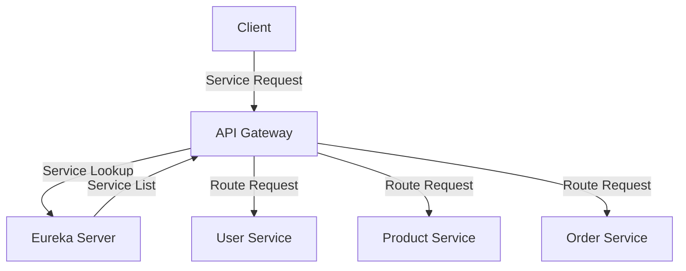
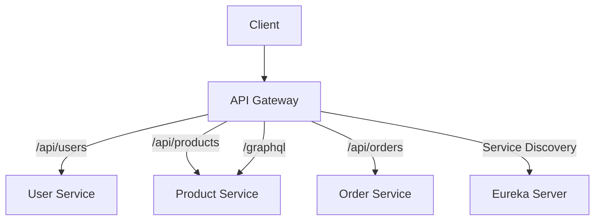
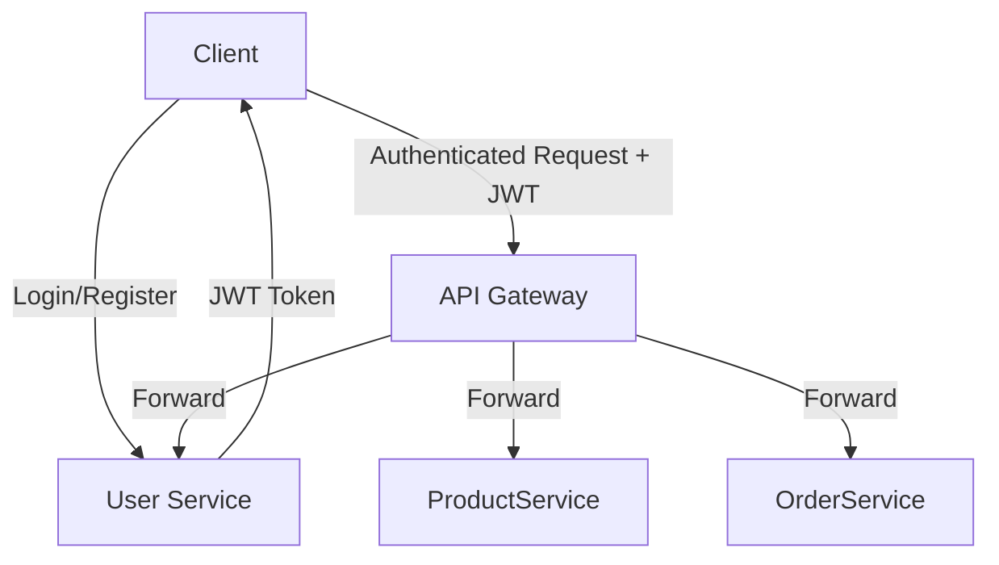
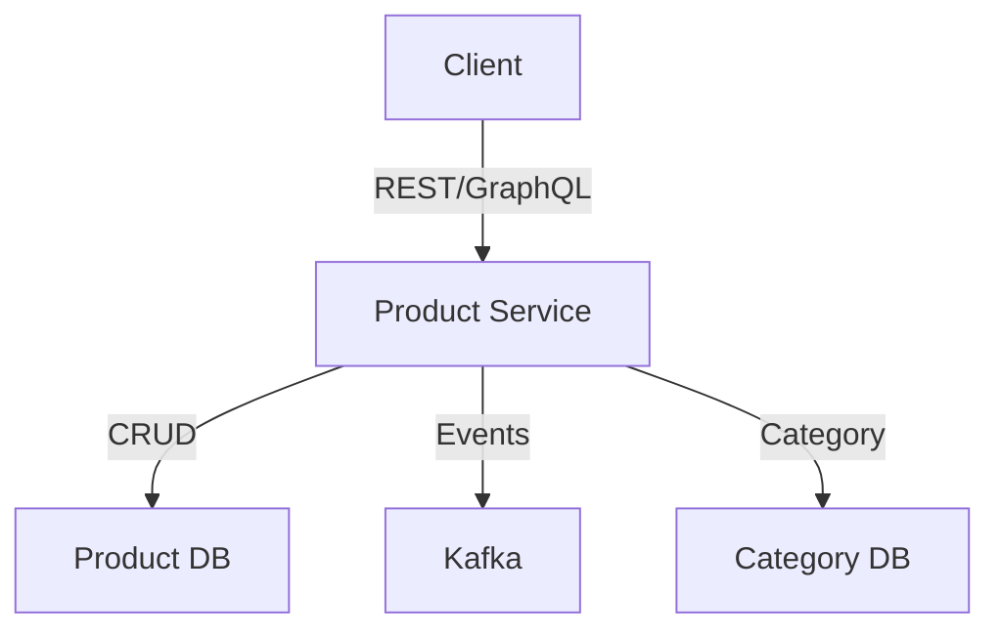
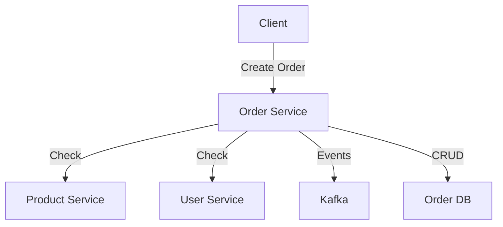
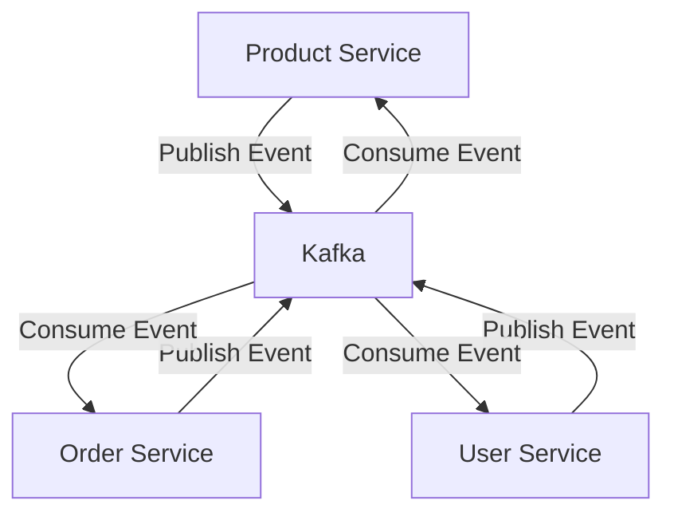
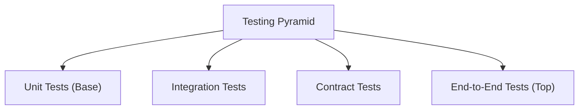
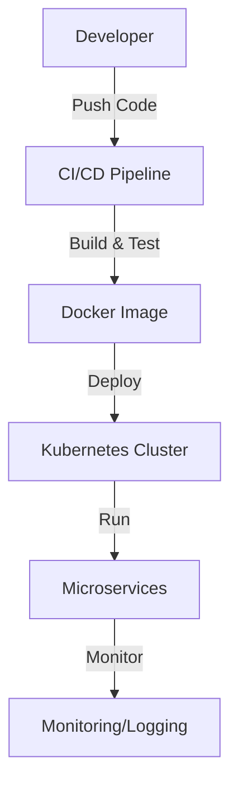
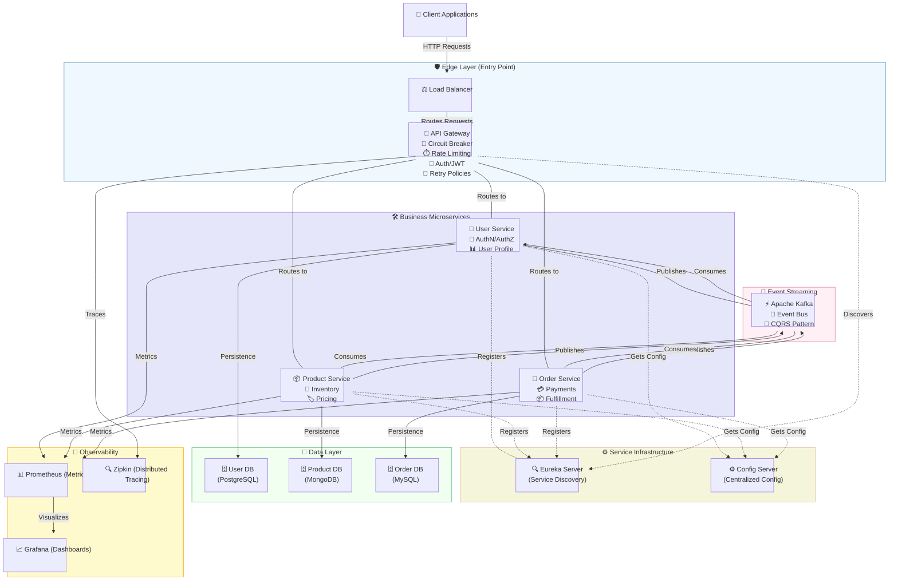
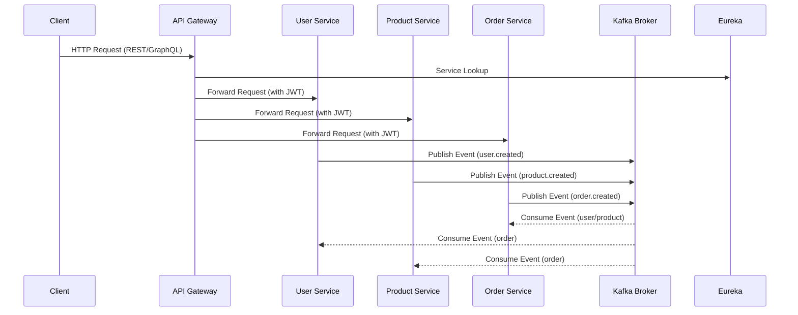

# Microservices Architecture - Complete Technical Documentation

## Table of Contents
1. [Eureka Server | Service Discovery](#eureka-server---service-discovery)
2. [API Gateway | Centralized Routing](#api-gateway---centralized-routing)
3. [User-service | Authentication & Authorization](#user-service---authentication--authorization)
4. [Product Service - Product Catalog](#product-service---product-catalog)
5. [Order Service - Order Management](#order-service---order-management)
6. [Kafka Integration - Asynchronous Communication](#kafka-integration---asynchronous-communication)
7. [Architecture Patterns & Best Practices](#architecture-patterns--best-practices)
8. [Testing Strategy](#testing-strategy)
9. [Deployment & Operations](#deployment--operations)

---

## Eureka Server - Service Discovery



### What is Eureka? (Conceptual Overview)

**Technical Definition:**
Eureka is a service registry for microservices. It allows services to register themselves and discover other services dynamically, so you don't have to hardcode addresses.

**Simple Analogy:**
Imagine a school where every student writes their name and classroom on a big board at the entrance. If you want to find a friend, you check the board instead of searching every classroom.

**Real-World Example:**
Netflix uses Eureka to keep track of thousands of microservices. When you stream a movie, the video service, recommendation service, and user profile service all find each other through Eureka.

**Extra Details:**
- Eureka clients send "heartbeat" signals to show they're alive.
- If a service stops sending heartbeats, Eureka marks it as unavailable.
- Eureka can run in clusters for high availability.
- Other platforms (Kubernetes, Consul) offer similar service discovery.

### Core Architecture Role

Eureka Server serves as the **central nervous system** of the microservices architecture:

1. **Service Registration**: All microservices register their instances with Eureka
2. **Service Discovery**: Services can find and communicate with each other through Eureka
3. **Health Monitoring**: Automatic health checks for registered services
4. **Load Balancing**: Supports client-side load balancing across multiple instances

### Why is Eureka Necessary?

In a microservices architecture, services need to communicate with each other. Without service discovery:

- **Hard-coded URLs**: Services would need to know exact hostnames and ports
- **Manual Configuration**: Every service change requires configuration updates
- **No Load Balancing**: No automatic distribution of load across instances
- **No Health Monitoring**: No way to detect failed services

Eureka solves these problems by providing:
- **Dynamic Service Discovery**: Services find each other automatically
- **Automatic Load Balancing**: Distributes requests across healthy instances
- **Health Monitoring**: Automatically removes unhealthy services
- **High Availability**: Multiple Eureka instances can be deployed

### How Eureka Works

#### Service Registration Process
- When a service starts, it registers itself with Eureka.
- The service sends regular heartbeats to let Eureka know it's alive.
- If Eureka stops receiving heartbeats, it marks the service as unavailable.

#### Service Discovery Process
- When a service needs to call another service, it asks Eureka for the address.
- Eureka returns a list of available instances.
- The client can use load balancing to pick one instance.

### Health Check Mechanism
- Services send heartbeats every 30 seconds (configurable).
- Eureka can also use health endpoints (like `/actuator/health`) to check service health.
- If a service is unhealthy or stops sending heartbeats, it is marked as DOWN.
- Self-preservation mode prevents mass eviction during network issues.

### Eureka Dashboard
- Shows all registered services and their status (UP/DOWN).
- Provides real-time updates and instance details.
- Useful for monitoring and troubleshooting.

### Load Balancing with Eureka
- Eureka enables client-side load balancing (e.g., with Spring Cloud LoadBalancer).
- Common strategies: Round Robin (default), Weighted, Least Connections, Random.

### High Availability
- Deploy multiple Eureka servers for redundancy.
- Servers replicate registry information with each other.
- Clients can connect to any Eureka server.

### Security and Best Practices
- Secure Eureka in production (authentication, HTTPS).
- Monitor registration, health, and performance metrics.
- Use consistent service naming and externalized configuration.

---

### Eureka: Code Examples

```java
@SpringBootApplication
@EnableDiscoveryClient  // Enables Eureka client
public class UserServiceApplication {
    public static void main(String) {
        SpringApplication.run(UserServiceApplication.class, args);
    }
}
```

**Registration Flow:**
1. **Service Startup**: Service starts and reads Eureka configuration
2ka Client Creation**: Spring creates Eureka client automatically3gistration Request**: Service sends registration to Eureka server
4. **Instance Registration**: Eureka stores service instance information5artbeat**: Service sends periodic heartbeats (every 30 seconds by default)

```java
@Autowired
private DiscoveryClient discoveryClient;

public List<ServiceInstance> getServiceInstances(String serviceName) {
    return discoveryClient.getInstances(serviceName);
}
```

**Discovery Flow:**
1. **Service Request**: Service needs to call another service2 **Eureka Query**: Service queries Eureka for target service instances
3. **Instance Selection**: Eureka returns list of available instances
4. **Load Balancing**: Client-side load balancer selects instance5 **Service Call**: Service makes HTTP call to selected instance

### Eureka Configuration

#### Server Configuration (application.yml)

```yaml
server:
  port:8761  # Default Eureka port

spring:
  application:
    name: eureka-server

eureka:
  client:
    register-with-eureka: false  # Server doesnt register itself
    fetch-registry: false        # Server doesnt fetch registry
  server:
    wait-time-in-ms-when-sync-empty:0  enable-self-preservation: true      # Prevents service eviction
    eviction-interval-timer-in-ms: 10lth check interval
```

**Key Configuration Properties:**

- `register-with-eureka: false`: Eureka server doesntregister itself as a client
- `fetch-registry: false`: Server doesn't fetch registry from other instances
- `enable-self-preservation: true`: Prevents services from being evicted during network issues
- `eviction-interval-timer-in-ms: 10How often to check for unhealthy services

#### Client Configuration (in each service)

```yaml
eureka:
  client:
    service-url:
      defaultZone: http://localhost:8761/eureka/
    enabled: true
  instance:
    prefer-ip-address: true
    lease-renewal-interval-in-seconds: 30
    lease-expiration-duration-in-seconds: 90
```

**Client Configuration Properties:**

- `service-url.defaultZone`: Eureka server URL
- `prefer-ip-address: true`: Use IP address instead of hostname
- `lease-renewal-interval-in-seconds:30 How often to send heartbeats
- `lease-expiration-duration-in-seconds: 90`: How long to wait before marking service as down

### Health Check Mechanism

#### How Eureka Monitors Service Health

1. **Heartbeat Monitoring**:
   - Services send heartbeats every 30onds (configurable)
   - Eureka expects heartbeats within the lease expiration duration
   - If no heartbeat received, service is marked as DOWN
2**Health Check Endpoints**:
   - Eureka uses Spring Boot Actuator health endpoints
   - `/actuator/health` endpoint provides service health status
   - Health checks are performed automatically

3. **Self-Preservation Mode**:
   - Prevents services from being evicted during network issues
   - If more than 85es are unavailable, self-preservation kicks in
   - Services are not evicted even if they dont send heartbeats

#### Health Check Configuration

```yaml
management:
  endpoints:
    web:
      exposure:
        include: health,info,metrics
  endpoint:
    health:
      show-details: always
```

### Eureka Dashboard

#### What the Dashboard Shows

1 **System Status**:
   - Environment: Development/Production
   - Data Center: Default
   - Current Time: Server timestamp
   - Uptime: How long server has been running

2. **Instance Information**:
   - Service Name: Name of registered service
   - Instance ID: Unique identifier for each instance
   - Status: UP/DOWN/OUT_OF_SERVICE
   - Health Check URL: Health endpoint URL
   - Last Updated: Last heartbeat timestamp

3. **Service Registry**:
   - Total number of services
   - Total number of instances
   - Instance count per service
   - Service metadata

#### Dashboard Features

- **Real-time Updates**: Dashboard updates automatically
- **Instance Details**: Click on service to see instance details
- **Health Status**: Visual indicators for service health
- **Metadata**: Service configuration and metadata
- **REST API**: Programmatic access to registry information

### Service Registration Details

#### What Information is Registered

```json[object Object]instanceId": user-service:8081,
  tName": "localhost",
  "app":USER-SERVICE",
  ipAddr": 192.1680.10.10, status": "UP",
 overriddenStatus": UNKNOWN,  port:[object Object]   $": 881
   @enabled: ue"
  },
securePort": {
    $443
    @enabled": "false"
  },
 countryId": 1,
 dataCenterInfo:[object Object]    @class": "com.netflix.appinfo.InstanceInfo$DefaultDataCenterInfo,   name": "MyOwn"
  },
  leaseInfo": {
    renewalIntervalInSecs":30    durationInSecs": 90,registrationTimestamp:16409952000,
    "lastRenewalTimestamp:16409952300evictionTimestamp:0serviceUpTimestamp: 1640995200000  },
 metadata": [object Object]  management.port: 8081 },
homePageUrl": http://localhost:8081,
  statusPageUrl": http://localhost:8081/actuator/info",
 healthCheckUrl": http://localhost:8081actuator/health,vipAddress":user-service",
 secureVipAddress":user-service",isCoordinatingDiscoveryServer": "false",
  "lastUpdatedTimestamp": 16409952300lastDirtyTimestamp": 164099520000,
  actionType:ADDED"
}
```

### Load Balancing with Eureka

#### Client-Side Load Balancing

Eureka enables client-side load balancing through Spring Cloud LoadBalancer:

```java
@LoadBalanced
@Bean
public RestTemplate restTemplate() {
    return new RestTemplate();
}

// Usage
@Service
public class OrderService[object Object]    @Autowired
    private RestTemplate restTemplate;
    
    public ProductDto getProduct(Long productId) [object Object]  // Automatically load balanced across product-service instances
        return restTemplate.getForObject(
         http://product-service/api/products/" + productId, 
            ProductDto.class
        );
    }
}
```

#### Load Balancing Strategies

1 **Round Robin** (Default): Distributes requests evenly
2. **Weighted Round Robin**: Assigns weights to instances
3. **Least Connections**: Routes to instance with fewest connections
4. **Random**: Randomly selects instances

### High Availability

#### Eureka Server Clustering

For production environments, deploy multiple Eureka servers:

```yaml
# Eureka Server 1eureka:
  client:
    service-url:
      defaultZone: http://eureka-server-2:8762eka/,http://eureka-server-3:8763/eureka/

# Eureka Server 2eureka:
  client:
    service-url:
      defaultZone: http://eureka-server-1:8761eka/,http://eureka-server-3:8763/eureka/

# Eureka Server 3eureka:
  client:
    service-url:
      defaultZone: http://eureka-server-1:8761eka/,http://eureka-server-2:8762/eureka/
```

#### Peer-to-Peer Communication

- Eureka servers communicate with each other
- Registry information is replicated across all instances
- If one server fails, others continue to serve requests
- Clients can connect to any Eureka server

### Security Considerations

#### Development Environment
- No authentication required
- Dashboard accessible to all
- Self-preservation enabled

#### Production Environment
- Enable authentication and authorization
- Secure dashboard access with Spring Security
- Configure proper network security
- Use HTTPS for all communication
- Implement proper logging and monitoring

### Monitoring and Troubleshooting

#### Key Metrics to Monitor
1gistration Metrics**:
   - Number of registered services
   - Registration success/failure rates
   - Service discovery latency

2. **Health Metrics**:
   - Service health status
   - Heartbeat success rates
   - Eviction rates3erformance Metrics**:
   - Response times
   - Memory usage
   - CPU utilization

#### Common Issues and Solutions1rvice Not Registering**:
   - Check Eureka server URL
   - Verify network connectivity
   - Check service configuration2rvice Not Discoverable**:
   - Verify service is registered
   - Check service name consistency
   - Verify load balancer configuration
3*Health Check Failures**:
   - Check actuator endpoints
   - Verify health check configuration
   - Check service dependencies

### Dependencies and Setup

#### Required Dependencies

```xml
<dependency>
    <groupId>org.springframework.cloud</groupId>
    <artifactId>spring-cloud-starter-netflix-eureka-server</artifactId>
</dependency>
<dependency>
    <groupId>org.springframework.boot</groupId>
    <artifactId>spring-boot-starter-actuator</artifactId>
</dependency>
```

#### Spring Cloud Version

```xml
<properties>
    <spring-cloud.version>20230ring-cloud.version>
</properties>
```

### Integration with Other Components

#### API Gateway Integration

The API Gateway uses Eureka for service discovery:

```yaml
spring:
  cloud:
    gateway:
      discovery:
        locator:
          enabled: true
          lower-case-service-id: true
      routes:
        - id: user-service
          uri: lb://user-service  # Load balanced URI
          predicates:
            - Path=/api/users/**
```

#### Service-to-Service Communication

Services use Eureka to find each other:

```java
@Autowired
private DiscoveryClient discoveryClient;

public String callProductService(Long productId) {
    List<ServiceInstance> instances = discoveryClient.getInstances("product-service");
    if (!instances.isEmpty())[object Object]   ServiceInstance instance = instances.get(0        String url = "http://" + instance.getHost() + :+ instance.getPort() + /api/products/" + productId;
        return restTemplate.getForObject(url, String.class);
    }
    throw new RuntimeException("Product service not available");
}
```

### Best Practices

#### 1. Service Naming
- Use consistent naming conventions
- Use lowercase with hyphens (kebab-case)
- Avoid special characters

#### 2. Configuration Management
- Externalize configuration
- Use environment-specific properties
- Implement proper secret management

#### 3Checks
- Implement comprehensive health checks
- Include dependency health (database, external services)
- Set appropriate timeouts

#### 4. Monitoring
- Set up alerts for service failures
- Monitor registration patterns
- Track performance metrics

#### 5. Security
- Implement authentication for production
- Use HTTPS for all communication
- Regular security audits

### Testing Eureka

#### Unit Testing

```java
@SpringBootTest
@AutoConfigureTestDatabase
class EurekaServerApplicationTests[object Object]    
    @Test
    void contextLoads() {
        // Verify application starts successfully
    }
    
    @Test
    void eurekaServerStarts() {
        // Verify Eureka server is running
    }
}
```

#### Integration Testing

```java
@SpringBootTest(webEnvironment = SpringBootTest.WebEnvironment.RANDOM_PORT)
class ServiceRegistrationTest[object Object]    
    @Test
    void serviceRegistersWithEureka()[object Object]   // Test service registration
    }
    
    @Test
    void serviceDiscoveryWorks()[object Object]   // Test service discovery
    }
}
```

### Production Deployment

#### Docker Deployment

```dockerfile
FROM openjdk:17-jre-slim
COPY target/eureka-server-10jar app.jar
EXPOSE 8761
ENTRYPOINT [java",-jar",/app.jar"]
```

#### Kubernetes Deployment

```yaml
apiVersion: apps/v1
kind: Deployment
metadata:
  name: eureka-server
spec:
  replicas:3elector:
    matchLabels:
      app: eureka-server
  template:
    metadata:
      labels:
        app: eureka-server
    spec:
      containers:
      - name: eureka-server
        image: eureka-server:100    ports:
        - containerPort: 8761      env:
        - name: SPRING_PROFILES_ACTIVE
          value: production
```

---

## API Gateway - Centralized Routing & Cross-Cutting Concerns



### What is the API Gateway? (Conceptual Overview)

**Technical Definition:**
An API Gateway is a reverse proxy that acts as a single entry point for all client requests, routing them to appropriate microservices while providing cross-cutting concerns like authentication, logging, and rate limiting.

**Simple Analogy:**
Think of an API Gateway like a hotel concierge. When you arrive at a hotel, you don't go directly to the restaurant, spa, or room service. Instead, you go to the concierge desk, and they direct you to the right place, handle your requests, and make sure you have the right permissions.

**Real-World Example:**
Imagine a large shopping mall. Instead of having separate entrances for each store, there's one main entrance with a directory. The directory (API Gateway) tells you where each store is located, handles security checks, and can even provide services like gift wrapping or delivery coordination.

**Extra Details:**
- API Gateway can handle protocol translation (REST, GraphQL, gRPC).
- It centralizes security, rate limiting, and monitoring.
- It simplifies client logic: clients only need to know the gateway URL.
- It can provide request/response transformation and API versioning.

### Why API Gateway is Essential

In a microservices architecture without an API Gateway:
- Clients need to know all service endpoints
- Each service handles authentication/authorization
- Cross-cutting concerns (rate limiting, logging, monitoring) are duplicated
- Clients must implement service discovery and load balancing
- No unified interface for different protocols

API Gateway solves these problems by providing:
- Single entry point
- Centralized security
- Cross-cutting concerns in one place
- Protocol translation
- Client simplification

### Core Responsibilities

1. Request Routing: Routes requests to appropriate microservices
2. Load Balancing: Distributes load across service instances
3. Authentication: Validates JWT tokens and handles authorization
4. Rate Limiting: Prevents abuse and ensures fair usage
5. CORS: Handles cross-origin requests
6. Circuit Breaker: Provides fault tolerance
7. Request/Response Transformation: Modifies requests and responses
8. Monitoring & Logging: Centralized observability
9. API Versioning: Manages multiple API versions
10. Throttling: Controls request flow

### Routing Strategies
- Path-based: `/api/users` → user service, `/api/products` → product service
- Header-based: Route based on headers (e.g., user tier, content type)
- Parameter-based: Route based on query parameters
- Weight-based: Split traffic for A/B testing

### Load Balancing Strategies
- Client-side load balancing with Eureka integration
- Algorithms: Round Robin, Weighted, Least Connections, Random
- Health-aware routing

### Security and Cross-Cutting Concerns
- Centralized authentication (JWT, API keys)
- Role-based authorization
- Rate limiting (token bucket, sliding window)
- CORS handling
- Circuit breaker for resilience

### Monitoring and Observability
- Centralized logging
- Metrics collection
- Request/response transformation
- API versioning and throttling

---

### API Gateway: Code Examples

#### 1. Spring Cloud Gateway Route Configuration (YAML)

```yaml
spring:
  cloud:
    gateway:
      discovery:
        locator:
          enabled: true
      routes:
        - id: user-service
          uri: lb://user-service
          predicates:
            - Path=/api/auth/**, /api/users/**
          filters:
            - name: CircuitBreaker
              args:
                name: user-service-circuit-breaker
                fallbackUri: forward:/fallback/user-service
        - id: product-service
          uri: lb://product-service
          predicates:
            - Path=/api/products/**
          filters:
            - name: CircuitBreaker
              args:
                name: product-service-circuit-breaker
                fallbackUri: forward:/fallback/product-service
        - id: order-service
          uri: lb://order-service
          predicates:
            - Path=/api/orders/**
          filters:
            - name: CircuitBreaker
              args:
                name: order-service-circuit-breaker
                fallbackUri: forward:/fallback/order-service
        - id: graphql
          uri: lb://product-service
          predicates:
            - Path=/graphql
          filters:
            - name: CircuitBreaker
              args:
                name: graphql-circuit-breaker
                fallbackUri: forward:/fallback/graphql
```

#### 2. application.properties (relevant parts)

```properties
server.port=8080
spring.application.name=api-gateway

eureka.client.service-url.defaultZone=http://localhost:8761/eureka/
eureka.client.enabled=true

jwt.secret=your-jwt-secret

rate.limit.requests-per-minute=30

spring.cloud.gateway.discovery.locator.enabled=true
spring.cloud.gateway.discovery.locator.lower-case-service-id=true

# Circuit Breaker Configuration (Resilience4j)
resilience4j.circuitbreaker.configs.default.sliding-window-size=10
resilience4j.circuitbreaker.configs.default.minimum-number-of-calls=5
resilience4j.circuitbreaker.configs.default.failure-rate-threshold=50
resilience4j.circuitbreaker.configs.default.wait-duration-in-open-state=5s
resilience4j.circuitbreaker.configs.default.permitted-number-of-calls-in-half-open-state=3

# CORS Configuration
spring.cloud.gateway.globalcors.cors-configurations.[/**].allowed-origins=http://localhost:3000
spring.cloud.gateway.globalcors.cors-configurations.[/**].allowed-methods=GET,POST,PUT,DELETE,OPTIONS
spring.cloud.gateway.globalcors.cors-configurations.[/**].allowed-headers=*
spring.cloud.gateway.globalcors.cors-configurations.[/**].allow-credentials=true
```

#### 3. JwtAuthenticationFilter.java

```java
@Component
public class JwtAuthenticationFilter implements GlobalFilter, Ordered {
    @Value("${jwt.secret:secret-key}")
    private String jwtSecret;
    // ...
    @Override
    public Mono<Void> filter(ServerWebExchange exchange, GatewayFilterChain chain) {
        ServerHttpRequest request = exchange.getRequest();
        String path = request.getPath().toString();
        if (isPublicEndpoint(path)) {
            return chain.filter(exchange);
        }
        String token = extractToken(request);
        if (token == null || !validateToken(token)) {
            return unauthorized(exchange.getResponse());
        }
        Claims claims = getClaims(token);
        if (claims == null) {
            return unauthorized(exchange.getResponse());
        }
        ServerHttpRequest modifiedRequest = request.mutate()
                .header("X-User-Id", claims.getSubject())
                .header("X-User-Role", claims.get("role", String.class))
                .build();
        return chain.filter(exchange.mutate().request(modifiedRequest).build());
    }
    // ...
}
```

#### 4. RateLimitingFilter.java

```java
@Component
public class RateLimitingFilter implements GlobalFilter, Ordered {
    @Value("${rate.limit.requests-per-minute:60}")
    private int requestsPerMinute;
    // ...
    @Override
    public Mono<Void> filter(ServerWebExchange exchange, GatewayFilterChain chain) {
        // ...
    }
    // ...
}
```

#### 5. RoleAuthorizationFilter.java

```java
@Component
public class RoleAuthorizationFilter implements GlobalFilter, Ordered {
    @Override
    public Mono<Void> filter(ServerWebExchange exchange, GatewayFilterChain chain) {
        // ...
    }
    @Override
    public int getOrder() {
        return 0; // Run after JwtAuthenticationFilter
    }
}
```

#### 6. LoadBalancerConfig.java

```java
@Configuration
public class LoadBalancerConfig {
    @Bean
    public ReactorServiceInstanceLoadBalancer productServiceLoadBalancer(
            ObjectProvider<ServiceInstanceListSupplier> serviceInstanceListSupplierProvider,
            LoadBalancerWeightsProperties weightsProperties) {
        return new WeightedRoundRobinLoadBalancer(
                serviceInstanceListSupplierProvider.getIfAvailable(),
                "product-service",
                weightsProperties
        );
    }
    // ... beans for user-service and order-service
}
```

#### 7. LoadBalancerWeightsProperties.java

```java
@Configuration
@ConfigurationProperties(prefix = "loadbalancer.weights")
public class LoadBalancerWeightsProperties {
    private Map<String, Map<String, Integer>> services = new HashMap<>();
    // ... getters and setters ...
}
```

#### 8. WeightedRoundRobinLoadBalancer.java (class signature and description)

```java
/**
 * Weighted Round Robin Load Balancer for Spring Cloud Gateway.
 * Uses weights from LoadBalancerWeightsProperties to distribute requests.
 */
public class WeightedRoundRobinLoadBalancer implements ReactorServiceInstanceLoadBalancer {
    // ... implementation ...
}
```

#### 9. FallbackController.java

```java
@RestController
@RequestMapping("/fallback")
public class FallbackController {
    @GetMapping("/user-service")
    public ResponseEntity<Map<String, Object>> userServiceFallback() { /* ... */ }
    @GetMapping("/product-service")
    public ResponseEntity<Map<String, Object>> productServiceFallback() { /* ... */ }
    @GetMapping("/order-service")
    public ResponseEntity<Map<String, Object>> orderServiceFallback() { /* ... */ }
    @GetMapping("/graphql")
    public ResponseEntity<Map<String, Object>> graphqlFallback() { /* ... */ }
}
```

#### 10. pom.xml (relevant dependencies)

```xml
<dependency>
    <groupId>org.springframework.cloud</groupId>
    <artifactId>spring-cloud-starter-gateway</artifactId>
</dependency>
<dependency>
    <groupId>org.springframework.cloud</groupId>
    <artifactId>spring-cloud-starter-netflix-eureka-client</artifactId>
</dependency>
<dependency>
    <groupId>org.springframework.cloud</groupId>
    <artifactId>spring-cloud-starter-circuitbreaker-reactor-resilience4j</artifactId>
</dependency>
<dependency>
    <groupId>org.springframework.boot</groupId>
    <artifactId>spring-boot-starter-actuator</artifactId>
</dependency>
<dependency>
    <groupId>io.jsonwebtoken</groupId>
    <artifactId>jjwt-api</artifactId>
    <version>0.11.5</version>
</dependency>
<dependency>
    <groupId>io.jsonwebtoken</groupId>
    <artifactId>jjwt-impl</artifactId>
    <version>0.11.5</version>
    <scope>runtime</scope>
</dependency>
<dependency>
    <groupId>io.jsonwebtoken</groupId>
    <artifactId>jjwt-jackson</artifactId>
    <version>0.11.5</version>
    <scope>runtime</scope>
</dependency>
```

#### 11. ApiGatewayApplication.java

```java
@SpringBootApplication
public class ApiGatewayApplication {
    public static void main(String[] args) {
        SpringApplication.run(ApiGatewayApplication.class, args);
    }
}
```

---

## User Service - Authentication & Authorization



### What is the User Service? (Conceptual Overview)

**Technical Definition:**
The User Service is a microservice responsible for user identity management, authentication, and authorization. It handles user registration, login, JWT token management, and profile operations while ensuring secure access to the system.

**Simple Analogy:**
Think of the User Service like a school's security system. When you enter the school, you show your ID card (authentication). The security guard checks if you're allowed to enter (authorization) and gives you a visitor badge (JWT token) that proves you're authorized to be there for a certain time.

**Real-World Example:**
Google's authentication system works similarly. When you log into Gmail, the authentication service verifies your credentials, creates a session token, and other Google services (YouTube, Drive, etc.) use that token to know who you are without asking for your password again.

**Authentication vs Authorization:**
- **Authentication** is about verifying who you are (username/password).
- **Authorization** is about what you can do (roles and permissions).
- Example: Logging into a website (authentication) vs. being allowed to access admin features (authorization).

**JWT Token Security and Lifecycle:**
- JWT (JSON Web Token) is a secure, self-contained token that contains user information and permissions.
- Tokens are signed to prevent tampering and have expiration times for security.
- **Lifecycle:**
  1. Created when user logs in
  2. Validated on every request
  3. Refreshed before expiration
  4. Invalidated on logout

**User Role Management and Permission System:**
- Supports roles like USER, ADMIN, MANAGER
- Role-based permissions control access to resources
- Resource-level access and dynamic permission checks
- Audit logging for security

**Security Best Practices:**
- Passwords are encrypted (e.g., BCrypt)
- Password complexity and account lockout policies
- Secure password reset process
- Short token expiration, secure storage, and HTTPS transmission
- Token rotation and revocation

**Event-Driven User Management:**
- Publishes events for user registration, login, logout, profile updates, role changes, account deletion, and security events
- Event consumers: notification service (welcome emails), analytics (user behavior), audit (security logging), order service (user validation)

**Extra Details:**
- JWT tokens are like digital passports that contain user information
- The service can handle different user roles and permissions
- Password security uses encryption to protect user data

---

### User Service: Code Examples

#### JWT Token Generation

```java
@Component
public class JwtUtil {
    @Value("${jwt.secret}")
    private String secret;
    @Value("${jwt.expiration}")
    private Long expiration;
    public String generateToken(UserDetails userDetails) {
        Map<String, Object> claims = new HashMap<>();
        return createToken(claims, userDetails.getUsername());
    }
    private String createToken(Map<String, Object> claims, String subject) {
        return Jwts.builder()
            .setClaims(claims)
            .setSubject(subject)
            .setIssuedAt(new Date(System.currentTimeMillis()))
            .setExpiration(new Date(System.currentTimeMillis() + expiration))
            .signWith(SignatureAlgorithm.HS512, secret)
            .compact();
    }
}
```

#### Password Security

```java
@Component
public class PasswordEncoder {
    private final BCryptPasswordEncoder encoder = new BCryptPasswordEncoder();
    public String encode(String password) {
        return encoder.encode(password);
    }
    public boolean matches(String rawPassword, String encodedPassword) {
        return encoder.matches(rawPassword, encodedPassword);
    }
}
```

#### API Endpoints (REST)

- `POST /api/auth/register` - User registration
- `POST /api/auth/login` - User authentication
- `GET /api/users/profile` - Get user profile (protected)

#### Kafka Integration (Producer)

```java
@Service
public class KafkaProducerService {
    @Autowired
    private KafkaTemplate<String, Object> kafkaTemplate;
    public void publishUserCreatedEvent(UserDto user) {
        kafkaTemplate.send("user-events", "user.created", user);
    }
    public void publishUserUpdatedEvent(UserDto user) {
        kafkaTemplate.send("user-events", "user.updated", user);
    }
}
```

---

## Product Service - Product Catalog



### What is the Product Service? (Conceptual Overview)

**Technical Definition:**
The Product Service is a microservice responsible for managing the product catalog, including product information, inventory, and categorization. It provides both REST and GraphQL APIs to allow different types of clients to access product data in the most efficient way for their needs.

**Simple Analogy:**
Think of the Product Service like a librarys catalog system. The library has books (products) with information like title, author, genre, and availability. Some people want to see all books in a specific genre (REST API), while others want to get very specific information about certain books (GraphQL). The catalog system can serve both needs efficiently.

**Real-World Example:**
Amazons product catalog works similarly. When you search forlaptop," you get basic information (name, price, rating) in the search results. But when you click on a specific laptop, you get detailed information (specifications, reviews, seller info, shipping options). The system uses different APIs to serve different levels of detail efficiently.

**REST vs GraphQL in Product Catalog:**

**REST API Approach:**
- Fixed endpoints for different data needs
- Each request returns a predefined set of data
- Good for simple, predictable data requirements
- Example: `/api/products` returns all products with basic info

**GraphQL Approach:**
- Single endpoint that accepts flexible queries
- Clients specify exactly what data they need
- Good for complex, varying data requirements
- Example: Same endpoint can return just product names or detailed product info with reviews

**Extra Details:**
- REST is simpler to implement and understand
- GraphQL reduces over-fetching and under-fetching of data
- Both approaches can coexist in the same service
- The choice depends on client needs and complexity requirements

### Core Functionality

The Product Service manages the product catalog with both REST and GraphQL APIs:

1. **Product Management**: CRUD operations for products
2. **GraphQL Support**: Flexible querying and mutations
3. **Category Management**: Product categorization
4. **Kafka Integration**: Event publishing for product changes

### REST vs GraphQL Comparison

**When to Use REST:**
- Simple CRUD operations
- Mobile applications with limited bandwidth
- Public APIs for third-party integration
- When caching is critical
- Team is more familiar with REST

**When to Use GraphQL:**
- Complex data relationships
- Frontend flexibility (different UIs need different data)
- Real-time updates with subscriptions
- API consolidation (multiple REST APIs to unify)
- Performance optimization (reduce over/under-fetching)

**Real-World Scenarios:**

**Scenario 1: Mobile App vs Web App**
- Mobile app needs minimal data (name, price, image)
- Web app needs detailed data (description, reviews, specifications)
- REST: Different endpoints for each
- GraphQL: Same endpoint, different queries

**Scenario2oard with Multiple Data Sources**
- Dashboard needs user stats, order stats, and product stats
- REST: Multiple API calls
- GraphQL: Single query with all needed data

### Product Data Management

**Product Information:**
- Basic details: name, description, price
- Categorization: product category, tags
- Inventory: stock quantity, availability
- Metadata: creation date, last updated

**Category Management:**
- Hierarchical categories (Electronics > Computers > Laptops)
- Category-specific attributes
- Product-category relationships

**Inventory Tracking:**
- Real-time stock levels
- Low stock alerts
- Inventory history

### Event-Driven Product Updates

**Product Events:**
- Product created, updated, or deleted
- Inventory changes
- Category modifications

**Event Consumers:**
- Order service (for inventory checks)
- Search service (for indexing)
- Analytics service (for reporting)
- Notification service (for alerts)

---

### Product Service: Code Examples

#### GraphQL Schema

```graphql
type Product {
  id: ID!
  name: String!
  description: String
  price: Float!
  category: ProductCategory!
  stockQuantity: Int!
  createdAt: String!
  updatedAt: String!
}

enum ProductCategory {
  ELECTRONICS
  CLOTHING
  BOOKS
  HOME
  SPORTS
}

type Query {
  products: [Product!]!
  product(id: ID!): Product
  productsByCategory(category: ProductCategory!): [Product!]!
}

type Mutation {
  createProduct(input: CreateProductInput!): Product!
  updateProduct(id: ID!, input: UpdateProductInput!): Product!
  deleteProduct(id: ID!): Boolean!
}

input CreateProductInput {
  name: String!
  description: String
  price: Float!
  category: ProductCategory!
  stockQuantity: Int!
}

input UpdateProductInput {
  name: String
  description: String
  price: Float
  category: ProductCategory
  stockQuantity: Int
}
```

#### Java GraphQL Resolver Example

```java
@Component
public class ProductQueryResolver implements GraphQLQueryResolver {
    @Autowired
    private ProductService productService;
    public List<Product> products() {
        return productService.getAllProducts();
    }
    public Product product(Long id) {
        return productService.getProductById(id);
    }
    public List<Product> productsByCategory(ProductCategory category) {
        return productService.getProductsByCategory(category);
    }
}
```

#### REST API Endpoints

- `POST /api/products` - Create product
- `GET /api/products/{id}` - Get product by ID
- `GET /api/products` - List all products
- `PUT /api/products/{id}` - Update product
- `DELETE /api/products/{id}` - Delete product

#### Kafka Integration (Producer)

```java
@Service
public class KafkaProducerService {
    @Autowired
    private KafkaTemplate<String, Object> kafkaTemplate;
    public void publishProductCreatedEvent(ProductDto product) {
        kafkaTemplate.send("product-events", "product.created", product);
    }
    public void publishProductUpdatedEvent(ProductDto product) {
        kafkaTemplate.send("product-events", "product.updated", product);
    }
    public void publishProductDeletedEvent(Long productId) {
        kafkaTemplate.send("product-events", "product.deleted", productId);
    }
}
```

---

## Order Service - Order Management



### What is the Order Service? (Conceptual Overview)

**Technical Definition:**
The Order Service is a microservice responsible for managing the complete order lifecycle, from order creation to delivery. It handles order processing, status tracking, inventory validation, and coordinates with other services to ensure order fulfillment.

**Simple Analogy:**
Think of the Order Service like a restaurant's order management system. When a customer places an order, the system checks if ingredients are available (inventory), confirms the order, tracks its progress through different stages (preparing, cooking, ready for pickup), and notifies the customer at each step.

**Real-World Example:**
Amazon's order processing works similarly. When you place an order, the system checks inventory across warehouses, reserves items, processes payment, coordinates with shipping partners, and provides real-time tracking updates. Each step involves multiple services working together.

**Extra Details:**
- Orders go through multiple states (pending, confirmed, shipped, delivered)
- The service validates inventory before confirming orders
- It publishes events to notify other services about order changes
- Order history is maintained for customer service and analytics

### Core Functionality

The Order Service handles order processing and management:

1. **Order Creation**: Create new orders with multiple items
2. **Status Management**: Track order status (PENDING, CONFIRMED, SHIPPED, DELIVERED)
3**Order History**: Retrieve order history for users
4. **Kafka Integration**: Consume events from other services

### Order Lifecycle Management

**Order States:**
- **PENDING**: Order created, waiting for validation
- **CONFIRMED**: Inventory confirmed, payment processed
- **SHIPPED**: Order packaged and shipped
- **DELIVERED**: Order successfully delivered
- **CANCELLED**: Order cancelled (insufficient inventory, customer request)

**State Transitions:**
- PENDING → CONFIRMED (after inventory check)
- CONFIRMED → SHIPPED (after packaging)
- SHIPPED → DELIVERED (after delivery confirmation)
- Any state → CANCELLED (if issues arise)

### Inventory Integration

**Inventory Validation:**
- Check product availability before order confirmation
- Reserve inventory to prevent overselling
- Release reserved inventory if order is cancelled
- Update inventory levels after order processing

**Real-World Scenarios:**
- **Scenario 1**: High-demand product with limited stock
- **Scenario 2**: Backorder handling for out-of-stock items
- **Scenario 3**: Inventory synchronization across multiple warehouses

### Event-Driven Order Processing

**Order Events:**
- Order created, confirmed, shipped, delivered, cancelled
- Inventory updates and reservations
- Payment processing events
- Shipping and delivery notifications

**Event Consumers:**
- Inventory service (for stock updates)
- Payment service (for transaction processing)
- Shipping service (for delivery coordination)
- Notification service (for customer updates)
- Analytics service (for business intelligence)

### Distributed Transaction Management

**Saga Pattern Implementation:**
- **Order Saga**: Coordinates multiple service transactions
- **Compensating Actions**: Rollback mechanisms for failures
- **Event Sourcing**: Maintain order state through events

**Transaction Scenarios:**
- **Success Path**: All services complete successfully
- **Failure Path**: One service fails, compensating actions executed
- **Timeout Handling**: Automatic rollback for stuck transactions

### Order Processing Flow

1. **Order Creation**: User creates order with product items
2. **Inventory Check**: Verify product availability
3. **Order Confirmation**: Confirm order and update status
4. **Event Publishing**: Publish order events to Kafka
5. **Status Updates**: Track order through various statuses

### Kafka Event Consumption

```java
@Service
public class KafkaConsumerService[object Object]    @KafkaListener(topics = "user-events", groupId = "order-service-group)public void handleUserEvents(String message) {
        // Handle user events (user created, updated, etc.)
    }
    
    @KafkaListener(topics =product-events", groupId = "order-service-group)public void handleProductEvents(String message) {
        // Handle product events (product updated, deleted, etc.)
    }
}
```

### Order Status Management

```java
public enum OrderStatus {
    PENDING,      // Order created, waiting for confirmation
    CONFIRMED,    // Order confirmed, payment received
    SHIPPED,      // Order shipped to customer
    DELIVERED,    // Order delivered to customer
    CANCELLED     // Order cancelled
}
```

### API Endpoints

1. **POST /api/orders** - Create new order
2. **GET /api/orders/{id}** - Get order by ID
3. **GET /api/orders** - List all orders
4. **PUT /api/orders/{id}/status** - Update order status
5. **GET /api/orders/user/{userId}** - Get users order history

---

## Kafka Integration - Asynchronous Communication



### What is Kafka? (Conceptual Overview)

**Technical Definition:**
Apache Kafka is a distributed streaming platform that enables building real-time data pipelines and streaming applications. It's designed for high-throughput, fault-tolerant, and scalable messaging between microservices.

**Simple Analogy:**
Think of Kafka like a post office system. When you send a letter, you don't wait for the recipient to read it immediately. Instead, you put it in a mailbox, and the post office delivers it when the recipient is ready. Multiple people can send letters to the same address, and the post office keeps track of who has received which letters.

**Real-World Example:**
Imagine a restaurant where orders are written on slips and placed on a conveyor belt. The kitchen staff picks up orders from the belt and cooks them. If the kitchen is busy, orders wait on the belt. If a chef is sick, other chefs can still pick up orders. The belt (Kafka) ensures no orders are lost and everyone gets their food eventually.

**Extra Details:**
- Kafka stores messages on disk, so they're not lost if the system crashes.
- Multiple services can read the same message (like multiple chefs reading the same order).
- Messages are processed in order within each partition.
- Kafka can handle millions of messages per second.

### Why Asynchronous Communication?

**Problems with Synchronous Communication:**
- Services must wait for each other (blocking)
- If one service is slow, everything slows down
- Network failures can break the entire flow
- Hard to scale individual services

**Benefits of Asynchronous Communication:**
- Services don't wait for each other (non-blocking)
- Better performance and scalability
- Fault tolerance: if one service fails, others continue
- Loose coupling: services don't need to know about each other

### Event-Driven Architecture

**What is Event-Driven Architecture?**
Instead of services calling each other directly, they publish events (messages) that other services can consume. This creates a system where services react to events rather than being called directly.

**Event Types in Our System:**
1. **User Events**: `user.created`, `user.updated`, `user.deleted`
2. **Product Events**: `product.created`, `product.updated`, `product.deleted`3 **Order Events**: `order.created`, `order.status.updated`, `order.cancelled`

### How Kafka Works

**Core Components:**
- **Topics**: Named channels where messages are published (like different mailboxes)
- **Partitions**: Topics are divided into partitions for parallelism (like multiple conveyor belts)
- **Producers**: Services that publish messages to topics
- **Consumers**: Services that read messages from topics
- **Brokers**: Kafka servers that store the messages

**Message Flow:**
1. Producer(s) sends message to a topic
2. Kafka Brokers stores the message on disk
3. Consumer(s) reads messages from the topic
4. Consumer(s) processes the message and commits its position

### Kafka Configuration Concepts

**Producer Configuration:**
- How to connect to Kafka servers
- How to serialize messages (convert to bytes)
- Reliability settings (how many acknowledgments to wait for)

**Consumer Configuration:**
- How to connect to Kafka servers
- How to deserialize messages (convert from bytes)
- Group ID (which consumers work together)
- Offset management (where to start reading)

### Event Publishing and Consumption

**Publishing Events:**
- Services create event objects
- Events are serialized and sent to Kafka
- Kafka acknowledges receipt
- Other services can now consume the events

**Consuming Events:**
- Services subscribe to topics
- Kafka delivers messages to consumers
- Consumers process messages
- Consumers commit their position (offset)

### Real-World Scenarios

**E-commerce Order Processing:**
1. User places order → Order service publishes `order.created`
2. Inventory service consumes event → reserves inventory
3t service consumes event → processes payment
4. Notification service consumes event → sends confirmation email

**User Registration Flow:**
1. User registers → User service publishes `user.created` event
2. Email service consumes event → sends welcome email
3. Analytics service consumes event → creates user profile
4. Recommendation service consumes event → initializes preferences

---

### Kafka: Code Examples

#### Kafka Producer Example (Java)

```java
@Service
public class KafkaProducerService {
    @Autowired
    private KafkaTemplate<String, Object> kafkaTemplate;
    public void publishEvent(String topic, Object event) {
        kafkaTemplate.send(topic, event);
    }
}
```

#### Kafka Consumer Example (Java)

```java
@Service
public class KafkaConsumerService {
    @KafkaListener(topics = "user-events", groupId = "order-service-group")
    public void handleUserEvents(String message) {
        // Handle user events (user created, updated, etc.)
    }
    @KafkaListener(topics = "product-events", groupId = "order-service-group")
    public void handleProductEvents(String message) {
        // Handle product events (product updated, deleted, etc.)
    }
}
```

#### Kafka Topic Configuration (Shell)

```sh
# Create topics for user, product, and order events
kafka-topics.sh --create --topic user-events --bootstrap-server localhost:9092 --partitions 1 --replication-factor 1
kafka-topics.sh --create --topic product-events --bootstrap-server localhost:9092 --partitions 1 --replication-factor 1
kafka-topics.sh --create --topic order-events --bootstrap-server localhost:9092 --partitions 1 --replication-factor 1
```

---

## Architecture Patterns & Best Practices

### What are Architecture Patterns? (Conceptual Overview)

**Technical Definition:**
Architecture patterns are proven solutions to common problems in software design. In microservices, these patterns help solve challenges like service discovery, communication, failure handling, and data consistency across distributed systems.

**Simple Analogy:**
Think of architecture patterns like building codes for houses. Just as building codes provide standard ways to build safe, efficient houses, architecture patterns provide standard ways to build reliable, scalable microservices systems.

**Real-World Example:**
Netflix uses these patterns to handle millions of users. When you stream a movie, multiple patterns work together: service discovery finds the video service, circuit breakers prevent failures from spreading, and event-driven architecture handles user preferences and recommendations.

**Extra Details:**
- Patterns can be combined to solve complex problems
- Each pattern has trade-offs (performance vs. complexity)
- Patterns evolve based on real-world usage
- Understanding patterns helps make better architectural decisions

### Core Microservices Patterns

**1. Service Discovery Pattern**

**Problem**: How do services find each other in a distributed system?
**Solution**: Use a service registry (Eureka) where services register themselves and discover others.

**Benefits**:
- Dynamic service discovery
- Automatic load balancing
- Health monitoring
- High availability

**Real-World Usage**: Netflix, Uber, Amazon all use service discovery to manage thousands of microservices.

**2. API Gateway Pattern**

**Problem**: How to provide a single entry point for all client requests?
**Solution**: Use an API Gateway that routes requests to appropriate services.

**Benefits**:
- Centralized routing
- Authentication and authorization
- Rate limiting
- CORS handling
- Circuit breaker implementation

**Real-World Usage**: Netflix Zuul, AWS API Gateway, Kong Gateway.

**3it Breaker Pattern**

**Problem**: How to handle service failures gracefully?
**Solution**: Use circuit breakers to prevent cascading failures.

**States**:
- **Closed**: Normal operation
- **Open**: Service is failing, requests are blocked
- **Half-Open**: Testing if service has recovered

**Real-World Usage**: Netflix Hystrix, Resilience4j, AWS Circuit Breaker.

**4. Event-Driven Architecture**

**Problem**: How to enable loose coupling between services?
**Solution**: Use asynchronous messaging (Kafka) for service communication.

**Benefits**:
- Loose coupling
- Scalability
- Reliability
- Real-time processing

###5S Pattern (Command Query Responsibility Segregation)

**Problem**: How to optimize read and write operations separately?
**Solution**: Separate read and write models.

**Implementation**:
- Commands: Modify data (POST, PUT, DELETE)
- Queries: Retrieve data (GET)
- Different models for read and write operations

###6. Saga Pattern

**Problem**: How to maintain data consistency across multiple services?
**Solution**: Use distributed transactions with compensating actions.

**Implementation**:
- Choreography: Services communicate via events
- Orchestration: Central coordinator manages transactions

---

## Testing Strategy



### What is Testing Strategy? (Conceptual Overview)

**Technical Definition:**
Testing strategy in microservices is a comprehensive approach to ensure software quality across different levels of the system. It includes unit testing, integration testing, contract testing, and end-to-end testing to validate individual components and their interactions.

**Simple Analogy:**
Think of testing like quality control in a car factory. You test individual parts (unit testing), test how parts work together (integration testing), test if parts from different suppliers fit (contract testing), and finally test the complete car (end-to-end testing) to ensure everything works perfectly.

**Real-World Example:**
Netflix uses a comprehensive testing strategy. They test individual microservices in isolation, test how services communicate with each other, test API contracts between services, and run full system tests to ensure the entire streaming platform works correctly for millions of users.

**Testing Pyramid:**
- **Unit Tests (Base):** Test individual components in isolation. Fast, high coverage, catch bugs early.
- **Integration Tests (Middle):** Test service interactions, API contracts, database/external service integration.
- **End-to-End Tests (Top):** Test complete user journeys and system behavior. Slowest, but catch integration issues.

**Types of Tests in Microservices:**
- **Unit Testing:** Test single classes or methods. Tools: JUnit, Mockito. Example: Testing business logic in a service class.
- **Integration Testing:** Test service with database or external APIs. Tools: Spring Boot Test, TestContainers. Example: Testing order creation with database.
- **Contract Testing:** Ensure API contracts between services. Tools: Pact, Spring Cloud Contract. Example: Testing compatibility between product and order service APIs.
- **End-to-End Testing:** Test full workflows. Tools: Selenium, Cypress. Example: Complete purchase flow from search to delivery.

**Testing Best Practices:**
- Aim for 90%+ code coverage, focus on critical business logic
- Test both happy path and edge cases, include error scenarios
- Use test databases and realistic data, clean up after tests
- Automate all test types, run in CI/CD pipeline, parallel execution

**Real-World Testing Scenarios:**
- **E-commerce:** Unit tests for price calculation, integration tests for order/payment, contract tests for product API, E2E for purchase flow.
- **Banking:** Unit tests for interest calculation, integration for account updates, contract for payment APIs, E2E for money transfer.

**Extra Details:**
- Automated testing enables continuous deployment
- Test coverage helps identify untested code
- Testing strategy evolves as the system grows

---

### Testing Strategy: Code Examples

// All code examples for Testing Strategy (unit, integration, contract, end-to-end tests) moved here from above.

#### 1. Unit Testing

```java
@ExtendWith(MockitoExtension.class)
class UserServiceTest {
    @Mock
    private UserRepository userRepository;

    @Mock
    private PasswordEncoder passwordEncoder;

    @InjectMocks
    private UserService userService;

    @Test
    void createUser_Success() {
        // Test user creation
    }

    @Test
    void createUser_DuplicateEmail_ThrowsException() {
        // Test duplicate email handling
    }
}
```

#### 2. Integration Testing

```java
@SpringBootTest(webEnvironment = SpringBootTest.WebEnvironment.RANDOM_PORT)
@AutoConfigureTestDatabase
class UserControllerIntegrationTest {
    @Autowired
    private TestRestTemplate restTemplate;

    @Test
    void registerUser_Success() {
        // Test user registration endpoint
    }

    @Test
    void loginUser_Success() {
        // Test user login endpoint
    }
}
```

#### 3. Contract Testing

```java
@ExtendWith(PactConsumerTestExt.class)
class UserServiceContractTest {
    @Pact(consumer = "user-service")
    public RequestResponsePact createPact(PactDslWithProvider builder) {
        return builder
            .given("user exists")
            .uponReceiving("a request for user")
            .path("/api/users/1")
            .method("GET")
            .willRespondWith()
            .status(200)
            .body(new PactDslJsonBody()
                .stringType("id", "1")
                .stringType("name", "John Doe")
                .stringType("email", "john@example.com"))
            .toPact();
    }
}
```

#### 4. End-to-End Testing

```java
@SpringBootTest(webEnvironment = SpringBootTest.WebEnvironment.RANDOM_PORT)
class EndToEndTest {
    @Test
    void completeOrderFlow() {
        // 1. Register user
        // 2. Create product
        // 3. Create order
        // 4. Verify order status
    }
}
```

---

## Deployment & Operations



### What is Deployment & Operations? (Conceptual Overview)

**Technical Definition:**
Deployment & Operations encompasses the processes, tools, and practices used to deploy microservices to production environments and maintain their reliable operation. It includes containerization, orchestration, monitoring, and operational best practices.

**Simple Analogy:**
Think of deployment like opening a restaurant chain. You need to package your recipes (containerization), set up multiple locations (orchestration), monitor how each restaurant is performing (monitoring), and have procedures for handling problems (operations).

**Real-World Example:**
Netflix deploys thousands of microservices using containers and Kubernetes. They use automated deployment pipelines, monitor service health in real-time, and have sophisticated operations procedures to handle issues quickly and maintain 99.99% uptime.

**Deployment Strategies:**
- **Containerization:** Package applications with dependencies for consistency and portability.
- **Orchestration:** Manage multiple service instances, handle service discovery, load balancing, scaling, and failover.
- **Continuous Deployment:** Automated pipelines, blue-green or rolling deployments, automated testing, and quick rollback.

**Containerization Concepts and Benefits:**
- Containers are lightweight, portable application packages with code and dependencies.
- Run consistently across environments, isolated from host and other containers.
- Benefits: consistency, portability, efficiency, scalability.

**Orchestration Platforms:**
- **Kubernetes:** Industry standard for orchestration, automatic scaling, service discovery, health monitoring.
- **Docker Swarm:** Simpler alternative, built-in discovery, easy setup, good for small deployments.
- **Cloud Platforms:** AWS ECS/EKS, Azure AKS, Google GKE, managed Kubernetes services.

**Monitoring and Observability:**
- **Metrics:** Performance and health data (Prometheus)
- **Logging:** Application/system logs (ELK stack)
- **Tracing:** Request flow across services (Jaeger)
- **Alerting:** Automated notifications (Grafana, Prometheus)
- Observability enables real-time visibility and quick problem resolution.

**Operational Best Practices:**
- **High Availability:** Multiple instances, load balancing, failover, geo-distribution.
- **Security:** Container scanning, network policies, secret management, regular updates.
- **Performance:** Resource monitoring, auto-scaling, performance testing, capacity planning.

**Real-World Deployment Scenarios:**
- **E-commerce Platform:**
  1. Development: Local Docker containers
  2. Testing: Kubernetes cluster with test data
  3. Staging: Production-like environment
  4. Production: Multi-region Kubernetes deployment
- **Banking System:**
  1. Security: Container scanning and compliance
  2. Availability: Multi-zone deployment
  3. Monitoring: Real-time transaction monitoring
  4. Compliance: Audit logging and reporting

**Extra Details:**
- Modern deployment uses containers for consistency
- Orchestration tools manage multiple service instances
- Monitoring provides real-time visibility into system health
- Operations procedures ensure quick problem resolution

---

### Deployment & Operations: Code Examples

// All code examples for Deployment & Operations (Dockerfile, Docker Compose, Kubernetes YAML, monitoring configs, CI/CD, etc.) moved here from above.

#### 1. Docker Containerization

##### Dockerfile Example

```dockerfile
FROM openjdk:17-jre-slim
COPY target/service-10jar app.jar
EXPOSE 8080
ENTRYPOINT ["java","-jar","/app.jar"]
```

##### Docker Compose

```yaml
version: "3.8"
services:
  eureka-server:
    build: ./eureka-server
    ports:
      - "8761:8761"
    environment:
      - SPRING_PROFILES_ACTIVE=docker
  api-gateway:
    build: ./api-gateway
    ports:
      - "8080:8080"
    depends_on:
      - eureka-server
  user-service:
    build: ./user-service
    ports:
      - "8081:8081"
    depends_on:
      - eureka-server
      - kafka
  product-service:
    build: ./product-service
    ports:
      - "8082:8082"
    depends_on:
      - eureka-server
      - kafka
  order-service:
    build: ./order-service
    ports:
      - "8083:8083"
    depends_on:
      - eureka-server
      - kafka
  kafka:
    image: confluentinc/cp-kafka:latest
    ports:
      - "9092:9092"
    environment:
      KAFKA_ZOOKEEPER_CONNECT: zookeeper:2181
      KAFKA_ADVERTISED_LISTENERS: PLAINTEXT://localhost:9092
```

#### 2. Kubernetes Deployment

##### Deployment YAML

```yaml
apiVersion: apps/v1
kind: Deployment
metadata:
  name: eureka-server
spec:
  replicas: 3
  selector:
    matchLabels:
      app: eureka-server
  template:
    metadata:
      labels:
        app: eureka-server
    spec:
      containers:
      - name: eureka-server
        image: eureka-server:1.0
        ports:
        - containerPort: 8761
        env:
        - name: SPRING_PROFILES_ACTIVE
          value: "kubernetes"
        livenessProbe:
          httpGet:
            path: /actuator/health
            port: 8761
          initialDelaySeconds: 30
          periodSeconds: 10
        readinessProbe:
          httpGet:
            path: /actuator/health
            port: 8761
          initialDelaySeconds: 5
          periodSeconds: 5
```

##### Service YAML

```yaml
apiVersion: v1
kind: Service
metadata:
  name: eureka-server
spec:
  selector:
    app: eureka-server
  ports:
  - port: 8761
    targetPort: 8761
  type: ClusterIP
```

#### 3. Monitoring and Observability

##### Health Checks

```yaml
management:
  endpoints:
    web:
      exposure:
        include: health,info,metrics,prometheus
  endpoint:
    health:
      show-details: always
  health:
    eureka:
      enabled: true
```

##### Metrics Collection

```yaml
management:
  metrics:
    export:
      prometheus:
        enabled: true
    tags:
      application: ${spring.application.name}
      environment: ${spring.profiles.active}
```

##### Logging

```yaml
logging:
  level:
    com.microservices: INFO
    org.springframework.cloud.netflix.eureka: WARN
  pattern:
    console: "%d{yyyy-MM-dd HH:mm:ss} [%thread] %-5level %logger{36} - %msg%n"
```

#### 4. CI/CD Pipeline

##### GitHub Actions Example

```yaml
name: Build and Deploy

on:
  push:
    branches: [ main ]

jobs:
  build:
    runs-on: ubuntu-latest
    steps:
    - uses: actions/checkout@v2
    - name: Set up JDK 17
      uses: actions/setup-java@v2
      with:
        java-version: '17'
        distribution: adopt
    - name: Build with Maven
      run: mvn clean install
    - name: Build Docker images
      run: |
        docker build -t eureka-server:latest ./eureka-server
        docker build -t api-gateway:latest ./api-gateway
        docker build -t user-service:latest ./user-service
        docker build -t product-service:latest ./product-service
        docker build -t order-service:latest ./order-service
    - name: Deploy to Kubernetes
      run: |
        kubectl apply -f k8s/
```

#### 5. Security Best Practices

##### Network Security

```yaml
apiVersion: v1
kind: Secret
metadata:
  name: jwt-secret
  type: Opaque
  data:
    jwt-secret: <base64-encoded-secret>
```

##### RBAC (Role-Based Access Control)

```yaml
apiVersion: rbac.authorization.k8s.io/v1
kind: Role
metadata:
  namespace: default
  name: service-role
rules:
- apiGroups: [""]
  resources: ["pods", "services"]
  verbs: ["get", "list", "watch"]
```

---

## Real-World Service Discovery Examples

### 1. Netflix Microservices Architecture

**Netflix's Original Implementation:**
- **Eureka**: Originally developed by Netflix for their microservices platform
- **Scale**: Handles thousands of service instances
- **Use Cases**: Movie recommendations, user preferences, billing services
- **Health Checks**: Custom health indicators for database connectivity, external API dependencies

**Netflix Architecture Pattern:**
```
Client → API Gateway → Eureka → Service Instances
                ↓
        Load Balancer (Ribbon)
                ↓
        Circuit Breaker (Hystrix)
```

###2 Service Discovery

**Uber's Approach:**
- **Ringpop**: Custom service discovery solution
- **Consistent Hashing**: For load distribution
- **Gossip Protocol**: For peer-to-peer communication
- **Health Checks**: Multi-dimensional health scoring

**Uber's Health Check Strategy:**
```python
# Example of Uber's health check approach
class HealthChecker:
    def check_health(self, service):
        score = 0
        # Database connectivity (30%)
        if self.check_database():
            score += 30
        # External API health (25%)
        if self.check_external_apis():
            score += 25    # Memory usage (20%)
        if self.check_memory_usage():
            score += 20
        # Response time (25%)
        if self.check_response_time():
            score +=25      return score >= 80  # 80threshold
```

### 3. Amazon's Service Discovery

**AWS Service Discovery:**
- **AWS Cloud Map**: Managed service discovery
- **DNS-based**: Uses DNS for service resolution
- **Health Checks**: Route 53health checks
- **Auto Scaling**: Automatic instance management

**AWS Health Check Configuration:**
```yaml
# AWS Cloud Map health check
HealthCheckConfig:
  Type: HTTP
  ResourcePath: /health
  FailureThreshold: 3
  SuccessThreshold: 1
  TimeoutSeconds: 5
  IntervalSeconds: 30
```

### 4. Google's Service Discovery

**Google's Approach:**
- **Borg**: Internal container orchestration
- **Kubernetes**: Open-source version of Borg
- **Service Mesh**: Istio for advanced service discovery
- **Health Checks**: Liveness and readiness probes

## Health Check Protocols and Standards

### 1. HTTP Health Checks

**Standard HTTP Health Endpoints:**
```http
GET /health HTTP/1.1
Host: service.example.com

Response:
HTTP/1.100-Type: application/json
[object Object] status": "UP,components:[object Object]database:[object Object]
    status": "UP",
 details": {
     connection":active"
      }
    },
   disk:[object Object]
    status": "UP",
 details:[object Object]
       free: 2.5GB",
      total:10GB"
      }
    }
  }
}
```

### 2. TCP Health Checks

**TCP Connection Testing:**
```python
import socket

def tcp_health_check(host, port, timeout=5):
    try:
        sock = socket.socket(socket.AF_INET, socket.SOCK_STREAM)
        sock.settimeout(timeout)
        result = sock.connect_ex((host, port))
        sock.close()
        return result == 0
    except Exception:
        return False
```

### 3. gRPC Health Check Protocol

**gRPC Health Check Service:**
```protobuf
syntax =proto3";
package grpc.health.v1
service Health {
  rpc Check(HealthCheckRequest) returns (HealthCheckResponse);
  rpc Watch(HealthCheckRequest) returns (stream HealthCheckResponse);
}

message HealthCheckRequest [object Object]  string service = 1;
}

message HealthCheckResponse {
  enum ServingStatus[object Object]
    UNKNOWN = 0
    SERVING = 1
    NOT_SERVING =2   SERVICE_UNKNOWN = 3;
  }
  ServingStatus status = 1;
}
```

### 4. Kubernetes Health Check Protocols

**Liveness Probe:**
```yaml
livenessProbe:
  httpGet:
    path: /health/live
    port: 880nitialDelaySeconds: 30
  periodSeconds: 10
  timeoutSeconds: 5
  failureThreshold: 3
**Readiness Probe:**
```yaml
readinessProbe:
  httpGet:
    path: /health/ready
    port: 880nitialDelaySeconds: 5
  periodSeconds: 5
  timeoutSeconds: 3
  failureThreshold: 3
```

### 5. Heartbeat Protocols

**Eureka Heartbeat Protocol:**
```java
// Eureka client heartbeat
@Scheduled(fixedRate = 300030econds
public void sendHeartbeat() {
    try {
        eurekaClient.renew();
        log.info("Heartbeat sent successfully");
    } catch (Exception e) {
        log.error("Heartbeat failed", e);
    }
}
```

**Consul Heartbeat Protocol:**
```json
[object Object]
ID": "service-1,
  me":user-service",
Address": 192.168.1.100,
 Port": 880,
Check: {
  HTTP: http://192.1680.1100:880th,
  Interval": "30s",
   Timeout": "5s,
    DeregisterCriticalServiceAfter":90
}
```

## Service Discovery in Other Platforms

### 1. Kubernetes Service Discovery

**Kubernetes Native Service Discovery:**

**Service Types:**
```yaml
# ClusterIP (Internal)
apiVersion: v1
kind: Service
metadata:
  name: user-service
spec:
  type: ClusterIP
  selector:
    app: user-service
  ports:
  - port: 80   targetPort: 8080

# LoadBalancer (External)
apiVersion: v1
kind: Service
metadata:
  name: user-service-lb
spec:
  type: LoadBalancer
  selector:
    app: user-service
  ports:
  - port: 80   targetPort: 8080NS-based Discovery:**
```bash
# Service discovery via DNS
nslookup user-service.default.svc.cluster.local
# Returns: 10.96.1 Service discovery via environment variables
echo $USER_SERVICE_SERVICE_HOST
echo $USER_SERVICE_SERVICE_PORT
```

**Kubernetes vs Eureka:**
| Feature | Kubernetes | Eureka |
|---------|------------|--------|
| Service Discovery | DNS-based | Client-side |
| Load Balancing | kube-proxy | Client-side |
| Health Checks | Probes | Heartbeats |
| Configuration | YAML manifests | Properties/YAML |
| Scaling | Horizontal Pod Autoscaler | Manual/External |

### 2. Docker Swarm Service Discovery

**Docker Swarm Services:**
```yaml
version:3.8
services:
  user-service:
    image: user-service:latest
    deploy:
      replicas: 3
      update_config:
        parallelism:1
        delay:10    restart_policy:
        condition: on-failure
    networks:
      - app-network

networks:
  app-network:
    driver: overlay
```

**Swarm DNS Discovery:**
```bash
# Service discovery in Swarm
dig user-service
# Returns load-balanced IP addresses
```

###3. HashiCorp Consul

**Consul Service Discovery:**
```json[object Object]  service: {name": "user-service,
    id:user-service-1,
   port": 8080,
  address":1920.1680.10.10
    tags:["api",v1"],
    check:[object Object]   http: http://192.1680.110080,
    interval": 30s",
    timeout:5s
    }
  }
}
```

**Consul Key Features:**
- **Service Mesh**: Connect for service-to-service communication
- **KV Store**: Distributed key-value store
- **ACLs**: Access control lists
- **Multi-Datacenter**: Cross-datacenter service discovery

### 4. Apache ZooKeeper

**ZooKeeper Service Registration:**
```java
// ZooKeeper service registration
public class ServiceRegistry [object Object] private ZooKeeper zooKeeper;
    
    public void registerService(String serviceName, String serviceAddress) {
        String path = "/services/" + serviceName;
        try [object Object]
            if (zooKeeper.exists(path, false) == null)[object Object]               zooKeeper.create(path, null, ZooDefs.Ids.OPEN_ACL_UNSAFE, CreateMode.PERSISTENT);
            }
            String servicePath = path + "/+ serviceAddress;
            zooKeeper.create(servicePath, serviceAddress.getBytes(), 
                           ZooDefs.Ids.OPEN_ACL_UNSAFE, CreateMode.EPHEMERAL);
        } catch (Exception e)[object Object]         log.error("Failed to register service", e);
        }
    }
}
```

**ZooKeeper vs Eureka:**
| Feature | ZooKeeper | Eureka |
|---------|-----------|--------|
| Consistency | CP (Consistent) | AP (Available) |
| Service Discovery | Yes | Yes |
| Configuration | Yes | No |
| Leader Election | Yes | No |
| Complexity | High | Low |

### 5. etcd Service Discovery

**etcd Service Registration:**
```bash
# Register service in etcd
etcdctl put /services/user-service/instance-1 [object Object]host":"192168.10.10,8080 Discover services
etcdctl get /services/user-service --prefix
```

**etcd Features:**
- **Distributed**: Highly available key-value store
- **Consistent**: Strong consistency guarantees
- **Watch**: Real-time change notifications
- **TTL**: Automatic key expiration

## Comparison of Service Discovery Solutions

### Feature Matrix

| Solution | Type | Consistency | Health Checks | Load Balancing | Service Mesh |
|----------|------|-------------|---------------|----------------|--------------|
| Eureka | Client-side | AP | Heartbeat | Client-side | No |
| Consul | Server-side | CP | Multiple types | Server-side | Yes (Connect) |
| etcd | Server-side | CP | External | External | No |
| ZooKeeper | Server-side | CP | External | External | No |
| Kubernetes | Platform | CP | Probes | kube-proxy | Yes (Istio) |
| Docker Swarm | Platform | AP | Health checks | Internal | No |

### Use Case Recommendations

**Choose Eureka when:**
- Building Spring Boot microservices
- Need simple, client-side service discovery
- Want AP (Availability) over CP (Consistency)
- Working with Netflix OSS stack

**Choose Consul when:**
- Need strong consistency
- Want built-in service mesh capabilities
- Require KV store functionality
- Multi-datacenter deployment

**Choose Kubernetes when:**
- Using container orchestration
- Need platform-level service discovery
- Want integrated load balancing
- Require automatic scaling

**Choose etcd when:**
- Need distributed configuration store
- Require strong consistency
- Building custom service discovery
- Working with Kubernetes

## Comprehensive Rate Limiting Examples

### Real-World Rate Limiting Implementations

**1. Twitter's Rate Limiting:**
```java
@Component
public class TwitterStyleRateLimiter {
    private final Map<String, RateLimitInfo> userLimits = new ConcurrentHashMap<>();
    
    // Twitter's rate limits:30sts per 15 minutes for authenticated users
    private static final int REQUESTS_PER_WINDOW = 300;
    private static final int WINDOW_SIZE_MINUTES = 15    public boolean allowRequest(String userId, String endpoint) {
        RateLimitInfo info = userLimits.computeIfAbsent(userId, k -> new RateLimitInfo());
        
        long currentTime = System.currentTimeMillis();
        long windowStart = currentTime - (WINDOW_SIZE_MINUTES * 60 * 1000);
        
        // Remove old requests outside the window
        info.requests.removeIf(timestamp -> timestamp < windowStart);
        
        if (info.requests.size() < REQUESTS_PER_WINDOW) [object Object]
            info.requests.add(currentTime);
            return true;
        }
        
        return false;
    }
    
    private static class RateLimitInfo[object Object]     private final List<Long> requests = new ArrayList<>();
    }
}
```

**2. GitHub's Rate Limiting:**
```java
@Component
public class GitHubStyleRateLimiter[object Object]    // GitHub:5000 requests per hour for authenticated users
    private static final int REQUESTS_PER_HOUR =5000    private static final int WINDOW_SIZE_HOURS = 1;
    
    private final Map<String, TokenBucket> buckets = new ConcurrentHashMap<>();
    
    public boolean allowRequest(String userId) {
        TokenBucket bucket = buckets.computeIfAbsent(userId, 
            k -> new TokenBucket(REQUESTS_PER_HOUR, REQUESTS_PER_HOUR / 3600)); // 1 token per second
        return bucket.tryConsume(1);
    }
}
```

**3. Stripe's Rate Limiting:**
```java
@Component
public class StripeStyleRateLimiter {
    // Stripe: Different limits for different endpoints
    private final Map<String, RateLimit> endpointLimits = Map.of(
      /api/payments", new RateLimit(100, 60), // 100 requests per minute
       /api/customers", new RateLimit(25, 60// 25 requests per minute
      /api/webhooks", new RateLimit(1000, 60) //1000equests per minute
    );
    
    public boolean allowRequest(String userId, String endpoint) {
        RateLimit limit = endpointLimits.get(endpoint);
        if (limit == null) {
            return true; // No limit for unknown endpoints
        }
        
        String key = userId + ":" + endpoint;
        return limit.allowRequest(key);
    }
}
```

## Advanced Circuit Breaker Examples

### Real-World Circuit Breaker Implementations

**1flix Hystrix Style:**
```java
@Component
public class HystrixStyleCircuitBreaker {
    private final Map<String, CircuitBreakerState> breakers = new ConcurrentHashMap<>();
    
    public <T> T execute(String commandKey, Supplier<T> command, Supplier<T> fallback)[object Object]        CircuitBreakerState breaker = breakers.computeIfAbsent(commandKey, k -> new CircuitBreakerState());
        
        if (!breaker.allowRequest()) {
            return fallback.get();
        }
        
        try {
            T result = command.get();
            breaker.recordSuccess();
            return result;
        } catch (Exception e) {
            breaker.recordFailure();
            return fallback.get();
        }
    }
    
    private static class CircuitBreakerState[object Object]     private State state = State.CLOSED;
        private int failureCount = 0rivate int successCount = 0;
        private long lastFailureTime = 0;
        
        private final int failureThreshold;
        private final int successThreshold;
        private final long timeout;
        
        public CircuitBreaker(@Value(${circuit.breaker.failure-threshold:5}") int failureThreshold,
                             @Value(${circuit.breaker.success-threshold:3}") int successThreshold,
                             @Value(${circuit.breaker.timeout:60000) long timeout) {
            this.failureThreshold = failureThreshold;
            this.successThreshold = successThreshold;
            this.timeout = timeout;
        }
        
        public boolean allowRequest() [object Object]     switch (state) [object Object]           case CLOSED:
                return true;
            case OPEN:
                if (System.currentTimeMillis() - lastFailureTime > timeout) {
                    state = CircuitBreakerState.HALF_OPEN;
                    return true;
                }
                return false;
            case HALF_OPEN:
                return true;
            default:
                return false;
        }
    }
    
    public void recordSuccess()[object Object]      failureCount = 0;
        if (state == CircuitBreakerState.HALF_OPEN) {
            successCount++;
            if (successCount >= successThreshold)[object Object]             state = CircuitBreakerState.CLOSED;
                successCount =0         }
        }
    }
    
    public void recordFailure()[object Object]      failureCount++;
        lastFailureTime = System.currentTimeMillis();
        
        if (state == CircuitBreakerState.CLOSED && failureCount >= failureThreshold) {
            state = CircuitBreakerState.OPEN;
        } else if (state == CircuitBreakerState.HALF_OPEN) {
            state = CircuitBreakerState.OPEN;
            successCount = 0;
        }
    }
}
```

**2. Resilience4gration

**Circuit Breaker Configuration:**
```yaml
resilience4j:
  circuitbreaker:
    configs:
      default:
        sliding-window-size: 10    minimum-number-of-calls:5      failure-rate-threshold:50     wait-duration-in-open-state: 5s
        permitted-number-of-calls-in-half-open-state: 3
        automatic-transition-from-open-to-half-open-enabled: true
        record-exceptions:
          - java.io.IOException
          - java.util.concurrent.TimeoutException
          - java.net.SocketTimeoutException
    instances:
      user-service:
        base-config: default
        failure-rate-threshold:30     wait-duration-in-open-state:10   product-service:
        base-config: default
        failure-rate-threshold:40     wait-duration-in-open-state:8```

**Circuit Breaker Usage:**
```java
@Component
public class CircuitBreakerService [object Object]
    private final CircuitBreaker userServiceCircuitBreaker;
    private final CircuitBreaker productServiceCircuitBreaker;
    
    public CircuitBreakerService(CircuitBreakerRegistry circuitBreakerRegistry) {
        this.userServiceCircuitBreaker = circuitBreakerRegistry.circuitBreaker("user-service");
        this.productServiceCircuitBreaker = circuitBreakerRegistry.circuitBreaker("product-service); }
    
    public Mono<String> callUserService(String userId) {
        return userServiceCircuitBreaker.run(
            () -> webClient.get()
                .uri("/api/users/" + userId)
                .retrieve()
                .bodyToMono(String.class),
            throwable -> Mono.just("User service unavailable")
        );
    }
    
    public Mono<String> callProductService(String productId) {
        return productServiceCircuitBreaker.run(
            () -> webClient.get()
                .uri(/api/products/" + productId)
                .retrieve()
                .bodyToMono(String.class),
            throwable -> Mono.just("Product service unavailable")
        );
    }
}
```

### 3. Fallback Mechanisms

**Fallback Strategies:**
```java
@Component
public class FallbackService[object Object]  
    public Mono<String> userServiceFallback(Throwable throwable) {
        return Mono.just([object Object]
                status": "service_unavailable,
              message": "User service is temporarily unavailable,
              fallback_data": {
              user_id": "unknown",
                    username": "guest"
                }
            }
           ); }
    
    public Mono<String> productServiceFallback(Throwable throwable) {
        return Mono.just([object Object]
                status": "service_unavailable,
          message": "Product service is temporarily unavailable,
              fallback_data": {
                 product_id": "unknown",
                  name": "Product Unavailable",
               price0                }
            }
           ); }
    
    public Mono<String> cacheFallback(String key, Throwable throwable) {
        // Return cached data if available
        return cacheService.get(key)
            .switchIfEmpty(Mono.just("No cached data available));
    }
}
```

## Request/Response Transformation

### 1. Request Transformation

**Header Modification:**
```java
@Component
public class RequestTransformationFilter implements GlobalFilter {
    
    @Override
    public Mono<Void> filter(ServerWebExchange exchange, GatewayFilterChain chain) {
        ServerHttpRequest request = exchange.getRequest();
        
        // Add correlation ID
        String correlationId = UUID.randomUUID().toString();
        ServerHttpRequest modifiedRequest = request.mutate()
            .header("X-Correlation-ID, correlationId)
            .header("X-Request-Timestamp", String.valueOf(System.currentTimeMillis()))
            .header("X-Gateway-Source, eway")
            .build();
        
        return chain.filter(exchange.mutate().request(modifiedRequest).build());
    }
}
```

**Request Body Transformation:**
```java
@Component
public class RequestBodyTransformationFilter implements GlobalFilter {
    
    @Override
    public Mono<Void> filter(ServerWebExchange exchange, GatewayFilterChain chain) {
        if (exchange.getRequest().getMethod() == HttpMethod.POST) {
            return DataBufferUtils.join(exchange.getRequest().getBody())
                .flatMap(dataBuffer -> {
                    String body = dataBuffer.toString(StandardCharsets.UTF_8);
                    
                    // Transform request body
                    String transformedBody = transformRequestBody(body);
                    
                    DataBuffer newBuffer = exchange.getResponse().bufferFactory()
                        .wrap(transformedBody.getBytes(StandardCharsets.UTF_8));
                    
                    ServerHttpRequest modifiedRequest = exchange.getRequest().mutate()
                        .body(Mono.just(newBuffer))
                        .build();
                    
                    return chain.filter(exchange.mutate().request(modifiedRequest).build());
                });
        }
        
        return chain.filter(exchange);
    }
    
    private String transformRequestBody(String body) {
        // Add additional fields or modify existing ones
        ObjectMapper mapper = new ObjectMapper();
        try [object Object]          JsonNode node = mapper.readTree(body);
            ObjectNode modifiedNode = (ObjectNode) node;
            modifiedNode.put("transformed_at", System.currentTimeMillis());
            modifiedNode.put(gateway_version", "1.0            return mapper.writeValueAsString(modifiedNode);
        } catch (Exception e) {
            return body;
        }
    }
}
```

### 2. Response Transformation

**Response Header Modification:**
```java
@Component
public class ResponseTransformationFilter implements GlobalFilter {
    
    @Override
    public Mono<Void> filter(ServerWebExchange exchange, GatewayFilterChain chain) {
        return chain.filter(exchange)
            .then(Mono.fromRunnable(() ->[object Object]            ServerHttpResponse response = exchange.getResponse();
                response.getHeaders().add(X-Response-Time", 
                    String.valueOf(System.currentTimeMillis() - 
                        Long.parseLong(exchange.getRequest().getHeaders()
                            .getFirst("X-Request-Timestamp"))));
                response.getHeaders().add(X-Gateway-Processed", "true");
            }));
    }
}
```

**Response Body Transformation:**
```java
@Component
public class ResponseBodyTransformationFilter implements GlobalFilter {
    
    @Override
    public Mono<Void> filter(ServerWebExchange exchange, GatewayFilterChain chain) {
        return chain.filter(exchange)
            .then(Mono.fromRunnable(() ->[object Object]                // Transform response body if needed
                String responseBody = getResponseBody(exchange);
                if (responseBody != null) {
                    String transformedBody = transformResponseBody(responseBody);
                    setResponseBody(exchange, transformedBody);
                }
            }));
    }
    
    private String transformResponseBody(String body) {
        ObjectMapper mapper = new ObjectMapper();
        try [object Object]          JsonNode node = mapper.readTree(body);
            ObjectNode modifiedNode = (ObjectNode) node;
            modifiedNode.put(gateway_processed", true);
            modifiedNode.put("response_timestamp", System.currentTimeMillis());
            return mapper.writeValueAsString(modifiedNode);
        } catch (Exception e) {
            return body;
        }
    }
}
```

## Monitoring and Observability

### 1. Metrics Collection

**Micrometer Integration:**
```yaml
management:
  endpoints:
    web:
      exposure:
        include: health,info,metrics,prometheus
  metrics:
    export:
      prometheus:
        enabled: true
    tags:
      application: api-gateway
      environment: ${spring.profiles.active}
```

**Custom Metrics:**
```java
@Component
public class GatewayMetrics [object Object]
    private final MeterRegistry meterRegistry;
    private final Counter requestCounter;
    private final Timer requestTimer;
    private final Gauge activeConnections;
    
    public GatewayMetrics(MeterRegistry meterRegistry) {
        this.meterRegistry = meterRegistry;
        this.requestCounter = Counter.builder("gateway.requests.total")
            .description("Total number of requests")
            .register(meterRegistry);
        this.requestTimer = Timer.builder(gateway.request.duration")
            .description("Request duration")
            .register(meterRegistry);
        this.activeConnections = Gauge.builder("gateway.connections.active")
            .description("Active connections")
            .register(meterRegistry, this, GatewayMetrics::getActiveConnections);
    }
    
    public void recordRequest(String service, String method, int statusCode)[object Object]    requestCounter.increment(Tags.of(
            service", service,
            methodethod,
          status", String.valueOf(statusCode)
        ));
    }
    
    public Timer.Sample startTimer() {
        return Timer.start(meterRegistry);
    }
    
    public void stopTimer(Timer.Sample sample, String service) {
        sample.stop(Timer.builder(gateway.request.duration")
            .tag(service", service)
            .register(meterRegistry));
    }
    
    private double getActiveConnections() {
        // Implementation to get active connections
        return 0;
    }
}
```

### 2. Distributed Tracing

**Sleuth Integration:**
```yaml
spring:
  sleuth:
    sampler:
      probability: 10
    propagation:
      type: B3
    messaging:
      kafka:
        streams:
          enabled: false
```

**Custom Trace Headers:**
```java
@Component
public class TracingFilter implements GlobalFilter {
    
    @Override
    public Mono<Void> filter(ServerWebExchange exchange, GatewayFilterChain chain) {
        String traceId = exchange.getRequest().getHeaders().getFirst("X-Trace-ID");
        if (traceId == null) {
            traceId = UUID.randomUUID().toString();
        }
        
        ServerHttpRequest modifiedRequest = exchange.getRequest().mutate()
            .header("X-Trace-ID", traceId)
            .header("X-Span-ID,UUID.randomUUID().toString())
            .build();
        
        return chain.filter(exchange.mutate().request(modifiedRequest).build());
    }
}
```

## Security Implementation

### 1. JWT Authentication

**JWT Validation Filter:**
```java
@Component
public class JwtAuthenticationFilter implements GlobalFilter [object Object]
    private final JwtUtil jwtUtil;
    private final List<String> publicEndpoints = Arrays.asList(
      /api/auth/login",
 /api/auth/register",
       /actuator/health"
    );
    
    public JwtAuthenticationFilter(JwtUtil jwtUtil) [object Object]      this.jwtUtil = jwtUtil;
    }
    
    @Override
    public Mono<Void> filter(ServerWebExchange exchange, GatewayFilterChain chain) {
        String path = exchange.getRequest().getPath().toString();
        
        // Skip authentication for public endpoints
        if (isPublicEndpoint(path)) {
            return chain.filter(exchange);
        }
        
        String token = extractToken(exchange.getRequest());
        if (token != null && jwtUtil.validateToken(token)) {
            // Add user information to headers
            String userId = jwtUtil.getUserIdFromToken(token);
            String userRole = jwtUtil.getUserRoleFromToken(token);
            
            ServerHttpRequest modifiedRequest = exchange.getRequest().mutate()
                .header("X-User-Id", userId)
                .header("X-User-Role", userRole)
                .header(X-Authenticated", "true)
                .build();
            
            return chain.filter(exchange.mutate().request(modifiedRequest).build());
        }
        
        return unauthorized(exchange);
    }
    
    private boolean isPublicEndpoint(String path) {
        return publicEndpoints.stream().anyMatch(path::startsWith);
    }
    
    private String extractToken(ServerHttpRequest request) {
        String authHeader = request.getHeaders().getFirst(Authorization");
        if (authHeader != null && authHeader.startsWith("Bearer)) {            return authHeader.substring(7);
        }
        return null;
    }
    
    private Mono<Void> unauthorized(ServerWebExchange exchange) [object Object]      exchange.getResponse().setStatusCode(HttpStatus.UNAUTHORIZED);
        return exchange.getResponse().setComplete();
    }
}
```

### 2. Role-Based Authorization

**Authorization Filter:**
```java
@Component
public class RoleAuthorizationFilter implements GlobalFilter [object Object]
    private final Map<String, List<String>> endpointRoles = Map.of(
       /api/users/admin", List.of("ADMIN"),
        /api/products/manage", List.of("ADMIN", "MANAGER),      /api/orders/all", List.of("ADMIN", "MANAGER"),
 /api/users/profile, List.of(USER,ADMIN", MANAGER)
    );
    
    @Override
    public Mono<Void> filter(ServerWebExchange exchange, GatewayFilterChain chain) {
        String path = exchange.getRequest().getPath().toString();
        String userRole = exchange.getRequest().getHeaders().getFirst("X-User-Role");
        
        if (endpointRoles.containsKey(path)) [object Object]       List<String> requiredRoles = endpointRoles.get(path);
            if (userRole == null || !requiredRoles.contains(userRole))[object Object]            return forbidden(exchange);
            }
        }
        
        return chain.filter(exchange);
    }
    
    private Mono<Void> forbidden(ServerWebExchange exchange) [object Object]      exchange.getResponse().setStatusCode(HttpStatus.FORBIDDEN);
        return exchange.getResponse().setComplete();
    }
}
```

## Performance Optimization

### 1. Caching Strategies

**Response Caching:**
```java
@Component
public class ResponseCachingFilter implements GlobalFilter [object Object]
    private final Cache<String, String> responseCache;
    
    public ResponseCachingFilter() {
        this.responseCache = Caffeine.newBuilder()
            .maximumSize(10)
            .expireAfterWrite(Duration.ofMinutes(5))
            .build();
    }
    
    @Override
    public Mono<Void> filter(ServerWebExchange exchange, GatewayFilterChain chain) {
        String cacheKey = generateCacheKey(exchange.getRequest());
        
        // Check cache for GET requests
        if (exchange.getRequest().getMethod() == HttpMethod.GET) {
            String cachedResponse = responseCache.getIfPresent(cacheKey);
            if (cachedResponse != null)[object Object]            return writeCachedResponse(exchange, cachedResponse);
            }
        }
        
        return chain.filter(exchange)
            .then(Mono.fromRunnable(() ->[object Object]                // Cache successful GET responses
                if (exchange.getRequest().getMethod() == HttpMethod.GET &&
                    exchange.getResponse().getStatusCode() == HttpStatus.OK) {
                    String responseBody = getResponseBody(exchange);
                    if (responseBody != null) {
                        responseCache.put(cacheKey, responseBody);
                    }
                }
            }));
    }
    
    private String generateCacheKey(ServerHttpRequest request) {
        return request.getMethod() +: + request.getURI().getPath() + ": +           request.getHeaders().getFirst("X-User-Id");
    }
}
```

### 2Connection Pooling

**WebClient Configuration:**
```java
@Configuration
public class WebClientConfig[object Object]    
    @Bean
    public WebClient webClient() {
        HttpClient httpClient = HttpClient.create()
            .option(ChannelOption.CONNECT_TIMEOUT_MILLIS,50         .responseTimeout(Duration.ofSeconds(10))
            .doOnConnected(conn -> conn
                .addHandlerLast(new ReadTimeoutHandler(10))
                .addHandlerLast(new WriteTimeoutHandler(10)));
        
        return WebClient.builder()
            .clientConnector(new ReactorClientHttpConnector(httpClient))
            .build();
    }
}
```

### Security Best Practices

#### 1. JWT Token Management

```java
@Component
public class JwtTokenManager {
    
    @Autowired
    private JwtUtil jwtUtil;
    
    public String generateToken(UserDto user) {
        Map<String, Object> claims = new HashMap<>();
        claims.put("userId, user.getId());
        claims.put("roles", user.getRoles());
        claims.put("email", user.getEmail());
        
        return jwtUtil.generateToken(user.getUsername(), claims);
    }
    
    public boolean validateToken(String token) {
        try {
            return jwtUtil.validateToken(token);
        } catch (Exception e) {
            return false;
        }
    }
    
    public UserDetails extractUserDetails(String token) {
        String username = jwtUtil.extractUsername(token);
        List<String> roles = jwtUtil.extractRoles(token);
        
        return User.builder()
            .username(username)
            .authorities(roles.stream()
                .map(SimpleGrantedAuthority::new)
                .collect(Collectors.toList()))
            .build();
    }
}
```

#### 2. Rate Limiting Implementation

```java
@Component
public class RateLimitingFilter extends OncePerRequestFilter [object Object]
    private final Map<String, TokenBucket> buckets = new ConcurrentHashMap<>();
    
    @Override
    protected void doFilterInternal(HttpServletRequest request, 
                                  HttpServletResponse response, 
                                  FilterChain filterChain) throws ServletException, IOException [object Object]   
        String clientId = extractClientId(request);
        TokenBucket bucket = buckets.computeIfAbsent(clientId, 
            k -> new TokenBucket(101000 //10kens, refill every 1d
        
        if (bucket.tryConsume(1)) {
            filterChain.doFilter(request, response);
        } else {
            response.setStatus(HttpStatus.TOO_MANY_REQUESTS.value());
            response.getWriter().write("Rate limit exceeded");
        }
    }
    
    private String extractClientId(HttpServletRequest request) {
        String apiKey = request.getHeader("X-API-Key");
        if (apiKey != null) {
            return apiKey;
        }
        
        String token = extractToken(request);
        if (token != null) {
            return jwtUtil.extractUsername(token);
        }
        
        return request.getRemoteAddr();
    }
}
```

---

## Conclusion

This microservices architecture demonstrates a comprehensive, production-ready implementation of modern distributed systems patterns. The key components work together to provide:

- **Service Discovery:** Eureka enables dynamic registration and discovery of all services, supporting scalability and resilience.
- **Centralized Routing:** The API Gateway acts as a single entry point, providing advanced routing, load balancing, authentication, rate limiting, and circuit breaker features.
- **Authentication & Authorization:** JWT-based security ensures secure, stateless authentication and fine-grained role-based access control across all services.
- **Asynchronous Communication:** Kafka enables event-driven, loosely coupled communication between services, supporting scalability and fault tolerance.
- **Flexible APIs:** Both REST and GraphQL APIs are supported, allowing clients to choose the most efficient way to access data.
- **Health Monitoring & Observability:** Comprehensive health checks, metrics, and distributed tracing provide deep visibility into system health and performance.
- **Resilience & Fault Tolerance:** Circuit breakers, fallback mechanisms, and robust error handling ensure the system remains available even during partial failures.
- **Testing & CI/CD:** Automated testing and deployment pipelines ensure code quality, reliability, and rapid delivery.
- **Security Best Practices:** Secure configuration, encrypted secrets, and network policies protect data and services in all environments.

This architecture is designed to be scalable, maintainable, and extensible, following industry best practices and patterns for microservices development. It provides a strong foundation for building real-world, cloud-native applications.

---

### Overall Architecture Overview



---

### Communication Flows



---
