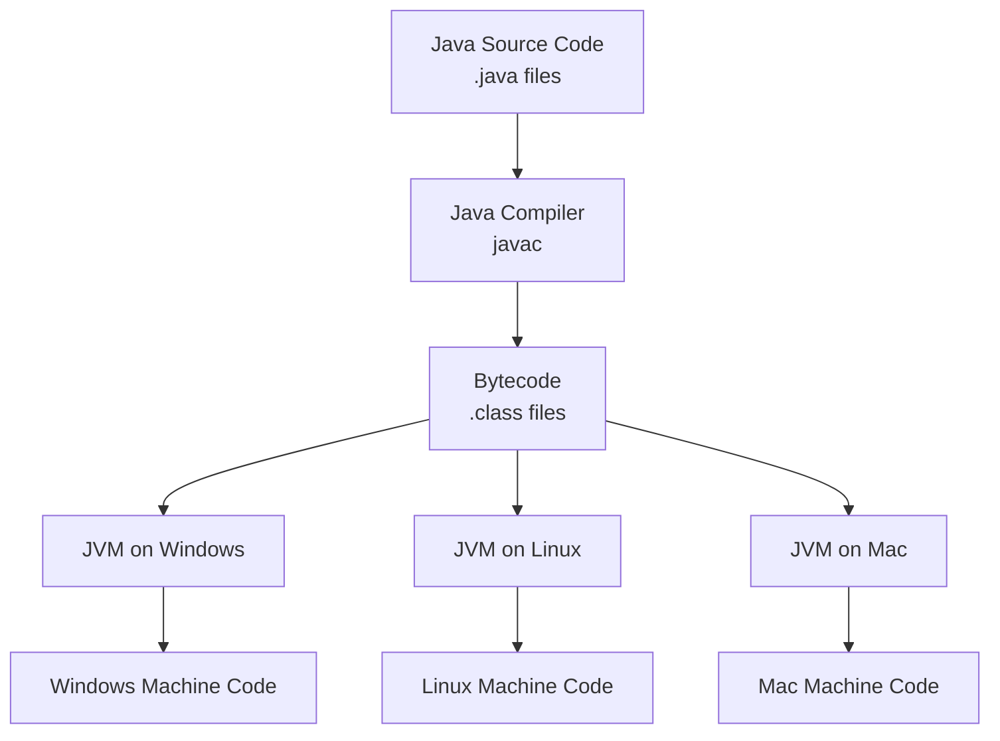
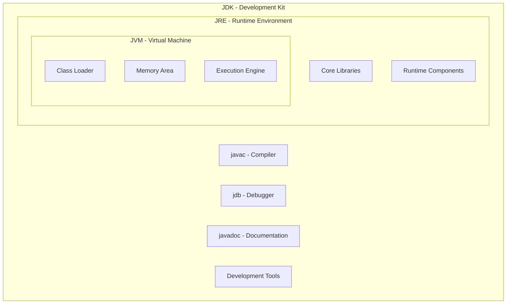
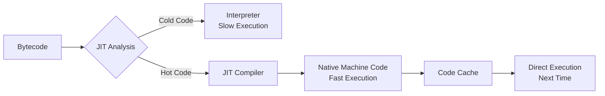
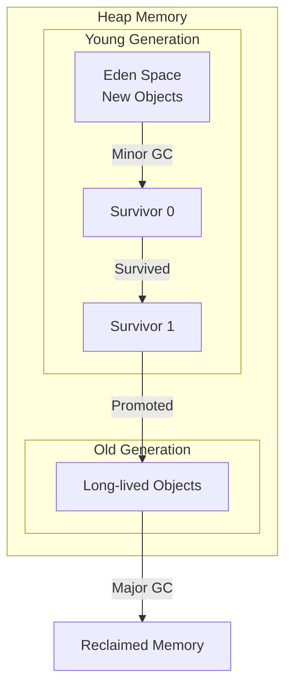
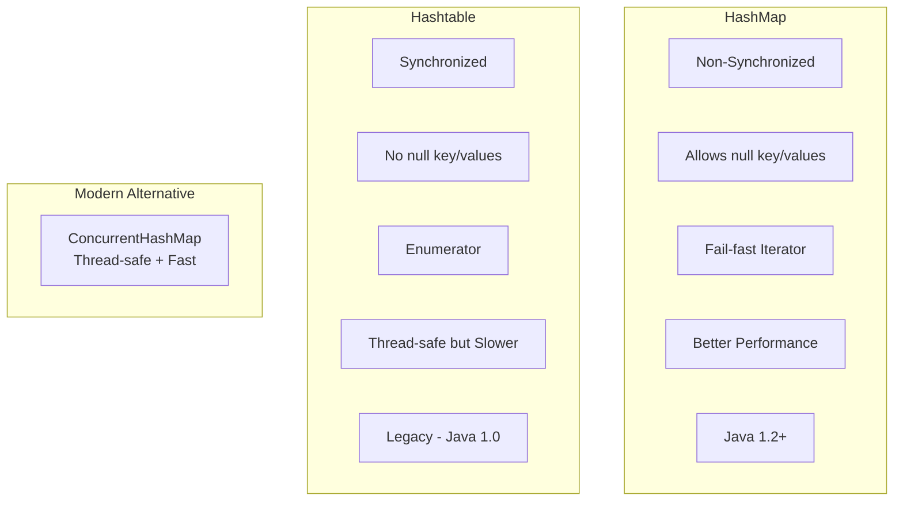
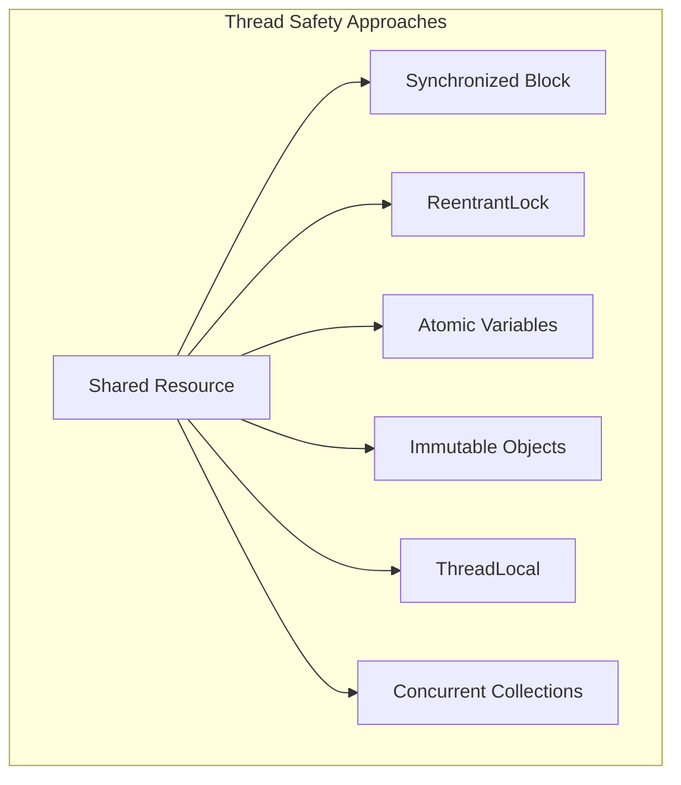
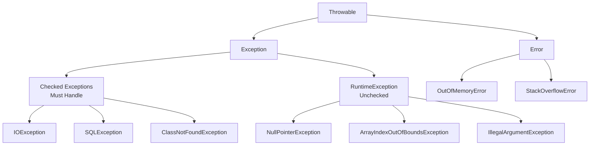
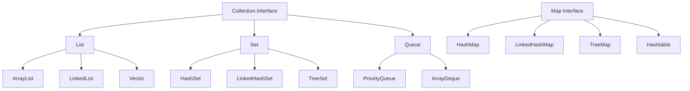

# Comprehensive Interview Q&A Guide for Java Developer

## JAVA - Top 40 Questions

### 1. What is Java and why is it platform independent?

**Technical Explanation:**
Java is a high-level, object-oriented programming language that achieves platform independence through its unique compilation and execution model. Java source code is compiled into bytecode (intermediate representation) rather than native machine code. This bytecode runs on the Java Virtual Machine (JVM), which acts as an abstraction layer between the bytecode and the operating system. Each platform has its own JVM implementation that translates bytecode into platform-specific instructions at runtime. The principle "Write Once, Run Anywhere" (WORA) is enabled by this architecture, along with standardized APIs and automatic memory management.

Imagine Java like a universal translator for computers. When you write instructions in Java, it's like writing a letter in a special universal language that any computer can understand. Instead of writing different letters for Windows computers, Mac computers, and Linux computers, you write one letter and give it to a translator (JVM) who lives on each computer. Each translator knows how to read your universal letter and explain it to their specific computer in the language that computer understands best.

**Scenario:**
A software company develops a financial application for banks. Using Java, they write the code once and deploy it across different bank branches running various operating systems - Windows servers, Linux mainframes, and cloud platforms. Without modifying the code, the same application runs seamlessly everywhere, reducing development time and maintenance costs significantly.



### 2. Explain JVM, JRE, and JDK - What are the differences?

**Technical Explanation:**
JVM (Java Virtual Machine) is the runtime environment that executes Java bytecode. It provides memory management, security, and platform independence. JRE (Java Runtime Environment) includes JVM plus standard Java class libraries and runtime components needed to run Java applications. JDK (Java Development Kit) contains JRE plus development tools like compiler (javac), debugger (jdb), documentation generator (javadoc), and other utilities for developing Java applications. The relationship is hierarchical: JDK contains JRE, which contains JVM.

Think of these three components like a kitchen setup. JVM is like the oven that actually cooks (executes) your food (code). JRE is like having the oven plus all the basic utensils, pots, and pans you need to serve the cooked food to people who want to eat it. JDK is like having a complete professional kitchen with the oven, all utensils, PLUS recipe books, measuring tools, food processors, and everything a chef needs to create new dishes from scratch.

**Scenario:**
A developer needs JDK installed on their machine to write and compile a new e-commerce application. The testing team only needs JRE to run and test the compiled application. End users downloading the application only need JRE on their systems. The company's production servers also only require JRE, keeping the deployment footprint minimal and secure.



### 3. What is JIT Compiler and how does it improve performance?

**Technical Explanation:**
JIT (Just-In-Time) Compiler is a component of JVM that improves performance by compiling frequently executed bytecode sections into native machine code at runtime. Unlike traditional interpretation where bytecode is executed line by line, JIT identifies "hot spots" (frequently executed code) through profiling and compiles them into optimized native code. This compiled code is cached and reused for subsequent executions. Modern JVMs use tiered compilation with C1 (client compiler) for quick compilation and C2 (server compiler) for aggressive optimizations. JIT performs optimizations like inlining, dead code elimination, loop unrolling, and escape analysis.

Imagine you're reading a book in a foreign language. At first, you translate each sentence word by word, which is slow. But after reading certain sentences many times, you memorize their meaning and understand them instantly without translation. JIT Compiler works similarly - it watches which parts of your program run frequently and "memorizes" them by converting them into a language the computer understands directly, making those parts run super fast the next time.

**Scenario:**
An online gaming platform processes millions of player moves per second. Initially, the game logic runs slowly as bytecode is interpreted. But JIT Compiler notices that collision detection and physics calculations run thousands of times per second. It compiles these "hot" methods into highly optimized machine code, improving game performance by 10x and providing smooth gameplay even with thousands of concurrent players.



### 4. How does Garbage Collection work in Java?

**Technical Explanation:**
Garbage Collection (GC) is Java's automatic memory management system that identifies and removes objects no longer reachable from any live thread. The heap is divided into generations: Young Generation (Eden and Survivor spaces) for new objects, and Old Generation for long-lived objects. GC algorithms include Serial GC, Parallel GC, G1GC, and ZGC. The process involves marking reachable objects from GC roots, sweeping unreachable objects, and optionally compacting memory. Generational hypothesis assumes most objects die young, optimizing collection strategies. GC tuning involves adjusting heap sizes, generation ratios, and GC algorithm selection based on application characteristics.

Think of Garbage Collection like having an automatic cleaning robot in your room. As you play with toys (create objects), you sometimes forget about old toys and leave them scattered around. The robot periodically checks which toys you're still playing with (reachable objects) and which ones you've abandoned. It picks up the abandoned toys and puts them away, freeing up space for new toys. The robot is smart - it checks frequently used play areas more often than storage areas where you keep favorite toys longer.

**Scenario:**
A social media application creates millions of temporary objects for user posts, comments, and notifications. Without garbage collection, the server would run out of memory within hours. GC automatically identifies that old notification objects are no longer referenced after users read them and frees that memory. During peak hours, G1GC ensures low pause times, keeping the application responsive while cleaning up memory in the background.



### 5. Explain the four pillars of Object-Oriented Programming

**Technical Explanation:**
The four pillars of OOP are Encapsulation (bundling data and methods within classes, hiding internal implementation), Inheritance (creating new classes based on existing ones, promoting code reuse), Polymorphism (ability of objects to take multiple forms, achieved through method overriding and overloading), and Abstraction (hiding complex implementation details, showing only essential features). These principles work together to create modular, maintainable, and scalable code. Encapsulation uses access modifiers, Inheritance uses extends/implements keywords, Polymorphism enables dynamic method dispatch, and Abstraction uses abstract classes and interfaces.

Think of OOP like building with smart LEGO blocks. Encapsulation is like each LEGO block having its own hidden mechanisms inside - you can use the block without knowing how it's made internally. Inheritance is like creating new blocks based on existing ones - a window block inherits properties from a basic square block but adds transparency. Polymorphism is like different blocks fitting the same connection points - a wheel, propeller, or decoration can all attach to the same spot. Abstraction is like instruction manuals showing only what you need to build, not how each block was manufactured.

**Scenario:**
A banking system uses all four OOP pillars: Account class encapsulates balance and account number with private access. SavingsAccount and CheckingAccount inherit from Account. Both implement calculateInterest() differently (polymorphism) - savings uses compound interest while checking uses simple interest. The abstract Transaction class defines common behavior for deposits and withdrawals without specifying implementation details, allowing different transaction types to implement their own validation rules.

```mermaid
graph TB
    subgraph "Abstraction"
        A[Abstract Vehicle<br/>- speed<br/>+ move()]
    end
    
    subgraph "Inheritance"
        B[Car]
        C[Bike]
        A --> B
        A --> C
    end
    
    subgraph "Encapsulation"
        D[Private: engineType<br/>Protected: speed<br/>Public: getSpeed()]
    end
    
    subgraph "Polymorphism"
        E[Car.move() - drives]
        F[Bike.move() - pedals]
    end
```

### 6. What is the difference between HashMap and Hashtable?

**Technical Explanation:**
HashMap and Hashtable are both hash table implementations but differ significantly. HashMap is non-synchronized, allows null keys/values, and provides better performance in single-threaded environments. Hashtable is synchronized (thread-safe), doesn't allow null keys/values, and is legacy from Java 1.0. HashMap uses fail-fast iterators that throw ConcurrentModificationException, while Hashtable uses enumerators. HashMap extends AbstractMap and implements Map interface, while Hashtable extends Dictionary class. For thread-safety with performance, ConcurrentHashMap is preferred over Hashtable. Initial capacity and load factor affect performance in both.

Imagine two different types of lockers at school. Hashtable is like old-style lockers where only one person can access the locker area at a time - it's very safe but creates long queues. HashMap is like modern lockers where multiple people can access different lockers simultaneously - it's faster but you need to be careful not to bump into others. Hashtable doesn't allow empty lockers (null), while HashMap is fine with having some empty spaces. Most schools now prefer the HashMap style with special safety rules when needed.

**Scenario:**
An e-commerce website's shopping cart uses HashMap to store product IDs and quantities because it's accessed by single user sessions. The inventory management system uses ConcurrentHashMap (not Hashtable) for thread-safe operations when multiple warehouse workers update stock levels simultaneously. The legacy payment system still uses Hashtable, causing performance bottlenecks during Black Friday sales, prompting a migration to modern concurrent collections.



### 7. Explain ArrayList vs LinkedList - When to use which?

**Technical Explanation:**
ArrayList uses a dynamic array internally, providing O(1) random access but O(n) insertion/deletion in the middle. It's cache-friendly due to contiguous memory allocation. LinkedList uses doubly-linked nodes, providing O(1) insertion/deletion at any position with iterator but O(n) random access. ArrayList is memory efficient for storing elements, while LinkedList has overhead for node pointers. ArrayList is better for frequent access and iteration, LinkedList excels at frequent insertion/deletion. ArrayList may need resizing (amortized O(1) addition), while LinkedList grows seamlessly.

Think of ArrayList like a notebook with numbered pages - you can instantly flip to page 50, but inserting a new page in the middle means shifting all subsequent pages. LinkedList is like a treasure hunt where each clue points to the next location - adding a new clue anywhere is easy (just change what the previous clue points to), but finding clue #50 means following all 49 previous clues. Choose the notebook for reading and the treasure hunt for frequent changes.

**Scenario:**
A music player app uses ArrayList for the main playlist display because users frequently scroll through songs (random access) and the list doesn't change often during playback. The "Now Playing" queue uses LinkedList because songs are constantly added/removed from various positions as users queue up next songs or remove upcoming ones. The search results use ArrayList for fast display and sorting of hundreds of matches.

```mermaid
graph LR
    subgraph "ArrayList"
        A1[0] --> A2[1] --> A3[2] --> A4[3] --> A5[4]
        AN[Direct Access O(1)]
    end
    
    subgraph "LinkedList"
        L1[Node] -.-> L2[Node] -.-> L3[Node] -.-> L4[Node]
        L2 -.-> L1
        L3 -.-> L2
        L4 -.-> L3
        LN[Sequential Access O(n)]
    end
```

### 8. What are Java 8 Stream APIs and their benefits?

**Technical Explanation:**
Stream API provides functional-style operations on collections, enabling declarative data processing. Streams support intermediate operations (filter, map, sorted) that return streams and terminal operations (collect, forEach, reduce) that produce results. Benefits include parallel processing with parallelStream(), lazy evaluation for performance, reduced boilerplate code, and functional programming paradigms. Streams are not data structures but pipelines for data transformation. They support method chaining, lambda expressions, and method references. Common operations include filtering, mapping, reducing, grouping, and partitioning.

Imagine Stream API like a smart conveyor belt in a factory. Instead of workers manually checking each item one by one (traditional loops), you set up stations along the belt - one station removes defective items (filter), another paints them (map), another sorts by size (sorted), and the final station packages them (collect). The belt can split into multiple parallel belts for faster processing. You just describe what each station should do, and the belt system handles the actual work efficiently.

**Scenario:**
An HR system processes employee data to find all developers earning above $100k in California, group them by experience level, and calculate average salaries. Using streams: `employees.stream().filter(e -> e.getRole().equals("Developer") && e.getSalary() > 100000 && e.getState().equals("CA")).collect(Collectors.groupingBy(Employee::getExperienceLevel, Collectors.averagingDouble(Employee::getSalary)))`. This replaces 20+ lines of traditional code with a single readable pipeline.

```mermaid
graph LR
    A[Collection] --> B[stream()]
    B --> C[filter()]
    C --> D[map()]
    D --> E[sorted()]
    E --> F[collect()]
    F --> G[Result]
    
    B -.-> H[parallelStream()]
    H -.-> C
```

### 9. What is the difference between Interface and Abstract Class?

**Technical Explanation:**
Abstract classes are partially implemented classes that cannot be instantiated, supporting both abstract and concrete methods, instance variables, constructors, and all access modifiers. Interfaces define contracts with public abstract methods (default and static methods since Java 8, private methods since Java 9), only public static final variables, no constructors, and support multiple inheritance. A class extends one abstract class but implements multiple interfaces. Abstract classes enable code reuse through inheritance, while interfaces define capabilities through contracts. Java 8+ interfaces with default methods blur some distinctions but maintain conceptual differences.

Think of an abstract class like a partially built house blueprint that includes some completed rooms (concrete methods) and some rooms marked "finish yourself" (abstract methods). You can only use one blueprint to build your house. An interface is like a checklist of features your house must have - "must have a door," "must have windows" - without specifying how to build them. You can follow multiple checklists simultaneously. Your house (class) is built from one blueprint but can satisfy many different feature checklists.

**Scenario:**
A game development framework uses abstract class `GameObject` with concrete methods for position management and abstract methods for render() and update(). All game objects (Player, Enemy, PowerUp) extend GameObject, inheriting common positioning logic. Interfaces like `Moveable`, `Shootable`, and `Collidable` define capabilities. A Player class extends GameObject and implements all three interfaces, while a Building extends GameObject but only implements Collidable, showcasing flexible capability composition.

```mermaid
graph TD
    subgraph "Abstract Class"
        A[Animal<br/>- name: String<br/>+ getName()<br/>+ abstract makeSound()]
    end
    
    subgraph "Interface"
        I1[Flyable<br/>+ fly()]
        I2[Swimmable<br/>+ swim()]
    end
    
    subgraph "Implementation"
        D[Duck extends Animal<br/>implements Flyable, Swimmable]
        C[Cat extends Animal]
    end
    
    A --> D
    A --> C
    I1 --> D
    I2 --> D
```

### 10. Explain Method Overloading vs Method Overriding

**Technical Explanation:**
Method Overloading (compile-time polymorphism) occurs when multiple methods have the same name but different parameters (number, type, or order) within the same class. The compiler determines which method to call based on arguments. Method Overriding (runtime polymorphism) occurs when a subclass provides a specific implementation for a method already defined in its parent class, maintaining the same signature. Overriding uses @Override annotation, requires inheritance, follows access modifier rules (can't reduce visibility), and enables dynamic method dispatch through virtual method tables.

Method overloading is like having different recipes for chocolate cake - one recipe uses cocoa powder, another uses melted chocolate, and another adds coffee. They're all called "makeChocolateCake" but use different ingredients (parameters). Method overriding is like your grandmother's apple pie recipe that you modify - you keep the same name and basic ingredients but change the technique to make it your own special version. When someone asks for apple pie, they get your version, not grandma's.

**Scenario:**
A payment processing system uses overloading for processPayment() methods - one accepts credit card details, another accepts bank account info, and another accepts digital wallet tokens. Each handles different payment types. For overriding, the base PaymentProcessor class has a validateTransaction() method. The CreditCardProcessor overrides it to check card validity and credit limits, while CryptoProcessor overrides it to verify blockchain confirmations, providing specialized validation logic for each payment type.

```mermaid
graph TD
    subgraph "Method Overloading - Same Class"
        O1[print(String s)]
        O2[print(int i)]
        O3[print(String s, int times)]
    end
    
    subgraph "Method Overriding - Inheritance"
        P[Parent: draw()]
        C1[Circle: @Override draw()]
        C2[Square: @Override draw()]
        P --> C1
        P --> C2
    end
```

### 11. What is the Java Memory Model and how is memory organized?

**Technical Explanation:**
Java Memory Model defines how threads interact through memory and what behaviors are allowed in concurrent execution. JVM memory is divided into: Heap (shared among threads, stores objects and arrays, divided into Young and Old generations), Stack (thread-private, stores method invocations, local variables, partial results), Method Area/Metaspace (stores class metadata, constants, static variables), PC Registers (holds current executing instruction address), and Native Method Stack (for native method execution). The model ensures visibility, ordering, and atomicity through happens-before relationships, volatile variables, and synchronization mechanisms.

Imagine JVM memory like a school building. The Heap is the shared cafeteria where all students (threads) eat together - food (objects) is available to everyone. Each student has their own locker (Stack) for personal items (local variables) that others can't access. The library (Method Area) stores shared textbooks (class information) that everyone can read. The principal's announcements (volatile variables) are immediately visible to all students. The building rules ensure orderly behavior when students interact in shared spaces.

**Scenario:**
A multi-threaded web server processes user requests. Each request thread has its own stack storing request parameters and temporary calculations. User session objects are stored in heap memory, accessible by any thread handling that user's requests. Class definitions for request handlers are in Metaspace. When one thread updates a shared cache (volatile field), the memory model ensures all threads see the update immediately, preventing stale data issues in concurrent request processing.

```mermaid
graph TB
    subgraph "JVM Memory Structure"
        subgraph "Per Thread"
            S1[Thread 1 Stack]
            S2[Thread 2 Stack]
            PC1[PC Register 1]
            PC2[PC Register 2]
        end
        
        subgraph "Shared Memory"
            H[Heap<br/>Young Gen | Old Gen]
            M[Metaspace<br/>Class Metadata]
        end
        
        subgraph "Stack Frame"
            LV[Local Variables]
            OS[Operand Stack]
            FR[Frame Data]
        end
    end
```

### 12. What is Thread Safety and how do you achieve it?

**Technical Explanation:**
Thread safety ensures that shared data remains consistent when accessed by multiple threads concurrently. Achieving thread safety involves: Synchronization (synchronized blocks/methods using intrinsic locks), Immutability (using final fields and immutable objects), Atomic Variables (AtomicInteger, AtomicReference using compare-and-swap), Concurrent Collections (ConcurrentHashMap, CopyOnWriteArrayList), ThreadLocal Variables (thread-confined data), and Lock-Free Algorithms. The java.util.concurrent package provides high-level constructs like ReentrantLock, Semaphore, CountDownLatch, and Executors framework for managing concurrency effectively.

Think of thread safety like multiple cooks in one kitchen. Without safety measures, they might bump into each other, use ingredients someone else needs, or ruin each other's dishes. Thread safety is like having rules: only one cook can use the stove at a time (synchronization), some ingredients are pre-portioned in sealed containers that can't be changed (immutability), there's a number system for taking turns (atomic operations), and each cook has their own cutting board (ThreadLocal). These rules ensure everyone can cook without interfering with others.

**Scenario:**
A banking application processes thousands of concurrent transactions. Account balance updates use synchronized blocks to prevent race conditions where two withdrawals might overdraw an account. Transaction IDs use AtomicLong for thread-safe generation without synchronization overhead. The audit log uses ConcurrentLinkedQueue for high-performance concurrent writes. Customer objects are immutable - any change creates a new object, eliminating synchronization needs for read operations while maintaining thread safety.



### 13. Explain the difference between String, StringBuilder, and StringBuffer

**Technical Explanation:**
String is immutable - once created, its value cannot be changed. Any modification creates a new String object, making it thread-safe but potentially inefficient for multiple concatenations. StringBuilder (Java 5+) is mutable with dynamic character array, providing efficient string manipulation without creating new objects, but is not thread-safe. StringBuffer is the thread-safe version of StringBuilder, using synchronized methods for all operations, resulting in performance overhead. String is stored in String Pool for memory optimization, while StringBuilder/StringBuffer are always heap objects. Use String for fixed values, StringBuilder for single-threaded concatenation, and StringBuffer for multi-threaded scenarios.

Think of String like a printed book - once printed, you can't change the words. To make changes, you must print a whole new book. StringBuilder is like writing with a pencil - you can erase and rewrite easily, but only one person should write at a time. StringBuffer is like a special notebook with a lock - multiple people can write, but they must take turns using the lock, which slows things down. Most of the time, you read printed books (String) or write notes yourself (StringBuilder).

**Scenario:**
A log processing application reads millions of log entries. Using String concatenation in a loop would create millions of temporary objects, causing memory pressure and garbage collection overhead. StringBuilder efficiently builds each processed log entry. In the multi-threaded aggregation phase where multiple threads contribute to a summary report, StringBuffer ensures thread-safe concatenation. For configuration constants and error messages that don't change, String is used for memory efficiency through String Pool sharing.

```mermaid
graph LR
    subgraph "String - Immutable"
        S1[Hello] --> S2[Hello World<br/>New Object]
    end
    
    subgraph "StringBuilder - Mutable"
        SB1[Hello] --> SB2[Append: World<br/>Same Object Modified]
    end
    
    subgraph "StringBuffer - Thread-Safe"
        SF1[synchronized append()]
        SF2[synchronized insert()]
        SF3[synchronized delete()]
    end
```

### 14. What are Checked and Unchecked Exceptions?

**Technical Explanation:**
Checked exceptions are compile-time exceptions that must be either caught or declared in the method signature using throws clause. They extend Exception but not RuntimeException, representing recoverable conditions like IOException, SQLException, ClassNotFoundException. Unchecked exceptions extend RuntimeException, occur at runtime, and don't require explicit handling. They represent programming errors like NullPointerException, ArrayIndexOutOfBoundsException, IllegalArgumentException. Error class represents serious problems like OutOfMemoryError that applications shouldn't catch. The distinction enables compile-time safety for anticipated issues while avoiding cluttered code for programming errors.

Checked exceptions are like airport security checkpoints - you know they're there and must prepare for them (have your ID ready). You can't board the plane without passing through security. Unchecked exceptions are like accidentally tripping while walking - they can happen anywhere, anytime, usually because you weren't careful. You don't prepare for every possible trip, but you try to walk carefully. Errors are like the building collapsing - something so serious that evacuation is the only option, not trying to fix it.

**Scenario:**
A file processing application uses checked exceptions when reading configuration files - FileNotFoundException forces developers to handle missing config files gracefully with defaults or user prompts. Database connections throw SQLException (checked), ensuring proper error handling for network issues. During processing, unchecked exceptions like NullPointerException might occur if data validation fails. The application catches specific checked exceptions for recovery (retry connection, use backup file) while letting unchecked exceptions bubble up for debugging programming errors.



### 15. What is the Singleton Design Pattern and how do you implement it?

**Technical Explanation:**
Singleton ensures a class has only one instance and provides global access to it. Implementation approaches include: Eager initialization (instance created at class loading), Lazy initialization (instance created on first use), Thread-safe Singleton (using synchronization), Double-checked locking (optimized synchronization), Bill Pugh solution (using inner static helper class), and Enum Singleton (Java's recommended approach). Key considerations include thread safety, serialization handling (readResolve method), reflection attack prevention, and classloader issues. Modern applications often prefer dependency injection over Singleton for better testability and flexibility.

Singleton is like having only one principal in a school. No matter how many times students or teachers need to talk to "the principal," they're always directed to the same person. You can't create another principal - there's a rule ensuring only one exists. Different schools might hire their principal at different times (eager vs lazy), but once hired, everyone refers to that same principal. The school board (JVM) makes sure even if someone tries to create another principal, they get directed to the existing one.

**Scenario:**
A logging framework uses Singleton pattern for the Logger class, ensuring all application components write to the same log file without conflicts. Database connection pool manager is another Singleton, maintaining a fixed number of connections shared across the application. The configuration manager Singleton loads application settings once and provides them throughout the application lifecycle. Using enum-based Singleton prevents issues during serialization when logs are sent to remote monitoring systems.

```mermaid
graph TD
    subgraph "Singleton Implementation"
        A[Private Constructor]
        B[Private Static Instance]
        C[Public getInstance()]
        
        D[Thread 1] --> C
        E[Thread 2] --> C
        F[Thread 3] --> C
        
        C --> G[Same Instance Returned]
    end
    
    subgraph "Singleton Types"
        H[Eager Loading]
        I[Lazy Loading]
        J[Thread-Safe]
        K[Enum Singleton]
    end
```

### 16. What are Lambda Expressions and Functional Interfaces?

**Technical Explanation:**
Lambda expressions are anonymous functions that provide concise syntax for implementing functional interfaces. Syntax: `(parameters) -> expression` or `(parameters) -> { statements; }`. Functional interfaces have exactly one abstract method and can be annotated with @FunctionalInterface. Common functional interfaces include Predicate<T> (test condition), Function<T,R> (transform input to output), Consumer<T> (accept input, no output), and Supplier<T> (provide output, no input). Lambdas enable functional programming, improve code readability, and work seamlessly with Stream API. They capture variables from enclosing scope (effectively final) and support method references (Class::method).

Lambda expressions are like giving someone quick instructions without writing a formal letter. Instead of creating a whole class just to say "double this number," you write `x -> x * 2`. It's like the difference between giving someone a full recipe book versus quickly saying "just add salt to taste." Functional interfaces are like job descriptions with one main task - a security guard's main job is "check IDs," which can be done different ways (lambda expressions) by different guards.

**Scenario:**
An e-commerce platform uses lambdas extensively for data processing. Filtering products: `products.filter(p -> p.getPrice() < 100 && p.isInStock())`. Sorting with custom logic: `products.sort((p1, p2) -> p1.getRating().compareTo(p2.getRating()))`. Event handling for button clicks: `button.setOnAction(event -> processOrder())`. The code becomes more readable and maintainable, reducing boilerplate ActionListener implementations and anonymous inner classes throughout the application.

```mermaid
graph LR
    subgraph "Traditional Approach"
        A[new Interface() {<br/>public void method() {<br/>// implementation<br/>}<br/>}]
    end
    
    subgraph "Lambda Expression"
        B[() -> implementation]
    end
    
    subgraph "Functional Interfaces"
        C[Predicate<T>]
        D[Function<T,R>]
        E[Consumer<T>]
        F[Supplier<T>]
    end
```

### 17. Explain the concept of Generics in Java

**Technical Explanation:**
Generics enable types (classes and interfaces) to be parameters when defining classes, interfaces, and methods. They provide compile-time type safety, eliminate casting, and enable code reuse. Syntax uses angle brackets: `Class<T>`, with T as type parameter. Common conventions: T (Type), E (Element), K (Key), V (Value), N (Number). Features include bounded type parameters (`<T extends Number>`), wildcards (`? extends Type`, `? super Type`), and generic methods. Type erasure occurs at runtime for backward compatibility, replacing generic types with Object or bounds. Generics prevent ClassCastException and enable stronger type checking.

Generics are like labeled storage containers that only accept specific types of items. Instead of having a general box where you might accidentally put shoes with food, you have a `Box<Shoes>` that only accepts shoes and a `Box<Food>` that only accepts food. The compiler acts like a security guard, checking that you're putting the right items in the right boxes. When you take items out, you know exactly what type they are without checking or guessing.

**Scenario:**
A data analytics platform uses generics extensively. `Repository<Customer>` ensures only Customer objects are saved/retrieved, preventing accidentally mixing with Product data. `Cache<String, User>` provides type-safe key-value storage. `List<? extends Animal>` accepts lists of any animal subtype for a zoo management system. `Comparator<Employee>` enables type-safe sorting without casting. This prevents runtime errors where a developer might accidentally cast a Product to Customer, catching such errors at compile time.

```mermaid
graph TD
    subgraph "Without Generics"
        A[List list = new ArrayList()<br/>list.add(anything)<br/>Object obj = list.get(0)<br/>String s = (String) obj // Risky!]
    end
    
    subgraph "With Generics"
        B[List<String> list = new ArrayList<>()<br/>list.add(string only)<br/>String s = list.get(0) // Safe!]
    end
    
    subgraph "Generic Class"
        C[class Box<T> {<br/>  private T content;<br/>  void set(T item)<br/>  T get()<br/>}]
    end
```

### 18. What is the difference between == and equals() method?

**Technical Explanation:**
The == operator compares reference equality (memory addresses) for objects and value equality for primitives. The equals() method compares logical equality based on implementation, default being reference equality from Object class. String class overrides equals() for content comparison. For custom classes, override equals() following the contract: reflexive, symmetric, transitive, consistent, and null-comparison returns false. When overriding equals(), also override hashCode() to maintain the contract that equal objects must have equal hash codes. StringPool affects String comparison with == due to interning.

The == operator is like checking if two people are literally the same person by comparing their ID cards. The equals() method is like checking if two people have the same characteristics you care about - maybe same name, age, and hometown. For identical twins, == says they're different people (different IDs), but equals() might say they're the same if you only compare appearance. With String literals, Java is clever and might reuse the same ID card for identical text, making == sometimes work unexpectedly.

**Scenario:**
A user authentication system compares passwords. Using `password == userInput` fails because user input creates a new String object. Using `password.equals(userInput)` correctly compares content. For User objects, the default equals() compares references, so two User objects with same email are considered different. After overriding equals() to compare email fields, users can log in from different sessions. The system ensures hashCode() is also overridden so User objects work correctly in HashMaps for session management.

```mermaid
graph TD
    subgraph "Reference Comparison (==)"
        A[Object A<br/>Memory: 0x1234] 
        B[Object B<br/>Memory: 0x5678]
        C[A == B: false]
    end
    
    subgraph "Value Comparison (equals)"
        D[Object A<br/>value: "Hello"]
        E[Object B<br/>value: "Hello"]
        F[A.equals(B): true]
    end
    
    subgraph "String Pool"
        G[String s1 = "Hello"]
        H[String s2 = "Hello"]
        I[Same Reference<br/>s1 == s2: true]
    end
```

### 19. What are the different types of Inner Classes in Java?

**Technical Explanation:**
Java supports four types of inner classes: Member Inner Class (non-static nested class with access to outer class members), Static Nested Class (static class within another class, no access to outer instance members), Local Inner Class (defined within a method or block, accesses final/effectively final local variables), and Anonymous Inner Class (unnamed class for one-time use, often for interface implementations). Inner classes enable logical grouping, encapsulation, and cleaner event handling. They can access private members of outer class, but create implicit references affecting garbage collection.

Inner classes are like rooms within a house. Member inner class is like a bedroom that knows everything about the house - temperature, who lives there, etc. Static nested class is like a garage - it's part of the property but doesn't need to know if anyone's home. Local inner class is like a temporary tent set up in a room for a specific event - it exists only during that event. Anonymous inner class is like a pop-up booth - you set it up quickly for one specific purpose without giving it a formal name.

**Scenario:**
A GUI application uses all inner class types. Member inner class `ButtonHandler` accesses parent window's fields to update display. Static nested class `Configuration` groups related constants without needing window instance. Local inner class in `setupUI()` method creates specialized components that need method parameters. Anonymous inner classes handle events: `button.addActionListener(new ActionListener() { public void actionPerformed(ActionEvent e) { /* handle click */ } })`. This organizes related functionality while maintaining encapsulation.

```mermaid
graph TD
    subgraph "Outer Class"
        A[OuterClass]
        
        subgraph "Member Inner"
            B[InnerClass<br/>Access all outer members]
        end
        
        subgraph "Static Nested"
            C[static NestedClass<br/>No outer instance needed]
        end
        
        subgraph "Method"
            D[void method() {<br/>  class LocalClass {}<br/>  new Interface() {} //Anonymous<br/>}]
        end
    end
```

### 20. Explain the Java Collections Hierarchy

**Technical Explanation:**
Java Collections Framework provides unified architecture for storing and manipulating groups of objects. The hierarchy starts with Collection interface, branching into List (ordered, allows duplicates: ArrayList, LinkedList, Vector), Set (no duplicates: HashSet, LinkedHashSet, TreeSet), and Queue (FIFO operations: PriorityQueue, LinkedList, ArrayDeque) interfaces. Map interface (not extending Collection) handles key-value pairs: HashMap, LinkedHashMap, TreeMap, Hashtable. Each implementation offers different performance characteristics for operations like add, remove, search, and iteration. Concurrent collections provide thread-safe alternatives.

The Collections Framework is like different types of containers in your kitchen. List is like a recipe book where order matters and you might have duplicate ingredients. Set is like a spice rack where you have one of each spice, no duplicates. Queue is like a line of dishes to wash - first in, first out. Map is like a phone book linking names to numbers. Each container type has different materials (implementations) - plastic (ArrayList) for quick access, or linked chains (LinkedList) for easy insertion and removal.

**Scenario:**
A social media platform uses various collections: ArrayList stores user's timeline posts in chronological order. HashSet tracks unique users who liked a post, preventing duplicate likes. PriorityQueue manages notification delivery based on importance. HashMap caches user profiles with userId as key. TreeSet maintains trending hashtags in alphabetical order. ConcurrentHashMap handles real-time active user sessions across multiple servers. Each collection choice optimizes specific operations for better performance.



### 21. What is the difference between Comparable and Comparator?

**Technical Explanation:**
Comparable interface defines natural ordering for objects through compareTo() method, implemented by the class itself. It provides single sorting sequence and modifies the original class. Comparator interface defines custom ordering through compare() method, implemented as separate class or lambda. It enables multiple sorting sequences without modifying original class. Comparable uses `Collections.sort(list)` while Comparator uses `Collections.sort(list, comparator)`. Common practice: implement Comparable for primary sorting logic, use Comparator for alternative sorting needs or when unable to modify the class.

Comparable is like teaching students to line up by height naturally - each student knows their height and can compare with others. It's the default way they organize themselves. Comparator is like a teacher who arranges students differently each time - by age for one activity, by last name for another, by test scores for awards. The students don't change, but the teacher (Comparator) provides different arrangement rules. You can have only one natural way to line up (Comparable) but unlimited teacher-directed arrangements (Comparators).

**Scenario:**
An employee management system has Employee class implementing Comparable to sort by employeeId (natural ordering). For reports, different Comparators sort employees: by salary for compensation analysis, by joining date for seniority benefits, by department then name for organizational charts. The HR dashboard dynamically sorts employee lists using: `employees.sort(Comparator.comparing(Employee::getDepartment).thenComparing(Employee::getName))`. This flexibility allows various views without modifying the Employee class repeatedly.

```mermaid
graph LR
    subgraph "Comparable"
        A[class Employee implements Comparable<Employee><br/>compareTo(Employee other)]
        B[Natural Ordering<br/>One way to sort]
    end
    
    subgraph "Comparator"
        C[class SalaryComparator implements Comparator<Employee><br/>compare(Employee e1, Employee e2)]
        D[Multiple Comparators<br/>Many ways to sort]
        E[Lambda: (e1, e2) -> e1.salary - e2.salary]
    end
```

### 22. What is the volatile keyword and when should you use it?

**Technical Explanation:**
The volatile keyword ensures visibility of changes to variables across threads by preventing CPU caching and compiler optimizations. When a field is declared volatile, any write to that variable is immediately visible to all threads, establishing happens-before relationships. It provides weaker synchronization than synchronized blocks - guarantees visibility but not atomicity. Useful for flags, status indicators, and double-checked locking patterns. volatile doesn't prevent race conditions for compound operations (like increment). Modern uses include shutdown flags, configuration updates, and JSR-133 compliant double-checked locking.

Volatile is like a public announcement board in a school that everyone checks constantly. Without volatile, each classroom might have their own copy of announcements that they update occasionally. With volatile, there's only one official board, and whenever someone posts a new announcement, everyone sees it immediately. It ensures everyone has the latest information but doesn't prevent two people from trying to post conflicting announcements at the same time - for that, you'd need a lock on the board.

**Scenario:**
A web server uses volatile boolean for shutdown flag: `private volatile boolean shutdownRequested = false`. When admin triggers shutdown, the main thread sets this flag to true. All worker threads checking this flag immediately see the change and begin graceful shutdown. Without volatile, worker threads might cache the old value and never stop. For request counters requiring atomicity, AtomicLong is used instead since `volatile long requestCount` wouldn't prevent lost updates when multiple threads increment simultaneously.

```mermaid
graph TD
    subgraph "Without Volatile"
        A[Thread 1 Cache<br/>flag = false] 
        B[Thread 2 Cache<br/>flag = false]
        C[Main Memory<br/>flag = true]
        D[Threads don't see update!]
    end
    
    subgraph "With Volatile"
        E[Thread 1] --> G[Main Memory<br/>volatile flag = true]
        F[Thread 2] --> G
        H[All threads see update immediately]
    end
```

### 23. Explain the concept of Serialization and Deserialization

**Technical Explanation:**
Serialization converts object state into byte stream for storage or transmission, while deserialization reconstructs objects from byte streams. Classes implement Serializable interface (marker interface) to enable serialization. The process uses ObjectOutputStream.writeObject() and ObjectInputStream.readObject(). SerialVersionUID ensures version compatibility. Transient keyword excludes fields from serialization. Customization possible through writeObject/readObject methods. Considerations include security (deserialization vulnerabilities), performance, versioning, and inheritance. Alternative approaches include JSON/XML serialization, protocol buffers, and Java 14's Records with automatic serialization support.

Serialization is like packing your toys in a box to mail to a friend. You carefully wrap each toy (convert object to bytes) and label them so your friend knows how to reassemble them. Deserialization is your friend opening the box and putting the toys back together exactly as they were. Some fragile parts (transient fields) you might not ship, instead leaving a note to buy replacements locally. The serial version UID is like a model number ensuring your friend has the right instruction manual for assembly.

**Scenario:**
A distributed caching system serializes user session objects to share across servers. Shopping cart data is serialized to survive server restarts. The Payment class marks credit card numbers as transient for security. Custom writeObject method encrypts sensitive data before serialization. When deserializing old sessions after application updates, serialVersionUID ensures compatibility. Remote method invocation (RMI) uses serialization to pass objects between JVMs. The system switches to JSON serialization for REST APIs to support non-Java clients.

```mermaid
graph LR
    A[Java Object] --> B[Serialization]
    B --> C[Byte Stream]
    C --> D[File/Network/Database]
    D --> E[Deserialization]
    E --> F[Java Object Recreated]
    
    G[Transient Fields] -.-> B
    G --> H[Not Serialized]
```

### 24. What are the different ways to create threads in Java?

**Technical Explanation:**
Java provides multiple ways to create threads: extending Thread class (override run() method), implementing Runnable interface (preferred for flexibility), implementing Callable interface (returns result and throws exceptions), using Executor framework (manages thread pools), and CompletableFuture for asynchronous programming. Thread class approach limits inheritance, while Runnable/Callable allow implementing multiple interfaces. ExecutorService provides better resource management than creating raw threads. Modern approaches use parallel streams, ForkJoinPool for recursive tasks, and virtual threads (Project Loom) for lightweight concurrency.

Creating threads is like hiring workers for different tasks. Extending Thread is like hiring someone who only knows one specific job and can't learn anything else. Implementing Runnable is like hiring someone who can do your task plus learn other skills. Callable is like hiring a worker who not only does the job but also gives you a report when done. Executor framework is like using a staffing agency that manages a pool of workers - you just tell them what needs doing, and they assign available workers efficiently.

**Scenario:**
A web scraping application uses different threading approaches: Runnable for simple page downloads that don't return values. Callable<String> for tasks that extract and return specific data from pages. ExecutorService with fixed thread pool prevents creating thousands of threads that would overwhelm the system. CompletableFuture chains asynchronous operations: download page → parse content → save to database. For CPU-intensive data processing, ForkJoinPool recursively splits large datasets across available cores for parallel processing.

```mermaid
graph TD
    A[Creating Threads]
    
    A --> B[extends Thread]
    A --> C[implements Runnable]
    A --> D[implements Callable<V>]
    A --> E[ExecutorService]
    A --> F[CompletableFuture]
    
    B --> G[new MyThread().start()]
    C --> H[new Thread(runnable).start()]
    D --> I[executorService.submit(callable)]
    E --> J[Manages Thread Pool]
    F --> K[Async Operations]
```

### 25. What is the difference between wait() and sleep() methods?

**Technical Explanation:**
wait() is an Object class method that releases the lock and waits for notification, used for inter-thread communication within synchronized context. sleep() is a Thread class static method that pauses execution for specified time without releasing locks. wait() must be called within synchronized block/method and can be interrupted by notify()/notifyAll(). sleep() can be called anywhere and resumes after timeout or interruption. wait() is for coordination between threads (producer-consumer), while sleep() is for introducing delays. Both throw InterruptedException and put thread in waiting state but serve different purposes.

wait() is like waiting in a doctor's waiting room - you give up your turn (release lock) and wait until the nurse calls you (notify). Other patients can be seen while you wait. sleep() is like taking a nap in your locked car - you keep the parking spot (hold lock) and nobody else can use it until you wake up after your alarm. wait() allows others to proceed while you wait for a condition, but sleep() blocks the resource even though you're not actively using it.

**Scenario:**
A restaurant order processing system uses both methods. Kitchen threads use wait() when no orders are available, releasing lock on order queue so waiters can add new orders. When waiters add orders, they call notifyAll() to wake up kitchen threads. The system uses sleep() to simulate cooking time - Thread.sleep(5000) for a 5-second dish preparation, during which the kitchen station remains occupied. This demonstrates wait() for coordination and sleep() for timed delays in the workflow.

```mermaid
graph TD
    subgraph "wait() Method"
        A[Synchronized Block] --> B[object.wait()]
        B --> C[Release Lock]
        C --> D[Wait for notify()]
        E[Another Thread] --> F[object.notify()]
        F --> G[Thread Wakes Up]
        G --> H[Reacquire Lock]
    end
    
    subgraph "sleep() Method"
        I[Any Context] --> J[Thread.sleep(1000)]
        J --> K[Keep All Locks]
        K --> L[Sleep 1 second]
        L --> M[Wake Up & Continue]
    end
```

### 26. Explain the Java 8 Optional class and its benefits

**Technical Explanation:**
Optional<T> is a container object that may or may not contain a non-null value, designed to prevent NullPointerException and make null-handling explicit. Creation methods include Optional.of() (non-null values), Optional.ofNullable() (possibly null), and Optional.empty(). Key methods: isPresent(), ifPresent(), orElse(), orElseGet(), orElseThrow(), map(), flatMap(), and filter(). Benefits include explicit API contracts about nullable returns, functional programming style with method chaining, forced null-checking by design, and improved code readability. Best practices: don't use Optional for fields or method parameters, prefer returning Optional over null.

Optional is like a gift box that might or might not contain a present. Instead of opening an empty box and being disappointed (NullPointerException), you can shake it first to check if something's inside (isPresent), or have a backup plan ready (orElse). You can even say "if there's a toy inside, paint it red" (map) without opening empty boxes. It makes gift-giving rules clear - some people always give gifts in these special boxes, so you know to check before opening.

**Scenario:**
A user service refactors findUserById to return Optional<User> instead of null. Client code changes from null checks to functional style: `userService.findUserById(123).map(User::getEmail).filter(email -> email.endsWith("@company.com")).ifPresent(email -> sendNewsletter(email))`. Database queries return Optional preventing null pointer exceptions: `Optional<String> city = Optional.ofNullable(resultSet.getString("city")).orElse("Unknown")`. This makes the codebase more robust and self-documenting about nullable values.

```mermaid
graph LR
    subgraph "Without Optional"
        A[User user = findUser()]
        B[if (user != null)]
        C[Process user]
        D[Handle null case]
    end
    
    subgraph "With Optional"
        E[Optional<User> user = findUser()]
        F[user.map(User::getName)]
        G[.filter(name -> !name.isEmpty())]
        H[.orElse(Default Name)]
    end
```

### 27. What are Method References in Java 8?

**Technical Explanation:**
Method references are shorthand notation for lambda expressions that call existing methods. Four types: Static method reference (Class::staticMethod), Instance method of particular object (instance::method), Instance method of arbitrary object of particular type (Class::instanceMethod), and Constructor reference (Class::new). They improve readability when lambda only calls an existing method. Syntax uses double colon (::) operator. Method references can be used wherever functional interfaces are expected. They work with streams, optional operations, and event handlers. Compiler infers the functional interface method signature.

Method references are like giving someone directions using landmarks instead of detailed instructions. Instead of saying "go straight 100 meters, turn left, walk 50 meters" (lambda: x -> System.out.println(x)), you say "go to the post office" (System.out::println). Both get you there, but the landmark reference is clearer when the destination already exists. You're pointing to an existing method rather than describing what to do step by step.

**Scenario:**
A data processing pipeline uses method references for clarity: `employees.stream().map(Employee::getName)` instead of `map(e -> e.getName())`. Sorting uses `employees.sort(Comparator.comparing(Employee::getSalary))`. Constructor references create objects: `Stream.generate(Employee::new).limit(10)` creates 10 empty employees. Event handling simplifies: `button.setOnAction(this::handleButtonClick)`. The code becomes more readable, especially when method names are self-documenting, reducing lambda expression verbosity throughout the application.

```mermaid
graph LR
    subgraph "Lambda Expression"
        A[x -> System.out.println(x)]
        B[() -> new ArrayList<>()]
        C[s -> s.toUpperCase()]
    end
    
    subgraph "Method Reference"
        D[System.out::println]
        E[ArrayList::new]
        F[String::toUpperCase]
    end
    
    A -.-> D
    B -.-> E
    C -.-> F
```

### 28. Explain the concept of Autoboxing and Unboxing

**Technical Explanation:**
Autoboxing is automatic conversion of primitive types to their wrapper classes (int to Integer), while unboxing converts wrapper objects back to primitives. Java compiler handles these conversions automatically since Java 5. Autoboxing occurs during assignment, method arguments, and collections usage. Unboxing happens when wrapper objects are used in primitive contexts. Performance considerations include object creation overhead and potential NullPointerException during unboxing null values. Caching exists for common values (-128 to 127 for Integer). Explicit conversions use valueOf() and intValue() methods.

Autoboxing and unboxing are like automatic gift wrapping and unwrapping services. When you buy a toy (primitive int), the store can automatically put it in a gift box (Integer object) when needed for special occasions (like storing in collections). When you want to play with the toy, it's automatically unwrapped. The service is convenient but takes time, and you might be surprised if someone gives you an empty wrapped box (null) - unwrapping it causes problems!

**Scenario:**
A statistics calculator uses List<Integer> to store scores since collections can't hold primitives. Autoboxing happens when adding: `scores.add(95)` automatically converts int 95 to Integer. Unboxing occurs during calculations: `int sum = scores.get(0) + scores.get(1)`. Performance profiling reveals excessive autoboxing in loops, leading to optimization using primitive arrays for computation. NullPointerException occurs when `Integer cached = map.get("missing"); int value = cached;` - fixed by checking for null before unboxing.

```mermaid
graph LR
    subgraph "Autoboxing"
        A[int i = 5] --> B[Integer obj = i]
        C[Primitive] --> D[Wrapper Object]
    end
    
    subgraph "Unboxing"
        E[Integer obj = 10] --> F[int i = obj]
        G[Wrapper Object] --> H[Primitive]
    end
    
    subgraph "Common Usage"
        I[List<Integer> list]
        J[list.add(42) // Autoboxing]
        K[int value = list.get(0) // Unboxing]
    end
```

### 29. What is the difference between fail-fast and fail-safe iterators?

**Technical Explanation:**
Fail-fast iterators throw ConcurrentModificationException when collection is structurally modified during iteration (except through iterator's own methods). They operate on original collection and use modCount to detect changes. Examples include ArrayList, HashMap, TreeSet iterators. Fail-safe iterators work on cloned/snapshot copy of collection, allowing concurrent modifications without exceptions. They don't reflect modifications during iteration and have memory overhead. Examples include CopyOnWriteArrayList, ConcurrentHashMap iterators. Fail-fast ensures program correctness by detecting bugs early, while fail-safe provides better concurrency at the cost of consistency.

Fail-fast iterators are like strict library rules - if someone rearranges books while you're reading through the shelf, the librarian immediately stops you and says "the shelf changed, start over!" This catches mistakes but interrupts your reading. Fail-safe iterators are like taking photos of each shelf before reading - even if someone rearranges the actual shelf, you continue reading from your photos. You won't see new books added, but you won't be interrupted either.

**Scenario:**
A social media feed uses ArrayList with fail-fast iteration for single-threaded rendering. When background thread tries updating the list during iteration, ConcurrentModificationException alerts developers to the threading bug. For real-time collaborative editing, CopyOnWriteArrayList provides fail-safe iteration - multiple users can view the document while others edit, though viewers see a snapshot until they refresh. The choice depends on whether detecting concurrent modifications (fail-fast) or allowing them (fail-safe) better serves the use case.

```mermaid
graph TD
    subgraph "Fail-Fast Iterator"
        A[Start Iteration] --> B[Check modCount]
        B --> C{Modified?}
        C -->|Yes| D[ConcurrentModificationException]
        C -->|No| E[Continue Iteration]
    end
    
    subgraph "Fail-Safe Iterator"
        F[Start Iteration] --> G[Work on Copy/Snapshot]
        G --> H[Original Modified?]
        H --> I[No Exception]
        I --> J[Continue with Snapshot]
    end
```

### 30. Explain the Producer-Consumer pattern implementation in Java

**Technical Explanation:**
Producer-Consumer pattern involves producers generating data and consumers processing it, with a shared buffer mediating between them. Implementation approaches include: BlockingQueue (put/take methods handle synchronization automatically), wait/notify with synchronized blocks (traditional approach), Semaphores for permit-based access control, and Exchanger for direct producer-consumer pairing. Java's concurrent package provides ArrayBlockingQueue, LinkedBlockingQueue, and PriorityBlockingQueue. Lock and Condition provide fine-grained control. Key considerations include buffer size, blocking behavior, fairness, and multiple producer/consumer scenarios.

The Producer-Consumer pattern is like a restaurant kitchen and waiters. Cooks (producers) prepare dishes and place them on the service counter (buffer). Waiters (consumers) take dishes to serve customers. The counter has limited space - if full, cooks wait; if empty, waiters wait. This coordination ensures smooth operation without overwhelming either side. Multiple cooks and waiters can work simultaneously, with the counter managing the flow between kitchen and dining room.

**Scenario:**
A log processing system implements producer-consumer for handling millions of log entries. Producer threads read log files and add entries to BlockingQueue. Consumer threads take entries, parse them, and write to database. When queue fills (during log bursts), producers block automatically. When empty (during quiet periods), consumers wait. The system scales by adjusting producer/consumer thread counts based on load. LinkedBlockingQueue provides better performance than ArrayBlockingQueue for variable-size log entries.

```mermaid
graph LR
    subgraph "Producers"
        P1[Producer 1]
        P2[Producer 2]
    end
    
    subgraph "Buffer"
        Q[BlockingQueue<br/>Capacity: 100]
    end
    
    subgraph "Consumers"
        C1[Consumer 1]
        C2[Consumer 2]
    end
    
    P1 -->|put()| Q
    P2 -->|put()| Q
    Q -->|take()| C1
    Q -->|take()| C2
    
    Q -->|Full| PB[Producers Block]
    Q -->|Empty| CB[Consumers Block]
```

### 31. What are Java Records and their benefits? (Java 14+)

**Technical Explanation:**
Records are immutable data classes that automatically generate constructor, getters, equals(), hashCode(), and toString() methods. Declared using `record` keyword with components in parentheses. They're final classes extending java.lang.Record, with final fields and no setter methods. Benefits include reduced boilerplate code, guaranteed immutability, pattern matching support (Java 16+), and clear intent for data carriers. Compact constructors allow validation, and can implement interfaces but cannot extend classes. Limitations include no inheritance, no mutable fields, and no lazy initialization.

Records are like pre-printed forms for storing information. Instead of creating a custom form from scratch with spaces for name, address, and phone (writing full class with fields, constructor, getters, equals, hashCode, toString), you use a standard form that automatically has all these sections properly laid out. The form is laminated (immutable) - once filled, you can't change it, only create a new form with different information.

**Scenario:**
A financial trading system replaces verbose POJOs with records for trade data: `record Trade(String symbol, double price, int quantity, Instant timestamp) {}`. This single line replaces 50+ lines of traditional code. Pattern matching enables elegant processing: `if (trade instanceof Trade(var symbol, var price, _, _) && price > 1000) { processLargeTrade(symbol); }`. Records ensure trade data immutability critical for audit trails. The system uses records for DTOs, event objects, and configuration values throughout the application.

```mermaid
graph LR
    subgraph "Traditional Class"
        A[public class Point {<br/>  private final int x;<br/>  private final int y;<br/>  constructor...<br/>  getters...<br/>  equals/hashCode...<br/>  toString...<br/>}]
    end
    
    subgraph "Record"
        B[record Point(int x, int y) {}]
    end
    
    A -.->|Equivalent| B
    
    subgraph "Auto-Generated"
        C[Constructor]
        D[Getters: x(), y()]
        E[equals/hashCode]
        F[toString]
    end
```

### 32. Explain Virtual Threads in Java (Project Loom - Java 19+)

**Technical Explanation:**
Virtual threads are lightweight threads managed by JVM rather than OS, enabling millions of concurrent threads. They're implemented as continuations that can be suspended and resumed, multiplexed onto platform threads. Creation via Thread.ofVirtual() or Executors.newVirtualThreadPerTaskExecutor(). Benefits include massive concurrency without thread pool management, simplified synchronous coding style for I/O-bound operations, and automatic optimal scheduling. Virtual threads excel at blocking I/O but shouldn't be used for CPU-intensive tasks. They integrate with existing Thread APIs and debugger tools.

Virtual threads are like having unlimited temporary workers who cost almost nothing to hire. Traditional threads are like full-time employees - expensive and limited in number (you can only afford hundreds). Virtual threads are like gig workers - you can have millions ready to work, and they only use resources when actually doing something. When a virtual worker waits for something (like a delivery), they step aside completely, letting others work, then resume exactly where they left off.

**Scenario:**
A web server handling 100K concurrent connections previously required complex async code with callbacks. With virtual threads, each connection gets its own thread with simple synchronous code: `Thread.startVirtualThread(() -> handleConnection(socket))`. When threads block on database queries or API calls, they consume no OS resources. The server handles massive concurrency with straightforward code, eliminating callback hell and async complexity while maintaining performance. Thread dumps remain manageable despite thousands of virtual threads.

```mermaid
graph TD
    subgraph "Traditional Threads"
        T1[Platform Thread 1<br/>~2MB memory]
        T2[Platform Thread 2<br/>~2MB memory]
        T3[Limited to ~1000s]
    end
    
    subgraph "Virtual Threads"
        V1[Virtual Thread 1<br/>~1KB memory]
        V2[Virtual Thread 2<br/>~1KB memory]
        V3[Can have millions]
        
        V1 --> P1[Platform Thread Pool]
        V2 --> P1
        V3 --> P1
    end
```

### 33. What is Pattern Matching in Java? (Java 14+ with enhancements)

**Technical Explanation:**
Pattern matching allows testing expressions against patterns with automatic extraction of components. Features include instanceof pattern matching (Java 14+), switch expressions pattern matching (Java 17+), record patterns (Java 19+), and guarded patterns with when clauses. It eliminates explicit casting, enables destructuring of objects, and supports nested patterns. Pattern matching works with sealed classes for exhaustive checking. Benefits include more concise code, better type safety, compiler-enforced exhaustiveness, and functional programming style.

Pattern matching is like a smart security scanner at an airport that not only identifies what type of item passes through but also automatically unpacks and categorizes contents. Instead of manually checking "is this a bag?", then opening it to check contents, the scanner says "this is a laptop bag containing a Dell laptop, charger, and mouse" in one operation. It recognizes patterns and extracts useful information simultaneously, eliminating multiple inspection steps.

**Scenario:**
A payment processing system uses pattern matching to handle different payment types elegantly: 
```java
switch (payment) {
    case CreditCard(var number, var cvv, var expiry) when expiry.isAfter(LocalDate.now()) -> processCreditCard(number);
    case BankTransfer(var accountNumber, var routingNumber) -> processBankTransfer(accountNumber, routingNumber);
    case CryptoPament(var wallet, var amount) when amount > 0 -> processCrypto(wallet);
    case null -> handleNullPayment();
}
```
This replaces verbose instanceof checks and manual casting throughout the codebase.

```mermaid
graph TD
    subgraph "Traditional Approach"
        A[if (obj instanceof String)]
        B[String s = (String) obj]
        C[Use s]
    end
    
    subgraph "Pattern Matching"
        D[if (obj instanceof String s)]
        E[Use s directly]
    end
    
    subgraph "Switch Pattern Matching"
        F[switch (shape) {<br/>  case Circle(var radius) -> area = PI * radius * radius;<br/>  case Rectangle(var width, var height) -> area = width * height;<br/>  case Triangle(var base, var height) -> area = 0.5 * base * height;<br/>}]
    end
```

### 34. Explain Sealed Classes in Java (Java 17+)

**Technical Explanation:**
Sealed classes restrict which classes can extend or implement them using `permits` clause. They provide controlled inheritance hierarchies, enabling exhaustive pattern matching in switch expressions. Declaration uses `sealed` modifier and `permits` clause listing allowed subclasses. Subclasses must be `final`, `sealed` (with their own permits), or `non-sealed` (open for extension). Benefits include better domain modeling, compiler-enforced exhaustiveness, maintaining invariants across hierarchy, and API evolution control. Sealed interfaces work similarly.

Sealed classes are like exclusive clubs with a strict membership list. Unlike public clubs (regular classes) where anyone can join (extend), sealed clubs only allow specific, pre-approved members. Each approved member must declare their status: "I'm the end of the line" (final), "I have my own exclusive sub-club" (sealed), or "I'm opening my membership to everyone" (non-sealed). This ensures the club maintains its exclusivity and standards while knowing exactly who all members are.

**Scenario:**
A financial system models payment methods as a sealed hierarchy:
```java
public sealed class Payment permits CreditPayment, DebitPayment, CryptoPayment {
    public abstract double calculateFee();
}
final class CreditPayment extends Payment { /* 2.9% fee */ }
final class DebitPayment extends Payment { /* $0.30 flat fee */ }
sealed class CryptoPayment extends Payment permits BitcoinPayment, EthereumPayment { /* varies */ }
```
This ensures no unauthorized payment types can be added, and switch expressions over Payment are exhaustive.

```mermaid
graph TD
    A[sealed class Shape<br/>permits Circle, Rectangle, Triangle]
    
    A --> B[final class Circle]
    A --> C[final class Rectangle]
    A --> D[sealed class Triangle<br/>permits EquilateralTriangle, IsoscelesTriangle]
    
    D --> E[final class EquilateralTriangle]
    D --> F[final class IsoscelesTriangle]
    
    G[❌ class Hexagon extends Shape<br/>// Compilation Error]
```

### 35. What is the Fork/Join Framework?

**Technical Explanation:**
Fork/Join framework enables parallel programming through recursive task decomposition. Based on work-stealing algorithm where idle threads steal tasks from busy threads' queues. Core components include ForkJoinPool (manages worker threads), ForkJoinTask (abstract base for tasks), RecursiveTask<V> (returns result), and RecursiveAction (void tasks). Tasks split work using fork() and combine results using join(). Optimal for CPU-intensive operations with balanced workload division. Common pool available via ForkJoinPool.commonPool(). Integrates with parallel streams and CompletableFuture.

Fork/Join is like organizing a massive group cleanup project. Instead of one person cleaning everything, you divide the area into sections. Each person takes a section, and if their section is still too big, they divide it further and recruit helpers. If someone finishes early, they help others still working (work-stealing). Eventually, all small cleaning tasks complete and combine into the fully cleaned area. This approach scales efficiently with available helpers.

**Scenario:**
A image processing application uses Fork/Join to apply filters to large images. The task recursively splits the image into quadrants until reaching threshold size (1000x1000 pixels). Each subtask processes its quadrant in parallel:
```java
class FilterTask extends RecursiveAction {
    protected void compute() {
        if (image.size() <= THRESHOLD) {
            applyFilter();
        } else {
            FilterTask[] subtasks = splitIntoQuadrants();
            invokeAll(subtasks);
        }
    }
}
```
This utilizes all CPU cores efficiently, reducing processing time from minutes to seconds.

```mermaid
graph TD
    A[Large Task] --> B{Size > Threshold?}
    B -->|Yes| C[Fork into Subtasks]
    B -->|No| D[Process Directly]
    
    C --> E[Subtask 1]
    C --> F[Subtask 2]
    C --> G[Subtask 3]
    C --> H[Subtask 4]
    
    E --> I[Join Results]
    F --> I
    G --> I
    H --> I
    
    I --> J[Combined Result]
```

### 36. Explain CompletableFuture and asynchronous programming

**Technical Explanation:**
CompletableFuture represents asynchronous computation results, supporting functional composition and complex async workflows. Creation methods include supplyAsync(), runAsync(), and completedFuture(). Composition methods: thenApply() (transform result), thenCompose() (chain futures), thenCombine() (combine two futures), allOf()/anyOf() (multiple futures). Exception handling via exceptionally(), handle(), and whenComplete(). Supports custom executors for thread pool control. Benefits include non-blocking operations, pipeline creation, exception propagation, and timeout handling. Integrates with reactive streams and async frameworks.

CompletableFuture is like ordering from multiple restaurants simultaneously through a delivery app. Instead of ordering from one restaurant, waiting for delivery, then ordering from the next (synchronous), you place all orders at once. You can say "when the pizza arrives, reheat it" (thenApply), "after dinner arrives, order dessert from another place" (thenCompose), or "when both food and drinks arrive, start eating" (thenCombine). If any restaurant fails, you have backup plans (exceptionally).

**Scenario:**
An e-commerce checkout process uses CompletableFuture for parallel operations:
```java
CompletableFuture<Boolean> inventory = CompletableFuture.supplyAsync(() -> checkInventory(items));
CompletableFuture<PaymentResult> payment = CompletableFuture.supplyAsync(() -> processPayment(card));
CompletableFuture<ShippingLabel> shipping = CompletableFuture.supplyAsync(() -> calculateShipping(address));

CompletableFuture<Order> order = inventory
    .thenCombine(payment, (inv, pay) -> inv && pay.isSuccess())
    .thenCombine(shipping, (valid, label) -> valid ? createOrder(label) : null)
    .exceptionally(ex -> handleCheckoutFailure(ex));
```
This reduces checkout time by running independent operations concurrently.

```mermaid
graph LR
    A[Start] --> B[CompletableFuture 1<br/>Check Inventory]
    A --> C[CompletableFuture 2<br/>Process Payment]
    A --> D[CompletableFuture 3<br/>Calculate Shipping]
    
    B --> E[thenCombine]
    C --> E
    D --> E
    
    E --> F[All Complete]
    F --> G[Create Order]
    
    E -.-> H[exceptionally<br/>Handle Failures]
```

### 37. What are the new Date/Time APIs in Java 8?

**Technical Explanation:**
Java 8 introduced java.time package addressing java.util.Date/Calendar issues. Core classes include LocalDate (date without time/timezone), LocalTime (time without date/timezone), LocalDateTime (date-time without timezone), ZonedDateTime (date-time with timezone), Instant (machine timestamp), Period (date-based amount), and Duration (time-based amount). APIs are immutable, thread-safe, and follow ISO-8601 standards. Features include fluent interfaces, comprehensive formatting/parsing, timezone handling, and calendar system support. Conversion methods bridge legacy date classes.

The new Date/Time API is like upgrading from a confusing multi-function watch to specialized instruments. Instead of one complex dial showing everything poorly (old Date class), you have separate, clear instruments: a calendar for dates (LocalDate), a clock for time (LocalTime), a world clock for different timezones (ZonedDateTime), and a stopwatch for measuring durations. Each tool does one job perfectly and can't be accidentally broken (immutable).

**Scenario:**
A global meeting scheduler uses the new API effectively:
```java
// Meeting scheduled in New York time
ZonedDateTime nyMeeting = ZonedDateTime.of(2024, 3, 15, 10, 0, 0, 0, ZoneId.of("America/New_York"));
// Convert for participants in different zones
ZonedDateTime londonTime = nyMeeting.withZoneSameInstant(ZoneId.of("Europe/London"));
ZonedDateTime tokyoTime = nyMeeting.withZoneSameInstant(ZoneId.of("Asia/Tokyo"));

// Calculate meeting duration
Duration meetingLength = Duration.ofHours(1);
// Find next occurrence
LocalDate nextMeeting = LocalDate.now().with(TemporalAdjusters.next(DayOfWeek.FRIDAY));
```
This eliminates timezone bugs common with legacy Date handling.

```mermaid
graph TD
    subgraph "Old API Problems"
        A[java.util.Date<br/>- Mutable<br/>- Confusing timezone<br/>- Poor API design]
    end
    
    subgraph "New java.time API"
        B[LocalDate<br/>Date only]
        C[LocalTime<br/>Time only]
        D[LocalDateTime<br/>Date + Time]
        E[ZonedDateTime<br/>Date + Time + Zone]
        F[Instant<br/>Machine timestamp]
        G[Period/Duration<br/>Time amounts]
    end
    
    subgraph "Benefits"
        H[Immutable]
        I[Thread-Safe]
        J[Clear APIs]
        K[ISO-8601]
    end
```

### 38. Explain the concept of Dependency Injection

**Technical Explanation:**
Dependency Injection (DI) is a design pattern where objects receive their dependencies from external sources rather than creating them internally. It implements Inversion of Control (IoC), promoting loose coupling and testability. Types include Constructor Injection (dependencies via constructor), Setter Injection (via setter methods), and Field Injection (direct field access). Benefits include easier testing with mock objects, flexible configuration, reduced coupling, and single responsibility adherence. Popular frameworks include Spring, Google Guice, and CDI. Modern Java uses annotations like @Inject, @Autowired, @Resource.

Dependency Injection is like a restaurant where chefs don't grow their own ingredients or make their own tools. Instead, suppliers deliver ingredients (dependencies) to the kitchen. The chef (class) declares what they need - "I need tomatoes, cheese, and an oven" - and the restaurant manager (DI container) ensures these are provided. This lets chefs focus on cooking, easily switch suppliers, and test recipes with substitute ingredients without changing their cooking methods.

**Scenario:**
An email service demonstrates DI benefits:
```java
// Without DI - tightly coupled
class EmailService {
    private SmtpServer server = new SmtpServer("smtp.gmail.com"); // Hard-coded dependency
}

// With DI - loosely coupled
class EmailService {
    private final EmailServer server;
    
    @Inject
    public EmailService(EmailServer server) { // Dependency injected
        this.server = server;
    }
}
```
Testing uses mock servers, production uses real SMTP, and switching providers requires no code changes in EmailService.

```mermaid
graph TD
    subgraph "Without DI"
        A[Class A] -->|Creates| B[new ClassB()]
        A -->|Creates| C[new ClassC()]
        D[Tight Coupling]
    end
    
    subgraph "With DI"
        E[DI Container]
        E -->|Injects| F[Class B Instance]
        E -->|Injects| G[Class C Instance]
        E -->|Injects into| H[Class A]
        I[Loose Coupling]
    end
```

### 39. What is Reflection API and its use cases?

**Technical Explanation:**
Reflection API enables runtime inspection and manipulation of classes, methods, fields, and constructors. Core classes include Class<?>, Method, Field, Constructor, and Modifier. Operations include loading classes dynamically, invoking methods, accessing/modifying fields (even private), creating instances, and examining annotations. Use cases include frameworks (Spring, JUnit), serialization libraries, debugging tools, and plugin systems. Performance overhead exists due to security checks and optimization prevention. Security implications require careful access control. Modern alternatives include method handles and var handles for better performance.

Reflection is like having X-ray vision and telekinetic powers for Java objects. Instead of only seeing what's publicly visible (like looking at a closed box), you can see inside any object - its private fields, hidden methods, and internal structure. You can even modify these internals or call private methods, like reaching inside the box without opening it. This power is useful for special tools but dangerous if misused, like how X-ray vision helps doctors but could violate privacy.

**Scenario:**
A JSON serialization library uses reflection to convert any object to JSON without knowing its structure beforehand:
```java
public String toJson(Object obj) {
    Class<?> clazz = obj.getClass();
    Field[] fields = clazz.getDeclaredFields();
    JsonObject json = new JsonObject();
    
    for (Field field : fields) {
        field.setAccessible(true); // Access private fields
        json.add(field.getName(), field.get(obj));
    }
    return json.toString();
}
```
Testing frameworks like JUnit use reflection to discover and run test methods annotated with @Test dynamically.

```mermaid
graph TD
    A[Object Instance] --> B[Reflection API]
    
    B --> C[Class Information]
    B --> D[Methods]
    B --> E[Fields]
    B --> F[Constructors]
    B --> G[Annotations]
    
    C --> H[getName(), getSuperclass()]
    D --> I[invoke(), getParameters()]
    E --> J[get(), set(), setAccessible()]
    F --> K[newInstance()]
    G --> L[getAnnotation()]
```

### 40. Explain Module System in Java (Java 9+)

**Technical Explanation:**
Java Platform Module System (JPMS) introduces modules as first-class citizens for better encapsulation and dependency management. Modules defined in module-info.java specify exported packages, required dependencies, and provided services. Keywords include requires (dependencies), exports (public API), opens (reflection access), uses/provides (services). Benefits include strong encapsulation, reliable configuration, improved performance, and smaller runtime images with jlink. Module types include named modules, automatic modules (from classpath JARs), and unnamed modules (classpath compatibility). Module path replaces classpath for modular applications.

Modules are like apartment buildings in a city instead of one giant open field. Each building (module) has clearly marked public entrances (exported packages) and private areas (internal packages). Buildings declare which other buildings they need access to (requires) and what services they offer (provides). Unlike the old way where everyone could wander anywhere (classpath), modules enforce boundaries - you can't access private apartments even if you know they exist. This creates more organized, secure neighborhoods.

**Scenario:**
A banking application uses modules for security and organization:
```java
// module-info.java for com.bank.core
module com.bank.core {
    exports com.bank.core.api;        // Public API
    exports com.bank.core.model;      // Domain objects
    requires java.sql;                // Database access
    requires com.bank.security;       // Internal module
    
    // Internal packages not exported - hidden from other modules
    // com.bank.core.internal.*
}
```
This prevents external code from accessing internal implementation, enforcing architectural boundaries at compile-time.

```mermaid
graph TD
    subgraph "Module System"
        A[module com.app.main]
        B[module com.app.data]
        C[module com.app.ui]
        
        A -->|requires| B
        A -->|requires| C
        C -->|requires| B
        
        B -->|exports com.app.data.api| D[Public API]
        B -->|internal packages hidden| E[Implementation]
    end
    
    subgraph "Benefits"
        F[Strong Encapsulation]
        G[Reliable Dependencies]
        H[Smaller Runtime]
    end
```

## SPRING BOOT - Top 20+ Questions

### 1. What is Spring Boot and how does it differ from Spring Framework?

**Technical Explanation:**
Spring Boot is an opinionated framework built on top of Spring Framework that simplifies the bootstrapping and development of Spring applications. It provides auto-configuration, embedded servers, starter dependencies, production-ready features, and eliminates XML configuration. Key differences include: Spring Boot auto-configures beans based on classpath dependencies, provides embedded Tomcat/Jetty/Undertow servers, offers starter POMs for easy dependency management, includes Actuator for production monitoring, and follows convention-over-configuration principle. While Spring Framework requires explicit configuration, Spring Boot provides sensible defaults that can be overridden when needed.

Spring Boot is like the difference between buying a ready-to-eat meal versus buying ingredients and cooking from scratch. Spring Framework gives you all the ingredients and cooking tools (components), but you need to follow recipes, measure everything, and cook it yourself. Spring Boot is like a meal kit service - it comes with pre-measured ingredients, includes the recipe, and even preheats the oven for you. You can still customize the spices, but most of the hard work is already done, letting you enjoy your meal much faster.

**Scenario:**
A startup needs to quickly build a REST API for their mobile app. Using traditional Spring would require configuring DispatcherServlet, component scanning, view resolvers, message converters, datasource, entity manager, transaction manager, and web server. With Spring Boot, they simply add spring-boot-starter-web dependency, annotate main class with @SpringBootApplication, and start coding controllers. The application runs with embedded Tomcat, auto-configured Jackson for JSON, and sensible defaults - reducing setup time from days to minutes.

```mermaid
graph TD
    subgraph "Traditional Spring"
        A[Manual Configuration]
        B[XML/Java Config]
        C[Deploy to Server]
        D[Manage Dependencies]
        E[Configure Everything]
    end
    
    subgraph "Spring Boot"
        F[@SpringBootApplication]
        G[Auto-configuration]
        H[Embedded Server]
        I[Starter Dependencies]
        J[Convention over Configuration]
    end
    
    subgraph "Spring Boot Benefits"
        K[Rapid Development]
        L[Microservice Ready]
        M[Production Features]
        N[DevOps Friendly]
    end
```

### 2. Explain Spring Boot Auto-configuration and how it works

**Technical Explanation:**
Spring Boot Auto-configuration automatically configures Spring application based on jar dependencies present on classpath. It uses @EnableAutoConfiguration annotation (included in @SpringBootApplication) to trigger auto-configuration. The mechanism involves: spring.factories files listing configuration classes, @Conditional annotations determining when configurations apply, @ConditionalOnClass checking for specific classes, @ConditionalOnMissingBean preventing overriding user configurations, and @ConfigurationProperties binding external configuration. Auto-configuration classes are processed after user-defined beans, allowing custom configurations to take precedence. Debug logging shows auto-configuration report detailing what was configured and why.

Auto-configuration is like having a smart home system that automatically adjusts settings based on what devices you plug in. When you connect a smart TV, the system automatically configures the remote, sets up the sound system, and adjusts the lighting for movie watching. If you plug in a coffee maker, it sets up morning routines. You don't need to manually program each device - the system recognizes what you have and configures everything accordingly. You can still override any automatic settings with your preferences.

**Scenario:**
A developer adds spring-boot-starter-data-jpa to their project. Spring Boot auto-configuration detects Hibernate on classpath and automatically configures: DataSource (from application.properties), EntityManagerFactory, TransactionManager, and Spring Data repositories. When they add H2 database dependency, it auto-configures an in-memory database for development. Adding spring-boot-starter-security automatically secures all endpoints with form login. The developer can see what was auto-configured using debug=true and override any configuration by defining their own beans.

```mermaid
graph TD
    A[Application Starts] --> B[@EnableAutoConfiguration]
    B --> C[Scan Classpath]
    C --> D[Check Conditions]
    
    D --> E[@ConditionalOnClass]
    D --> F[@ConditionalOnMissingBean]
    D --> G[@ConditionalOnProperty]
    
    E --> H[DataSource Found?]
    H -->|Yes| I[Configure DataSource]
    H -->|No| J[Skip Configuration]
    
    I --> K[User Defined Bean?]
    K -->|Yes| L[Use User Bean]
    K -->|No| M[Use Auto-configured Bean]
```

### 3. What are Spring Boot Starters and why are they useful?

**Technical Explanation:**
Spring Boot Starters are dependency descriptors that bundle common dependencies for specific functionality. They follow naming convention spring-boot-starter-* and transitively include all required dependencies with compatible versions. Common starters include spring-boot-starter-web (Spring MVC, Tomcat, Jackson), spring-boot-starter-data-jpa (Spring Data, Hibernate, connection pools), spring-boot-starter-security (Spring Security), and spring-boot-starter-test (JUnit, Mockito, AssertJ). Benefits include simplified dependency management, version compatibility assurance, reduced POM complexity, and quick project setup. Custom starters can be created for organization-specific needs.

Starters are like pre-packed travel kits for different types of trips. Instead of individually packing shampoo, toothbrush, towel, and soap for each trip, you grab a "beach vacation kit" that has sunscreen, beach towel, and swimwear, or a "business trip kit" with formal clothes and laptop accessories. Each kit contains everything you need for that specific purpose, all compatible and ready to use. You don't worry about forgetting something important or items not working together.

**Scenario:**
A team building a microservice adds these starters to their pom.xml:
- spring-boot-starter-web: Gets Spring MVC, embedded Tomcat, validation, and JSON support
- spring-boot-starter-data-mongodb: Gets Spring Data MongoDB, MongoDB driver, and data mapping
- spring-boot-starter-actuator: Gets health checks, metrics, and monitoring endpoints
- spring-boot-starter-test: Gets JUnit 5, Mockito, AssertJ, and test utilities

Instead of managing 50+ individual dependencies and their versions, they manage just 4 starters. When Spring Boot updates, all related dependencies update together, preventing version conflicts.

```mermaid
graph TD
    subgraph "spring-boot-starter-web"
        A[spring-webmvc]
        B[spring-web]
        C[tomcat-embed]
        D[jackson-databind]
        E[validation-api]
    end
    
    subgraph "spring-boot-starter-data-jpa"
        F[spring-data-jpa]
        G[hibernate-core]
        H[HikariCP]
        I[spring-jdbc]
    end
    
    subgraph "Your Project"
        J[pom.xml] --> K[spring-boot-starter-web]
        J --> L[spring-boot-starter-data-jpa]
    end
```

### 4. Explain @SpringBootApplication annotation and its components

**Technical Explanation:**
@SpringBootApplication is a convenience annotation combining three key annotations: @SpringBootConfiguration (specialized @Configuration marking configuration class), @EnableAutoConfiguration (enables Spring Boot auto-configuration), and @ComponentScan (enables component scanning from current package and sub-packages). Additional attributes include exclude/excludeName for excluding auto-configurations, scanBasePackages for custom component scan paths, and proxyBeanMethods for configuration optimization. This meta-annotation eliminates boilerplate by combining common annotations needed for Spring Boot applications. It should be placed on the main class containing the main() method.

@SpringBootApplication is like an all-in-one remote control for your smart home. Instead of pressing three different buttons - one to turn on the house systems (@Configuration), one to automatically detect and set up all your smart devices (@EnableAutoConfiguration), and one to find all the rooms and devices to control (@ComponentScan) - you press just one button that does all three things at once. It's designed to get your entire house running with a single command.

**Scenario:**
A developer creating a Spring Boot application typically needs:
```java
// Without @SpringBootApplication
@Configuration
@EnableAutoConfiguration
@ComponentScan
public class Application {
    public static void main(String[] args) {
        SpringApplication.run(Application.class, args);
    }
}

// With @SpringBootApplication
@SpringBootApplication
public class Application {
    public static void main(String[] args) {
        SpringApplication.run(Application.class, args);
    }
}
```
The single annotation sets up configuration capability, enables auto-configuration based on dependencies, and scans for components like @Controller, @Service, @Repository in the application package and sub-packages.

```mermaid
graph TD
    A[@SpringBootApplication] --> B[@SpringBootConfiguration]
    A --> C[@EnableAutoConfiguration]
    A --> D[@ComponentScan]
    
    B --> E[Marks Configuration Class]
    C --> F[Enables Auto-config]
    D --> G[Scans for Components]
    
    subgraph "Scanned Components"
        H[@Controller]
        I[@Service]
        J[@Repository]
        K[@Component]
    end
    
    G --> H
    G --> I
    G --> J
    G --> K
```

### 5. How does Dependency Injection work in Spring Boot?

**Technical Explanation:**
Spring Boot leverages Spring Framework's IoC container for dependency injection, using annotations to manage object dependencies. Three injection types: Constructor injection (recommended, immutable, ensures required dependencies), Setter injection (optional dependencies, allows reconfiguration), and Field injection (least preferred, hard to test). Key annotations include @Autowired (inject by type), @Qualifier (specify bean name), @Primary (default bean for type), @Resource (inject by name), and @Value (inject properties). Spring Boot automatically creates beans for classes annotated with @Component, @Service, @Repository, @Controller and manages their lifecycle through ApplicationContext.

Dependency injection in Spring Boot is like having a smart assistant who knows exactly what tools each worker needs. Instead of workers going to find their own hammers, screwdrivers, and measuring tapes, the assistant automatically delivers the right tools to each worker based on their job. A carpenter automatically gets woodworking tools, an electrician gets electrical tools, and they don't need to worry about finding or managing these tools themselves - they just focus on their work.

**Scenario:**
An e-commerce application demonstrates DI in action:
```java
@Service
public class OrderService {
    private final PaymentService paymentService;
    private final InventoryService inventoryService;
    private final NotificationService notificationService;
    
    @Autowired // Optional in recent versions for constructor injection
    public OrderService(PaymentService payment, InventoryService inventory, 
                       NotificationService notification) {
        this.paymentService = payment;
        this.inventoryService = inventory;
        this.notificationService = notification;
    }
}
```
Spring Boot automatically creates and injects all required services when creating OrderService, managing the entire dependency graph without manual instantiation.

```mermaid
graph TD
    A[Spring IoC Container] --> B[Component Scanning]
    B --> C[@Service OrderService]
    B --> D[@Service PaymentService]
    B --> E[@Service InventoryService]
    B --> F[@Service NotificationService]
    
    A --> G[Dependency Resolution]
    G --> H[Inject Dependencies]
    
    D --> C
    E --> C
    F --> C
    
    subgraph "Injection Types"
        I[Constructor Injection<br/>Recommended]
        J[Setter Injection<br/>Optional Deps]
        K[Field Injection<br/>Not Recommended]
    end
```

### 6. What are the key annotations in Spring Boot and their purposes?

**Technical Explanation:**
Spring Boot uses various annotations for different purposes:
- **Component Scanning**: @Component (generic), @Service (business logic), @Repository (data access), @Controller (web controllers), @RestController (@Controller + @ResponseBody)
- **Configuration**: @Configuration (Java config), @Bean (bean definition), @PropertySource (external properties), @ConfigurationProperties (type-safe configuration)
- **Request Mapping**: @RequestMapping (map URLs), @GetMapping, @PostMapping, @PutMapping, @DeleteMapping, @PatchMapping
- **Data Binding**: @RequestParam (query parameters), @PathVariable (URL path), @RequestBody (request body), @ResponseBody (response body)
- **Validation**: @Valid, @Validated, @NotNull, @Size, @Email
- **Transaction**: @Transactional (manage transactions), @EnableTransactionManagement
- **Security**: @EnableWebSecurity, @PreAuthorize, @Secured
- **Scheduling**: @Scheduled, @EnableScheduling
- **Caching**: @Cacheable, @CacheEvict, @EnableCaching

These annotations are like different colored tags in an office organizing system. @Service tags mark business filing cabinets, @Repository tags mark database storage areas, @Controller tags mark customer service desks. @Autowired tags show where supplies should be automatically delivered. @Transactional tags mark areas where all work must be completed together or not at all. @Scheduled tags show recurring tasks like daily backups. Each tag color tells Spring Boot exactly how to handle that part of your application.


--------------------------------------------------------------------------------------------------------------------------------------------------------------------------------------------------------------------------------------------------------------------------------------------------------------------------------------------------------------------------------------------------------------------------------------------------------------------------


## Microservices

### Question 1: What are Microservices and how do they differ from Monolithic architecture?

**Technical Explanation:**
Microservices architecture is a software development approach that structures an application as a collection of loosely coupled, independently deployable services. Each service runs in its own process and communicates via well-defined APIs, typically HTTP/REST or message queues. Unlike monolithic architecture where all components are interconnected and deployed as a single unit, microservices decompose the application into smaller, specialized services that can be developed, deployed, and scaled independently.

Key characteristics include service autonomy, decentralized governance, failure isolation, technology diversity, and organized around business capabilities. Each service owns its data and business logic, making the system more resilient and scalable.

**Simple Explanation:**
Imagine building with LEGO blocks versus carving from a single piece of wood. A monolithic app is like carving everything from one big piece of wood - if you want to change the nose, you might accidentally damage the eyes. Microservices are like LEGO blocks - each piece (service) does one job really well, and you can replace or fix one block without touching the others. If the payment block breaks, the shopping cart block still works fine.

**Visualization:**
```mermaid
graph TD
    subgraph "Monolithic Architecture"
        M[Single Application] --> UI[User Interface]
        M --> BL[Business Logic]
        M --> DAL[Data Access Layer]
        M --> DB[(Single Database)]
    end
    
    subgraph "Microservices Architecture"
        API[API Gateway]
        API --> US[User Service]
        API --> PS[Payment Service]
        API --> OS[Order Service]
        API --> IS[Inventory Service]
        
        US --> UDB[(User DB)]
        PS --> PDB[(Payment DB)]
        OS --> ODB[(Order DB)]
        IS --> IDB[(Inventory DB)]
    end
```

**Real-World Scenario:**
Netflix uses microservices extensively. Their recommendation service, user authentication, video streaming, and billing are all separate services. When they update their recommendation algorithm, it doesn't affect video playback or user login functionality.

### Question 2: What are the main benefits and challenges of implementing microservices?

**Technical Explanation:**
Benefits include independent deployability allowing faster release cycles, technology diversity enabling teams to choose optimal tools, improved fault isolation where service failures don't cascade, better scalability through targeted resource allocation, and organizational alignment with small, focused teams.

Challenges encompass distributed system complexity, network latency and communication overhead, data consistency across services, operational complexity requiring sophisticated monitoring and deployment tools, increased security surface area, and the need for comprehensive testing strategies including contract testing and end-to-end integration testing.

**Simple Explanation:**
Think of microservices like having separate specialists for different jobs versus one person doing everything. Benefits: Each specialist is really good at their job, if one gets sick others keep working, and you can hire more specialists for busy areas. Challenges: Specialists need to talk to each other more, coordination becomes harder, and you need a manager to keep track of everyone.

**Visualization:**
```mermaid
graph LR
    subgraph "Benefits"
        B1[Independent Deployment]
        B2[Technology Flexibility]
        B3[Fault Isolation]
        B4[Scalability]
        B5[Team Autonomy]
    end
    
    subgraph "Challenges"
        C1[Network Complexity]
        C2[Data Consistency]
        C3[Operational Overhead]
        C4[Testing Complexity]
        C5[Security Concerns]
    end
```

**Real-World Scenario:**
Amazon's transition from monolith to microservices allowed them to scale different parts independently. During Black Friday, they can scale payment processing services without scaling their recommendation engine, saving costs while maintaining performance.

### Question 3: How do microservices communicate with each other?

**Technical Explanation:**
Microservices communication occurs through two primary patterns: synchronous and asynchronous. Synchronous communication uses HTTP/REST APIs or gRPC for request-response interactions, providing immediate feedback but creating tight coupling. Asynchronous communication employs message queues (RabbitMQ, Apache Kafka) or event streaming, enabling loose coupling and better resilience but with eventual consistency challenges.

Communication patterns include API Gateway for external access, service mesh for internal communication management, event-driven architecture for loosely coupled interactions, and service discovery mechanisms for dynamic service location.

**Simple Explanation:**
Services talk like people do - sometimes they have direct conversations (synchronous) and sometimes they leave messages (asynchronous). Direct talking is like phone calls - you get immediate answers but both people need to be available. Leaving messages is like email - you send it when convenient, and they respond when they can. An API Gateway is like a receptionist who directs calls to the right person.

**Visualization:**
```mermaid
sequenceDiagram
    participant Client
    participant Gateway as API Gateway
    participant UserService
    participant OrderService
    participant PaymentService
    participant Queue as Message Queue
    
    Client->>Gateway: Place Order Request
    Gateway->>UserService: Validate User
    UserService->>Gateway: User Valid
    Gateway->>OrderService: Create Order
    OrderService->>Queue: Order Created Event
    Queue->>PaymentService: Process Payment
    PaymentService->>Queue: Payment Confirmed
    Gateway->>Client: Order Confirmation
```

**Real-World Scenario:**
Uber's microservices communicate through multiple patterns. The ride request service synchronously calls the driver matching service for immediate responses, while payment processing happens asynchronously through message queues to handle high volumes without blocking the ride booking process.

### Question 4: What is Service Discovery and why is it important?

**Technical Explanation:**
Service Discovery is a mechanism that enables services to find and communicate with each other without hardcoding network locations. It consists of a service registry where services register their network locations and health status, and a discovery mechanism for clients to query available services.

Two main patterns exist: client-side discovery where clients query the registry directly and perform load balancing, and server-side discovery where a load balancer queries the registry. Popular tools include Eureka, Consul, etcd, and Zookeeper. Service Discovery handles dynamic scaling, failure recovery, and network changes automatically.

**Simple Explanation:**
Think of Service Discovery like a phone book that updates itself automatically. In a big office building, instead of remembering everyone's desk number, you call reception and ask "Where is the payment department today?" They tell you the current location. If the payment team moves to a different floor, the phone book updates automatically, so you always reach them without needing to remember their exact location.

**Visualization:**
```mermaid
graph TB
    subgraph "Service Discovery Flow"
        SR[Service Registry]
        S1[Service A] --> SR : Register
        S2[Service B] --> SR : Register
        S3[Service C] --> SR : Register
        
        Client --> SR : Discover Services
        SR --> Client : Return Service Locations
        Client --> S2 : Make Request
    end
    
    subgraph "Health Checking"
        SR --> S1 : Health Check
        SR --> S2 : Health Check
        SR --> S3 : Health Check
    end
```

**Real-World Scenario:**
In AWS, services use ELB (Elastic Load Balancer) with Auto Scaling Groups. When new instances spin up or down based on traffic, they automatically register/deregister with the load balancer, ensuring traffic only goes to healthy instances without manual configuration updates.

### Question 5: What are the different deployment strategies for microservices?

**Technical Explanation:**
Deployment strategies for microservices include Blue-Green deployment where two identical production environments alternate, providing zero-downtime deployments and easy rollbacks. Canary deployment gradually routes traffic to new versions, enabling risk mitigation through incremental exposure. Rolling deployment updates services incrementally across instances, maintaining availability while updating.

Container orchestration platforms like Kubernetes provide sophisticated deployment controls including readiness probes, liveness checks, and automated rollbacks. Infrastructure as Code ensures consistency across environments, while CI/CD pipelines automate the entire deployment process with proper testing gates.

**Simple Explanation:**
Think of deployment strategies like moving to a new house. Blue-Green is like having two identical houses - you move everything to the new house, and if something's wrong, you go back to the old one. Canary is like moving one room at a time and checking if everything works before moving the next room. Rolling deployment is like gradually replacing furniture piece by piece while still living in the house.

**Visualization:**
```mermaid
graph TD
    subgraph "Blue-Green Deployment"
        LB1[Load Balancer]
        Blue[Blue Environment<br/>Current Version]
        Green[Green Environment<br/>New Version]
        LB1 --> Blue
        LB1 -.-> Green
    end
    
    subgraph "Canary Deployment"
        LB2[Load Balancer]
        Prod[Production<br/>90% Traffic]
        Canary[Canary<br/>10% Traffic]
        LB2 --> Prod
        LB2 --> Canary
    end
```

**Real-World Scenario:**
Netflix uses sophisticated deployment strategies with their Spinnaker platform. They perform canary deployments where new code gets 1% of traffic initially. If metrics look good, they gradually increase to 5%, then 25%, then 100%. If any issues arise, they automatically rollback to the previous version.

### Question 6: How do you handle data consistency in microservices?

**Technical Explanation:**
Data consistency in microservices involves managing ACID properties across distributed services. The CAP theorem forces trade-offs between Consistency, Availability, and Partition tolerance. Eventual consistency becomes acceptable for many use cases, implemented through event sourcing and CQRS patterns.

Saga pattern manages distributed transactions through choreography (services coordinate through events) or orchestration (central coordinator manages the transaction). Two-phase commit provides strong consistency but reduces availability. Event sourcing stores all changes as events, enabling audit trails and replay capabilities.

**Simple Explanation:**
Imagine coordinating a group project where everyone works on different parts. Strong consistency is like everyone waiting for approval before making any change - very safe but slow. Eventual consistency is like everyone working independently and syncing up regularly - faster but sometimes things are temporarily out of sync. The Saga pattern is like having a project plan that says "if this step fails, undo these other steps."

**Visualization:**
```mermaid
sequenceDiagram
    participant Order as Order Service
    participant Payment as Payment Service
    participant Inventory as Inventory Service
    participant Shipping as Shipping Service
    
    Note over Order,Shipping: Saga Pattern - Choreography
    Order->>Payment: Charge Customer
    Payment->>Order: Payment Success
    Order->>Inventory: Reserve Items
    Inventory->>Order: Items Reserved
    Order->>Shipping: Ship Order
    
    Note over Order,Shipping: Compensation Flow (if shipping fails)
    Shipping-->>Order: Shipping Failed
    Order-->>Inventory: Release Items
    Order-->>Payment: Refund Customer
```

**Real-World Scenario:**
Amazon's order processing uses the Saga pattern. When you place an order, it charges your card, reserves inventory, and creates shipping labels as separate steps. If shipping fails (maybe the item is damaged), it automatically reverses the previous steps - releases inventory and refunds your payment.

### Question 7: What is an API Gateway and what problems does it solve?

**Technical Explanation:**
An API Gateway serves as a single entry point for all client requests to microservices, providing cross-cutting concerns like authentication, authorization, rate limiting, request/response transformation, and load balancing. It decouples clients from service implementations, enabling service evolution without breaking existing clients.

Key features include protocol translation (HTTP to gRPC), request aggregation for multiple service calls, circuit breaking for fault tolerance, monitoring and analytics, SSL termination, and request/response caching. Popular solutions include Kong, Zuul, AWS API Gateway, and Istio Gateway.

**Simple Explanation:**
An API Gateway is like a hotel concierge. Instead of guests wandering around looking for different services (restaurant, gym, spa), they ask the concierge who knows where everything is and can help with special requests. The concierge also checks if you're a registered guest (authentication) and might limit how many towels you can get (rate limiting). This makes the guest experience better and the hotel more organized.

**Visualization:**
```mermaid
graph TB
    Client1[Mobile App]
    Client2[Web App]
    Client3[Partner API]
    
    Gateway[API Gateway<br/>- Authentication<br/>- Rate Limiting<br/>- Load Balancing<br/>- Monitoring]
    
    Service1[User Service]
    Service2[Order Service]
    Service3[Payment Service]
    Service4[Notification Service]
    
    Client1 --> Gateway
    Client2 --> Gateway
    Client3 --> Gateway
    
    Gateway --> Service1
    Gateway --> Service2
    Gateway --> Service3
    Gateway --> Service4
```

**Real-World Scenario:**
Spotify uses API Gateways to manage requests from their mobile apps, web players, and partner integrations. The gateway handles user authentication, applies different rate limits for free vs premium users, and routes music streaming requests to different services based on geographic location and content licensing.

### Question 8: What is Circuit Breaker pattern and when should you use it?

**Technical Explanation:**
The Circuit Breaker pattern prevents cascading failures in distributed systems by monitoring service calls and "opening" the circuit when failure rates exceed thresholds. It has three states: Closed (normal operation), Open (failing fast without calling the service), and Half-Open (testing if the service has recovered).

Parameters include failure threshold, timeout period, and recovery timeout. It provides fail-fast behavior, prevents resource exhaustion, and enables graceful degradation. Libraries like Hystrix, Resilience4j, and Polly implement this pattern with metrics and dashboards for monitoring.

**Simple Explanation:**
A Circuit Breaker works like the electrical circuit breakers in your house. When there's a problem (like too much electricity), the breaker "trips" and stops the electricity flow to prevent damage. In software, when a service keeps failing, the circuit breaker stops sending requests to that service temporarily, preventing your whole system from getting overwhelmed. After a while, it tries again to see if the service is working.

**Visualization:**
```mermaid
stateDiagram-v2
    [*] --> Closed
    Closed --> Open : Failure threshold exceeded
    Open --> HalfOpen : Recovery timeout elapsed
    HalfOpen --> Closed : Success
    HalfOpen --> Open : Failure
    
    note right of Closed : Normal operation<br/>Requests pass through
    note right of Open : Failing fast<br/>No requests sent
    note right of HalfOpen : Testing recovery<br/>Limited requests
```

**Real-World Scenario:**
Netflix's Hystrix library implements circuit breakers for their streaming service. If their recommendation service starts failing, the circuit breaker opens and the main page shows a generic "Popular Movies" list instead of personalized recommendations, keeping the core streaming functionality available while the recommendation service recovers.

### Question 9: How do you implement monitoring and logging in microservices?

**Technical Explanation:**
Microservices monitoring requires distributed tracing to track requests across multiple services, centralized logging for aggregated analysis, and comprehensive metrics collection. The Three Pillars of Observability are Metrics (quantitative measurements), Logs (discrete events), and Traces (request flow across services).

Tools include Jaeger or Zipkin for distributed tracing, ELK Stack (Elasticsearch, Logstash, Kibana) or Splunk for logging, and Prometheus with Grafana for metrics. Correlation IDs link related operations across services, while structured logging enables efficient searching and analysis.

**Simple Explanation:**
Monitoring microservices is like tracking a package delivery across multiple companies. You need to see the entire journey (tracing), collect information from each step (logging), and measure how long each step takes (metrics). Correlation IDs are like tracking numbers that let you follow one request through all the different services it touches, just like following a package from sender to receiver.

**Visualization:**
```mermaid
graph TB
    subgraph "Observability Stack"
        Request[Client Request<br/>Correlation ID: ABC123]
        
        Service1[Service A<br/>Log: Processing ABC123]
        Service2[Service B<br/>Log: Processing ABC123]
        Service3[Service C<br/>Log: Processing ABC123]
        
        Jaeger[Jaeger<br/>Distributed Tracing]
        ELK[ELK Stack<br/>Centralized Logging]
        Prometheus[Prometheus + Grafana<br/>Metrics & Alerts]
        
        Request --> Service1
        Service1 --> Service2
        Service2 --> Service3
        
        Service1 --> Jaeger
        Service2 --> Jaeger
        Service3 --> Jaeger
        
        Service1 --> ELK
        Service2 --> ELK
        Service3 --> ELK
        
        Service1 --> Prometheus
        Service2 --> Prometheus
        Service3 --> Prometheus
    end
```

**Real-World Scenario:**
Uber uses comprehensive observability with distributed tracing to monitor ride requests. When a user requests a ride, they can trace the request through user authentication, driver matching, route calculation, and payment processing services. If the ride request is slow, they can pinpoint exactly which service is causing the delay.

### Question 10: What are the security considerations for microservices?

**Technical Explanation:**
Microservices security involves multiple layers: network security through service mesh and VPCs, authentication and authorization using JWT tokens or OAuth2, API security with rate limiting and input validation, and secrets management through tools like HashiCorp Vault. Zero-trust architecture assumes no implicit trust between services.

Security patterns include mutual TLS for service-to-service communication, API Gateway for centralized security policies, container security scanning, and security monitoring with SIEM tools. Principle of least privilege ensures services only have necessary permissions.

**Simple Explanation:**
Securing microservices is like securing a large apartment building. You need security at multiple levels: building entrance (API Gateway), apartment doors (service authentication), and room locks (data encryption). You also need security cameras (monitoring), visitor logs (audit trails), and you don't automatically trust someone just because they're inside the building (zero-trust).

**Visualization:**
```mermaid
graph TB
    subgraph "Security Layers"
        Internet[Internet]
        WAF[Web Application Firewall]
        Gateway[API Gateway<br/>- Authentication<br/>- Rate Limiting]
        Mesh[Service Mesh<br/>- mTLS<br/>- Authorization]
        Services[Microservices<br/>- Input Validation<br/>- Secrets Management]
        Data[Data Layer<br/>- Encryption at Rest<br/>- Access Controls]
        
        Internet --> WAF
        WAF --> Gateway
        Gateway --> Mesh
        Mesh --> Services
        Services --> Data
    end
```

**Real-World Scenario:**
Google's microservices use their BeyondCorp zero-trust model where every service request is authenticated and authorized regardless of source. Their services communicate using mutual TLS, and access decisions are based on device state, user credentials, and request context rather than network location.

### Question 11: How do you handle configuration management in microservices?

**Technical Explanation:**
Configuration management in microservices involves centralizing configuration data while maintaining service autonomy. External configuration servers like Spring Cloud Config, Consul, or etcd provide versioned, environment-specific configurations. The Twelve-Factor App methodology advocates storing configuration in environment variables.

Patterns include configuration as code with GitOps workflows, secrets management with dedicated vaults, feature flags for runtime configuration changes, and configuration validation to prevent deployment of invalid configurations. Hot reloading enables configuration updates without service restarts.

**Simple Explanation:**
Configuration management is like having a central instruction manual that all services can read. Instead of each service having its own copy of instructions that might get out of sync, they all check the same central manual. This manual can be updated for different environments (like having different instructions for home vs office), and services can be told when the instructions change.

**Visualization:**
```mermaid
graph TB
    subgraph "Configuration Management"
        Git[Git Repository<br/>Configuration Files]
        ConfigServer[Config Server<br/>- Version Control<br/>- Environment Specific]
        Vault[Secrets Vault<br/>- Encrypted Storage<br/>- Access Control]
        
        Service1[Service A]
        Service2[Service B]
        Service3[Service C]
        
        Git --> ConfigServer
        ConfigServer --> Service1
        ConfigServer --> Service2
        ConfigServer --> Service3
        
        Vault --> Service1
        Vault --> Service2
        Vault --> Service3
    end
```

**Real-World Scenario:**
Netflix uses a sophisticated configuration management system where services fetch configuration from a central service at startup and periodically poll for updates. They use Archaius for dynamic configuration that can change feature flags and circuit breaker settings without redeploying services.

### Question 12: What is Event-Driven Architecture in microservices?

**Technical Explanation:**
Event-Driven Architecture (EDA) uses events as the primary communication mechanism between microservices. Services publish events when their state changes and subscribe to events they're interested in. This creates loose coupling and enables asynchronous processing, improving system resilience and scalability.

Key components include event producers, event consumers, event brokers (Kafka, RabbitMQ), and event stores. Patterns include event sourcing (storing all changes as events), CQRS (Command Query Responsibility Segregation), and event choreography vs orchestration for complex workflows.

**Simple Explanation:**
Event-Driven Architecture is like a school announcement system. When something important happens (like a fire drill), the principal makes an announcement over the PA system. Different people respond differently - teachers stop classes, students line up, office staff secure files. Nobody has to directly tell each person what to do; they all know how to respond to the announcement.

**Visualization:**
```mermaid
graph TB
    subgraph "Event-Driven Architecture"
        OrderService[Order Service]
        PaymentService[Payment Service]
        InventoryService[Inventory Service]
        NotificationService[Notification Service]
        
        EventBus[Event Bus<br/>Kafka/RabbitMQ]
        
        OrderService --> EventBus : Order Created Event
        EventBus --> PaymentService : Process Payment
        EventBus --> InventoryService : Update Inventory
        EventBus --> NotificationService : Send Confirmation
    end
```

**Real-World Scenario:**
Amazon's order processing is event-driven. When you place an order, it triggers events that flow through inventory management (reserve items), payment processing (charge card), shipping (create label), and notifications (send email). Each service reacts to events independently, making the system resilient to individual service failures.

### Question 13: How do you implement caching strategies in microservices?

**Technical Explanation:**
Caching in microservices involves multiple layers: client-side caching, API Gateway caching, application-level caching, and database caching. Strategies include cache-aside (application manages cache), write-through (write to cache and database simultaneously), and write-behind (write to cache first, database later).

Distributed caching with Redis or Hazelcast provides shared cache across service instances. Cache invalidation strategies include TTL (Time To Live), write-through invalidation, and event-based invalidation. CDNs cache static content globally, reducing latency and server load.

**Simple Explanation:**
Caching is like keeping frequently used items in easily accessible places. Instead of going to the main warehouse (database) every time, you keep popular items in a local storage room (cache). Different types of caching are like having storage at different levels - your desk drawer (client cache), department storage (service cache), and building storage (shared cache).

**Visualization:**
```mermaid
graph TB
    subgraph "Caching Layers"
        Client[Client App<br/>Browser Cache]
        CDN[Content Delivery Network]
        Gateway[API Gateway<br/>Response Cache]
        
        Service1[Service A<br/>Local Cache]
        Service2[Service B<br/>Local Cache]
        
        SharedCache[Shared Cache<br/>Redis/Memcached]
        Database[Database]
        
        Client --> CDN
        CDN --> Gateway
        Gateway --> Service1
        Gateway --> Service2
        
        Service1 --> SharedCache
        Service2 --> SharedCache
        SharedCache --> Database
    end
```

**Real-World Scenario:**
Twitter uses multi-level caching for their timeline service. User timelines are cached at CDN level for quick access, trending topics are cached in Redis for real-time updates, and user profile data is cached locally in services to reduce database load during high-traffic events.

### Question 14: What are the testing strategies for microservices?

**Technical Explanation:**
Microservices testing follows the testing pyramid: unit tests for individual service logic, integration tests for service interactions, and contract tests for API compatibility. Consumer-driven contract testing ensures backward compatibility using tools like Pact. End-to-end tests validate complete user journeys but should be minimal due to complexity and brittleness.

Testing strategies include test doubles (mocks, stubs) for external dependencies, testcontainers for integration testing with real databases, chaos engineering for resilience testing, and canary releases for production testing with real traffic.

**Simple Explanation:**
Testing microservices is like testing a car with multiple systems. You test each part individually (unit tests) - engine, brakes, lights. Then you test how parts work together (integration tests) - does the engine start when you turn the key? Finally, you test the whole car on a road trip (end-to-end tests) - does everything work together for the complete journey?

**Visualization:**
```mermaid
pyramid
    title Testing Pyramid for Microservices
    section E2E Tests
        desc: Few tests, high confidence, slow, expensive
    section Contract Tests
        desc: Medium tests, API compatibility, fast
    section Integration Tests
        desc: More tests, service interactions, moderate speed
    section Unit Tests
        desc: Many tests, fast, cheap, individual components
```

**Real-World Scenario:**
Spotify uses comprehensive testing strategies where each microservice has extensive unit tests, contract tests ensure API compatibility between teams, and they use chaos engineering (deliberately breaking services) to test system resilience during their weekly "Failure Friday" sessions.

### Question 15: How do you handle versioning in microservices?

**Technical Explanation:**
API versioning in microservices involves semantic versioning (MAJOR.MINOR.PATCH), backward compatibility considerations, and deployment strategies. Versioning approaches include URI versioning (/v1/users), header versioning (Accept: application/vnd.api+json;version=1), and query parameter versioning (?version=1).

Service versioning strategies include simultaneous running of multiple versions, deprecation policies with migration timelines, and consumer-driven contracts to understand version usage. Blue-green deployments enable safe version transitions with rollback capabilities.

**Simple Explanation:**
API versioning is like having different editions of a textbook. When you update content, you create a new edition but keep the old one available until everyone can upgrade. Students (other services) can keep using the old edition until they're ready to switch. You announce when old editions will stop being supported, giving everyone time to upgrade.

**Visualization:**
```mermaid
graph TB
    subgraph "API Versioning Strategy"
        Client1[Legacy Client] --> V1[API v1.0<br/>Deprecated]
        Client2[Updated Client] --> V2[API v2.0<br/>Current]
        Client3[New Client] --> V3[API v3.0<br/>Beta]
        
        V1 --> Service[Service Implementation]
        V2 --> Service
        V3 --> Service
        
        V1 -.-> X[Sunset Date<br/>6 months]
    end
```

**Real-World Scenario:**
Stripe maintains multiple API versions simultaneously. They support older versions for years, giving developers time to migrate. When they release new features in v2020-08-27, existing integrations using v2019-12-03 continue working, but new features are only available in newer versions.

### Question 16: What is Service Mesh and how does it help microservices?

**Technical Explanation:**
Service Mesh is a dedicated infrastructure layer for service-to-service communication, providing features like load balancing, service discovery, failure recovery, metrics collection, and A/B testing without requiring application code changes. It consists of data plane (proxies handling traffic) and control plane (managing configuration).

Popular implementations include Istio, Linkerd, and Consul Connect. Features include mutual TLS for security, circuit breaking for resilience, distributed tracing for observability, and traffic management for deployments. The sidecar pattern deploys proxies alongside each service instance.

**Simple Explanation:**
Service Mesh is like having a smart postal system for your services. Instead of services talking directly to each other, they use smart mailboxes (proxies) that handle delivery, security checks, tracking, and even rerouting if a service is busy. The postal system (control plane) manages all the mailboxes and provides reports on mail delivery.

**Visualization:**
```mermaid
graph TB
    subgraph "Service Mesh Architecture"
        subgraph "Service A"
            AppA[Application A]
            ProxyA[Sidecar Proxy]
        end
        
        subgraph "Service B"
            AppB[Application B]
            ProxyB[Sidecar Proxy]
        end
        
        subgraph "Service C"
            AppC[Application C]
            ProxyC[Sidecar Proxy]
        end
        
        ControlPlane[Control Plane<br/>- Configuration<br/>- Policies<br/>- Certificates]
        
        ProxyA <--> ProxyB
        ProxyB <--> ProxyC
        ProxyA <--> ProxyC
        
        ControlPlane --> ProxyA
        ControlPlane --> ProxyB
        ControlPlane --> ProxyC
    end
```

**Real-World Scenario:**
Lyft developed Envoy proxy and uses Istio service mesh to manage communication between hundreds of microservices. The mesh automatically handles load balancing, security, and observability, allowing developers to focus on business logic while the infrastructure handles cross-cutting concerns.

### Question 17: How do you implement Rate Limiting in microservices?

**Technical Explanation:**
Rate limiting controls the number of requests a client can make within a specific time window, preventing abuse and ensuring fair resource usage. Algorithms include token bucket (replenishes tokens at fixed rate), leaky bucket (processes requests at steady rate), fixed window (resets counter at intervals), and sliding window (more accurate but complex).

Implementation locations include API Gateway (centralized control), individual services (fine-grained control), and CDN level (global protection). Distributed rate limiting requires shared state management using Redis or similar systems to track limits across service instances.

**Simple Explanation:**
Rate limiting is like controlling how fast people can enter a popular restaurant. You might give each customer a certain number of "entry tokens" per hour. When they use all tokens, they wait until more tokens are available. This prevents the restaurant from being overwhelmed and ensures everyone gets fair access.

**Visualization:**
```mermaid
graph TB
    subgraph "Rate Limiting Strategies"
        Client[Client Requests]
        
        subgraph "Token Bucket"
            TB[Token Bucket<br/>Capacity: 10<br/>Refill: 1/sec]
            TBLogic[Allow if tokens available<br/>Consume 1 token per request]
        end
        
        subgraph "Fixed Window"
            FW[Window: 1 minute<br/>Limit: 100 requests]
            FWLogic[Reset counter every minute]
        end
        
        Client --> TB
        Client --> FW
    end
```

**Real-World Scenario:**
GitHub API implements sophisticated rate limiting with different limits for different endpoints and user types. Authenticated users get 5000 requests per hour, while unauthenticated requests are limited to 60 per hour. They use sliding windows and provide headers showing remaining quota and reset time.

### Question 18: What is Database per Service pattern and its implications?

**Technical Explanation:**
Database per Service pattern ensures each microservice owns its data and database schema, preventing tight coupling through shared databases. Services can choose optimal database technologies for their needs (polyglot persistence). This enables independent development, deployment, and scaling but introduces challenges in maintaining data consistency and implementing cross-service queries.

Implications include eventual consistency across services, need for distributed transaction patterns like Saga, data duplication for performance, and complex reporting requiring data aggregation strategies. Event sourcing and CQRS patterns often accompany this approach.

**Simple Explanation:**
Database per Service is like each department in a company having its own filing cabinet instead of sharing one big cabinet. Each department can organize their files the way they want and work independently. However, when you need information from multiple departments, you can't just look in one place - you need to ask each department and combine the information yourself.

**Visualization:**
```mermaid
graph TB
    subgraph "Database per Service Pattern"
        US[User Service] --> UDB[(User Database<br/>PostgreSQL)]
        OS[Order Service] --> ODB[(Order Database<br/>MongoDB)]
        PS[Payment Service] --> PDB[(Payment Database<br/>MySQL)]
        IS[Inventory Service] --> IDB[(Inventory Database<br/>Redis)]
        
        subgraph "Cross-Service Data Access"
            US -.->|Events| EventBus[Event Bus]
            OS -.->|Events| EventBus
            PS -.->|Events| EventBus
            IS -.->|Events| EventBus
        end
    end
```

**Real-World Scenario:**
Netflix uses database per service extensively. Their user profiles are in Cassandra for high availability, viewing history in a different NoSQL database optimized for time-series data, and billing information in a traditional SQL database for ACID compliance. Data synchronization happens through event streams.

### Question 19: How do you handle Cross-Cutting Concerns in microservices?

**Technical Explanation:**
Cross-cutting concerns are aspects that affect multiple services like logging, security, monitoring, and caching. Solutions include aspect-oriented programming, service mesh for infrastructure concerns, shared libraries for common functionality, and centralized services for shared capabilities.

Patterns include sidecar pattern (deploy concerns alongside services), API Gateway pattern (centralize external concerns), and shared kernel pattern (common libraries). However, shared libraries can create coupling, so careful versioning and backward compatibility are essential.

**Simple Explanation:**
Cross-cutting concerns are like utilities in a neighborhood - everyone needs electricity, water, and internet, but you don't want each house to have its own power plant. Instead, you have shared utilities (like service mesh for networking) or standard equipment (like shared libraries for logging) that every house uses in the same way.

**Visualization:**
```mermaid
graph TB
    subgraph "Cross-Cutting Concerns Solutions"
        subgraph "Service Mesh Approach"
            SM[Service Mesh<br/>- Security<br/>- Observability<br/>- Traffic Management]
            S1[Service A] -.-> SM
            S2[Service B] -.-> SM
            S3[Service C] -.-> SM
        end
        
        subgraph "Shared Library Approach"
            SL[Shared Library<br/>- Logging<br/>- Configuration<br/>- Validation]
            S4[Service D<br/>includes SL]
            S5[Service E<br/>includes SL]
        end
    end
```

**Real-World Scenario:**
Google handles cross-cutting concerns through their service mesh (Istio) for networking and security, while using shared libraries for consistent logging formats and monitoring across all services. This allows central policy management while maintaining service autonomy.

### Question 20: What are the data management patterns in microservices?

**Technical Explanation:**
Data management patterns include Database per Service for service autonomy, Shared Database (anti-pattern) creating tight coupling, Data Lake for analytics across services, and Event Sourcing for audit trails and temporal queries. CQRS separates read and write models for optimized performance.

Patterns for data consistency include Saga for distributed transactions, Outbox pattern for reliable event publishing, and Two-Phase Commit for strong consistency. Data synchronization strategies include real-time streaming, batch processing, and change data capture (CDC).

**Simple Explanation:**
Data management in microservices is like organizing a library system across multiple buildings. Each building (service) has its own catalog (database), but sometimes you need to find information across all buildings. You might have a central index (data lake), or librarians send notifications when new books arrive (events), or have special reading rooms that combine information from multiple buildings (CQRS read models).

**Visualization:**
```mermaid
graph TB
    subgraph "Data Management Patterns"
        subgraph "Operational Data"
            S1[Service A<br/>Database A]
            S2[Service B<br/>Database B]
            S3[Service C<br/>Database C]
        end
        
        subgraph "Event Stream"
            ES[Event Stream<br/>CDC/Events]
            S1 --> ES
            S2 --> ES
            S3 --> ES
        end
        
        subgraph "Analytics"
            DL[Data Lake<br/>Analytics & Reporting]
            ES --> DL
        end
        
        subgraph "CQRS Read Models"
            RM[Read Model<br/>Optimized Views]
            ES --> RM
        end
    end
```

**Real-World Scenario:**
LinkedIn uses various data management patterns. Each service has its own operational database, but they stream all changes to Kafka for real-time processing. Their data lake aggregates information for analytics, and they maintain specialized read models for features like "People You May Know" that need data from multiple services.

---

## RESTful APIs

### Question 1: What is REST and what are its core principles?

**Technical Explanation:**
REST (Representational State Transfer) is an architectural style for designing networked applications, based on six constraints: Client-Server separation, Statelessness, Cacheability, Uniform Interface, Layered System, and Code-on-Demand (optional). The uniform interface constraint includes resource identification through URIs, resource manipulation through representations, self-descriptive messages, and HATEOAS.

REST uses HTTP methods semantically: GET for retrieval, POST for creation, PUT for updates, DELETE for removal, and PATCH for partial updates. Resources are identified by URIs, and representations (JSON, XML) transfer state between client and server. Status codes provide standardized response meanings.

**Simple Explanation:**
REST is like a well-organized library system with clear rules. Every book (resource) has a unique address (URI), you use standard actions (GET to read, POST to add, PUT to replace, DELETE to remove), the librarian doesn't remember your previous visits (stateless), and you get clear responses about whether your request worked (status codes). The system is organized in layers - you talk to the front desk, they might check with different departments, but you don't need to know the internal process.

**Visualization:**
```mermaid
graph TB
    subgraph "REST Principles"
        CS[Client-Server<br/>Separation of concerns]
        SL[Stateless<br/>No client state on server]
        CA[Cacheable<br/>Responses can be cached]
        UI[Uniform Interface<br/>Standard methods & URIs]
        LS[Layered System<br/>Hierarchical layers]
        COD[Code-on-Demand<br/>Optional executable code]
        
        HTTP[HTTP Methods]
        GET[GET - Retrieve]
        POST[POST - Create]
        PUT[PUT - Update/Replace]
        DELETE[DELETE - Remove]
        PATCH[PATCH - Partial Update]
        
        HTTP --> GET
        HTTP --> POST
        HTTP --> PUT
        HTTP --> DELETE
        HTTP --> PATCH
    end
```

**Real-World Scenario:**
Twitter's REST API follows these principles: GET /tweets/123 retrieves a specific tweet, POST /tweets creates a new tweet, DELETE /tweets/123 removes a tweet. The API is stateless (each request contains all necessary information), cacheable (tweets can be cached), and uses standard HTTP status codes (200 for success, 404 for not found).

### Question 2: How do you design RESTful URLs and what are the best practices?

**Technical Explanation:**
RESTful URL design follows resource-oriented architecture using nouns (not verbs) to represent resources, with hierarchical relationships reflected in URL structure. Best practices include using plural nouns (/users, not /user), meaningful resource names, consistent naming conventions, and avoiding deep nesting (maximum 2-3 levels).

URL patterns include collection resources (/users), singleton resources (/users/123), sub-collection resources (/users/123/orders), and avoiding RPC-style URLs (/getUser or /createUser). Query parameters handle filtering, sorting, and pagination. Version information can be in URLs (/v1/users) or headers.

**Simple Explanation:**
Designing RESTful URLs is like creating a clear addressing system for a city. Streets are resources (users, orders), house numbers are specific items (user 123), and you can have sub-addresses (user 123's orders). You use simple, clear names that everyone understands, keep the structure shallow so addresses aren't too long, and use consistent patterns throughout the city.

**Visualization:**
```mermaid
graph TB
    subgraph "RESTful URL Design"
        subgraph "Good Examples"
            G1[GET /users<br/>Get all users]
            G2[GET /users/123<br/>Get specific user]
            G3[POST /users<br/>Create new user]
            G4[GET /users/123/orders<br/>Get user's orders]
            G5[PUT /users/123<br/>Update user]
        end
        
        subgraph "Bad Examples"
            B1[GET /getUsers<br/>RPC-style]
            B2[POST /users/create<br/>Verb in URL]
            B3[GET /user<br/>Singular noun]
            B4[GET /users/123/orders/456/items/789<br/>Too deep nesting]
        end
    end
```

**Real-World Scenario:**
GitHub's API exemplifies good RESTful design: GET /repos/owner/repo retrieves repository information, GET /repos/owner/repo/issues gets issues for that repository, POST /repos/owner/repo/issues creates a new issue. The URLs clearly represent the hierarchical relationship between repositories and their issues.

### Question 3: How do you handle error responses and status codes in REST APIs?

**Technical Explanation:**
HTTP status codes provide standardized meanings: 2xx for success (200 OK, 201 Created, 204 No Content), 3xx for redirection (301 Moved Permanently, 304 Not Modified), 4xx for client errors (400 Bad Request, 401 Unauthorized, 404 Not Found, 409 Conflict), and 5xx for server errors (500 Internal Server Error, 503 Service Unavailable).

Error responses should include structured error information with error codes, human-readable messages, and details for debugging. Consistent error formats across the API improve client development experience. Rate limiting uses 429 status code, and validation errors use 400 with detailed field-level error information.

**Simple Explanation:**
HTTP status codes are like traffic signals for your API. Green light (2xx) means "go ahead, everything worked," yellow light (3xx) means "slow down, something changed," red light (4xx) means "stop, you did something wrong," and flashing red (5xx) means "stop, we have a problem." Error messages are like helpful signs that tell you exactly what went wrong and how to fix it.

**Visualization:**
```mermaid
graph TB
    subgraph "HTTP Status Code Categories"
        subgraph "2xx Success"
            S200[200 OK<br/>Request successful]
            S201[201 Created<br/>Resource created]
            S204[204 No Content<br/>Success, no response body]
        end
        
        subgraph "4xx Client Errors"
            E400[400 Bad Request<br/>Invalid request syntax]
            E401[401 Unauthorized<br/>Authentication required]
            E404[404 Not Found<br/>Resource doesn't exist]
            E409[409 Conflict<br/>Resource state conflict]
        end
        
        subgraph "5xx Server Errors"
            E500[500 Internal Server Error<br/>Generic server error]
            E503[503 Service Unavailable<br/>Server overloaded]
        end
    end
```

**Real-World Scenario:**
Stripe's API provides excellent error handling. When a payment fails due to insufficient funds, they return a 402 status code with a detailed error object including error type, code, message, and parameter information, helping developers understand exactly what went wrong and how to handle it programmatically.

### Question 4: What is HATEOAS and how do you implement it?

**Technical Explanation:**
HATEOAS (Hypermedia as the Engine of Application State) is a REST constraint where responses include links to related actions and resources, making the API self-descriptive and discoverable. Clients navigate the API through provided links rather than constructing URLs manually, reducing coupling between client and server.

Implementation includes embedding links in response payloads with rel (relationship) attributes, href (URLs), and methods. Common link relations include self, next, prev for pagination, edit for modification, and delete for removal. Standards like HAL (Hypertext Application Language) provide structured formats for hypermedia.

**Simple Explanation:**
HATEOAS is like having a helpful guide in a museum. Instead of giving you a map and expecting you to find everything yourself, each exhibit (resource) includes signs pointing to related exhibits and telling you what you can do there. If you're looking at a painting, the sign might say "click here to see more by this artist" or "click here to buy a print." You don't need to know the museum layout; just follow the signs.

**Visualization:**
```mermaid
graph TB
    subgraph "HATEOAS Example"
        Request[GET /users/123]
        
        Response["{
          'id': 123,
          'name': 'John Doe',
          'email': 'john@example.com',
          '_links': {
            'self': { 'href': '/users/123' },
            'edit': { 'href': '/users/123', 'method': 'PUT' },
            'delete': { 'href': '/users/123', 'method': 'DELETE' },
            'orders': { 'href': '/users/123/orders' },
            'profile': { 'href': '/users/123/profile' }
          }
        }"]
        
        Request --> Response
        
        subgraph "Available Actions"
            Edit[Edit User<br/>PUT /users/123]
            Delete[Delete User<br/>DELETE /users/123]
            Orders[View Orders<br/>GET /users/123/orders]
            Profile[View Profile<br/>GET /users/123/profile]
        end
        
        Response --> Edit
        Response --> Delete
        Response --> Orders
        Response --> Profile
    end
```

**Real-World Scenario:**
PayPal's REST API uses HATEOAS extensively. When you retrieve a payment, the response includes links for actions like "approve", "execute", "cancel" depending on the payment state. This allows client applications to dynamically present available actions without hardcoding business logic about payment workflows.

### Question 5: How do you implement pagination, filtering, and sorting in REST APIs?

**Technical Explanation:**
Pagination prevents large datasets from overwhelming clients and servers, using query parameters like limit/offset (offset-based), cursor-based pagination for large datasets, or page/size parameters. Response headers or body include pagination metadata (total count, next/previous links).

Filtering uses query parameters with various patterns: exact matches (?status=active), ranges (?created_after=2023-01-01), and complex queries (?filter=name:John,age>25). Sorting typically uses sort parameter with field names and direction (?sort=name,-created_at for ascending name, descending created_at).

**Simple Explanation:**
API pagination is like reading a book with bookmarks. Instead of trying to read the whole book at once (which would be overwhelming), you read page by page (pagination), look for specific topics in the index (filtering), and might read chapters in a different order (sorting). The API tells you what page you're on and how to get to the next page, just like page numbers in a book.

**Visualization:**
```mermaid
graph TB
    subgraph "API Query Parameters"
        Base[GET /users]
        
        Pagination[?page=2&size=10<br/>Get page 2, 10 items per page]
        Filtering[?status=active&role=admin<br/>Filter by status and role]
        Sorting[?sort=name,-created_at<br/>Sort by name ASC, created_at DESC]
        Combined[?page=1&size=20&status=active&sort=name<br/>Combined parameters]
        
        Base --> Pagination
        Base --> Filtering
        Base --> Sorting
        Base --> Combined
    end
    
    subgraph "Response Structure"
        ResponseData["{
          'data': [...],
          'pagination': {
            'page': 2,
            'size': 10,
            'total': 150,
            'totalPages': 15,
            'hasNext': true,
            'hasPrev': true
          }
        }"]
    end
```

**Real-World Scenario:**
GitHub's API implements comprehensive query capabilities: GET /search/repositories?q=language:javascript&sort=stars&order=desc&page=2 searches for JavaScript repositories, sorts by stars in descending order, and returns page 2. The response includes pagination links in headers and metadata about total results.

---

## Swagger

### Question 1: What is Swagger/OpenAPI and why is it important for API development?

**Technical Explanation:**
Swagger, now known as OpenAPI Specification, is a language-agnostic specification for describing REST APIs. It provides a standardized format for documenting API endpoints, request/response schemas, authentication methods, and error responses. The specification enables code generation, interactive documentation, automated testing, and API governance.

OpenAPI 3.0+ includes features like callbacks, links between operations, anyOf/oneOf schema composition, and improved security definitions. Tools in the ecosystem include Swagger UI for interactive documentation, Swagger Codegen for client/server generation, and Swagger Editor for specification authoring.

**Simple Explanation:**
Swagger is like creating a detailed instruction manual for your API. Instead of writing separate documentation that might get outdated, you write a special file that describes exactly how your API works - what endpoints exist, what data they expect, what they return, and what can go wrong. This file can then automatically create beautiful web documentation, generate client code in different programming languages, and even test your API.

**Visualization:**
```mermaid
graph TB
    subgraph "OpenAPI Ecosystem"
        Spec[OpenAPI Specification<br/>YAML/JSON file describing API]
        
        SwaggerUI[Swagger UI<br/>Interactive Documentation]
        Codegen[Code Generation<br/>Client SDKs & Server Stubs]
        Testing[API Testing<br/>Automated validation]
        Mocking[API Mocking<br/>Development & Testing]
        
        Spec --> SwaggerUI
        Spec --> Codegen
        Spec --> Testing
        Spec --> Mocking
        
        subgraph "Generated Artifacts"
            Docs[Interactive Docs]
            ClientSDK[Client SDKs]
            ServerStub[Server Code]
            Tests[Test Cases]
        end
        
        SwaggerUI --> Docs
        Codegen --> ClientSDK
        Codegen --> ServerStub
        Testing --> Tests
    end
```

**Real-World Scenario:**
Spotify uses OpenAPI specifications for all their public APIs. Developers can explore the API interactively through Swagger UI, automatically generate client libraries in their preferred programming language, and the specification serves as the single source of truth for both internal teams and external developers building integrations.

### Question 2: How do you document complex API schemas and relationships in OpenAPI?

**Technical Explanation:**
OpenAPI supports complex schemas through JSON Schema vocabulary including object composition (allOf, anyOf, oneOf), inheritance patterns, nested objects, arrays, and conditional schemas. Schema reusability is achieved through components section with reusable schemas, parameters, responses, and security schemes.

Advanced features include discriminator for polymorphism, examples for better documentation, external documentation links, and callback definitions for webhook-style APIs. Schema validation rules include data types, formats, constraints (minimum, maximum, pattern), and required fields.

**Simple Explanation:**
Documenting complex APIs in OpenAPI is like creating a detailed parts catalog for a complex machine. You define reusable components (like standard bolts and screws), show how parts fit together (relationships), provide examples of assembled sections, and include different variations of the same part type. This makes it easy for anyone to understand both individual pieces and how they work together.

**Visualization:**
```mermaid
graph TB
    subgraph "OpenAPI Schema Composition"
        subgraph "Base Components"
            Person[Person Schema<br/>name, email, id]
            Address[Address Schema<br/>street, city, country]
            Contact[Contact Schema<br/>phone, email]
        end
        
        subgraph "Composed Schemas"
            Employee[Employee Schema<br/>allOf: [Person, Contact]<br/>+ employeeId, department]
            Customer[Customer Schema<br/>allOf: [Person, Address]<br/>+ customerId, preferences]
        end
        
        subgraph "Complex Relationships"
            Order[Order Schema<br/>- customer: Customer<br/>- items: [OrderItem]<br/>- shipping: Address]
            OrderItem[OrderItem Schema<br/>- product: Product<br/>- quantity: integer]
        end
        
        Person --> Employee
        Person --> Customer
        Contact --> Employee
        Address --> Customer
        Customer --> Order
        Address --> Order
    end
```

**Real-World Scenario:**
Slack's API documentation uses OpenAPI to describe complex message schemas that can contain various block types (text, images, interactive components). They use composition patterns to show how different block types inherit from base schemas while adding their specific properties, making it easy for developers to understand the flexible message structure.

### Question 3: How do you implement API versioning and documentation maintenance with OpenAPI?

**Technical Explanation:**
API versioning in OpenAPI can be handled through separate specification files for each version, server URL templating, or path-based versioning. Version management strategies include maintaining multiple OpenAPI specifications, using overlays for version-specific changes, or automated generation from annotated code.

Documentation maintenance involves CI/CD integration for automatic specification validation, linting for consistency, automated testing against live APIs, and synchronization between code and documentation. Tools like Spectral provide linting rules, while Prism enables mock server generation for testing.

**Simple Explanation:**
Managing API versions with OpenAPI is like maintaining different editions of a software manual. Each version gets its own complete manual (OpenAPI spec), but you can also create "change sheets" that show what's different between versions. Automated tools check that your manual matches your actual software and warn you if they get out of sync, just like spell-check for APIs.

**Visualization:**
```mermaid
graph TB
    subgraph "API Version Management"
        subgraph "Version Strategy"
            V1[API v1.0<br/>openapi-v1.yaml]
            V2[API v2.0<br/>openapi-v2.yaml]
            V3[API v3.0<br/>openapi-v3.yaml]
        end
        
        subgraph "Automated Pipeline"
            Code[API Code Changes]
            Generate[Auto-generate Specs]
            Validate[Validate Specs]
            Deploy[Deploy Documentation]
            
            Code --> Generate
            Generate --> Validate
            Validate --> Deploy
        end
        
        subgraph "Documentation Sites"
            DevPortal[Developer Portal<br/>All Versions Available]
            V1Doc[v1.0 Documentation]
            V2Doc[v2.0 Documentation]
            V3Doc[v3.0 Documentation]
            
            Deploy --> DevPortal
            DevPortal --> V1Doc
            DevPortal --> V2Doc
            DevPortal --> V3Doc
        end
    end
```

**Real-World Scenario:**
Stripe maintains comprehensive OpenAPI specifications for all API versions. Their developer portal automatically generates documentation from OpenAPI specs, provides version switching, shows migration guides between versions, and includes interactive examples. Their CI/CD pipeline validates that code changes match the OpenAPI specifications before deployment.

---

## JUnit/Testing

### Question 1: What are the different types of testing in software development and how does JUnit support them?

**Technical Explanation:**
Software testing includes unit tests (testing individual components in isolation), integration tests (testing component interactions), and end-to-end tests (testing complete user workflows). JUnit supports unit testing directly and integration testing through extensions like TestContainers. Test doubles (mocks, stubs, spies) isolate components under test.

JUnit 5 architecture consists of Platform (foundation for test frameworks), Jupiter (programming and extension model), and Vintage (backward compatibility). Features include parameterized tests, dynamic tests, nested test classes, conditional test execution, and lifecycle management through annotations (@BeforeEach, @AfterEach, @BeforeAll, @AfterAll).

**Simple Explanation:**
Testing software is like quality control in a factory. Unit tests check individual parts (like testing each screw separately), integration tests check how parts work together (like testing how the wheel attaches to the car), and end-to-end tests check the complete product (like test driving the finished car). JUnit is like a testing toolkit that provides standard ways to run these tests and report results.

**Visualization:**
```mermaid
pyramid
    title Testing Pyramid with JUnit
    section E2E Tests
        desc: Full application workflows, fewer tests, slow
        example: Selenium WebDriver tests
    section Integration Tests
        desc: Component interactions, moderate number, medium speed  
        example: @TestContainer, @SpringBootTest
    section Unit Tests
        desc: Individual methods/classes, many tests, fast
        example: @Test, @Mock, @ParameterizedTest
```

**Real-World Scenario:**
Netflix uses JUnit extensively with their testing pyramid approach. They have thousands of unit tests for individual service methods, integration tests using TestContainers to test database interactions, and end-to-end tests for critical user journeys like video playback. Their CI pipeline runs unit tests on every commit and integration tests on pull requests.

### Question 2: How do you use Mockito for mocking dependencies in unit tests?

**Technical Explanation:**
Mockito creates test doubles (mocks, spies, stubs) to isolate the unit under test from its dependencies. Mock objects simulate real dependencies with programmable behavior using when().thenReturn() for stubbing and verify() for interaction verification. Argument matchers (any(), eq(), argThat()) provide flexible parameter matching.

Advanced features include spy objects (partial mocks), argument captors for capturing method arguments, mock injection (@Mock, @InjectMocks), and behavior verification (times(), never(), atLeast()). Mockito integrates seamlessly with JUnit through MockitoExtension.

**Simple Explanation:**
Mockito is like having stunt doubles for your code's dependencies. When testing a class that depends on a database, instead of using the real database (which would be slow and unreliable), you create a "mock database" that acts exactly how you want for your test. You can tell the mock what to return when specific methods are called, and later check if the right methods were called with the right parameters.

**Visualization:**
```mermaid
graph TB
    subgraph "Without Mocking"
        ClassA1[Class Under Test] --> RealDB[Real Database]
        ClassA1 --> RealAPI[Real External API]
        ClassA1 --> RealFile[Real File System]
        
        Issues1[Issues:<br/>- Slow<br/>- Unreliable<br/>- Hard to test edge cases]
    end
    
    subgraph "With Mockito"
        ClassA2[Class Under Test] --> MockDB[Mock Database<br/>@Mock]
        ClassA2 --> MockAPI[Mock API<br/>@Mock]
        ClassA2 --> MockFile[Mock File System<br/>@Mock]
        
        Benefits[Benefits:<br/>- Fast<br/>- Reliable<br/>- Test any scenario]
        
        TestControl[Test Controls:<br/>when().thenReturn()<br/>verify()<br/>ArgumentCaptor]
    end
```

**Real-World Scenario:**
Airbnb uses Mockito to test their booking service. When testing the reservation logic, they mock the payment service, email notification service, and inventory system. This allows them to test various scenarios like payment failures or inventory conflicts without actually processing payments or sending emails during testing.

### Question 3: What are parameterized tests and how do you implement them with JUnit 5?

**Technical Explanation:**
Parameterized tests execute the same test method multiple times with different arguments, reducing code duplication and increasing test coverage. JUnit 5 provides various parameter sources: @ValueSource for primitive values, @CsvSource for CSV data, @MethodSource for method-provided arguments, @ArgumentsSource for custom providers, and @EnumSource for enum values.

Advanced features include argument conversion (@ConvertWith), argument aggregation (@AggregateWith), display name customization, and dynamic test generation. This approach enables data-driven testing and boundary value testing with minimal code duplication.

**Simple Explanation:**
Parameterized tests are like testing a calculator with different numbers instead of writing separate tests for each calculation. Instead of writing one test for 2+2=4, another for 3+3=6, and another for 5+5=10, you write one test method and tell JUnit to run it with different sets of numbers. This saves time and ensures you test many different scenarios without writing repetitive code.

**Visualization:**
```mermaid
graph TB
    subgraph "Traditional Approach"
        T1[testAdd2Plus2()]
        T2[testAdd3Plus3()]
        T3[testAdd5Plus5()]
        T4[testAdd10Plus10()]
        
        Code1[Repetitive test code<br/>Similar logic repeated]
    end
    
    subgraph "Parameterized Tests"
        PT[testAddition(int a, int b, int expected)]
        
        Sources[@ValueSource<br/>@CsvSource<br/>@MethodSource<br/>@EnumSource]
        
        Data[Test Data:<br/>(2,2,4)<br/>(3,3,6)<br/>(5,5,10)<br/>(10,10,20)]
        
        Sources --> PT
        Data --> PT
        
        Benefits[Benefits:<br/>- Less code duplication<br/>- Easy to add test cases<br/>- Clear test data separation]
    end
```

**Real-World Scenario:**
Amazon uses parameterized tests extensively for their pricing engine. They test discount calculations with hundreds of different scenarios (various product types, customer tiers, promotional codes) using @CsvFileSource to load test data from external files, making it easy to add new test cases without code changes.

### Question 4: How do you write effective integration tests using TestContainers?

**Technical Explanation:**
TestContainers provides lightweight, disposable instances of databases, message queues, web browsers, or any Docker container for integration testing. It eliminates environment differences between development, testing, and production by using the same database/service versions in tests.

Key features include automatic container lifecycle management, network isolation, custom images, compose file support, and integration with testing frameworks. Common patterns include database testing with @TestContainer annotation, service communication testing, and testing against real external service implementations.

**Simple Explanation:**
TestContainers is like having a magic box that can create any service you need for testing and automatically clean up afterward. Instead of installing and managing a test database on your machine, TestContainers spins up a real database in a container just for your test, runs your test against it, then throws it away. It's like having a fresh, clean testing environment every time.

**Visualization:**
```mermaid
graph TB
    subgraph "Integration Test with TestContainers"
        Test[Integration Test<br/>@Testcontainers]
        
        subgraph "Test Containers"
            PostgresContainer[PostgreSQL Container<br/>@Container]
            RedisContainer[Redis Container<br/>@Container]
            KafkaContainer[Kafka Container<br/>@Container]
        end
        
        Application[Application Under Test<br/>Connects to test containers]
        
        Test --> Application
        Application --> PostgresContainer
        Application --> RedisContainer
        Application --> KafkaContainer
        
        Lifecycle[Container Lifecycle:<br/>1. Start containers<br/>2. Run tests<br/>3. Stop containers<br/>4. Cleanup]
    end
```

**Real-World Scenario:**
Spotify uses TestContainers for testing their playlist service. Their integration tests spin up PostgreSQL containers for playlist storage, Redis containers for caching, and Kafka containers for event streaming. This ensures tests run against the same database versions used in production, catching compatibility issues early.

### Question 5: What are the best practices for writing maintainable test code?

**Technical Explanation:**
Maintainable test code follows principles like Test Readability (clear naming, descriptive assertions), Test Independence (no shared state between tests), and Single Responsibility (one assertion per test concept). The AAA pattern (Arrange, Act, Assert) structures tests clearly.

Best practices include using test builders/factories for complex object creation, extracting common setup to helper methods, avoiding test logic duplication, using meaningful test names that describe behavior, and keeping tests close to the code they test. Test data should be minimal and focused on the specific behavior being tested.

**Simple Explanation:**
Writing good test code is like writing a good recipe. The recipe should be clear about what ingredients you need (Arrange), what steps to follow (Act), and how to know if it worked (Assert). Each recipe should be independent - you shouldn't need to make bread before making soup. Use descriptive names so anyone can understand what you're testing, and keep each test focused on one specific thing.


## JWT (JSON Web Tokens) - 3 Questions

### Question 1: What is JWT and how does its structure work?

**Technical Explanation:**
JSON Web Token (JWT) is a compact, URL-safe means of representing claims to be transferred between two parties. The token consists of three Base64URL-encoded parts separated by dots: Header.Payload.Signature. The header typically contains the algorithm used for signing (like HMAC SHA256 or RSA) and the token type. The payload contains claims - statements about an entity (typically the user) and additional metadata. Claims can be registered (predefined like 'iss' for issuer, 'exp' for expiration), public (defined at will), or private (custom claims agreed upon by parties). The signature is created by taking the encoded header, encoded payload, a secret key, and applying the algorithm specified in the header. This ensures the token hasn't been tampered with and, if signed with a private key, can verify the sender's identity.

**Simple Explanation:**
Think of JWT like a special ID card that you get when you log into a website. This ID card has three parts: first, it says what kind of card it is and how it was made secure. Second, it contains information about you, like your username and when the card expires. Third, it has a special signature that proves the card is real and hasn't been changed by anyone else. When you want to access something on the website, you show this card instead of typing your password again and again.

**Visualization:**
```mermaid
graph TB
    A[JWT Token Structure] --> B[Header]
    A --> C[Payload]
    A --> D[Signature]
    
    B --> B1[Algorithm: HS256]
    B --> B2[Type: JWT]
    
    C --> C1[User ID: 123]
    C --> C2[Username: john_doe]
    C --> C3[Expiry: 2025-07-23]
    C --> C4[Role: user]
    
    D --> D1[HMACSHA256 of Header + Payload + Secret]
    
    E[Flow] --> F[1. User Login]
    F --> G[2. Server Validates Credentials]
    G --> H[3. Server Creates JWT]
    H --> I[4. Client Receives JWT]
    I --> J[5. Client Sends JWT with Requests]
    J --> K[6. Server Validates JWT]
```

**Real-world Scenario:**
Netflix uses JWT tokens when you log in. After entering your credentials, Netflix's server creates a JWT containing your user ID, subscription plan, preferred language, and an expiration time. This token is stored in your browser and sent with every request to load movies, update your watchlist, or change settings. The token allows Netflix to quickly verify your identity without checking the database every time, enabling smooth streaming experiences across millions of users.

### Question 2: How does JWT authentication flow work in microservices architecture?

**Technical Explanation:**
In a microservices architecture, JWT enables stateless authentication across distributed services. The authentication service validates user credentials and issues a JWT containing user claims and permissions. This token is then passed to subsequent service calls via HTTP headers (typically Authorization: Bearer <token>). Each microservice can independently validate the JWT without contacting the authentication service by verifying the signature using the shared public key or secret. The payload contains all necessary authorization information, enabling each service to make access control decisions locally. Token expiration and refresh mechanisms prevent indefinite token validity. Services can extract user context from the token payload, eliminating the need for service-to-service calls to fetch user data.

**Simple Explanation:**
Imagine you're visiting a large theme park with many different rides and attractions. Instead of checking your ticket at every single ride, you get a special wristband at the entrance that proves you've paid. Each ride operator can look at your wristband and immediately know you're allowed in without calling the ticket office. The wristband also shows what rides you can access based on your ticket type. JWT works the same way - once you log in, you get a digital wristband that all the different parts of a website can check independently.

**Visualization:**
```mermaid
sequenceDiagram
    participant User
    participant AuthService
    participant APIGateway
    participant ServiceA
    participant ServiceB
    
    User->>AuthService: Login Request
    AuthService->>AuthService: Validate Credentials
    AuthService->>User: JWT Token
    User->>APIGateway: Request + JWT
    APIGateway->>APIGateway: Validate JWT
    APIGateway->>ServiceA: Forward Request + JWT
    ServiceA->>ServiceA: Extract User Info from JWT
    ServiceA->>ServiceB: Internal Call + JWT
    ServiceB->>ServiceB: Validate JWT & Process
    ServiceB->>ServiceA: Response
    ServiceA->>APIGateway: Response
    APIGateway->>User: Final Response
```

**Real-world Scenario:**
Uber's platform uses JWT tokens across their microservices ecosystem. When a driver logs into the Uber driver app, the authentication service issues a JWT containing the driver's ID, current location permissions, vehicle information, and rating status. When the driver accepts a ride request, this JWT is passed to the trip management service, payment service, and location tracking service. Each service can independently verify the driver's identity and permissions without making additional database calls, enabling real-time ride matching and tracking for millions of concurrent users.

### Question 3: What are JWT security considerations and best practices?

**Technical Explanation:**
JWT security involves multiple considerations: Algorithm confusion attacks can occur when services accept both symmetric (HS256) and asymmetric (RS256) algorithms, potentially allowing attackers to sign tokens with the public key. Token storage must be secure - storing JWTs in localStorage exposes them to XSS attacks, while httpOnly cookies provide better protection but require CSRF protection. Token expiration should be short-lived with refresh token mechanisms to limit exposure window. Sensitive information should never be stored in JWT payload as it's only Base64 encoded, not encrypted. The 'none' algorithm should be explicitly rejected to prevent unsigned token acceptance. Key rotation strategies are essential for long-term security. Rate limiting and token blacklisting mechanisms should be implemented for compromised tokens.

**Simple Explanation:**
Using JWT tokens safely is like handling a house key that has your address written on it. You need to be very careful about where you keep this key because if someone bad finds it, they can pretend to be you. The key should only work for a short time before you need a new one, just like how some hotel keys stop working after checkout time. You shouldn't write secret information on the key because anyone who finds it can read what's written. You also need to make sure the key is real and not a fake copy someone made.

**Visualization:**
```mermaid
graph TD
    A[JWT Security Best Practices] --> B[Token Storage]
    A --> C[Algorithm Security]
    A --> D[Token Lifecycle]
    A --> E[Payload Security]
    
    B --> B1[Use httpOnly Cookies]
    B --> B2[Avoid localStorage for sensitive tokens]
    B --> B3[Implement CSRF Protection]
    
    C --> C1[Reject 'none' algorithm]
    C --> C2[Use RS256 over HS256 for distributed systems]
    C --> C3[Implement key rotation]
    
    D --> D1[Short expiration times 15-30 min]
    D --> D2[Implement refresh tokens]
    D --> D3[Token blacklisting for logout]
    
    E --> E1[Never store passwords in payload]
    E --> E2[Minimize sensitive data]
    E --> E3[Use HTTPS always]
```

**Real-world Scenario:**
GitHub's JWT implementation demonstrates security best practices. When you authenticate with GitHub, they issue short-lived access tokens (1 hour) paired with longer-lived refresh tokens. The JWT payload contains only non-sensitive information like user ID and permissions scope. Tokens are transmitted over HTTPS and stored in httpOnly cookies to prevent XSS attacks. GitHub implements algorithm whitelisting to prevent algorithm confusion attacks and uses RS256 signatures with regular key rotation. They maintain a token revocation system that immediately invalidates tokens when users change passwords or revoke application access.

## GraphQL - 8 Questions

### Question 1: What is GraphQL and how does it differ from REST?

**Technical Explanation:**
GraphQL is a query language and runtime for APIs that enables clients to request exactly the data they need. Unlike REST's resource-based architecture with multiple endpoints, GraphQL exposes a single endpoint and allows clients to specify their data requirements through a query structure that mirrors the desired response format. The schema defines available types, fields, and operations (queries, mutations, subscriptions) using a type system. Resolvers are functions that fetch data for each field in the schema. GraphQL eliminates over-fetching by allowing field-level data selection and under-fetching by enabling related data retrieval in a single request through nested queries. The introspection system allows clients to discover schema capabilities at runtime.

**Simple Explanation:**
Imagine REST API like ordering from a restaurant with a fixed menu - if you want a burger, you get the whole meal with fries and a drink even if you only want the burger. GraphQL is like having a custom kitchen where you can ask for exactly what you want: "I want a burger with only cheese and lettuce, plus just the fries, but no drink." You tell the kitchen exactly what you want, and they give you only those items in one order, nothing more, nothing less.

**Visualization:**
```mermaid
graph TB
    A[REST vs GraphQL] --> B[REST Approach]
    A --> C[GraphQL Approach]
    
    B --> B1[Multiple Endpoints]
    B --> B2[/users/123]
    B --> B3[/users/123/posts]
    B --> B4[/posts/456/comments]
    B --> B5[Fixed Response Structure]
    B --> B6[Over-fetching Common]
    
    C --> C1[Single Endpoint /graphql]
    C --> C2[Custom Query Structure]
    C --> C3[Exact Data Selection]
    C --> C4[Nested Data in One Request]
    
    D[GraphQL Query Example] --> E["query {<br/>  user(id: 123) {<br/>    name<br/>    posts {<br/>      title<br/>      comments {<br/>        text<br/>      }<br/>    }<br/>  }<br/>}"]
```

**Real-world Scenario:**
Facebook (now Meta) developed GraphQL to solve mobile data efficiency problems. Their mobile apps needed to display user feeds with posts, comments, reactions, and user information, but REST APIs required multiple requests and returned excessive data. With GraphQL, the mobile app sends one query specifying exactly which fields are needed for the current screen. For a user profile, the app requests only name, profile picture, and recent post titles, reducing data transfer by 70% and improving load times on slow mobile connections.

### Question 2: How does GraphQL schema design and type system work?

**Technical Explanation:**
GraphQL schemas are built using a type system that defines the structure and capabilities of an API. Scalar types include built-in types like String, Int, Float, Boolean, and ID, plus custom scalars for dates, emails, etc. Object types represent entities with fields that can be scalars, other objects, or lists. Interfaces define common fields shared by multiple types, while unions allow fields to return one of several types. Enums restrict values to a specific set. Input types are used for mutation arguments and differ from output types. The schema defines three root operation types: Query for reads, Mutation for writes, and Subscription for real-time updates. Field arguments enable parameterization, and directives like @include and @skip provide conditional logic.

**Simple Explanation:**
Think of a GraphQL schema like a blueprint for a toy store catalog. The blueprint shows all the types of toys available (action figures, dolls, cars), what information each toy has (name, price, age recommendation), and how toys relate to each other (which accessories work with which toys). The schema also defines what actions customers can take: browsing toys (queries), buying toys (mutations), and getting notified when new toys arrive (subscriptions). Every piece of information and every action possible in the store is clearly defined in this blueprint.

**Visualization:**
```mermaid
graph TD
    A[GraphQL Schema] --> B[Types]
    A --> C[Operations]
    A --> D[Directives]
    
    B --> B1[Scalar Types]
    B --> B2[Object Types]
    B --> B3[Interface Types]
    B --> B4[Union Types]
    B --> B5[Enum Types]
    B --> B6[Input Types]
    
    B1 --> B1a[String, Int, Float, Boolean, ID]
    B1 --> B1b[Custom: Date, Email, URL]
    
    B2 --> B2a[User { id, name, email }]
    B2 --> B2b[Post { title, content, author }]
    
    C --> C1[Query - Read Operations]
    C --> C2[Mutation - Write Operations]
    C --> C3[Subscription - Real-time Updates]
    
    D --> D1[@include - Conditional Inclusion]
    D --> D2[@skip - Conditional Exclusion]
    D --> D3[@deprecated - Mark Fields]
```

**Real-world Scenario:**
Shopify's GraphQL schema demonstrates sophisticated type system usage. Their Product type includes scalar fields (title, price), object relationships (vendor, collections), and custom scalars for money amounts with currency codes. They use interfaces like Node to provide consistent ID fields across all objects, and unions like SearchResult to return mixed content types. Their schema includes over 200 types covering products, orders, customers, and store management, with field-level permissions ensuring customers can't access admin-only data while maintaining a single, comprehensive schema.

### Question 3: What are GraphQL resolvers and how do they work?

**Technical Explanation:**
Resolvers are functions that fetch data for each field in a GraphQL schema. Each field in the schema has a corresponding resolver function that receives four arguments: parent (the result of the parent field), args (field arguments), context (shared data like database connections and user authentication), and info (query execution metadata). Resolvers can be synchronous or asynchronous and can fetch data from databases, REST APIs, files, or any data source. The execution engine calls resolvers in a specific order based on the query structure, waiting for async resolvers before proceeding to dependent fields. Resolver chaining allows complex data relationships where one resolver's output becomes another's input. DataLoader pattern helps solve N+1 query problems by batching and caching database requests.

**Simple Explanation:**
Resolvers are like helpful assistants in a library. When you ask for a book (make a GraphQL query), different assistants are responsible for finding different pieces of information. One assistant finds the book's title and author, another finds which shelf it's on, and another checks if it's currently available. Each assistant knows exactly where to look for their specific information. They work together in order - first finding the book, then getting its details, then checking its availability. This teamwork ensures you get complete information efficiently.

**Visualization:**
```mermaid
graph TB
    A[GraphQL Query Execution] --> B[Resolver Chain]
    
    B --> C[Root Resolver]
    C --> D[user resolver]
    D --> E[User Object]
    
    E --> F[name resolver]
    E --> G[posts resolver]
    
    G --> H[Post Objects Array]
    H --> I[title resolver for each post]
    H --> J[author resolver for each post]
    
    K[Resolver Function Structure] --> L[function resolver parent, args, context, info]
    L --> M[Parent: Previous resolver result]
    L --> N[Args: Field arguments from query]
    L --> O[Context: Shared data database, user auth]
    L --> P[Info: Query metadata and schema info]
```

**Real-world Scenario:**
Netflix's GraphQL implementation uses sophisticated resolver patterns for their recommendation engine. When a user requests their homepage, the root resolver authenticates the user and fetches their profile. The recommendations resolver calls multiple microservices: one for trending content, another for personalized suggestions based on viewing history, and a third for new releases. Each content item resolver then fetches metadata from different sources - movie details from their content database, ratings from their analytics service, and availability from their licensing system. DataLoader batches these requests to prevent the N+1 problem when loading hundreds of movie details simultaneously.

### Question 4: How does GraphQL handle mutations and real-time subscriptions?

**Technical Explanation:**
GraphQL mutations handle write operations with guaranteed sequential execution order within a single mutation request, unlike queries which execute in parallel. Mutations follow input validation, business logic execution, and response formatting patterns. Input types define mutation arguments, often including required fields and validation rules. Mutations return output types that can include the modified object, operation status, and error details. Subscriptions enable real-time data updates using WebSockets, Server-Sent Events, or other persistent connection protocols. Subscription resolvers return AsyncIterator objects that yield values when events occur. Subscription filtering allows clients to receive only relevant updates based on arguments or user permissions. Connection management handles subscription lifecycle, including connection establishment, event publishing, and cleanup.

**Simple Explanation:**
Mutations are like filling out forms at a government office - they happen one at a time in the order you submit them, ensuring no conflicts occur. If you're updating your address and phone number, GraphQL makes sure the address change completes before starting the phone number change. Subscriptions are like having a notification system - you tell GraphQL "let me know whenever something specific happens," and it sends you updates in real-time. It's like subscribing to notifications about your favorite sports team's scores; you get updates immediately when games end, but only for the team you care about.

**Visualization:**
```mermaid
sequenceDiagram
    participant Client
    participant GraphQLServer
    participant Database
    participant PubSub
    
    Note over Client,PubSub: Mutation Flow
    Client->>GraphQLServer: Mutation Request
    GraphQLServer->>GraphQLServer: Validate Input
    GraphQLServer->>Database: Execute Changes
    Database->>GraphQLServer: Confirm Changes
    GraphQLServer->>PubSub: Publish Event
    GraphQLServer->>Client: Mutation Response
    
    Note over Client,PubSub: Subscription Flow
    Client->>GraphQLServer: Subscription Request
    GraphQLServer->>GraphQLServer: Setup Listener
    GraphQLServer->>Client: Acknowledge Subscription
    PubSub->>GraphQLServer: Event Triggered
    GraphQLServer->>GraphQLServer: Filter & Process Event
    GraphQLServer->>Client: Real-time Update
```

**Real-world Scenario:**
Slack's GraphQL implementation demonstrates sophisticated mutation and subscription patterns. When you send a message, a mutation creates the message record, updates the channel's last activity timestamp, and increments unread counts for other members. The mutation returns the complete message object including metadata like timestamp and delivery status. Simultaneously, the mutation triggers subscription events to all channel members' connected clients, delivering real-time message updates. Subscription filtering ensures users only receive messages for channels they're members of, and presence subscriptions update typing indicators and online status across the workspace in real-time.

### Question 5: What are GraphQL performance optimization techniques?

**Technical Explanation:**
GraphQL performance optimization involves query complexity analysis to prevent resource-intensive queries, implementing query depth limiting and cost analysis algorithms. DataLoader pattern solves N+1 query problems by batching and caching database requests within a single request execution. Query caching operates at multiple levels: persisted queries reduce bandwidth by storing common queries server-side, response caching stores complete query results, and field-level caching caches individual resolver results. Connection-based pagination uses cursor-based pagination for efficient large dataset navigation. Query whitelisting in production environments prevents arbitrary query execution. Monitoring and tracing tools track resolver performance, database query patterns, and overall request metrics. Schema stitching and federation enable distributed GraphQL architectures while maintaining performance.

**Simple Explanation:**
Optimizing GraphQL is like organizing a very efficient restaurant kitchen. You prevent customers from ordering too much food at once (query limiting), you batch similar cooking tasks together instead of cooking one item at a time (DataLoader), and you keep popular dishes prepared in advance (caching). You also train your staff to work together efficiently (monitoring) and have different kitchen stations handle different types of food (schema federation). This ensures even when the restaurant is very busy, everyone gets their food quickly and the kitchen doesn't get overwhelmed.

**Visualization:**
```mermaid
graph TD
    A[GraphQL Performance] --> B[Query Analysis]
    A --> C[Data Loading]
    A --> D[Caching Strategies]
    A --> E[Monitoring]
    
    B --> B1[Depth Limiting max 10 levels]
    B --> B2[Query Complexity Analysis]
    B --> B3[Query Timeout 30s]
    B --> B4[Rate Limiting per user]
    
    C --> C1[DataLoader Batching]
    C --> C2[Connection Pagination]
    C --> C3[Lazy Loading]
    
    D --> D1[Persisted Queries]
    D --> D2[Response Caching]
    D --> D3[Field-Level Caching]
    D --> D4[CDN Integration]
    
    E --> E1[Resolver Performance Tracking]
    E --> E2[Database Query Monitoring]
    E --> E3[Error Rate Analysis]
```

**Real-world Scenario:**
GitHub's GraphQL API implements comprehensive performance optimization. They use query complexity analysis to prevent expensive operations, with each field assigned a complexity score and queries limited to 1000 points total. Their DataLoader implementation batches repository lookups, reducing database queries from hundreds to single-digit numbers for complex organization queries. Response caching stores popular queries like trending repositories, while field-level caching stores expensive computations like commit statistics. They use persisted queries for their web interface, reducing query size by 90% and enabling aggressive CDN caching of GraphQL responses.

### Question 6: How does GraphQL error handling and validation work?

**Technical Explanation:**
GraphQL error handling operates on multiple levels with structured error responses that maintain partial success capabilities. Syntax errors occur during query parsing and return immediate rejection. Validation errors check queries against the schema, verifying field existence, argument types, and operation structure before execution begins. Runtime errors occur during resolver execution and are collected without stopping query execution, allowing partial results with error details. Error objects include message, locations (line/column numbers), path (field location in query), and extensions for additional metadata. Custom error types can extend base GraphQL errors with application-specific information. Error masking prevents sensitive internal error details from reaching clients in production. Resolver error handling can throw errors, return null, or use union types for explicit error states.

**Simple Explanation:**
GraphQL error handling is like a helpful teacher grading a test with multiple questions. If you make a spelling mistake in one answer (syntax error), the teacher tells you before you even start. If you answer questions that don't exist (validation error), the teacher points that out too. But if you get some answers right and some wrong during the actual test (runtime errors), the teacher gives you credit for the correct answers and explains what went wrong with the incorrect ones. You get partial credit instead of failing the entire test, and the teacher tells you exactly where each mistake happened.

**Visualization:**
```mermaid
graph TD
    A[GraphQL Error Types] --> B[Parse Errors]
    A --> C[Validation Errors]
    A --> D[Runtime Errors]
    
    B --> B1[Invalid Syntax]
    B --> B2[Malformed Query]
    B --> B3[Complete Failure]
    
    C --> C1[Unknown Fields]
    C --> C2[Invalid Arguments]
    C --> C3[Type Mismatches]
    C --> C4[Complete Failure]
    
    D --> D1[Resolver Exceptions]
    D --> D2[Database Errors]
    D --> D3[Permission Denied]
    D --> D4[Partial Results with Errors]
    
    E[Error Response Structure] --> F[Data: Partial Results]
    E --> G[Errors Array]
    G --> H[Message]
    G --> I[Locations line, column]
    G --> J[Path field path]
    G --> K[Extensions metadata]
```

**Real-world Scenario:**
Airbnb's GraphQL error handling demonstrates production-ready error management. When a user searches for accommodations, if the payment service is temporarily unavailable, the query still returns listing details, photos, and availability but includes an error in the response indicating payment options couldn't be loaded. Their error system masks sensitive database errors from clients while logging detailed information for debugging. They use custom error codes like 'RATE_LIMITED', 'INSUFFICIENT_PERMISSIONS', and 'EXTERNAL_SERVICE_UNAVAILABLE' to help client applications handle specific error conditions gracefully, maintaining user experience even during partial service outages.

### Question 7: What are GraphQL security considerations and best practices?

**Technical Explanation:**
GraphQL security requires multiple defense layers due to its flexible query nature. Query depth limiting prevents deeply nested queries that could cause exponential resource consumption. Query complexity analysis assigns cost scores to fields and limits total query cost. Rate limiting should be implemented both at the query level and resolver level to prevent abuse. Authorization occurs at the field level within resolvers, checking user permissions for each requested field. Query whitelisting in production prevents arbitrary query execution. Introspection should be disabled in production to prevent schema discovery. Input validation must sanitize all arguments to prevent injection attacks. Timeout mechanisms prevent long-running queries from consuming resources indefinitely. Audit logging tracks query patterns and potential security incidents.

**Simple Explanation:**
Securing GraphQL is like managing a public library with flexible borrowing rules. You need to prevent people from asking for too many books at once (query limiting), check that each person can only access books they're allowed to read (authorization), and make sure people can't spend forever in the library blocking others (timeouts). You also shouldn't give out the complete catalog to everyone (disable introspection) and should keep track of unusual borrowing patterns (monitoring). It's about being helpful and flexible while protecting the library's resources and following the rules.

**Visualization:**
```mermaid
graph TD
    A[GraphQL Security] --> B[Query Protection]
    A --> C[Access Control]
    A --> D[Input Security]
    A --> E[Monitoring]
    
    B --> B1[Depth Limiting max 15 levels]
    B --> B2[Query Complexity Analysis]
    B --> B3[Timeout Protection 30s]
    B --> B4[Rate Limiting 100 req/min]
    
    C --> C1[Field-Level Authorization]
    C --> C2[Role-Based Permissions]
    C --> C3[Resource-Based Access]
    C --> C4[Disable Introspection in Prod]
    
    D --> D1[Argument Sanitization]
    D --> D2[SQL Injection Prevention]
    D --> D3[Input Type Validation]
    
    E --> E1[Query Pattern Analysis]
    E --> E2[Abuse Detection]
    E --> E3[Performance Metrics]
```

**Real-world Scenario:**
Pinterest's GraphQL security implementation showcases enterprise-level protection. They implement query complexity analysis where image operations cost more points than text fields, preventing expensive image processing abuse. Field-level authorization checks ensure users can only access their own private boards while allowing public board discovery. Query whitelisting in production allows only pre-approved queries from their mobile and web applications, preventing arbitrary query execution. They monitor query patterns to detect potential scraping attempts and automatically rate-limit suspicious IP addresses. Introspection is disabled in production, and they use query timeouts to prevent resource exhaustion from complex relationship queries across their massive dataset of pins and boards.

### Question 8: How does GraphQL federation and schema stitching work?

**Technical Explanation:**
GraphQL federation enables building a unified API from multiple independent GraphQL services, each owning specific domains. The Apollo Federation specification defines directives like @key for entity identification, @external for fields owned by other services, and @requires/@provides for field dependencies. The gateway service handles query planning, breaking complex queries into subqueries for appropriate services and merging results. Entity references enable cross-service relationships using entity representations that contain enough information for services to fetch complete objects. Schema composition occurs at the gateway level, creating a unified schema from multiple subschemas. Schema stitching, the predecessor to federation, merges schemas by delegating field resolution to remote services but requires more manual configuration and has less sophisticated query planning.

**Simple Explanation:**
GraphQL federation is like having multiple specialized departments in a large company that work together to serve customers. The customer service department (gateway) receives all customer requests and knows which department handles what. If a customer asks about their order status and billing information, customer service contacts both the shipping department and accounting department, then combines the information into one complete response. Each department is an expert in their area and can work independently, but they cooperate when needed to give customers everything they want in one conversation.

**Visualization:**
```mermaid
graph TB
    A[GraphQL Federation] --> B[Gateway]
    A --> C[Service A Users]
    A --> D[Service B Products]
    A --> E[Service C Orders]
    
    B --> B1[Query Planning]
    B --> B2[Schema Composition]
    B --> B3[Response Merging]
    
    C --> C1[User Entity with @key id]
    C --> C2[name, email, preferences]
    
    D --> D1[Product Entity with @key sku]
    D --> D2[title, price, inventory]
    
    E --> E1[Order Entity with @key id]
    E --> E2[Extends User @external]
    E --> E3[Extends Product @external]
    
    F[Federation Flow] --> G[Client Query]
    G --> H[Gateway Receives Query]
    H --> I[Query Planning Split by Service]
    I --> J[Parallel Service Calls]
    J --> K[Entity Resolution]
    K --> L[Response Merging]
    L --> M[Unified Response to Client]
```

**Real-world Scenario:**
Netflix's GraphQL federation architecture demonstrates enterprise-scale implementation. Their gateway federates over 20 microservices: user service manages profiles and preferences, content service handles movie/show metadata, recommendation service provides personalized suggestions, and viewing service tracks watch history. When loading a user's homepage, the gateway creates a query plan that fetches user preferences, gets personalized recommendations based on viewing history, and enriches each recommendation with content metadata and availability information. The federation layer handles millions of requests daily, with each service team independently deploying schema changes while maintaining the unified API contract for Netflix's web and mobile applications.

## Key Technical Concepts

## Nexus - 2 Questions

### Question 1: What is Nexus and how does it work as a repository manager?

**Technical Explanation:**
Nexus Repository Manager is an artifact repository manager that serves as a central hub for storing, organizing, and distributing software components and dependencies. It supports multiple package formats including Maven, npm, Docker, PyPI, NuGet, and others through format-specific repositories. Nexus operates with three repository types: hosted repositories store artifacts directly uploaded to Nexus, proxy repositories cache artifacts from remote repositories like Maven Central, and group repositories aggregate multiple repositories into a single URL. The repository manager implements security through role-based access control, allowing fine-grained permissions on repositories, formats, and operations. Blob stores provide underlying storage abstraction, supporting file system, S3, and Azure storage backends. Cleanup policies automatically remove old artifacts based on criteria like age, usage, or versioning patterns.

**Simple Explanation:**
Think of Nexus like a smart warehouse for software parts. Just like a warehouse stores different types of products in organized sections, Nexus stores different types of software components (like Java libraries, JavaScript packages, or Docker images) in separate areas. It can also order parts from other warehouses when you need them (proxy repositories) and create combined catalogs that show parts from multiple locations (group repositories). The warehouse has security guards who check if people are allowed to take or add specific items, and it has automatic cleaning systems that remove old or unused items to keep the warehouse organized.

**Visualization:**
```mermaid
graph TD
    A[Nexus Repository Manager] --> B[Repository Types]
    A --> C[Security & Access]
    A --> D[Storage Backend]
    A --> E[Supported Formats]
    
    B --> B1[Hosted Repositories]
    B --> B2[Proxy Repositories]
    B --> B3[Group Repositories]
    
    B1 --> B1a[Internal Artifacts]
    B1 --> B1b[Custom Libraries]
    
    B2 --> B2a[Cache Maven Central]
    B2 --> B2b[Cache npm Registry]
    
    B3 --> B3a[Combine Multiple Repos]
    B3 --> B3b[Single Access URL]
    
    E --> E1[Maven JAR/WAR]
    E --> E2[npm JavaScript]
    E --> E3[Docker Images]
    E --> E4[Python PyPI]
    E --> E5[NuGet .NET]
```

**Real-world Scenario:**
A large enterprise development team uses Nexus to manage their software supply chain. Their hosted repositories store proprietary Java libraries and internal Docker images built by development teams. Proxy repositories cache dependencies from Maven Central and npm registry, ensuring builds continue working even if external services are down and reducing bandwidth costs by avoiding repeated downloads. Group repositories provide developers with single URLs that combine internal libraries with cached external dependencies. Security policies ensure only authorized teams can deploy to production repositories, while automated cleanup policies remove old snapshot versions to manage storage costs across hundreds of projects and thousands of artifacts.

----------------------------------------------------------------------------------------------------------------------------------------------------------------------------------------------------------------------------------------------------------------------------------------------------------------------------------------------------------------------------------------------------------------------------

## Spring Framework

### Question 1: What is Spring Framework and explain its core concepts?

**Technical Explanation:**
Spring Framework is a comprehensive application framework for Java that provides infrastructure support for developing Java applications. It's built on two fundamental design principles: Inversion of Control (IoC) and Aspect-Oriented Programming (AOP). The IoC container manages object creation and dependency injection, where dependencies are injected into objects rather than objects creating their dependencies. Spring uses ApplicationContext as its IoC container, which loads bean definitions from configuration files (XML, Java-based, or annotations) and manages the complete lifecycle of beans. The framework supports various modules including Core Container, Data Access/Integration, Web, AOP, Instrumentation, and Test modules.

**Simple Explanation (10-year-old level):**
Imagine Spring as a super helpful assistant that manages all your toys (objects) and their relationships. Instead of you having to remember which toys go together and getting them yourself, Spring remembers everything and brings you exactly what you need when you need it. It's like having a smart toy organizer that knows your teddy bear needs its blanket, and automatically gives both to you when you ask for the teddy bear.

**Visualization:**
```mermaid
graph TB
    A[Spring IoC Container] --> B[Bean Factory]
    A --> C[Application Context]
    B --> D[Bean Creation]
    B --> E[Dependency Injection]
    C --> F[Configuration Loading]
    C --> G[Bean Lifecycle Management]
    D --> H[Singleton Beans]
    D --> I[Prototype Beans]
    E --> J[Constructor Injection]
    E --> K[Setter Injection]
    E --> L[Field Injection]
```

**Real-world Scenario:**
In a banking application, Spring manages all components like UserService, AccountService, and TransactionService. When the system needs to process a money transfer, Spring automatically provides UserService with the required AccountService and DatabaseConnection, without the developer manually creating these connections.

### Question 2: How does Dependency Injection work in Spring?

**Technical Explanation:**
Dependency Injection (DI) in Spring is a design pattern where objects don't create their dependencies directly but receive them from an external source (the Spring container). Spring supports three types of DI: Constructor injection (dependencies provided through class constructor), Setter injection (dependencies provided through setter methods), and Field injection (dependencies injected directly into fields using @Autowired). The container uses reflection to inject dependencies based on type, name, or qualifier annotations. This promotes loose coupling, easier testing, and better maintainability.

**Simple Explanation:**
Think of DI like a restaurant where you don't go to the kitchen to get your ingredients and cook. Instead, you tell the waiter (Spring) what you want, and they bring you a complete meal. The chef (Spring container) knows exactly what ingredients each dish needs and prepares everything for you. You just enjoy the food without worrying about how it was made.

**Visualization:**
```mermaid
graph LR
    A[Client Class] --> B[Spring Container]
    B --> C[Dependency A]
    B --> D[Dependency B]
    B --> E[Dependency C]
    C --> F[Injected into Client]
    D --> F
    E --> F
    
    subgraph "Injection Types"
        G[Constructor Injection]
        H[Setter Injection]
        I[Field Injection]
    end
```

**Real-world Scenario:**
In an e-commerce system, OrderService needs PaymentService and InventoryService. Instead of OrderService creating these services, Spring injects them automatically. This makes testing easier because you can inject mock services during testing.

### Question 3: Explain Spring AOP (Aspect-Oriented Programming)?

**Technical Explanation:**
Spring AOP enables separation of cross-cutting concerns (like logging, security, transaction management) from business logic. It works through proxies, creating wrapper objects around target beans at runtime. Key concepts include Aspects (classes containing advice), Advice (code executed at specific join points - @Before, @After, @Around, @AfterReturning, @AfterThrowing), Join Points (execution points where advice can be applied), Pointcuts (expressions defining where advice should be applied), and Weaving (process of applying aspects). Spring AOP uses either JDK dynamic proxies (for interfaces) or CGLIB proxies (for classes).

**Simple Explanation:**
Imagine you want to measure how long it takes to complete different activities in your day. Instead of manually starting and stopping a timer for each activity, you have a magical helper that automatically starts timing when you begin any activity and stops when you finish, then tells you how long it took. That helper is like AOP - it adds extra functionality (timing) without you having to modify each activity.

**Visualization:**
```mermaid
graph TB
    A[Business Method Call] --> B[Proxy Object]
    B --> C[@Before Advice]
    C --> D[Target Method Execution]
    D --> E[@After Advice]
    E --> F[@AfterReturning/@AfterThrowing]
    
    subgraph "Cross-cutting Concerns"
        G[Logging]
        H[Security]
        I[Transaction Management]
        J[Performance Monitoring]
    end
```

**Real-world Scenario:**
In a banking system, every method needs logging and security checks. Instead of adding these concerns to every method, AOP automatically adds logging before and after each method execution, and performs security checks, keeping the business logic clean and focused.

## Java Beans

### Question 1: What are Java Beans and their specifications?

**Technical Explanation:**
Java Beans are reusable software components that follow specific design conventions. They must have a public no-argument constructor, private fields with public getter and setter methods following naming conventions (getFieldName/setFieldName for boolean fields, isFieldName), and should implement Serializable interface for persistence. Beans can fire property change events to notify listeners when property values change. The JavaBeans specification defines introspection capabilities allowing tools to analyze bean properties, methods, and events at runtime using reflection.

**Simple Explanation:**
A Java Bean is like a standardized LEGO block. All LEGO blocks follow the same connection rules - they have bumps on top and hollow spaces underneath that fit together perfectly. Similarly, Java Beans follow specific rules (like having getters and setters) so they can easily connect and work with other parts of your program or tools.

**Visualization:**
```mermaid
graph TB
    A[Java Bean] --> B[Private Fields]
    A --> C[Public Getters]
    A --> D[Public Setters]
    A --> E[No-arg Constructor]
    A --> F[Serializable]
    
    B --> G[name: String]
    B --> H[age: int]
    C --> I[getName()]
    C --> J[getAge()]
    D --> K[setName(String)]
    D --> L[setAge(int)]
```

**Real-world Scenario:**
User profile information in a web application is stored as a UserBean with properties like username, email, and preferences. Development tools can automatically generate forms and database mappings because the bean follows standard conventions.

### Question 2: How do Java Beans work with Spring Framework?

**Technical Explanation:**
Spring treats Java Beans as managed objects within its IoC container. Spring uses JavaBeans conventions for property injection, automatically matching bean properties with configuration parameters. The framework leverages Java reflection API to instantiate beans, inject dependencies through setters, and manage lifecycle callbacks. Spring's BeanWrapper interface provides programmatic access to bean properties, enabling features like property editors for type conversion and validation. Bean scopes (singleton, prototype, request, session) control instance creation and lifecycle.

**Simple Explanation:**
Spring is like a smart factory that knows how to build and manage toy robots (Java Beans). The factory reads instruction manuals (configuration) that tell it what parts each robot needs, how to put them together, and when to build new robots. The factory can even upgrade robots by adding new parts without breaking them.

**Visualization:**
```mermaid
graph LR
    A[Spring Container] --> B[Bean Definition]
    B --> C[Bean Instantiation]
    C --> D[Property Injection]
    D --> E[Initialization]
    E --> F[Ready Bean]
    F --> G[Application Use]
    G --> H[Destruction]
    
    subgraph "Bean Scopes"
        I[Singleton]
        J[Prototype]
        K[Request]
        L[Session]
    end
```

**Real-world Scenario:**
In an online shopping system, ProductBean contains product information. Spring automatically populates ProductBean instances from database results and injects them into ShoppingCartService, handling all the complex wiring behind the scenes.

## Hibernate

### Question 1: What is Hibernate and how does Object-Relational Mapping work?

**Technical Explanation:**
Hibernate is an Object-Relational Mapping (ORM) framework that bridges the impedance mismatch between object-oriented programming and relational databases. It maps Java classes to database tables, class properties to table columns, and provides automatic CRUD operations. Hibernate uses SessionFactory (thread-safe factory for Session objects), Session (represents database connection and provides persistence operations), Transaction (represents database transaction), Query/Criteria API for database queries, and caching mechanisms (first-level cache per session, second-level cache across sessions). It generates SQL automatically and handles connection pooling, lazy loading, and cascade operations.

**Simple Explanation:**
Imagine you speak English but need to communicate with someone who only speaks French. Hibernate is like a translator that automatically converts everything you say in English (Java objects) into French (database language) and translates their responses back to English. You just talk normally, and the translator handles all the complex conversion work.

**Visualization:**
```mermaid
graph TB
    A[Java Objects] --> B[Hibernate ORM]
    B --> C[SQL Generation]
    C --> D[Database Tables]
    D --> E[Result Processing]
    E --> F[Object Mapping]
    F --> A
    
    subgraph "Hibernate Components"
        G[SessionFactory]
        H[Session]
        I[Transaction]
        J[Query API]
    end
    
    subgraph "Mapping"
        K[Class → Table]
        L[Property → Column]
        M[Object → Row]
    end
```

**Real-world Scenario:**
In a hospital management system, Patient objects in Java automatically map to patient records in the database. When you save a Patient object, Hibernate generates the appropriate INSERT/UPDATE SQL and handles all database interactions without you writing any SQL code.

### Question 2: Explain Hibernate caching mechanisms?

**Technical Explanation:**
Hibernate implements multi-level caching to improve performance. First-level cache is mandatory and session-scoped, automatically caching all objects loaded within a session to ensure object identity and reduce database calls. Second-level cache is optional and SessionFactory-scoped, shared across sessions, and configurable with providers like EhCache or Redis. Query cache stores query results and parameters, automatically invalidating when related entities change. Cache strategies include read-only, read-write, nonstrict-read-write, and transactional, each with different consistency guarantees and performance characteristics.

**Simple Explanation:**
Caching is like having a personal assistant with an excellent memory. The first time you ask for something (first-level cache), the assistant goes to get it and remembers it for the rest of the day. The second-level cache is like a shared notebook that all assistants can read - if one assistant learns something, all others can use that information. This way, they don't have to keep asking the same questions repeatedly.

**Visualization:**
```mermaid
graph TB
    A[Application Request] --> B[First Level Cache Session]
    B --> C{Object Found?}
    C -->|Yes| D[Return from Session Cache]
    C -->|No| E[Check Second Level Cache]
    E --> F{Object Found?}
    F -->|Yes| G[Return from L2 Cache]
    F -->|No| H[Query Database]
    H --> I[Store in Caches]
    I --> J[Return to Application]
    
    subgraph "Cache Levels"
        K[L1: Session Cache Mandatory]
        L[L2: SessionFactory Cache Optional]
        M[Query Cache Optional]
    end
```

**Real-world Scenario:**
In a product catalog system, frequently accessed product information is cached. The first user's request loads data from database into cache, and subsequent users get lightning-fast responses from cache until the product information changes.

### Question 3: What are Hibernate lazy loading and cascade operations?

**Technical Explanation:**
Lazy loading is a design pattern where related objects are loaded from database only when accessed, improving performance by avoiding unnecessary database queries. Hibernate implements lazy loading through proxy objects and bytecode enhancement. Cascade operations automatically propagate persistence operations (save, update, delete, refresh, merge, persist) from parent to child entities. Cascade types include ALL, PERSIST, MERGE, REMOVE, REFRESH, and DETACH. FetchType.LAZY defers loading until property access, while FetchType.EAGER loads immediately. N+1 query problem occurs with improper lazy loading configuration.

**Simple Explanation:**
Lazy loading is like reading a book with footnotes. You don't read all the footnotes when you start the book - you only read them when you encounter a reference and decide you need more information. Cascade operations are like dominos - when you push the first domino (save a parent), all connected dominos (child objects) automatically fall in the right sequence.

**Visualization:**
```mermaid
graph TB
    A[Parent Entity] --> B[Child Collection]
    B --> C{Lazy Loading}
    C -->|Not Accessed| D[Proxy Object No DB Call]
    C -->|Accessed| E[Database Query]
    E --> F[Load Child Objects]
    
    subgraph "Cascade Operations"
        G[PERSIST] --> H[Save Parent + Children]
        I[REMOVE] --> J[Delete Parent + Children]
        K[MERGE] --> L[Update Parent + Children]
    end
```

**Real-world Scenario:**
In a social media system, User entity has lazy-loaded Posts collection. When displaying user profile, posts aren't loaded until the user clicks "View Posts". When deleting a user account with CASCADE.REMOVE, all their posts and comments are automatically deleted too.

## MVC Architecture

### Question 1: Explain the Model-View-Controller (MVC) pattern and its components?

**Technical Explanation:**
MVC is an architectural pattern that separates application logic into three interconnected components. Model represents data and business logic, managing application state and rules. View handles presentation layer, rendering data to users and capturing user input. Controller acts as intermediary, processing user requests, manipulating model, and selecting appropriate views. In Spring MVC, DispatcherServlet acts as front controller, HandlerMapping maps requests to controllers, HandlerAdapter invokes controller methods, ViewResolver resolves view names to actual views, and ModelAndView carries model data and view information between components.

**Simple Explanation:**
MVC is like a restaurant system. The Model is the kitchen where food (data) is prepared and stored according to recipes (business rules). The View is the dining area where customers see and interact with the food (user interface). The Controller is the waiter who takes orders from customers (user requests), tells the kitchen what to prepare (processes requests), and brings the food to the right table (returns responses).

**Visualization:**
```mermaid
graph TB
    A[User Request] --> B[Controller]
    B --> C[Model Business Logic]
    C --> D[Data Processing]
    D --> E[Model Data]
    B --> F[View Selection]
    E --> G[View Rendering]
    F --> G
    G --> H[Response to User]
    
    subgraph "MVC Components"
        I[Model: Data + Logic]
        J[View: Presentation]
        K[Controller: Request Handling]
    end
```

**Real-world Scenario:**
In an online banking application, the Model contains account balance calculations and transaction logic, the View displays account information and transaction forms to users, and the Controller processes login requests, validates credentials, and decides whether to show the account dashboard or login error page.

### Question 2: How does Spring MVC handle request processing?

**Technical Explanation:**
Spring MVC request processing follows a well-defined flow: DispatcherServlet receives HTTP requests and consults HandlerMapping to find appropriate controller. HandlerAdapter invokes the controller method, which processes the request and returns ModelAndView. ViewResolver maps logical view names to actual view implementations. View renders the final response using model data. The framework supports multiple view technologies (JSP, Thymeleaf, JSON), content negotiation, exception handling through @ExceptionHandler, interceptors for cross-cutting concerns, and data binding from request parameters to method parameters.

**Simple Explanation:**
Think of Spring MVC like a postal service. When you send a letter (request), the main post office (DispatcherServlet) looks at the address and decides which delivery route (HandlerMapping) to use. The mail truck (HandlerAdapter) picks up the letter and delivers it to the right house (Controller). The house processes the letter and sends a reply back through the same system, ensuring it reaches you in the right format.

**Visualization:**
```mermaid
graph LR
    A[HTTP Request] --> B[DispatcherServlet]
    B --> C[HandlerMapping]
    C --> D[Controller]
    D --> E[ModelAndView]
    E --> F[ViewResolver]
    F --> G[View]
    G --> H[HTTP Response]
    
    subgraph "Processing Steps"
        I[1. Request Reception]
        J[2. Handler Selection]
        K[3. Controller Execution]
        L[4. View Resolution]
        M[5. Response Generation]
    end
```

**Real-world Scenario:**
When a user submits a product search on an e-commerce website, DispatcherServlet receives the request, routes it to ProductController, which queries the database through ProductService, creates a ModelAndView with search results, and ViewResolver renders the results page showing matching products.

## Web Services

### Question 1: What are web services and their types?

**Technical Explanation:**
Web services are software systems designed to support interoperable machine-to-machine interaction over a network. They use standard protocols (HTTP/HTTPS) and data formats (XML/JSON) for communication. Two main types exist: SOAP (Simple Object Access Protocol) web services use XML messaging with strict standards including WSDL (Web Service Description Language) for interface definition and UDDI for discovery. REST (Representational State Transfer) web services use HTTP methods (GET, POST, PUT, DELETE) and are stateless, cacheable, and support multiple data formats. Web services enable platform-independent integration between disparate systems.

**Simple Explanation:**
Web services are like universal translators for computer programs. Just like humans from different countries can communicate through a common language (English), programs written in different languages and running on different computers can talk to each other through web services. SOAP is like formal diplomatic communication with strict rules and protocols, while REST is like casual conversation that's easier and more flexible.

**Visualization:**
```mermaid
graph TB
    A[Client Application] --> B{Web Service Type}
    B --> C[SOAP Web Service]
    B --> D[REST Web Service]
    
    C --> E[XML Message]
    C --> F[WSDL Contract]
    C --> G[HTTP/SMTP Transport]
    
    D --> H[HTTP Methods]
    D --> I[JSON/XML Data]
    D --> J[Stateless Operations]
    
    subgraph "Communication Standards"
        K[HTTP Protocol]
        L[Standard Data Formats]
        M[Platform Independence]
    end
```

**Real-world Scenario:**
A travel booking website uses web services to communicate with airline systems (SOAP for complex transactions with strict security) and hotel APIs (REST for simple data retrieval) to provide real-time availability and pricing information to customers.

### Question 2: Compare SOAP vs REST web services?

**Technical Explanation:**
SOAP is a protocol with strict standards, using XML exclusively, supporting complex operations, built-in error handling (SOAP faults), WS-Security for enterprise security, and stateful operations. It requires more bandwidth due to XML overhead but provides guaranteed message delivery and transaction support. REST is an architectural style using multiple data formats (JSON, XML, HTML), HTTP methods for operations, stateless design, better cacheability, and simpler implementation. REST is more suitable for public APIs and mobile applications due to its lightweight nature, while SOAP excels in enterprise environments requiring high security and reliability.

**Simple Explanation:**
SOAP is like sending an official registered letter - lots of paperwork, strict format, guaranteed delivery, but slow and expensive. REST is like sending a text message - quick, simple, easy to understand, and works well for most everyday communication needs. You choose based on how formal and secure your communication needs to be.

**Visualization:**
```mermaid
graph TB
    A[Web Service Comparison] --> B[SOAP]
    A --> C[REST]
    
    B --> D[XML Only]
    B --> E[Complex Standards]
    B --> F[High Security]
    B --> G[Stateful]
    B --> H[Enterprise Focus]
    
    C --> I[Multiple Formats]
    C --> J[Simple HTTP]
    C --> K[Lightweight]
    C --> L[Stateless]
    C --> M[Web/Mobile Friendly]
    
    subgraph "Use Cases"
        N[SOAP: Banking, Healthcare]
        O[REST: Social Media, E-commerce]
    end
```

**Real-world Scenario:**
A bank uses SOAP web services for secure money transfers between branches (requiring encryption, authentication, and transaction guarantees) and REST APIs for mobile apps to check account balances (simple, fast, and mobile-friendly).

## SOAP

### Question 1: What is SOAP and its structure?

**Technical Explanation:**
SOAP (Simple Object Access Protocol) is a messaging protocol specification for exchanging structured information in web services using XML. A SOAP message consists of an Envelope (root element defining XML namespace), Header (optional element for metadata like authentication, routing, transaction context), Body (contains actual message payload), and optional Fault element for error information. SOAP supports different transport protocols (HTTP, SMTP, TCP) and message exchange patterns (request-response, one-way, notification, solicit-response). WS-* standards extend SOAP with security (WS-Security), reliability (WS-ReliableMessaging), and coordination (WS-Coordination).

**Simple Explanation:**
SOAP is like sending a very formal business letter. The envelope has your return address and recipient address (SOAP Envelope), the letter might have special instructions or priority stamps (Header), the main content is your actual message (Body), and if there's a problem, there's a specific way to report errors (Fault). Everything follows strict postal service rules so it arrives safely and the recipient knows exactly how to handle it.

**Visualization:**
```mermaid
graph TB
    A[SOAP Message] --> B[Envelope]
    B --> C[Header Optional]
    B --> D[Body Mandatory]
    
    C --> E[Authentication Info]
    C --> F[Routing Data]
    C --> G[Transaction Context]
    
    D --> H[Method Call]
    D --> I[Parameters]
    D --> J[Fault Optional]
    
    subgraph "SOAP Features"
        K[Platform Independent]
        L[Protocol Independent]
        M[Built-in Error Handling]
        N[Extensible Headers]
    end
```

**Real-world Scenario:**
An insurance company's claim processing system uses SOAP to communicate with hospitals. The SOAP header contains security credentials and claim reference numbers, the body contains patient information and treatment details, and faults report any processing errors back to the hospital system.

### Question 2: How does SOAP security work?

**Technical Explanation:**
SOAP security is implemented through WS-Security specification, providing message-level security independent of transport protocols. It supports authentication through username/password tokens, X.509 certificates, or SAML tokens placed in SOAP headers. Confidentiality is achieved through XML encryption of sensitive message parts. Message integrity uses XML digital signatures to detect tampering. WS-Trust establishes security context between parties, WS-SecureConversation enables secure sessions with key derivation, and WS-SecurityPolicy declares security requirements. SOAP security works end-to-end, unlike transport-level security (HTTPS) which only secures point-to-point communication.

**Simple Explanation:**
SOAP security is like sending a valuable package through multiple post offices. You put the package in a special lockbox (encryption) that only the recipient can open, attach your signature (digital signature) so they know it's really from you, and include your ID (authentication token). Even if the package passes through many hands, each person can verify it's genuine but can't see or change the contents.

**Visualization:**
```mermaid
graph TB
    A[SOAP Security] --> B[Authentication]
    A --> C[Encryption]
    A --> D[Digital Signatures]
    
    B --> E[Username/Password]
    B --> F[X.509 Certificates]
    B --> G[SAML Tokens]
    
    C --> H[XML Encryption]
    C --> I[Message Confidentiality]
    
    D --> J[XML Signatures]
    D --> K[Message Integrity]
    
    subgraph "Security Standards"
        L[WS-Security]
        M[WS-Trust]
        N[WS-SecureConversation]
    end
```

**Real-world Scenario:**
A healthcare system exchanging patient records uses SOAP security where each message is encrypted with the recipient hospital's public key, signed with the sender's digital certificate, and includes authentication tokens verified against a central identity provider, ensuring HIPAA compliance.

## Data Sources Configuration

### Question 1: What is data source configuration in enterprise applications?

**Technical Explanation:**
Data source configuration defines how applications connect to databases, managing connection parameters, pooling settings, and transaction behavior. In Java EE applications, data sources are JNDI resources configured in application servers, providing connection pooling, connection lifecycle management, and transaction integration. Key configuration parameters include URL, username, password, driver class, pool size limits (minimum, maximum, initial), connection validation queries, timeout settings, and isolation levels. Modern applications use connection pools like HikariCP, Apache DBCP, or C3P0 to efficiently manage database connections, reducing connection overhead and improving scalability.

**Simple Explanation:**
Data source configuration is like setting up a taxi service for your application. Instead of each person (application request) having to find and rent their own car (database connection) every time they need to go somewhere, you set up a taxi company (connection pool) with a fleet of cars ready to use. You decide how many taxis to keep available, where they can go (which databases), and the rules drivers must follow.

**Visualization:**
```mermaid
graph TB
    A[Application] --> B[Data Source]
    B --> C[Connection Pool]
    C --> D[Database Connections]
    
    subgraph "Configuration Parameters"
        E[URL]
        F[Username/Password]
        G[Driver Class]
        H[Pool Settings]
    end
    
    subgraph "Connection Pool"
        I[Min Pool Size]
        J[Max Pool Size]
        K[Connection Validation]
        L[Timeout Settings]
    end
    
    D --> M[Database Server]
```

**Real-world Scenario:**
An e-commerce application configures separate data sources for the product catalog (read-heavy, larger connection pool), order processing (transactional, smaller pool with strict timeout), and analytics (batch processing, dedicated pool with long timeouts), optimizing performance for each use case.

### Question 2: How do you configure data sources in Spring Boot?

**Technical Explanation:**
Spring Boot provides autoconfiguration for data sources through properties-based configuration in application.properties or application.yml. Default configuration creates HikariCP connection pool automatically when database dependencies are detected. Custom configuration involves defining DataSource beans with @Bean annotation, configuring multiple data sources with @Primary and @Qualifier annotations, and setting up transaction managers for each data source. Spring Boot supports externalized configuration through profiles, allowing different settings for development, testing, and production environments. Advanced features include connection pool monitoring, health checks, and metrics collection through Actuator.

**Simple Explanation:**
Spring Boot configuring data sources is like a smart hotel manager who automatically sets up all the services (pool, restaurant, gym) based on what type of guests are expected. You just tell the manager basic information (which database, how many guests), and they automatically figure out the best setup, but you can still give specific instructions if you have special requirements.

**Visualization:**
```mermaid
graph TB
    A[Spring Boot Application] --> B[Auto Configuration]
    B --> C[HikariCP Pool]
    C --> D[Database Connection]
    
    subgraph "Configuration Sources"
        E[application.properties]
        F[Environment Variables]
        G[Command Line Args]
    end
    
    subgraph "Multiple DataSources"
        H[@Primary DataSource]
        I[@Qualifier DataSource]
        J[Separate TransactionManager]
    end
    
    E --> B
    F --> B
    G --> B
```

**Real-world Scenario:**
A microservice application uses Spring Boot to configure a primary data source for user management (MySQL with 20 connections) and a secondary read-only data source for reporting (PostgreSQL replica with 5 connections), automatically switching between environments using Spring profiles.

## API Gateway

### Question 1: What is an API Gateway and its core functions?

**Technical Explanation:**
An API Gateway is a management tool that acts as a reverse proxy, sitting between clients and backend services, providing a single entry point for API requests. Core functions include request routing based on paths, headers, or parameters, protocol translation (HTTP to gRPC, REST to GraphQL), authentication and authorization using JWT tokens, OAuth, or API keys, rate limiting and throttling to prevent abuse, request/response transformation, caching for performance optimization, logging and monitoring for observability, and circuit breaker patterns for fault tolerance. Popular implementations include AWS API Gateway, Kong, Zuul, and Spring Cloud Gateway.

**Simple Explanation:**
An API Gateway is like a smart receptionist at a big office building. When visitors (API requests) arrive, the receptionist checks their ID (authentication), decides which floor they can visit (authorization), gives directions to the right office (routing), keeps track of who visits when (logging), and can even hold messages if an office is busy (rate limiting and caching).

**Visualization:**
```mermaid
graph TB
    A[Client Applications] --> B[API Gateway]
    B --> C[Authentication & Authorization]
    B --> D[Rate Limiting]
    B --> E[Request Routing]
    B --> F[Load Balancing]
    
    E --> G[Microservice A]
    E --> H[Microservice B]
    E --> I[Microservice C]
    
    subgraph "Gateway Features"
        J[Protocol Translation]
        K[Request/Response Transform]
        L[Caching]
        M[Circuit Breaker]
        N[Monitoring & Logging]
    end
```

**Real-world Scenario:**
An e-commerce platform uses API Gateway to route mobile app requests to product services, web requests to user services, and partner integration requests to order services, while applying different rate limits, authentication methods, and caching strategies for each client type.

### Question 2: How does API Gateway handle cross-cutting concerns?

**Technical Explanation:**
API Gateway centralizes cross-cutting concerns that would otherwise be scattered across multiple services. Security implementation includes token validation, certificate-based authentication, and policy enforcement. Rate limiting uses algorithms like token bucket or leaky bucket to control request rates per client, API key, or IP address. Circuit breaker pattern monitors service health and fails fast when services are unavailable. Request/response transformation handles data format conversion, header manipulation, and payload modification. Monitoring collects metrics on latency, error rates, and throughput, while distributed tracing tracks requests across services. Caching reduces backend load and improves response times.

**Simple Explanation:**
Cross-cutting concerns are like common rules that apply everywhere in a school - security guards check everyone's ID, there's a speed limit in hallways, and announcements go to all classrooms. Instead of having each classroom handle these separately, the main office (API Gateway) manages all these common functions, making everything more organized and consistent.

**Visualization:**
```mermaid
graph TB
    A[API Gateway Cross-Cutting Concerns] --> B[Security]
    A --> C[Rate Limiting]
    A --> D[Circuit Breaking]
    A --> E[Monitoring]
    A --> F[Caching]
    
    B --> G[Authentication]
    B --> H[Authorization]
    B --> I[SSL Termination]
    
    C --> J[Token Bucket]
    C --> K[Per-Client Limits]
    
    D --> L[Health Checks]
    D --> M[Failover Logic]
    
    E --> N[Metrics Collection]
    E --> O[Distributed Tracing]
```

**Real-world Scenario:**
A banking API Gateway applies consistent security policies across all financial services, implements different rate limits for retail vs corporate clients, uses circuit breakers to prevent cascading failures during high traffic, and provides unified monitoring dashboards for all API operations.

## Eureka Service Discovery

### Question 1: What is Eureka Service Discovery and how does it work?

**Technical Explanation:**
Eureka is a service discovery tool developed by Netflix, consisting of Eureka Server (service registry) and Eureka Client (embedded in microservices). Services register themselves with Eureka Server upon startup, sending heartbeats every 30 seconds to maintain registration. Clients query Eureka Server to discover service instances and cache the registry locally for fault tolerance. Eureka supports zone-aware load balancing, where services prefer instances in the same availability zone. It provides self-preservation mode during network partitions, preventing mass de-registration of services. Eureka integrates with Spring Cloud for automatic service registration and client-side load balancing through Ribbon.

**Simple Explanation:**
Eureka Service Discovery is like a phone directory for computer programs. When new services (like restaurants) open, they register their address and phone number in the directory. When other services (like customers) need to find a restaurant, they look it up in the directory. The directory is smart - it regularly calls each restaurant to make sure they're still open, and removes closed ones from the list.

**Visualization:**
```mermaid
graph TB
    A[Microservice A] --> B[Eureka Server]
    C[Microservice B] --> B
    D[Microservice C] --> B
    
    B --> E[Service Registry]
    E --> F[Service A: IP:Port]
    E --> G[Service B: IP:Port]
    E --> H[Service C: IP:Port]
    
    I[Client Service] --> B
    B --> I
    
    subgraph "Discovery Process"
        J[1. Service Registration]
        K[2. Heartbeat Maintenance]
        L[3. Service Query]
        M[4. Instance Selection]
    end
```

**Real-world Scenario:**
In a microservices-based food delivery app, when a new payment service instance starts up, it registers with Eureka Server. When the order service needs to process payment, it queries Eureka to find all available payment service instances and selects the healthiest one for processing.

### Question 2: How does Eureka handle service failures and network partitions?

**Technical Explanation:**
Eureka implements several fault tolerance mechanisms. Self-preservation mode activates when the heartbeat renewal rate drops below a threshold (typically 85%), preventing mass evictions during network issues. Services are marked as DOWN after missing heartbeats but aren't immediately removed from registry. Eureka uses eventual consistency model with peer-to-peer replication between server instances. Clients maintain local cache of service registry and use it when Eureka Server is unavailable. Delta fetches optimize network usage by sending only registry changes. Eureka prefers availability over consistency (AP in CAP theorem), allowing stale service information rather than complete unavailability.

**Simple Explanation:**
Eureka handles failures like a smart phone directory during a phone system outage. If many restaurants can't be reached, instead of removing them all from the directory (which might be a phone problem, not restaurant closures), it keeps them listed but marks them as "might be temporarily unreachable." People keep their old phone books at home, so even if the main directory is down, they can still try calling restaurants from their saved lists.

**Visualization:**
```mermaid
graph TB
    A[Normal Operation] --> B{Heartbeat Rate Check}
    B -->|>85%| C[Normal Mode]
    B -->|<85%| D[Self-Preservation Mode]
    
    C --> E[Remove Failed Services]
    D --> F[Keep All Services]
    D --> G[Log Warnings]
    
    H[Network Partition] --> I[Client Local Cache]
    I --> J[Continue Operations]
    
    subgraph "Fault Tolerance"
        K[Self-Preservation]
        L[Client-Side Caching]
        M[Peer Replication]
        N[Delta Updates]
    end
```

**Real-world Scenario:**
During a network outage in an AWS region, Eureka servers can't communicate with half of the microservices. Self-preservation mode prevents removing these services, allowing clients to continue using cached service information, maintaining partial functionality instead of complete system failure.

## Rate Limiting

### Question 1: What is rate limiting and its common algorithms?

**Technical Explanation:**
Rate limiting is a technique to control the rate of requests sent or received by a system, preventing abuse and ensuring fair usage. Common algorithms include Token Bucket (tokens added at fixed rate, requests consume tokens, allows burst traffic up to bucket size), Leaky Bucket (requests processed at fixed rate regardless of input rate, smooths traffic), Fixed Window Counter (counts requests in fixed time windows, simple but allows traffic spikes at window boundaries), Sliding Window Log (maintains log of request timestamps, more accurate but memory-intensive), and Sliding Window Counter (hybrid approach combining fixed window efficiency with sliding window accuracy). Implementation considerations include distributed rate limiting using Redis, per-user vs per-API quotas, and graceful degradation strategies.

**Simple Explanation:**
Rate limiting is like controlling water flow from a tap. Token Bucket is like having a bucket that slowly fills with tokens (permission slips) - you can use multiple tokens quickly for a burst of activity, but once empty, you must wait. Leaky Bucket is like a bucket with a small hole - water (requests) goes in at any speed but drips out at a steady rate. This prevents flooding while keeping a steady flow.

**Visualization:**
```mermaid
graph TB
    A[Rate Limiting Algorithms] --> B[Token Bucket]
    A --> C[Leaky Bucket]
    A --> D[Fixed Window]
    A --> E[Sliding Window]
    
    B --> F[Tokens Added at Rate R]
    B --> G[Bucket Capacity B]
    B --> H[Allows Bursts]
    
    C --> I[Fixed Processing Rate]
    C --> J[Queue Requests]
    C --> K[Smooth Traffic]
    
    D --> L[Reset Counter Every Window]
    L --> M[Simple Implementation]
    
    E --> N[Rolling Time Window]
    N --> O[More Accurate]
```

**Real-world Scenario:**
An API serving weather data uses token bucket rate limiting, allowing mobile apps to make 100 requests per minute with burst capability of 20 requests at once for initial app loading, while background services get steady 10 requests per minute using leaky bucket to prevent overwhelming the weather service providers.

### Question 2: How do you implement distributed rate limiting?

**Technical Explanation:**
Distributed rate limiting requires coordination across multiple service instances to maintain global rate limits. Redis-based implementation uses atomic operations (INCR, EXPIRE) with Lua scripts for consistency. Key design patterns include sliding window counters stored as Redis sorted sets, token bucket simulation using Redis hash maps with TTL, and distributed locks for critical sections. Challenges include network latency affecting accuracy, Redis failover handling, and balancing consistency vs performance. Advanced patterns include rate limiting hierarchies (global, per-tenant, per-user), geographic distribution with eventual consistency, and adaptive rate limiting based on system health metrics.

**Simple Explanation:**
Distributed rate limiting is like having multiple ticket booths at a concert that all need to coordinate to not oversell tickets. Each booth (service instance) needs to quickly check with the central system (Redis) how many tickets are left and update the count. They use special procedures (atomic operations) to make sure two booths don't accidentally sell the last ticket to different people at the same time.

**Visualization:**
```mermaid
graph TB
    A[Client Requests] --> B[Load Balancer]
    B --> C[Service Instance 1]
    B --> D[Service Instance 2]
    B --> E[Service Instance 3]
    
    C --> F[Redis Cluster]
    D --> F
    E --> F
    
    F --> G[Global Rate Counters]
    G --> H[User: 100/min]
    G --> I[API: 1000/min]
    G --> J[Tenant: 5000/min]
    
    subgraph "Coordination Mechanisms"
        K[Atomic Operations]
        L[Lua Scripts]
        M[Distributed Locks]
    end
```

**Real-world Scenario:**
A payment processing system with multiple server instances uses Redis to enforce a global limit of 1000 transactions per minute per merchant, ensuring that even if requests are distributed across different servers, the combined rate never exceeds the limit, preventing merchant account suspension.

## Circuit Breaker

### Question 1: What is the Circuit Breaker pattern and its states?

**Technical Explanation:**
Circuit Breaker is a design pattern used in distributed systems to handle failures gracefully by wrapping service calls and monitoring for failures. It has three states: Closed (normal operation, requests pass through, failures are counted), Open (circuit is tripped, requests fail fast without calling the service, after timeout period transitions to Half-Open), and Half-Open (limited requests are allowed to test if service has recovered, success transitions to Closed, failure returns to Open). Key parameters include failure threshold (number/percentage of failures to trip circuit), timeout duration (how long circuit stays open), and success threshold for recovery. Popular implementations include Netflix Hystrix, Resilience4j, and Spring Cloud Circuit Breaker.

**Simple Explanation:**
A circuit breaker in software works like an electrical circuit breaker in your house. When there are too many electrical problems (service failures), the circuit breaker "trips" and cuts off electricity (stops sending requests) to prevent damage (system overload). After some time, it allows a little bit of electricity through (test requests) to see if the problem is fixed. If everything works well, it turns back on completely.

**Visualization:**
```mermaid
stateDiagram-v2
    [*] --> Closed
    Closed --> Open: Failure threshold reached
    Open --> HalfOpen: Timeout elapsed
    HalfOpen --> Closed: Success threshold met
    HalfOpen --> Open: Any failure occurs
    
    state Closed {
        [*] --> Normal_Operation
        Normal_Operation --> Count_Failures
    }
    
    state Open {
        [*] --> Fail_Fast
        Fail_Fast --> Wait_Timeout
    }
    
    state HalfOpen {
        [*] --> Test_Requests
        Test_Requests --> Evaluate_Health
    }
```

**Real-world Scenario:**
An e-commerce application uses circuit breaker for the payment service. When the payment service starts failing (network issues), after 5 failures in 1 minute, the circuit breaker opens and shows users "Payment temporarily unavailable" instead of waiting 30 seconds for each timeout, providing better user experience.

### Question 2: How do you implement circuit breaker with fallback mechanisms?

**Technical Explanation:**
Circuit breaker implementation with fallbacks involves defining primary service calls, fallback methods for when circuits are open, and recovery strategies. Fallback mechanisms include default responses (cached data, static content), alternative service calls (backup payment processor), degraded functionality (simplified features), and user-friendly error messages. Advanced features include bulkhead pattern (isolating critical resources), metrics collection for monitoring circuit health, configuration management for threshold adjustment, and custom exception handling. Integration with service meshes like Istio provides infrastructure-level circuit breaking with observability and policy management.

**Simple Explanation:**
Implementing circuit breaker with fallbacks is like having backup plans when your favorite restaurant is closed. Your primary plan is the fancy restaurant (main service), but if it's closed (circuit open), you have fallback options: order from a different restaurant (alternative service), eat leftovers from the fridge (cached data), or make a simple sandwich (degraded functionality). You always have something to eat even when your first choice isn't available.

**Visualization:**
```mermaid
graph TB
    A[Service Request] --> B[Circuit Breaker]
    B --> C{Circuit State?}
    
    C -->|Closed| D[Primary Service Call]
    C -->|Open/Half-Open| E[Fallback Mechanism]
    
    D --> F{Service Response}
    F -->|Success| G[Return Response]
    F -->|Failure| H[Record Failure]
    H --> I[Check Threshold]
    I --> J[Open Circuit]
    J --> E
    
    E --> K[Cached Data]
    E --> L[Alternative Service]
    E --> M[Default Response]
    E --> N[Error Message]
```

**Real-world Scenario:**
A news application uses circuit breaker for external news APIs. When the primary news service fails, it falls back to cached articles for trending topics, uses a secondary news provider for breaking news, and shows a simplified layout with basic local news from the database, ensuring users always see relevant content.

## Load Balancing

### Question 1: What is load balancing and its algorithms?

**Technical Explanation:**
Load balancing distributes incoming network traffic across multiple servers to ensure no single server bears too much demand, improving application availability and responsiveness. Common algorithms include Round Robin (requests distributed sequentially), Weighted Round Robin (servers assigned weights based on capacity), Least Connections (requests sent to server with fewest active connections), Weighted Least Connections (combines connection count with server weights), IP Hash (client IP determines server assignment for session persistence), and Least Response Time (considers server response time and connection count). Load balancers operate at different layers: L4 (transport layer, routing based on IP and ports) and L7 (application layer, routing based on content like HTTP headers, URLs).

**Simple Explanation:**
Load balancing is like having multiple cashiers at a grocery store. Instead of everyone waiting in one long line for one cashier (which would be slow), a manager (load balancer) directs customers to different cashiers. The manager might use different strategies: send people to cashiers in order (round robin), send more people to faster cashiers (weighted), or send people to the cashier with the shortest line (least connections).

**Visualization:**
```mermaid
graph TB
    A[Client Requests] --> B[Load Balancer]
    B --> C[Server 1]
    B --> D[Server 2]
    B --> E[Server 3]
    
    subgraph "Load Balancing Algorithms"
        F[Round Robin: 1→2→3→1]
        G[Least Connections: Choose server with fewest active connections]
        H[Weighted: Server capacity-based distribution]
        I[IP Hash: Client IP determines server]
    end
    
    subgraph "Health Checks"
        J[Monitor Server Health]
        K[Remove Failed Servers]
        L[Automatic Failover]
    end
```

**Real-world Scenario:**
An online gaming platform uses weighted least connections load balancing for game servers, where high-performance servers get more weight and handle more players, while the load balancer continuously monitors server health and player connections to ensure optimal gaming experience.

### Question 2: How do you implement session persistence in load balancing?

**Technical Explanation:**
Session persistence (sticky sessions) ensures that requests from a particular client are always directed to the same server, maintaining session state. Implementation methods include cookie-based persistence (load balancer inserts cookies to track server assignment), IP-based persistence (client IP mapped to specific server), and URL rewriting (server identifier embedded in URLs). Challenges include server failure handling (session loss), uneven load distribution (popular clients may overwhelm servers), and scaling difficulties. Alternative approaches include session externalization (storing session data in shared databases/caches like Redis), stateless design with JWT tokens, and session replication across servers.

**Simple Explanation:**
Session persistence is like going to a doctor's office where you always see the same doctor who knows your medical history. The receptionist (load balancer) makes sure you always go to Dr. Smith's room because he has your file and knows your previous visits. If Dr. Smith is sick, you might have to see a different doctor, but they'll need to look up your history from the shared filing system.

**Visualization:**
```mermaid
graph TB
    A[Client with Session] --> B[Load Balancer]
    B --> C{Session Persistence}
    
    C --> D[Cookie-Based]
    C --> E[IP-Based]  
    C --> F[URL Rewriting]
    
    D --> G[Same Server Every Time]
    E --> G
    F --> G
    
    H[Alternative: Shared Session Store] --> I[Redis/Database]
    I --> J[Server 1 can access any session]
    I --> K[Server 2 can access any session]
    I --> L[Server 3 can access any session]
    
    subgraph "Session Storage Options"
        M[Sticky Sessions: Server Memory]
        N[Shared Storage: External Cache]
        O[Stateless: JWT Tokens]
    end
```

**Real-world Scenario:**
An e-commerce website implements cookie-based session persistence to maintain shopping cart contents, but also stores cart data in Redis so if a server fails, users don't lose their items and can continue shopping seamlessly when redirected to another server.

## Caching

### Question 1: What are different types of caching and their strategies?

**Technical Explanation:**
Caching stores frequently accessed data in fast storage to reduce latency and system load. Types include browser caching (HTTP headers control client-side caching), proxy/gateway caching (shared cache between clients and servers), application-level caching (in-memory caches like Redis, Memcached), database query result caching, and CDN caching for static content. Cache strategies include Cache-Aside/Lazy Loading (application manages cache, reads check cache first), Write-Through (write to cache and database simultaneously), Write-Behind/Write-Back (write to cache immediately, database asynchronously), and Refresh-Ahead (proactively refresh cache before expiration). Cache eviction policies include LRU (Least Recently Used), LFU (Least Frequently Used), FIFO, and TTL (Time To Live).

**Simple Explanation:**
Caching is like keeping snacks in your desk drawer instead of walking to the kitchen every time you're hungry. Different types are like having snacks in different places: your desk drawer (application cache), shared office snack area (proxy cache), and vending machines throughout the building (CDN). Different strategies are like deciding when to restock: get snacks when drawer is empty (cache-aside), always keep drawer and kitchen stocked together (write-through), or quickly grab snacks for your drawer and restock kitchen later (write-behind).

**Visualization:**
```mermaid
graph TB
    A[Client Request] --> B{Cache Hit?}
    B -->|Yes| C[Return Cached Data]
    B -->|No| D[Fetch from Database]
    D --> E[Store in Cache]
    E --> F[Return Data to Client]
    
    subgraph "Cache Types"
        G[Browser Cache]
        H[Application Cache]
        I[Database Cache]
        J[CDN Cache]
    end
    
    subgraph "Eviction Policies"
        K[LRU: Remove Least Recently Used]
        L[LFU: Remove Least Frequently Used]
        M[TTL: Time-based Expiration]
    end
    
    subgraph "Cache Strategies"
        N[Cache-Aside]
        O[Write-Through]
        P[Write-Behind]
    end
```

**Real-world Scenario:**
A social media platform uses multiple caching layers: CDN caches profile images globally, Redis caches user timeline data for 15 minutes using LRU eviction, and application cache stores frequently accessed user preferences, reducing database load from millions of requests to thousands.

### Question 2: How do you handle cache invalidation and consistency?

**Technical Explanation:**
Cache invalidation ensures cached data remains consistent with source data. Strategies include TTL-based expiration (automatic cache expiry), manual invalidation (explicit cache removal on data changes), event-driven invalidation (cache updates triggered by database changes), and cache tags/dependencies (logical grouping for bulk invalidation). Consistency models include eventual consistency (acceptable for social media feeds), strong consistency (required for financial data), and read-your-writes consistency (user sees their own changes immediately). Distributed cache challenges include cache coherence across multiple nodes, invalidation message propagation delays, and handling network partitions. Solutions include versioning, cache warming, and graceful degradation strategies.

**Simple Explanation:**
Cache invalidation is like updating all the calendars in an office when a meeting is rescheduled. You need to make sure everyone's calendar shows the correct information. You can set automatic reminders to check calendars daily (TTL), immediately update all calendars when changes happen (event-driven), or group related meetings and update them together (cache tags). The challenge is making sure everyone gets the update message, especially if someone's computer is turned off.

**Visualization:**
```mermaid
graph TB
    A[Data Update] --> B[Database]
    B --> C[Invalidation Strategy]
    
    C --> D[TTL Expiration]
    C --> E[Event-Driven]
    C --> F[Manual Invalidation]
    
    E --> G[Message Queue]
    G --> H[Cache Update Event]
    H --> I[Cache Node 1]
    H --> J[Cache Node 2]
    H --> K[Cache Node 3]
    
    subgraph "Consistency Challenges"
        L[Network Delays]
        M[Partial Failures]
        N[Message Loss]
        O[Cache Coherence]
    end
```

**Real-world Scenario:**
An e-commerce platform handles cache invalidation by immediately invalidating product price caches when prices change (strong consistency for pricing), using TTL for product descriptions (eventual consistency acceptable), and employing cache tags to invalidate all category-related caches when category structure changes.

## CDN (Content Delivery Network)

### Question 1: What is a CDN and how does it work?

**Technical Explanation:**
CDN is a geographically distributed network of proxy servers that cache and deliver content from locations closest to users, reducing latency and server load. CDN architecture includes origin servers (original content source), edge servers (geographically distributed cache servers), Points of Presence (PoPs) in multiple locations, and intelligent routing systems. Content delivery process involves DNS resolution to nearest edge server, cache hit/miss decisions, origin fetch for cache misses, and content caching based on HTTP headers. CDNs handle static content (images, CSS, JavaScript), dynamic content acceleration through connection optimization, and streaming media delivery with adaptive bitrate streaming.

**Simple Explanation:**
A CDN is like having multiple libraries in different neighborhoods instead of one central library downtown. When you need a book (website content), you go to your nearest neighborhood library (edge server) which is much faster than traveling downtown. If your local library doesn't have the book, they quickly get it from the main library (origin server) and keep a copy for other neighbors who might want the same book.

**Visualization:**
```mermaid
graph TB
    A[User in Asia] --> B[CDN Edge Server Asia]
    C[User in Europe] --> D[CDN Edge Server Europe]  
    E[User in US] --> F[CDN Edge Server US]
    
    B --> G{Content in Cache?}
    D --> H{Content in Cache?}
    F --> I{Content in Cache?}
    
    G -->|Yes| J[Serve from Cache]
    G -->|No| K[Origin Server]
    H -->|Yes| L[Serve from Cache]
    H -->|No| K
    I -->|Yes| M[Serve from Cache]
    I -->|No| K
    
    K --> N[Fetch Content]
    N --> O[Cache at Edge]
    O --> P[Serve to User]
```

**Real-world Scenario:**
Netflix uses CDN to store popular movies and shows on servers worldwide. When you watch a movie in Tokyo, it streams from a server in Japan rather than from Netflix's headquarters in California, providing smooth playback without buffering delays.

### Question 2: How do you implement CDN caching strategies and optimization?

**Technical Explanation:**
CDN caching strategies involve configuring cache headers (Cache-Control, ETag, Last-Modified), setting appropriate TTL values based on content types, and implementing cache purging/invalidation workflows. Optimization techniques include content compression (Gzip, Brotli), image optimization (WebP format, responsive images), HTTP/2 and HTTP/3 protocol benefits, and edge computing capabilities for dynamic content processing. Cache behavior configuration includes origin shield (intermediate caching layer), cache hierarchies (regional caches), and intelligent content prefetching. Performance monitoring involves cache hit ratios, origin load reduction metrics, and user experience improvements through reduced latency.

**Simple Explanation:**
CDN optimization is like organizing a very efficient delivery service. You decide what items to keep in each local warehouse (cache strategies), how long to keep them before checking if there's a newer version (TTL), and how to pack them efficiently (compression). You also set up smart systems that predict what people will want and pre-deliver popular items to local warehouses (prefetching).

**Visualization:**
```mermaid
graph TB
    A[CDN Optimization Strategies] --> B[Cache Headers]
    A --> C[Content Compression]
    A --> D[Protocol Optimization]
    A --> E[Edge Computing]
    
    B --> F[Cache-Control: max-age]
    B --> G[ETag: Version Control]
    B --> H[Vary: Content Negotiation]
    
    C --> I[Gzip Compression]
    C --> J[Image Optimization]
    C --> K[Minification]
    
    D --> L[HTTP/2 Multiplexing]
    D --> M[HTTP/3 QUIC]
    
    E --> N[Edge Functions]
    E --> O[Dynamic Content Processing]
```

**Real-world Scenario:**
An e-commerce site optimizes CDN by caching product images for 1 year with versioned URLs, compressing CSS/JavaScript files, using WebP images for modern browsers, and running edge functions to personalize content based on user location without hitting origin servers.

## XSD (XML Schema Definition)

### Question 1: What is XSD and how does it validate XML documents?

**Technical Explanation:**
XSD (XML Schema Definition) is a W3C standard for describing the structure, data types, and constraints of XML documents. XSD provides more powerful validation than DTD, including built-in data types (string, integer, date, boolean), custom data types through restriction and extension, complex type definitions with sequences, choices, and attributes, namespace support, and occurrence constraints (minOccurs, maxOccurs). Validation process involves parsing XSD schema, building validation rules, parsing XML document against schema, and reporting validation errors with specific location information. XSD supports inheritance, polymorphism, and reusable type definitions through import and include mechanisms.

**Simple Explanation:**
XSD is like a detailed blueprint or template for XML documents. Just as a house blueprint specifies exactly where rooms go, what size they should be, and what materials to use, XSD specifies exactly what elements an XML document can contain, in what order, what type of data goes in each part, and how many times elements can appear. It's quality control for XML documents.

**Visualization:**
```mermaid
graph TB
    A[XSD Schema] --> B[Element Definitions]
    A --> C[Data Type Definitions]
    A --> D[Constraint Rules]
    
    B --> E[Required Elements]
    B --> F[Optional Elements]
    B --> G[Element Order sequence/choice]
    
    C --> H[Built-in Types string, int, date]
    C --> I[Custom Types]
    C --> J[Complex Types]
    
    D --> K[Value Restrictions]
    D --> L[Occurrence Constraints]
    D --> M[Pattern Matching]
    
    N[XML Document] --> O[XSD Validator]
    A --> O
    O --> P[Validation Result]
```

**Real-world Scenario:**
A healthcare system uses XSD to validate patient record XML files before processing. The XSD ensures patient ID is exactly 10 digits, birthdate is in correct format, required fields like name and social security number are present, and medication dosages are within safe numeric ranges.

### Question 2: How do you design complex XSD schemas with reusability?

**Technical Explanation:**
Complex XSD design involves creating reusable type definitions through complexType and simpleType elements, organizing schemas with namespaces for modular design, using import and include for schema composition, implementing inheritance through extension and restriction, defining abstract types for polymorphic structures, and creating substitution groups for element alternatives. Best practices include separating common types into separate schema files, using meaningful naming conventions, documenting schema with annotations, versioning schemas for backward compatibility, and designing for extensibility through choice groups and any elements.

**Simple Explanation:**
Designing complex XSD schemas is like creating a set of LEGO instruction manuals for building different models. You create common building blocks (reusable types) that can be used in multiple designs, organize instructions into different booklets (namespaces) for different model categories, and allow builders to substitute certain pieces with compatible alternatives (substitution groups) while following the basic construction rules.

**Visualization:**
```mermaid
graph TB
    A[Main Schema] --> B[Import Common Types]
    A --> C[Define Complex Elements]
    
    B --> D[Address Type Schema]
    B --> E[Person Type Schema]
    B --> F[Date Type Schema]
    
    C --> G[Customer Element]
    C --> H[Order Element]
    C --> I[Product Element]
    
    G --> J[Uses Person Type]
    G --> K[Uses Address Type]
    H --> L[Uses Date Type]
    
    subgraph "Schema Reusability Features"
        M[Complex Types]
        N[Simple Types]
        O[Abstract Types]
        P[Substitution Groups]
        Q[Import/Include]
    end
```

**Real-world Scenario:**
A financial services company creates modular XSD schemas where common types (PersonType, AddressType, CurrencyType) are defined in separate schemas and imported by specific schemas for loans, accounts, and transactions, enabling consistent data validation across different financial products while allowing product-specific customizations.

## XML

### Question 1: What is XML and its core concepts?

**Technical Explanation:**
XML (eXtensible Markup Language) is a markup language designed to store and transport data in a human-readable format. Core concepts include well-formed documents (proper tag nesting, attribute quoting, single root element), elements (data containers with start/end tags), attributes (name-value pairs within elements), CDATA sections for literal text, processing instructions for application-specific information, and namespaces for element/attribute qualification. XML parsing involves SAX (Simple API for XML) for event-driven streaming parsing, DOM (Document Object Model) for tree-based parsing and manipulation, and StAX (Streaming API for XML) for pull-based parsing. XML technologies include XPath for element selection, XSLT for transformation, and XML Schema/DTD for validation.

**Simple Explanation:**
XML is like a very organized filing system with strict rules. Every piece of information must be properly labeled and filed in the right folder (elements), with additional notes (attributes) attached to folders. Everything must be nested properly - smaller folders go inside bigger folders, and every folder must have a clear opening and closing label. This makes it easy for any computer program to read and understand the information.

**Visualization:**
```mermaid
graph TB
    A[XML Document] --> B[XML Declaration]
    A --> C[Root Element]
    
    C --> D[Child Elements]
    D --> E[Text Content]
    D --> F[Attributes]
    D --> G[Nested Elements]
    
    H[XML Processing] --> I[DOM Parser]
    H --> J[SAX Parser]
    H --> K[StAX Parser]
    
    I --> L[Memory Tree Model]
    J --> M[Event-Driven Streaming]
    K --> N[Pull-Based Reading]
    
    subgraph "XML Technologies"
        O[XPath: Element Selection]
        P[XSLT: Transformation]
        Q[XSD: Validation]
    end
```

**Real-world Scenario:**
An online bookstore uses XML to exchange book catalog information with publishers. Each book is represented as an XML element with child elements for title, author, price, and ISBN, plus attributes for language and format, allowing different systems to easily parse and process book data regardless of the platform.

### Question 2: How do you process and transform XML data?

**Technical Explanation:**
XML processing involves parsing strategies based on document size and usage patterns. DOM parsing loads entire document into memory as tree structure, suitable for small documents requiring random access and modification. SAX parsing processes documents sequentially through events (startElement, characters, endElement), memory-efficient for large documents. StAX provides pull-based parsing for selective processing. XSLT (XSL Transformations) transforms XML to other formats (XML, HTML, text) using template matching and XPath expressions. XPath provides powerful query language for element selection using axes, predicates, and functions. Modern alternatives include JSON for simpler data exchange and streaming JSON parsers for performance.

**Simple Explanation:**
Processing XML is like reading a very long book in different ways. DOM is like reading the whole book and keeping it open on your desk so you can flip to any page (good for reference). SAX is like listening to someone read the book aloud - you hear each word in order but can't go back (good for large books). XSLT is like having a magic translator that can convert the book to different languages or formats while keeping the same meaning.

**Visualization:**
```mermaid
graph TB
    A[XML Input] --> B[Processing Method Choice]
    
    B --> C[DOM Parser]
    B --> D[SAX Parser]
    B --> E[StAX Parser]
    B --> F[XSLT Transformation]
    
    C --> G[Memory Tree]
    G --> H[Random Access Modification]
    
    D --> I[Sequential Events]
    I --> J[Memory Efficient Streaming]
    
    E --> K[Pull-based Reading]
    K --> L[Selective Processing]
    
    F --> M[Template Matching]
    M --> N[Output Format HTML/XML/Text]
    
    subgraph "Use Cases"
        O[Small Documents: DOM]
        P[Large Documents: SAX/StAX]
        Q[Transformation: XSLT]
    end
```

## JSON (JavaScript Object Notation)

### Q1: What is JSON and how does it work?

**Technical Explanation:**
JSON (JavaScript Object Notation) is a lightweight, text-based data interchange format that is language-independent but uses conventions familiar to programmers of C-family languages. JSON is built on two structures: a collection of name/value pairs (similar to an object, hash table, or dictionary) and an ordered list of values (similar to an array or list). JSON syntax is derived from JavaScript object notation but is supported by virtually all modern programming languages for parsing and generating JSON data.

**Simple Explanation (Kid-friendly):**
Imagine JSON like a recipe card. Just like how a recipe card has ingredients (keys) and their amounts (values), JSON stores information in pairs. For example, if you want to tell someone about your pet, you'd write: name is "Fluffy", age is 3, color is "brown". JSON does exactly this but in a format that computers can easily read and share with each other.

**Real-world Scenario:**
When you use a mobile app to check the weather, your phone sends a request to a weather service. The service responds with JSON data containing temperature, humidity, wind speed, etc. Your app then reads this JSON and displays the weather information in a user-friendly format.

### Q2: What are the advantages of JSON over XML?

**Technical Explanation:**
JSON offers several advantages over XML: lighter syntax with less verbose markup, native JavaScript support enabling direct parsing without additional libraries, faster parsing due to simpler structure, better readability for humans, smaller file sizes leading to reduced bandwidth usage, and better performance in web applications. JSON's structure maps directly to data structures in most programming languages, making serialization and deserialization more efficient.

**Simple Explanation:**
Think of JSON and XML like two ways to write a shopping list. XML is like writing "Item: milk, Quantity: 1 gallon, Item: bread, Quantity: 2 loaves" with lots of extra words. JSON is like writing "milk: 1 gallon, bread: 2 loaves" - much shorter and easier to read while containing the same information.

**Real-world Scenario:**
E-commerce websites use JSON to exchange product information between the frontend and backend. When you search for products, the server sends product details (name, price, description, images) in JSON format, which loads faster than XML and provides a smoother user experience.

## GIT

### Q1: What is Git and why is version control important?

**Technical Explanation:**
Git is a distributed version control system that tracks changes in source code during software development. It maintains a complete history of all changes, allows multiple developers to work on the same project simultaneously, supports branching and merging strategies, and provides data integrity through SHA-1 hashing. Git's distributed nature means every developer has a complete copy of the project history, enabling offline work and reducing single points of failure.

**Simple Explanation:**
Git is like a time machine for your homework. Imagine you're writing a story, and every time you make changes, Git takes a snapshot. If you mess up, you can go back to any previous version. When you and your friends work on a group project, Git helps everyone contribute without overwriting each other's work.

**Real-world Scenario:**
A software development team of 20 developers working on a banking application uses Git to manage code changes. Each developer works on different features (login, payments, account management) in separate branches. Git tracks all changes, allows merging of completed features, and maintains a history of who changed what and when.

### Q2: Explain Git branching strategies and merge conflicts.

**Technical Explanation:**
Git branching allows parallel development by creating independent lines of development. Common strategies include GitFlow (feature, develop, release, hotfix branches), GitHub Flow (feature branches with pull requests), and trunk-based development. Merge conflicts occur when Git cannot automatically resolve differences between branches, typically when the same lines of code are modified differently. Resolution requires manual intervention to decide which changes to keep, followed by committing the resolved version.

**Simple Explanation:**
Think of Git branches like different drafts of your story. You have the main story (master branch) and create copies to try different endings (feature branches). Sometimes when you try to combine two drafts, you find conflicting sentences in the same paragraph - that's a merge conflict. You need to decide which sentence to keep or combine them meaningfully.

**Real-world Scenario:**
Two developers modify the same user authentication function - one adds email validation, another adds password strength checking. When merging, Git detects a conflict in the same function. The team lead reviews both changes and manually combines them to include both email validation and password strength checking.

## NEXUS

### Q1: What is Nexus Repository Manager and its role in DevOps?

**Technical Explanation:**
Nexus Repository Manager is a repository manager that stores and distributes software components and build artifacts. It supports multiple repository formats (Maven, npm, Docker, NuGet, PyPI) and acts as a central hub for managing dependencies and artifacts throughout the software development lifecycle. Nexus provides features like component security scanning, cleanup policies, staging repositories, and integration with CI/CD pipelines for automated artifact deployment.

**Simple Explanation:**
Think of Nexus like a huge library where developers store all the building blocks (libraries, tools) they need to create software. Instead of everyone downloading the same tools from the internet repeatedly, they get them from this library. It's faster, safer, and the librarian (Nexus) makes sure all the books (dependencies) are authentic and virus-free.

**Real-world Scenario:**
A company building a web application needs various libraries (authentication, database connections, UI components). Instead of each developer downloading these from different internet sources, Nexus stores approved versions centrally. When developers build the application, they get all dependencies from Nexus, ensuring consistency and security across all environments.

### Q2: How does Nexus support different repository formats?

**Technical Explanation:**
Nexus supports hosted repositories (store your own artifacts), proxy repositories (cache artifacts from remote repositories), and group repositories (combine multiple repositories into a single URL). For Maven, it stores JARs, POMs, and metadata. For Docker, it stores container images and layers. For npm, it handles JavaScript packages. Each format has specific handling for metadata, versioning, and dependency resolution while maintaining security scanning and access control.

**Simple Explanation:**
Nexus is like a universal storage room that can organize different types of items properly. Java libraries go in one section with their instruction manuals, Docker containers go in another section like different-sized boxes, and JavaScript packages go in yet another section. Each section has its own organization system, but you can access everything from one entrance.

**Real-world Scenario:**
A microservices application uses Java Spring Boot services (Maven artifacts), containerized in Docker images, with a React frontend (npm packages). Nexus stores all these different types of artifacts, allowing the CI/CD pipeline to retrieve Java libraries, Docker base images, and JavaScript dependencies from a single source during the build process.

## JENKINS

### Q1: What is Jenkins and how does it enable Continuous Integration?

**Technical Explanation:**
Jenkins is an open-source automation server that facilitates Continuous Integration and Continuous Deployment (CI/CD). It monitors version control systems for changes, automatically triggers builds, runs tests, and deploys applications. Jenkins uses plugins to integrate with various tools (Git, Maven, Docker, cloud platforms) and supports distributed builds through master-slave architecture. It provides a web interface for configuration, monitoring, and managing build pipelines.

**Simple Explanation:**
Jenkins is like a robot assistant that watches your homework folder. Whenever you save new work, it automatically checks if everything is correct (like spelling and grammar), packages it nicely, and delivers it to your teacher. If something's wrong, it tells you immediately so you can fix it before your teacher sees it.

**Real-world Scenario:**
A development team commits code changes to Git multiple times daily. Jenkins detects each commit, automatically builds the application, runs unit tests, integration tests, performs security scans, and if everything passes, deploys the application to staging environment. This ensures bugs are caught early and releases are reliable.

### Q2: Explain Jenkins Master-Slave (Agent) Architecture.

**Technical Explanation:**
Jenkins Master-Agent architecture distributes build workload across multiple machines. The Master node schedules builds, serves the UI, stores configuration, and coordinates agents. Agent nodes execute build jobs assigned by the master. Communication happens through protocols like SSH, JNLP, or HTTP. This architecture enables parallel execution, platform-specific builds (Windows, Linux), resource isolation, and scalability. Labels and node restrictions control which jobs run on which agents.

**Simple Explanation:**
Think of Jenkins Master as a school principal and Agents as different classroom teachers. The principal (Master) assigns different subjects (build jobs) to appropriate teachers (Agents). Math teacher handles math homework (Java builds), Art teacher handles art projects (UI builds), and Gym teacher handles physical activities (deployment tasks). This way, many tasks happen simultaneously instead of waiting in line.

**Real-world Scenario:**
A company has applications for iOS, Android, and Web. Jenkins Master assigns iOS builds to Mac agents, Android builds to Linux agents with Android SDK, and web builds to Windows agents with specific browsers for testing. This enables parallel builds and platform-specific environments while centralizing management.

### Q3: What are Jenkins Pipelines and how do they work?

**Technical Explanation:**
Jenkins Pipelines define build processes as code using Groovy-based DSL. Declarative pipelines use structured syntax with predefined sections (agent, stages, steps), while Scripted pipelines offer more flexibility. Pipelines support parallel execution, conditional logic, error handling, and integration with external tools. Pipeline as Code stores build definitions in version control alongside application code, enabling versioning, code review, and consistency across environments.

**Simple Explanation:**
Jenkins Pipeline is like a recipe for cooking. It lists all the steps in order: get ingredients (checkout code), mix them (build), taste test (run tests), and serve (deploy). Just like you can write down a recipe and share it with friends, Pipeline lets you write down build steps and share them with your team. Everyone follows the same recipe to get consistent results.

**Real-world Scenario:**
An e-commerce application pipeline includes: checkout code, build backend services, build frontend, run unit tests, run integration tests, perform security scanning, deploy to staging, run automated UI tests, and if all pass, deploy to production. This entire workflow is defined as code and can be modified, reviewed, and versioned like any other code.

### Q4: How do you create and configure Jenkins Jobs?

**Technical Explanation:**
Jenkins jobs are created through the web interface or programmatically via API/CLI. Freestyle projects offer GUI-based configuration with build triggers (SCM polling, webhooks, scheduled), build environment setup, build steps (shell commands, batch files, invoke tools), and post-build actions (archive artifacts, send notifications). Jobs can be parameterized for runtime customization, chained together, and configured with security restrictions and node assignments.

**Simple Explanation:**
Creating a Jenkins job is like setting up a routine for your robot pet. You tell it: "When someone rings the doorbell (trigger), go to the front door (workspace), check who's there (build step), and if it's family, let them in (post-build action)." You set up these instructions once, and the robot follows them automatically every time.

**Real-world Scenario:**
Creating a job for a Spring Boot application: configure Git repository URL, set webhook trigger for automatic builds on commits, add build steps to run Maven clean install, configure JUnit test result publishing, set up email notifications on failure, and archive the generated JAR file as a build artifact.

### Q5: What are Jenkins Plugins and how do they extend functionality?

**Technical Explanation:**
Jenkins plugins are add-on modules that extend Jenkins functionality. The Plugin Manager handles installation, updates, and dependencies. Popular plugins include Git (SCM integration), Maven (build tool), Docker (containerization), AWS (cloud deployment), and Blue Ocean (modern UI). Plugins follow Jenkins extension points and APIs, enabling integration with external tools, custom build steps, notification systems, and UI enhancements while maintaining backwards compatibility.

**Simple Explanation:**
Jenkins plugins are like apps on your smartphone. Your phone comes with basic features (calling, texting), but you can download apps to add new capabilities (games, camera filters, maps). Similarly, Jenkins comes with basic build features, but plugins add superpowers like connecting to different tools, sending fancy notifications, or creating beautiful dashboards.

**Real-world Scenario:**
A project needs integration with Slack for notifications, SonarQube for code quality, Docker for containerization, and AWS for deployment. Installing respective plugins enables Jenkins to send build status to Slack channels, trigger SonarQube analysis, build Docker images, and deploy containers to AWS ECS, all configured through Jenkins interface.

### Q6: Explain Jenkins Security and User Management.

**Technical Explanation:**
Jenkins security includes authentication (verifying user identity) and authorization (controlling access permissions). Authentication methods include Jenkins database, LDAP, Active Directory, OAuth, and SAML. Authorization strategies include matrix-based security (fine-grained permissions), project-based matrix authorization, and role-based access control. Security also covers CSRF protection, agent-to-master access control, script approval for pipeline security, and credential management for storing sensitive information.

**Simple Explanation:**
Jenkins security is like a school system with different levels of access. Students (regular users) can see their own grades, teachers (developers) can create and run specific classes (projects), and principals (administrators) can access everything. Just like schools use ID cards and passwords to verify who you are and what you're allowed to do, Jenkins does the same for build systems.

**Real-world Scenario:**
In a company, developers can create and run jobs for their projects, QA team can trigger test jobs but not modify them, managers can view all job results but not access configuration, and only DevOps administrators can install plugins, manage agents, and modify global configurations. Credentials for databases, cloud services, and external tools are stored securely and referenced by jobs without exposing passwords.

### Q7: What is Blue Ocean and how does it improve Jenkins experience?

**Technical Explanation:**
Blue Ocean is a modern, intuitive UI for Jenkins that provides visual pipeline editor, enhanced pipeline visualization, and improved user experience. It offers real-time pipeline execution views with visual indication of stage progress, personalized dashboards showing relevant pipelines, integrated pipeline editor with visual drag-and-drop interface, and mobile-responsive design. Blue Ocean maintains compatibility with existing Jenkins installations while providing a contemporary interface for pipeline management.

**Simple Explanation:**
Blue Ocean is like upgrading from an old TV with knobs and buttons to a modern smart TV with a touchscreen remote. The old TV (classic Jenkins) works fine but is harder to use. The smart TV (Blue Ocean) does the same thing but with a beautiful, easy-to-use interface that makes everything clearer and more enjoyable to operate.

**Real-world Scenario:**
A development team struggling with Jenkins' traditional interface adopts Blue Ocean. Non-technical stakeholders can now easily understand pipeline progress through visual representations, developers can quickly identify which stage failed and why, and new team members can create pipelines using the visual editor without learning complex Jenkinsfile syntax.

### Q8: How do you implement Jenkins Pipeline as Code?

**Technical Explanation:**
Pipeline as Code stores build definitions in Jenkinsfile within the project repository. This approach enables version control of build processes, code review of pipeline changes, and consistency across environments. Jenkinsfiles use Declarative or Scripted syntax, support shared libraries for code reuse, can be parameterized for flexibility, and integrate with branch-based development workflows. Pipeline code follows software engineering best practices like modularity, testing, and documentation.

**Simple Explanation:**
Pipeline as Code is like keeping your cooking recipe in the same place as your ingredients. Instead of having build instructions written on sticky notes that can get lost, you keep them in the same folder as your code. When you share your project with others, they get both the ingredients (source code) and the recipe (build instructions) together.

**Real-world Scenario:**
A microservices architecture with 15 services stores each service's Jenkinsfile in its repository. When developers create feature branches, Jenkins automatically creates pipeline instances for those branches using the same build process. Pipeline changes go through code review, ensuring build process quality and enabling pipeline evolution alongside application development.

### Q9: What are Jenkins Shared Libraries and their benefits?

**Technical Explanation:**
Jenkins Shared Libraries enable code reuse across multiple pipeline scripts by storing common functionality in a Git repository. Libraries contain global variables, custom pipeline steps, and utility classes that can be imported into Jenkinsfiles. They support versioning, allowing different projects to use different library versions, and can be configured globally or at folder level. Shared Libraries promote standardization, reduce code duplication, and enable centralized maintenance of common build patterns.

**Simple Explanation:**
Jenkins Shared Libraries are like a family recipe book that everyone can use. Instead of each family member writing down the same cookie recipe separately, they keep one master recipe book. When someone improves the recipe, everyone benefits. Similarly, instead of every project writing the same build steps, they use the shared library, and when someone improves a build step, all projects get the improvement.

**Real-world Scenario:**
A company with 50 microservices creates shared libraries containing common steps like security scanning, Docker image building, and deployment patterns. Each service's Jenkinsfile becomes much shorter by calling library functions. When the company updates their security scanning tool, they only need to update the shared library, and all 50 services automatically use the new scanning method.

### Q10: How do you monitor and troubleshoot Jenkins?

**Technical Explanation:**
Jenkins monitoring involves system metrics (CPU, memory, disk usage), build metrics (success/failure rates, build duration trends), and log analysis. Tools include Jenkins' built-in monitoring, external solutions like Prometheus with Grafana, and log aggregation systems like ELK stack. Troubleshooting techniques include examining console output, system logs, plugin compatibility issues, and performance bottlenecks. Health checks monitor agent connectivity, disk space, and plugin status.

**Simple Explanation:**
Monitoring Jenkins is like being a doctor for your robot assistant. You regularly check if it's healthy (running well), measure its temperature (CPU usage), check its heartbeat (build success rates), and look at its diary (logs) when it's not feeling well. When problems occur, you use these health indicators to diagnose and fix issues.

**Real-world Scenario:**
A DevOps team monitors Jenkins through dashboards showing build success rates, average build times, and resource utilization. When builds start failing frequently, they investigate logs, check agent connectivity, verify plugin compatibility, and analyze resource constraints. Automated alerts notify them of critical issues like disk space running low or agent disconnections.

## MAVEN

### Q1: What is Maven and how does it manage Java projects?

**Technical Explanation:**
Maven is a build automation and project management tool primarily used for Java projects. It uses Project Object Model (POM) files to define project structure, dependencies, build lifecycle, and plugins. Maven follows Convention over Configuration, establishing standard directory layouts and build processes. It automatically downloads and manages dependencies from central repositories, handles transitive dependencies, and provides lifecycle phases (validate, compile, test, package, verify, install, deploy) for consistent project builds.

**Simple Explanation:**
Maven is like a smart assistant for building LEGO projects. Instead of you figuring out which pieces you need and in what order to assemble them, Maven reads the instruction manual (POM file) and automatically gets all the right pieces from the LEGO store (repository), follows the building steps in the correct order, and creates your final model. It even gets pieces that your main pieces depend on!

**Real-world Scenario:**
A Spring Boot web application uses Maven to manage 30+ dependencies (Spring framework, database drivers, testing libraries). Maven automatically downloads compatible versions, ensures all transitive dependencies are available, compiles source code, runs tests, and packages everything into an executable JAR file. Developers only need to specify direct dependencies in the POM file.

### Q2: Explain Maven Repository System and Dependency Management.

**Technical Explanation:**
Maven repositories store project artifacts and metadata. Local repository (on developer machine) caches downloaded dependencies, central repository (default remote repository) hosts open-source artifacts, and remote repositories can be configured for private artifacts. Dependency management includes version resolution, transitive dependency handling, dependency scopes (compile, test, runtime, provided), and conflict resolution through nearest definition strategy. Maven uses coordinates (groupId, artifactId, version) for unique artifact identification.

**Simple Explanation:**
Maven repositories are like a chain of libraries. You have a small personal library at home (local repository), your neighborhood has a big public library (central repository), and some specialized libraries exist for specific topics (remote repositories). When you need a book, Maven first checks your home library, then the public library, and finally specialized libraries. It also automatically gets any reference books that your main book mentions.

**Real-world Scenario:**
A project depends on Spring Boot, which internally depends on Spring Core, Spring Context, and logging frameworks. Maven automatically downloads all these transitive dependencies, resolving version conflicts by choosing the nearest version in the dependency tree. The local repository caches everything, so subsequent builds are faster, and team members get the same dependency versions.

### Q3: What are Maven Build Lifecycles and Phases?

**Technical Explanation:**
Maven defines three built-in lifecycles: clean (cleans up artifacts), default (builds the project), and site (generates project documentation). The default lifecycle contains phases: validate, initialize, generate-sources, process-sources, generate-resources, process-resources, compile, process-classes, generate-test-sources, process-test-sources, generate-test-resources, process-test-resources, test-compile, process-test-classes, test, prepare-package, package, pre-integration-test, integration-test, post-integration-test, verify, install, and deploy. Each phase can have goals bound to it through plugins.

**Simple Explanation:**
Maven lifecycle is like a step-by-step recipe for baking a cake. You can't skip from mixing ingredients directly to decorating - you must follow the order: prepare ingredients (validate), mix batter (compile), bake in oven (test), let cool (package), add frosting (install), and serve to guests (deploy). You can start from any step and Maven will do all previous steps automatically.

**Real-world Scenario:**
Running `mvn deploy` on a Spring Boot project executes all previous phases: validates project structure, compiles source code, runs unit tests, packages into JAR, runs integration tests, installs in local repository, and finally deploys to remote repository. Each phase can be extended with plugins for additional functionality like code coverage or security scanning.

## JMS (Java Message Service)

### Q1: What is JMS and how does it enable asynchronous communication?

**Technical Explanation:**
JMS (Java Message Service) is a Java API for creating, sending, receiving, and reading messages between distributed components. It provides asynchronous communication through message-oriented middleware (MOM), supporting two messaging models: point-to-point (queues) and publish-subscribe (topics). JMS ensures loose coupling between components, enables scalable architectures, and provides features like message persistence, transactions, and acknowledgment modes for reliable message delivery.

**Simple Explanation:**
JMS is like a postal system for computer programs. Instead of programs talking directly to each other (like phone calls), they send letters (messages) through a post office (message broker). The sender drops off a letter and continues working without waiting for a reply. The receiver gets the letter when they're ready to read it. This way, both programs can work independently without getting stuck waiting for each other.

**Real-world Scenario:**
An e-commerce system uses JMS for order processing. When a customer places an order, the web application sends a message to the order processing queue. The inventory service receives the message, checks stock availability, and sends a message to the payment queue. The payment service processes payment and sends confirmation messages. Each service works independently, making the system resilient and scalable.

### Q2: Explain JMS Message Models: Point-to-Point vs Publish-Subscribe.

**Technical Explanation:**
Point-to-Point model uses queues where each message has exactly one sender and one receiver. Messages are stored until consumed or expired, and multiple consumers can read from the same queue, but each message is delivered to only one consumer. Publish-Subscribe model uses topics where publishers send messages without knowing subscribers, and all active subscribers receive copies of each message. Durable subscriptions allow subscribers to receive messages even when offline.

**Simple Explanation:**
Point-to-Point is like sending a package to one specific person - only they can open it. Even if multiple people are waiting for packages, each package goes to exactly one person. Publish-Subscribe is like a newspaper - when the publisher prints an issue, all subscribers get their own copy. Everyone who subscribed gets the same news, but each person has their own newspaper to read.

**Real-world Scenario:**
A banking system uses Point-to-Point for transaction processing (each transaction processed by exactly one service) and Publish-Subscribe for fraud alerts (when fraud is detected, notifications are sent to multiple systems: security team, customer notification service, and audit logging system). Each model serves different communication patterns based on business requirements.

## DOCKER

### Q1: What is Docker and how does containerization work?

**Technical Explanation:**
Docker is a containerization platform that packages applications and their dependencies into lightweight, portable containers. Containers share the host OS kernel but run in isolated user spaces, providing process and file system isolation. Docker uses Linux namespaces for isolation, cgroups for resource management, and Union File Systems for layered images. Containers are created from immutable images built using Dockerfiles, which define the application environment, dependencies, and configuration.

**Simple Explanation:**
Docker is like a magical lunch box that keeps your food exactly the same no matter where you take it. Just like how your sandwich tastes the same whether you eat it at home, school, or park, Docker keeps your application working the same whether it runs on your laptop, a server, or in the cloud. The lunch box (container) contains everything your food (application) needs to stay fresh and tasty.

**Real-world Scenario:**
A web application works perfectly on a developer's laptop but fails on the production server due to different operating system versions and missing libraries. With Docker, the developer packages the application, runtime environment, libraries, and configurations into a container image. This image runs identically on any system with Docker, eliminating "it works on my machine" problems.

### Q2: Explain Docker Images, Layers, and the Union File System.

**Technical Explanation:**
Docker images are read-only templates composed of multiple layers stacked using Union File System. Each layer represents a change in the file system, created by Dockerfile instructions (FROM, RUN, COPY, etc.). Layers are cached and shared between images, optimizing storage and transfer efficiency. When a container runs, Docker adds a writable layer on top. Image layers use content-addressable storage with SHA-256 hashes for integrity and deduplication.

**Simple Explanation:**
Docker images are like transparent sheets that stack on top of each other to create a complete picture. The bottom sheet might have the basic operating system (like a landscape background), the next sheet adds programming languages (like trees), and the top sheet adds your application (like a house). When you want to make changes, you add a new transparent sheet on top instead of redrawing everything. This way, you can share the landscape and trees with others building different houses.

**Real-world Scenario:**
A company builds multiple Java applications sharing the same base layers: Ubuntu OS (layer 1), Java JDK (layer 2), and Maven (layer 3). Each application adds its specific layers (layer 4: application JAR, layer 5: configuration). When pushing to registry, only new layers are uploaded. If 10 applications share the first 3 layers, the registry stores these common layers once, saving storage space and transfer time.

### Q3: What are Dockerfiles and best practices for writing them?

**Technical Explanation:**
Dockerfiles are text files containing instructions to build Docker images. Common instructions include FROM (base image), WORKDIR (working directory), COPY/ADD (files), RUN (execute commands), EXPOSE (ports), ENV (environment variables), and CMD/ENTRYPOINT (container startup). Best practices include using specific base image tags, minimizing layers, leveraging build cache, using multi-stage builds, running as non-root user, and keeping images small through .dockerignore files.

**Simple Explanation:**
A Dockerfile is like a recipe card that tells Docker how to prepare your application container. Just like a recipe lists ingredients and cooking steps in order, a Dockerfile lists what base ingredients (operating system) to start with, what tools to install, where to put your application files, and how to start your application. Following good recipe practices (clear instructions, minimal ingredients, proper order) makes better containers.

**Real-world Scenario:**
A Node.js application Dockerfile starts with Node.js base image, sets working directory, copies package.json first (for dependency caching), runs npm install, copies application code, exposes port 3000, creates non-root user for security, and sets startup command. This approach optimizes build time through layer caching and follows security best practices.

### Q4: How do Docker Networks enable container communication?

**Technical Explanation:**
Docker networking enables communication between containers, hosts, and external networks. Default networks include bridge (default for containers on same host), host (container uses host network), and none (no networking). Custom networks support different drivers: bridge (isolated network on single host), overlay (multi-host networking for swarms), macvlan (assigns MAC addresses to containers), and host (direct access to host network). Network policies control traffic flow and security.

**Simple Explanation:**
Docker networks are like different types of playgrounds where containers can play together. A bridge network is like a school playground where kids from the same school can play together but are separated from other schools. A host network is like playing in your own backyard with no fence - you can reach anything around you. An overlay network is like having playgrounds in different cities connected by tunnels so kids can play together even from far away.

**Real-world Scenario:**
A microservices application uses custom bridge networks to isolate different service tiers: web services communicate on a "frontend" network, backend services on a "backend" network, and databases on a "data" network. Only web services connect to frontend and backend networks, providing security isolation while enabling necessary communication patterns.

## KUBERNETES

### Q1: What is Kubernetes and how does it orchestrate containers?

**Technical Explanation:**
Kubernetes is a container orchestration platform that automates deployment, scaling, and management of containerized applications. It provides declarative configuration through YAML manifests, maintains desired state through controllers, and offers service discovery, load balancing, storage orchestration, and automated rollouts/rollbacks. Kubernetes abstracts infrastructure complexity, enabling applications to run across multiple hosts while handling failures, scaling, and resource allocation automatically.

**Simple Explanation:**
Kubernetes is like a smart building manager for a huge apartment complex (your cluster). It knows how many apartments (containers) you need, makes sure they're all running properly, fixes broken ones, and can quickly add more apartments when more people (users) show up. It also manages the building's utilities (networking, storage) and makes sure everyone can find each other's apartments easily.

**Real-world Scenario:**
A social media application runs hundreds of containers across dozens of servers. Kubernetes automatically distributes containers based on resource requirements, restarts failed containers, scales up during peak usage times, updates application versions without downtime, and ensures database containers have persistent storage even if they move between servers.

### Q2: Explain Kubernetes Architecture: Master and Worker Nodes.

**Technical Explanation:**
Kubernetes cluster consists of master nodes (control plane) and worker nodes. Master components include API Server (receives and processes API requests), etcd (distributed key-value store for cluster state), Controller Manager (maintains desired state), and Scheduler (assigns pods to nodes). Worker nodes run kubelet (node agent communicating with master), kube-proxy (network proxy for services), and container runtime (Docker/containerd). This architecture provides high availability, scalability, and fault tolerance.

**Simple Explanation:**
Think of Kubernetes like a restaurant chain. The master node is like the headquarters with managers (API server, scheduler, controller) who make decisions about which restaurant (worker node) should serve which customers (pods). Worker nodes are individual restaurants with staff (kubelet, kube-proxy) who actually serve customers and report back to headquarters. If one restaurant closes, headquarters automatically sends customers to other locations.

**Real-world Scenario:**
A 3-master, 10-worker Kubernetes cluster runs an e-commerce platform. Masters coordinate decisions and maintain cluster state, while workers host actual application pods. When traffic increases during sales events, masters schedule additional pods across available workers. If a worker fails, masters detect the failure and recreate affected pods on healthy workers, ensuring continuous service availability.

### Q3: What are Kubernetes Pods, Services, and Deployments?

**Technical Explanation:**
Pods are the smallest deployable units containing one or more containers sharing network and storage. Services provide stable network endpoints for accessing pods, supporting ClusterIP (internal), NodePort (external access via node IP), LoadBalancer (cloud load balancer), and ExternalName types. Deployments manage replica sets to ensure desired number of pod replicas, handle rolling updates, and provide rollback capabilities. These primitives work together to create scalable, resilient applications.

**Simple Explanation:**
Pods are like apartments where your application lives - they can be single rooms (one container) or multi-room suites (multiple containers). Services are like the building's reception desk that knows where everyone lives and directs visitors to the right apartment, even when people move to different apartments. Deployments are like the building management company that ensures you always have enough apartments available and can upgrade them without kicking anyone out.

**Real-world Scenario:**
An online store has deployment specifications for web servers (3 replicas), API servers (5 replicas), and databases (1 replica with persistent storage). Services expose these deployments: LoadBalancer service for web servers (public access), ClusterIP for API servers (internal access), and headless service for databases (direct pod access). When updating the API, deployment performs rolling updates, ensuring availability throughout the process.

### Q4: How does Kubernetes handle ConfigMaps and Secrets?

**Technical Explanation:**
ConfigMaps store non-sensitive configuration data as key-value pairs, environment variables, or configuration files that can be mounted into pods. Secrets store sensitive information (passwords, tokens, keys) with base64 encoding and additional security features. Both can be consumed by pods through environment variables, volume mounts, or command-line arguments. Updates to ConfigMaps/Secrets can trigger pod restarts for dynamic configuration changes.

**Simple Explanation:**
ConfigMaps are like instruction cards that tell your application how to behave - what color theme to use, which database to connect to, or how many items to show per page. Secrets are like locked safes containing passwords and keys that your application needs but shouldn't be visible to everyone. Both can be changed without rebuilding your application, like updating settings on your phone without reinstalling apps.


# Comprehensive Technical Interview Q&A Guide

## KUBERNETES (In-Depth Questions)

### Question 1: What is Kubernetes and explain its architecture in detail?

**Technical Explanation:**
Kubernetes is an open-source container orchestration platform that automates the deployment, scaling, and management of containerized applications. The architecture follows a master-worker node pattern with several key components:

**Master Node Components:**
- **API Server (kube-apiserver)**: Acts as the front-end for the Kubernetes control plane, exposing REST APIs and validating/processing requests
- **etcd**: Distributed key-value store that maintains cluster state, configuration data, and metadata
- **Controller Manager**: Runs controller processes that regulate cluster state (ReplicaSet Controller, Deployment Controller, etc.)
- **Scheduler**: Assigns pods to nodes based on resource requirements, constraints, and policies

**Worker Node Components:**
- **kubelet**: Primary node agent that communicates with the API server and manages pod lifecycle
- **kube-proxy**: Network proxy that maintains network rules and enables service discovery
- **Container Runtime**: Software responsible for running containers (Docker, containerd, CRI-O)

The architecture enables declarative configuration, self-healing, horizontal scaling, and rolling updates through various abstractions like Pods, Services, Deployments, and ConfigMaps.

**Simple Explanation for Beginners:**
Think of Kubernetes like a really smart building manager for a huge apartment complex. You have many apartment buildings (worker nodes) and one main office (master node) that manages everything. 

The main office has different departments: one that answers all questions and takes requests (API server), one that keeps track of all the rules and who lives where (etcd), one that makes sure everything follows the rules (controller manager), and one that decides which apartment gets which tenant (scheduler).

Each apartment building has a building manager (kubelet) who takes care of the residents (containers), a security guard (kube-proxy) who controls who can visit whom, and the actual living spaces (container runtime) where people live.

When you want to move in new tenants or change something, you tell the main office, and they coordinate with all the building managers to make it happen smoothly.

**Visualization & Real-World Scenario:**
```mermaid
graph TB
    subgraph "Master Node"
        A[API Server] --> B[etcd]
        A --> C[Controller Manager]
        A --> D[Scheduler]
    end
    
    subgraph "Worker Node 1"
        E[kubelet] --> F[Pods]
        G[kube-proxy] --> F
        H[Container Runtime] --> F
    end
    
    subgraph "Worker Node 2"
        I[kubelet] --> J[Pods]
        K[kube-proxy] --> J
        L[Container Runtime] --> J
    end
    
    A --> E
    A --> I
```

**Real-World Scenario:** Netflix uses Kubernetes to manage their microservices. When a new movie is added, multiple services need updates: recommendation engine, metadata service, thumbnail generator, etc. Kubernetes automatically scales these services based on demand, ensures they stay healthy, and routes traffic appropriately across thousands of servers worldwide.

### Question 2: Explain Kubernetes Pods, Services, and Deployments with their relationships

**Technical Explanation:**
**Pods** are the smallest deployable units in Kubernetes, representing one or more containers that share storage, network, and lifecycle. Pods are ephemeral and mortal - they can be created, destroyed, and recreated. Each pod gets its own IP address and can contain multiple containers that communicate via localhost.

**Services** provide stable network endpoints for accessing pods. They abstract away pod IP addresses (which change when pods are recreated) and provide load balancing. Types include:
- ClusterIP: Internal cluster communication
- NodePort: Exposes service on each node's IP
- LoadBalancer: Exposes service externally using cloud provider's load balancer
- ExternalName: Maps service to external DNS name

**Deployments** manage ReplicaSets, which in turn manage Pods. They provide declarative updates, rolling deployments, rollback capabilities, and scaling. A Deployment ensures a specified number of pod replicas are running and handles updates through controlled rollouts.

The relationship: Deployment → ReplicaSet → Pod ← Service (selector-based targeting)

**Simple Explanation for Beginners:**
Imagine you're running a pizza restaurant chain:

**Pods** are like individual pizza ovens with their cooking crew. Each oven (pod) can make pizzas, but if an oven breaks down, you lose that cooking capacity until you get a new one.

**Services** are like the phone number customers call to order pizza. Even if you move ovens around or replace broken ones, customers always call the same number. The phone system (service) automatically connects them to an available oven crew.

**Deployments** are like your restaurant management system. It makes sure you always have the right number of ovens running, replaces broken ones automatically, and can gradually introduce new oven types without disrupting service. If you want to upgrade all ovens, the deployment does it one by one so you never stop serving customers.

**Visualization & Real-World Scenario:**
```mermaid
graph TB
    subgraph "Deployment"
        D[Deployment] --> RS[ReplicaSet]
        RS --> P1[Pod 1]
        RS --> P2[Pod 2]
        RS --> P3[Pod 3]
    end
    
    subgraph "Service Layer"
        S[Service] --> P1
        S --> P2
        S --> P3
    end
    
    EXT[External Traffic] --> S
```

**Real-World Scenario:** Spotify's music streaming service uses this pattern. The deployment manages multiple instances of their audio streaming service (pods). When users request songs, the service routes requests to healthy streaming pods. If a pod crashes due to high load, the deployment automatically creates a new one, while the service continues routing traffic to available instances.

### Question 3: How does Kubernetes handle scaling, both horizontal and vertical?

**Technical Explanation:**
**Horizontal Pod Autoscaling (HPA)** automatically scales the number of pod replicas based on observed CPU utilization, memory usage, or custom metrics. HPA works with Deployment, ReplicaSet, or StatefulSet controllers. The HPA controller queries metrics from the Metrics Server or custom metrics APIs, compares current utilization with target values, and calculates desired replica count using algorithms that prevent thrashing.

**Vertical Pod Autoscaling (VPA)** adjusts CPU and memory resource requests/limits for containers within pods. VPA has three modes:
- Off: Only provides recommendations
- Initial: Sets resource requests when pods are created
- Auto: Updates running pods (requires restart)

**Cluster Autoscaling** adjusts the number of nodes in the cluster based on resource demands. When pods cannot be scheduled due to insufficient resources, cluster autoscaler provisions new nodes. When nodes are underutilized, it safely removes them.

The scaling process involves metrics collection, decision algorithms with cooldown periods, and gradual changes to prevent oscillation.

**Simple Explanation for Beginners:**
Think of scaling like managing a restaurant during different busy periods:

**Horizontal scaling** is like having more pizza ovens when you get busy. If Monday night you need 2 ovens but Friday night you need 6 ovens, you automatically bring more ovens online during busy times and store them away when it's quiet.

**Vertical scaling** is like giving each oven more power and bigger capacity. Instead of adding more ovens, you upgrade your existing ovens to cook faster and handle larger pizzas.

**Cluster scaling** is like renting more kitchen space when you need more ovens than your current kitchen can hold. If you need 20 ovens but your kitchen only fits 10, you automatically rent additional kitchen space and return it when you don't need it.

Kubernetes watches how busy your "restaurant" gets and automatically makes these decisions for you, so you never run out of capacity but also don't waste money on unused resources.

**Visualization & Real-World Scenario:**
```mermaid
graph TD
    M[Metrics Server] --> HPA[Horizontal Pod Autoscaler]
    M --> VPA[Vertical Pod Autoscaler]
    M --> CA[Cluster Autoscaler]
    
    HPA --> D[Deployment]
    D --> P1[Pod 1]
    D --> P2[Pod 2]
    D --> P3[Pod 3]
    
    VPA --> P1
    VPA --> P2
    VPA --> P3
    
    CA --> N1[Node 1]
    CA --> N2[Node 2]
    CA --> N3[Node 3]
    
    P1 --> N1
    P2 --> N2
    P3 --> N3
```

**Real-World Scenario:** During Black Friday, an e-commerce platform like Amazon experiences traffic spikes. HPA automatically increases web server pods from 100 to 1000 based on CPU usage. VPA adjusts memory limits for recommendation engine pods that need to process more user data. Cluster autoscaler adds new EC2 instances when existing nodes can't accommodate all the new pods, then removes them when traffic normalizes.

### Question 4: Explain Kubernetes networking model and how pod-to-pod communication works

**Technical Explanation:**
Kubernetes networking follows a flat network model with specific requirements:
- Every pod gets its own IP address from the pod CIDR range
- Pods can communicate with other pods without NAT
- Agents on nodes can communicate with all pods on that node
- Pods in the host network can communicate with all pods on all nodes without NAT

**Networking Components:**
- **Container Network Interface (CNI)**: Plugin-based architecture for configuring network interfaces in containers
- **kube-proxy**: Implements Kubernetes Service concept, maintaining network rules for service-to-pod communication
- **Network Policies**: Kubernetes resources that control traffic flow between pods using selectors and rules

**Communication Flow:**
1. **Pod-to-Pod (same node)**: Direct communication via virtual ethernet pairs and bridge networking
2. **Pod-to-Pod (different nodes)**: Handled by CNI plugin (Calico, Flannel, Weave) which creates overlay networks or uses routing protocols
3. **Pod-to-Service**: kube-proxy intercepts traffic to service IPs and load-balances to backend pods using iptables rules or IPVS

**Simple Explanation for Beginners:**
Imagine Kubernetes networking like a huge office building with a special phone system:

Every office (pod) has its own direct phone number that works throughout the entire building. You don't need to go through a switchboard - you can call any office directly.

The building has floors (nodes), and offices on the same floor can talk to each other very easily through internal building wiring. When an office on floor 5 wants to talk to an office on floor 10, there's special building infrastructure (CNI plugins) that connects all floors together seamlessly.

There are also department phone numbers (services) that ring to any available person in that department. When you call the "customer service" number, it automatically connects you to whoever is available, even if people come and go from the department.

The building also has security rules (network policies) that can control who can call whom - like making sure only the accounting department can call the finance department.

**Visualization & Real-World Scenario:**
```mermaid
graph TB
    subgraph "Node 1"
        P1[Pod A<br/>IP: 10.1.1.1] --> BR1[Bridge]
        P2[Pod B<br/>IP: 10.1.1.2] --> BR1
        BR1 --> CNI1[CNI Plugin]
    end
    
    subgraph "Node 2"  
        P3[Pod C<br/>IP: 10.1.2.1] --> BR2[Bridge]
        P4[Pod D<br/>IP: 10.1.2.2] --> BR2
        BR2 --> CNI2[CNI Plugin]
    end
    
    subgraph "Service Layer"
        S[Service<br/>ClusterIP: 10.96.1.1] --> P1
        S --> P3
    end
    
    CNI1 <--> CNI2
    EXT[External Client] --> LB[LoadBalancer] --> S
```

**Real-World Scenario:** In a microservices architecture for a banking application, the user authentication pod needs to communicate with the account verification pod and the transaction processing pod. The authentication pod (10.1.1.5) directly calls the account service (Service IP: 10.96.2.10) which load-balances between account pods on different nodes. Network policies ensure that only authenticated services can access sensitive financial data pods, while the transaction pods can communicate with external payment gateways through specific egress rules.

### Question 5: What are Kubernetes Operators and Custom Resource Definitions (CRDs)?

**Technical Explanation:**
**Custom Resource Definitions (CRDs)** extend Kubernetes API by allowing users to define custom resources with their own schemas, validation rules, and API endpoints. CRDs are stored in etcd like native Kubernetes resources and can be managed using kubectl and Kubernetes APIs.

**Operators** are applications that use CRDs and implement domain-specific knowledge to manage complex stateful applications. They follow the controller pattern:
- **Observe**: Watch for changes in desired state (custom resources)
- **Analyze**: Determine what actions are needed
- **Act**: Execute operations to reconcile actual state with desired state

**Operator Components:**
- Custom Resource (CR): Instance of a CRD
- Controller: Watches CRs and manages associated resources
- Reconciliation Loop: Continuously ensures actual state matches desired state

**Common Use Cases:**
- Database operators (MySQL, PostgreSQL, MongoDB)
- Monitoring operators (Prometheus, Grafana)
- Application lifecycle management
- Backup and disaster recovery

Operators can handle complex operations like rolling upgrades, scaling, backup scheduling, and failure recovery automatically.

**Simple Explanation for Beginners:**
Think of Kubernetes like a general-purpose toolkit that comes with standard tools (screwdriver, hammer, wrench). But sometimes you need specialized tools for specific jobs, like a pizza oven or a car engine.

**CRDs** are like creating blueprints for new specialized tools. You define exactly what your tool looks like, what parts it has, and how it should work. Once you create the blueprint, Kubernetes knows about your new tool type.

**Operators** are like expert craftspeople who know how to use these specialized tools perfectly. They watch over your tools and know exactly what to do in every situation - when to fix them, when to upgrade them, when to make more copies, and how to handle problems.

For example, if you want to run a database in Kubernetes, a database operator is like having a database expert who automatically handles backups, updates, scaling, and repairs without you having to learn all the complex database management details.

**Visualization & Real-World Scenario:**
```mermaid
graph TB
    subgraph "Custom Resource Definition"
        CRD[CRD: MyDatabase] --> API[Kubernetes API]
    end
    
    subgraph "Custom Resources"
        CR1[MyDatabase: prod-db]
        CR2[MyDatabase: test-db]
    end
    
    subgraph "Operator"
        O[Database Operator] --> C[Controller Logic]
        C --> RL[Reconciliation Loop]
    end
    
    API --> CR1
    API --> CR2
    O --> API
    
    subgraph "Managed Resources"
        RL --> POD[Database Pods]
        RL --> SVC[Database Service]
        RL --> PVC[Persistent Volumes]
        RL --> SEC[Secrets & ConfigMaps]
    end
```

**Real-World Scenario:** A company running PostgreSQL databases uses the PostgreSQL Operator. When developers request a new database environment, they create a PostgreSQL custom resource specifying requirements (version: 13.5, storage: 100GB, replicas: 3). The operator automatically creates the necessary pods, services, persistent volumes, configures replication, sets up monitoring, schedules backups, and handles rolling updates. When a database pod fails, the operator detects it and automatically recreates it with the same configuration and data.

### Question 6: How does Kubernetes handle secrets and configuration management?

**Technical Explanation:**
**ConfigMaps** store non-confidential configuration data in key-value pairs. They decouple configuration from container images, making applications portable across environments. ConfigMaps can be consumed by pods in three ways:
- Environment variables
- Command-line arguments  
- Files in mounted volumes

**Secrets** store sensitive data (passwords, tokens, keys) with base64 encoding. They provide additional security features:
- Stored in tmpfs (memory) rather than written to disk on nodes
- Only distributed to nodes running pods that require them
- API server stores them encrypted in etcd (with encryption at rest)

**Secret Types:**
- Opaque: Arbitrary user-defined data
- kubernetes.io/service-account-token: Service account tokens
- kubernetes.io/dockercfg: Docker registry authentication
- kubernetes.io/tls: TLS certificates and keys

**Security Best Practices:**
- Use RBAC to control secret access
- Enable encryption at rest in etcd
- Use external secret management systems (Vault, AWS Secrets Manager)
- Rotate secrets regularly
- Avoid logging secret values

The configuration management follows immutable infrastructure principles where configuration changes trigger new deployments rather than in-place updates.

**Simple Explanation for Beginners:**
Think of configuration management like organizing important information for your house:

**ConfigMaps** are like a bulletin board where you post non-secret information that everyone in the house might need - like the WiFi network name, the thermostat settings, or the grocery store hours. Everyone can see this information, and when you need to change it, you update the bulletin board and everyone gets the new information.

**Secrets** are like a locked safe where you keep sensitive information - like your house alarm code, banking passwords, or important documents. Only people who need this information can access the safe, and it's stored securely so others can't accidentally see it.

When family members (containers) need information, they can either:
- Get a copy posted on their bedroom door (environment variables)
- Have it written on a note they carry (command-line arguments)
- Check a special folder where the information is kept (mounted files)

The important thing is that if you need to change the WiFi password or alarm code, you update it in one place and everyone automatically gets the new information.

**Visualization & Real-World Scenario:**
```mermaid
graph TB
    subgraph "Configuration Sources"
        CM[ConfigMaps<br/>Non-sensitive config]
        S[Secrets<br/>Sensitive data]
    end
    
    subgraph "Pod Consumption"
        P[Pod] --> ENV[Environment Variables]
        P --> VOL[Volume Mounts]
        P --> CMD[Command Args]
    end
    
    subgraph "Storage & Security"
        CM --> ETCD[etcd]
        S --> ETCD_ENC[etcd (encrypted)]
        S --> TMPFS[tmpfs (node memory)]
    end
    
    CM --> ENV
    CM --> VOL
    CM --> CMD
    S --> ENV
    S --> VOL
    S --> CMD
    
    RBAC[RBAC Policies] --> S
    RBAC --> CM
```

**Real-World Scenario:** A web application deployment uses ConfigMaps to store database connection strings, API endpoints, and feature flags that vary between development, staging, and production environments. Secrets store database passwords, API keys, and TLS certificates. When deploying to different environments, the same application image uses different ConfigMaps and Secrets. For example, the production environment uses a ConfigMap pointing to the production database URL and a Secret containing the production database password, while development uses different values. When the database password needs rotation, only the Secret is updated, triggering a rolling update of the application pods.

### Question 7: Explain Kubernetes storage concepts: Persistent Volumes, Persistent Volume Claims, and Storage Classes

**Technical Explanation:**
**Persistent Volumes (PV)** are cluster-wide storage resources provisioned by administrators or dynamically by storage classes. PVs have lifecycles independent of pods and can be backed by various storage systems (NFS, iSCSI, cloud storage, etc.). PV attributes include:
- Capacity: Storage size
- Access Modes: ReadWriteOnce, ReadOnlyMany, ReadWriteMany
- Reclaim Policy: Retain, Recycle, Delete
- Storage Class: Dynamic provisioning template
- Mount Options: File system specific options

**Persistent Volume Claims (PVC)** are requests for storage by users/pods. They specify size, access modes, and optionally storage class. Kubernetes controller matches PVCs to suitable PVs based on:
- Size requirements (PV must be >= PVC request)
- Access modes compatibility
- Storage class matching
- Selector labels (optional)

**Storage Classes** define different types of storage with specific provisioners, parameters, and policies. They enable dynamic provisioning where PVs are created automatically when PVCs are created. Examples include:
- aws-ebs: AWS Elastic Block Store
- gce-pd: Google Persistent Disk
- azure-disk: Azure Managed Disks

**Storage States:**
- Available: Ready for binding
- Bound: PVC-PV binding established
- Released: PVC deleted but PV not yet reclaimed
- Failed: Reclamation failed

**Simple Explanation for Beginners:**
Think of Kubernetes storage like a public storage facility:

**Persistent Volumes (PV)** are like individual storage units of different sizes that the storage facility owner (cluster admin) sets up. Each unit has specific characteristics - some are small lockers, some are large rooms, some allow only one person access, others allow multiple people.

**Persistent Volume Claims (PVC)** are like rental applications where customers (your applications) specify what they need: "I need a medium-sized unit that I can access exclusively" or "I need a large shared space that multiple people can use."

**Storage Classes** are like different service tiers the storage facility offers: "Economy" (slow but cheap), "Premium" (fast SSD), "Archive" (very cheap but slow access). When you make a rental application, you can specify which tier you want.

The storage facility (Kubernetes) automatically matches your rental application (PVC) with an appropriate storage unit (PV). If no suitable unit exists and you chose a service tier that supports it, they'll build a new unit just for you (dynamic provisioning).

**Visualization & Real-World Scenario:**
```mermaid
graph TB
    subgraph "Storage Classes"
        SC1[fast-ssd<br/>Provisioner: aws-ebs<br/>Type: gp3]
        SC2[slow-disk<br/>Provisioner: aws-ebs<br/>Type: st1]
    end
    
    subgraph "Persistent Volumes"
        PV1[PV-1<br/>100GB, RWO<br/>fast-ssd class]
        PV2[PV-2<br/>500GB, RWX<br/>slow-disk class]
    end
    
    subgraph "Persistent Volume Claims"
        PVC1[database-pvc<br/>50GB, RWO<br/>fast-ssd class]
        PVC2[shared-files-pvc<br/>200GB, RWX<br/>slow-disk class]
    end
    
    subgraph "Pods"
        POD1[Database Pod] --> PVC1
        POD2[Web Server Pod] --> PVC2
        POD3[Worker Pod] --> PVC2
    end
    
    SC1 -.-> PV1
    SC2 -.-> PV2
    PVC1 --> PV1
    PVC2 --> PV2
```

**Real-World Scenario:** An e-commerce platform runs multiple applications with different storage needs. The PostgreSQL database uses a PVC requesting 200GB of fast SSD storage (fast-ssd storage class) with ReadWriteOnce access for high-performance transactional data. The application's file upload service uses a PVC requesting 1TB of standard storage (standard storage class) with ReadWriteMany access so multiple pods can read/write user-uploaded images. The log aggregation system uses a PVC for cheaper, slower storage (archive storage class) to store large volumes of historical logs. When pods restart or move to different nodes, they automatically reconnect to the same persistent storage, ensuring data durability and consistency.

---

## TERRAFORM (In-Depth Questions)

### Question 1: What is Terraform and explain its core concepts and architecture?

**Technical Explanation:**
Terraform is an Infrastructure as Code (IaC) tool developed by HashiCorp that enables declarative provisioning and management of cloud infrastructure across multiple providers. Its architecture consists of several core components:

**Core Components:**
- **Terraform Core**: The main binary that interprets configuration, manages state, and executes plans
- **Providers**: Plugins that interface with APIs of cloud providers, SaaS services, and other platforms
- **State Management**: Maintains mapping between configuration and real-world resources
- **Configuration Language**: HashiCorp Configuration Language (HCL) for defining infrastructure

**Key Concepts:**
- **Resources**: Fundamental infrastructure components (EC2 instances, S3 buckets, etc.)
- **Data Sources**: Allow Terraform to fetch information from external sources
- **Variables**: Parameterize configurations for reusability
- **Outputs**: Extract information from infrastructure for use by other configurations
- **Modules**: Reusable configuration packages that encapsulate related resources

**Terraform Workflow:**
1. **Init**: Initialize working directory and download providers
2. **Plan**: Create execution plan showing what changes will be made
3. **Apply**: Execute the plan to create/modify infrastructure
4. **Destroy**: Remove infrastructure when no longer needed

The tool follows an idempotent approach where running the same configuration multiple times produces the same result.

**Simple Explanation for Beginners:**
Think of Terraform like an architect's blueprint system for building cities (cloud infrastructure):

Instead of manually building each building, road, and utility line, you create detailed blueprints (configuration files) that describe exactly what your city should look like. These blueprints specify where every building goes, what type it should be, how big it should be, and how everything connects together.

**Terraform Core** is like the construction manager who reads your blueprints and coordinates all the work. **Providers** are like specialized contractors - one knows how to build on Amazon's land (AWS), another on Microsoft's land (Azure), etc.

The **State** is like a detailed inventory list that keeps track of everything that's been built, so the construction manager knows what already exists and what needs to be added or changed.

When you want to build or change your city, you show the blueprints to the construction manager, they tell you exactly what work needs to be done (plan), and then you give approval to start construction (apply). If you want to tear down everything, they can do that too (destroy).

**Visualization & Real-World Scenario:**
```mermaid
graph TB
    subgraph "Terraform Architecture"
        C[Configuration Files<br/>(.tf files)] --> TC[Terraform Core]
        TC --> P1[AWS Provider]
        TC --> P2[Azure Provider]
        TC --> P3[GCP Provider]
        
        TC <--> S[State File<br/>(terraform.tfstate)]
        
        P1 --> AWS[AWS Resources]
        P2 --> AZ[Azure Resources]
        P3 --> GCP[GCP Resources]
    end
    
    subgraph "Workflow"
        INIT[terraform init] --> PLAN[terraform plan]
        PLAN --> APPLY[terraform apply]
        APPLY --> DESTROY[terraform destroy]
    end
```

**Real-World Scenario:** A startup wants to deploy their web application across AWS. Instead of manually clicking through the AWS console to create VPCs, subnets, security groups, load balancers, EC2 instances, and RDS databases, they write Terraform configuration files. When they need to replicate the same infrastructure for staging and production environments, they simply run Terraform with different variable values. When they need to scale up for Black Friday traffic, they modify a single variable and Terraform automatically creates additional resources while preserving existing ones.

### Question 2: Explain Terraform State management and its importance

**Technical Explanation:**
Terraform State is a critical component that maintains the mapping between configuration files and real-world resources. The state file (terraform.tfstate) contains:

**State File Contents:**
- Resource metadata including IDs, attributes, and dependencies
- Resource relationships and dependency graph
- Provider configuration and version information
- Workspace information and backend configuration

**State Management Challenges:**
- **Concurrency**: Multiple team members modifying infrastructure simultaneously
- **Security**: State files often contain sensitive information
- **Backup and Recovery**: State corruption can make infrastructure unmanageable
- **Collaboration**: Sharing state across team members and CI/CD systems

**Remote State Backends:**
- **S3 Backend**: AWS S3 with DynamoDB for state locking
- **Azure Storage**: Azure Storage Account with state locking
- **Google Cloud Storage**: GCS bucket with optional state locking
- **Terraform Cloud**: HashiCorp's managed service with collaboration features
- **Consul**: HashiCorp Consul for distributed state storage

**State Operations:**
- **terraform state list**: Show all resources in state
- **terraform state show**: Inspect specific resource details
- **terraform import**: Import existing infrastructure into state
- **terraform state mv**: Rename resources in state
- **terraform state rm**: Remove resources from state without destroying them

**Best Practices:**
- Always use remote state for team collaboration
- Enable state locking to prevent concurrent modifications
- Encrypt state files at rest and in transit
- Implement state backup strategies
- Use separate state files for different environments

**Simple Explanation for Beginners:**
Think of Terraform state like a detailed inventory notebook for a large warehouse:

Imagine you're managing a huge warehouse with thousands of items. Your **state file** is like a master inventory book that keeps track of exactly what you have, where it's located, and how everything relates to each other.

When you want to add new items or rearrange things, you don't start from scratch counting everything - you check your inventory book to see what's already there. This way, you only need to add what's missing or change what's different.

**Problems without proper state management:**
- If everyone has their own inventory book, they might create duplicate items or interfere with each other's work
- If the book gets lost or damaged, you don't know what you actually have
- If someone updates the warehouse but forgets to update the book, everything gets confused

**Remote state** is like keeping the master inventory book in a shared, secure office where everyone can access it but only one person can update it at a time. This way, everyone sees the same information and nobody accidentally messes up someone else's work.

**Visualization & Real-World Scenario:**
```mermaid
graph TB
    subgraph "Local State (Not Recommended)"
        L1[Developer 1] --> LS1[Local State]
        L2[Developer 2] --> LS2[Local State]
        LS1 --> CONFLICT[State Conflicts]
        LS2 --> CONFLICT
    end
    
    subgraph "Remote State (Recommended)"
        D1[Developer 1] --> RS[Remote State Backend]
        D2[Developer 2] --> RS
        CI[CI/CD Pipeline] --> RS
        RS --> LOCK[State Locking]
        RS --> ENCRYPT[Encryption]
        RS --> BACKUP[Automated Backups]
    end
    
    subgraph "Backend Options"
        S3[S3 + DynamoDB]
        AZ[Azure Storage]
        GCS[Google Cloud Storage]
        TFC[Terraform Cloud]
    end
    
    RS --> S3
    RS --> AZ
    RS --> GCS
    RS --> TFC
```

**Real-World Scenario:** A development team of 10 engineers manages infrastructure for an e-commerce platform across development, staging, and production environments. They use S3 backend with DynamoDB for state locking. When Engineer A starts working on adding a new RDS instance, Terraform locks the state file. Engineer B tries to modify security groups simultaneously but gets a "state locked" message, preventing conflicts. The CI/CD pipeline automatically applies infrastructure changes after code reviews, using the same remote state. When they need to troubleshoot an issue, they can run `terraform state show aws_instance.web_server` to see the exact configuration of production servers without accessing AWS console.

### Question 3: What are Terraform Modules and how do they promote reusability?

**Technical Explanation:**
Terraform Modules are reusable configurations that encapsulate related resources into logical components. They promote the DRY (Don't Repeat Yourself) principle and enable infrastructure standardization across teams and projects.

**Module Structure:**
- **Root Module**: The main configuration in the working directory
- **Child Modules**: Called by other configurations, stored in separate directories or remote repositories
- **Published Modules**: Available in Terraform Registry for public use

**Module Components:**
- **Input Variables** (variables.tf): Parameterize the module for different use cases
- **Output Values** (outputs.tf): Expose information for use by calling configurations
- **Resources** (main.tf): Define the actual infrastructure components
- **Local Values** (locals.tf): Compute and store intermediate values

**Module Sources:**
- Local paths: `source = "./modules/vpc"`
- Terraform Registry: `source = "terraform-aws-modules/vpc/aws"`
- Git repositories: `source = "git::https://github.com/company/terraform-modules"`
- HTTP URLs, S3 buckets, etc.

**Module Versioning:**
Using semantic versioning (1.2.3) enables controlled updates and prevents breaking changes in production environments.

**Advanced Features:**
- **Count and for_each**: Create multiple instances of modules
- **Conditional Logic**: Use conditional expressions for different environments
- **Dynamic Blocks**: Generate repeated configuration blocks programmatically
- **Module Composition**: Combine multiple child modules within parent modules

**Best Practices:**
- Keep modules focused on single responsibilities
- Use semantic versioning for module releases
- Provide comprehensive documentation and examples
- Implement proper variable validation and defaults
- Test modules in isolation before integration

**Simple Explanation for Beginners:**
Think of Terraform modules like LEGO instruction sets for building specific things:

Imagine you want to build a city with LEGO blocks. Instead of figuring out how to build each house, car, and building from scratch every time, you create instruction sets (modules) for common things you build frequently.

You might have:
- A "house module" that always builds a standard house but lets you choose the color and size
- A "road module" that builds a street but lets you choose how long and how many lanes
- A "park module" that builds a park but lets you choose what playground equipment to include

When you want to build a new neighborhood, you don't start from individual blocks. Instead, you say "I want 5 houses (using the house module), 3 roads (using the road module), and 1 park (using the park module)." You can customize each one by choosing different colors, sizes, and features.

The best part is that once you perfect your "house module," you can share it with friends, and they can build the same type of house in their cities. You can also use instruction sets that other people have created and shared.

**Visualization & Real-World Scenario:**
```mermaid
graph TB
    subgraph "Root Configuration"
        MAIN[main.tf] --> VPC_MOD[VPC Module]
        MAIN --> EC2_MOD[EC2 Module]
        MAIN --> RDS_MOD[RDS Module]
    end
    
    subgraph "VPC Module"
        VPC_VAR[variables.tf<br/>- cidr_block<br/>- environment] 
        VPC_MAIN[main.tf<br/>- VPC Resource<br/>- Subnets<br/>- Internet Gateway]
        VPC_OUT[outputs.tf<br/>- vpc_id<br/>- subnet_ids]
    end
    
    subgraph "EC2 Module"
        EC2_VAR[variables.tf<br/>- instance_type<br/>- subnet_id<br/>- security_groups]
        EC2_MAIN[main.tf<br/>- EC2 Instance<br/>- Security Groups]
        EC2_OUT[outputs.tf<br/>- instance_id<br/>- public_ip]
    end
    
    VPC_OUT --> EC2_VAR
    
    subgraph "Module Registry"
        PUB1[terraform-aws-modules/vpc/aws]
        PUB2[terraform-aws-modules/ec2-instance/aws]
    end
```

**Real-World Scenario:** A fintech company has standardized infrastructure patterns across multiple products. They create modules for:
- **VPC Module**: Creates secure network infrastructure with private/public subnets, NAT gateways, and security groups following company standards
- **Application Module**: Deploys containerized applications with load balancers, auto-scaling, and monitoring
- **Database Module**: Provisions RDS instances with encryption, backups, and proper security configurations

When launching a new product, teams simply reference these modules with product-specific variables. For example, the payments team uses `module "payments_vpc" { source = "git::https://github.com/company/terraform-modules//vpc" environment = "production" cidr_block = "10.1.0.0/16" }`. When security requirements change, updating the module automatically applies changes across all products using it.

### Question 4: Explain Terraform Providers and how they integrate with different cloud platforms

**Technical Explanation:**
Terraform Providers are plugins that enable Terraform to interact with cloud platforms, SaaS services, and other APIs. They translate Terraform configuration into API calls and manage the lifecycle of resources.

**Provider Architecture:**
- **Provider Binary**: Executable plugin that communicates with Terraform Core via gRPC
- **Resource Types**: Define available infrastructure components (aws_instance, azurerm_virtual_machine)
- **Data Sources**: Enable reading information from external systems
- **Provider Configuration**: Authentication and connection settings

**Provider Lifecycle:**
1. **Discovery**: Terraform searches for providers in local cache, then downloads from registry
2. **Initialization**: Provider binary is started and establishes communication with Terraform Core
3. **Schema Validation**: Provider validates configuration against defined schemas
4. **Resource Operations**: CRUD operations translated to API calls
5. **State Updates**: Provider returns resource attributes for state management

**Provider Categories:**
- **Official Providers**: Maintained by HashiCorp (AWS, Azure, GCP)
- **Partner Providers**: Maintained by technology partners (Datadog, PagerDuty)
- **Community Providers**: Open-source community maintained
- **Custom Providers**: Internally developed for proprietary systems

**Provider Configuration:**
```hcl
terraform {
  required_providers {
    aws = {
      source  = "hashicorp/aws"
      version = "~> 5.0"
    }
  }
}

provider "aws" {
  region = "us-west-2"
  assume_role {
    role_arn = "arn:aws:iam::123456789012:role/TerraformRole"
  }
}
```

**Multi-Provider Usage:**
Terraform can manage resources across multiple cloud providers simultaneously, enabling hybrid and multi-cloud architectures.

**Simple Explanation for Beginners:**
Think of Terraform providers like translators who speak different languages:

Imagine you're a project manager who speaks only English, but you need to work with construction teams that speak different languages - some speak "AWS language," others speak "Azure language," and some speak "Google Cloud language."

**Providers** are like specialized translators who understand both your language (Terraform configuration) and the specific language of each construction team (cloud provider APIs).

When you say "I want to build a medium-sized server," the AWS translator converts that to AWS-specific instructions about EC2 instances, while the Azure translator converts the same request to Azure Virtual Machine instructions. Each translator knows all the specific rules, procedures, and capabilities of their respective teams.

The amazing thing is that you can have multiple translators working for you at the same time. You can tell the AWS translator to build some infrastructure in Amazon, while simultaneously telling the Azure translator to build other parts in Microsoft's cloud, and they both understand your instructions perfectly.

**Visualization & Real-World Scenario:**
```mermaid
graph TB
    subgraph "Terraform Core"
        CONFIG[Configuration Files] --> CORE[Terraform Core Engine]
    end
    
    subgraph "Provider Layer"
        CORE --> AWS_P[AWS Provider]
        CORE --> AZURE_P[Azure Provider] 
        CORE --> GCP_P[GCP Provider]
        CORE --> K8S_P[Kubernetes Provider]
    end
    
    subgraph "External Services"
        AWS_P --> AWS[AWS APIs<br/>EC2, S3, RDS, etc.]
        AZURE_P --> AZURE[Azure APIs<br/>VM, Storage, SQL, etc.]
        GCP_P --> GCP[GCP APIs<br/>Compute, Storage, etc.]
        K8S_P --> K8S[Kubernetes APIs<br/>Pods, Services, etc.]
    end
    
    subgraph "Provider Registry"
        REG[Terraform Registry<br/>hashicorp/aws<br/>hashicorp/azurerm<br/>hashicorp/google]
        REG --> AWS_P
        REG --> AZURE_P
        REG --> GCP_P
    end
```

**Real-World Scenario:** A global e-commerce company uses a multi-cloud strategy: they host their main application on AWS for North American customers, use Azure for European customers (for data residency compliance), and use Google Cloud for their machine learning workloads. Their Terraform configuration uses all three providers simultaneously. The AWS provider creates EC2 instances and RDS databases in us-east-1, the Azure provider creates Virtual Machines and SQL databases in West Europe, and the GCP provider manages BigQuery datasets and Cloud ML models. Additionally, they use the Kubernetes provider to deploy applications to clusters running on all three cloud platforms, and the Datadog provider to set up consistent monitoring across all environments.

### Question 5: What are Terraform Workspaces and how do they manage multiple environments?

**Technical Explanation:**
Terraform Workspaces provide a mechanism to maintain multiple, separate instances of infrastructure from the same configuration. Each workspace has its own state file, enabling environment isolation while sharing the same configuration code.

**Workspace Types:**
- **Local Workspaces**: Stored locally in `.terraform/terraform.tfstate.d/` directory
- **Remote Workspaces**: Managed by remote backends (Terraform Cloud, S3, etc.)

**Workspace Operations:**
- `terraform workspace new <name>`: Create new workspace
- `terraform workspace select <name>`: Switch to existing workspace
- `terraform workspace list`: List all workspaces
- `terraform workspace show`: Display current workspace
- `terraform workspace delete <name>`: Delete workspace

**Workspace Integration:**
- **terraform.workspace**: Built-in variable containing current workspace name
- **Conditional Logic**: Use workspace name for environment-specific configurations
- **Variable Files**: Different .tfvars files for each workspace
- **Backend Configuration**: Separate state storage per workspace

**Best Practices:**
- Use descriptive workspace names (dev, staging, prod)
- Implement workspace-specific variable validation
- Avoid hardcoding workspace names in configurations
- Use remote state backends for shared workspaces
- Implement proper access controls per workspace

**Alternative Approaches:**
- **Directory Structure**: Separate directories for each environment
- **Git Branches**: Different branches for environment configurations
- **Terragrunt**: Third-party tool for managing multiple Terraform configurations

**Simple Explanation for Beginners:**
Think of Terraform workspaces like having separate notebooks for different versions of the same project:

Imagine you're an architect designing a standard coffee shop layout. You have one set of blueprints (Terraform configuration) that defines how to build a coffee shop, but you need to build this shop in different locations with different requirements:

- **Development workspace**: A small test shop where you try new ideas
- **Staging workspace**: A full-size shop that's almost like the real thing for final testing
- **Production workspace**: The actual customer-facing shop

Each workspace is like a separate notebook where you keep track of what's been built for that specific location. The blueprints (configuration) are the same, but you might use different materials, sizes, or colors based on the location's needs.

When you want to work on the test shop, you switch to your "development" notebook. When you want to work on the real shop, you switch to your "production" notebook. This way, you never accidentally mess up the real shop while experimenting with the test shop.

**Visualization & Real-World Scenario:**
```mermaid
graph TB
    subgraph "Single Configuration"
        CONFIG[main.tf<br/>Shared Configuration]
    end
    
    subgraph "Workspaces"
        DEV[Development Workspace]
        STAGE[Staging Workspace]
        PROD[Production Workspace]
    end
    
    subgraph "State Files"
        DEV_STATE[dev.tfstate<br/>t2.micro instances<br/>dev.example.com]
        STAGE_STATE[staging.tfstate<br/>t3.medium instances<br/>staging.example.com]
        PROD_STATE[prod.tfstate<br/>m5.large instances<br/>example.com]
    end
    
    subgraph "Variable Files"
        DEV_VARS[dev.tfvars<br/>instance_type = "t2.micro"<br/>environment = "dev"]
        STAGE_VARS[staging.tfvars<br/>instance_type = "t3.medium"<br/>environment = "staging"]
        PROD_VARS[prod.tfvars<br/>instance_type = "m5.large"<br/>environment = "prod"]
    end
    
    CONFIG --> DEV
    CONFIG --> STAGE
    CONFIG --> PROD
    
    DEV --> DEV_STATE
    STAGE --> STAGE_STATE
    PROD --> PROD_STATE
    
    DEV --> DEV_VARS
    STAGE --> STAGE_VARS
    PROD --> PROD_VARS
```

**Real-World Scenario:** A SaaS company uses Terraform workspaces to manage their web application across different environments. Their configuration includes web servers, databases, load balancers, and monitoring systems. The dev workspace creates minimal resources (1 small EC2 instance, single AZ RDS) for developers to test features. The staging workspace creates a production-like environment (2 medium EC2 instances, multi-AZ RDS) for QA testing. The production workspace creates highly available, scalable resources (auto-scaling group with large instances, read replicas, multiple availability zones). When developers need to test a new feature, they switch to the dev workspace and apply changes without affecting production. The same configuration with different workspace-specific variables automatically creates appropriate infrastructure for each environment.

### Question 6: Explain Terraform's planning and execution process, including the concept of execution plans

**Technical Explanation:**
Terraform's planning and execution process is a multi-phase approach that ensures safe and predictable infrastructure changes through careful analysis and user confirmation.

**Terraform Plan Phase:**
1. **Configuration Loading**: Parse and validate .tf files, load variables and provider configurations
2. **State Analysis**: Compare current state file with real-world infrastructure
3. **Dependency Graph**: Build directed acyclic graph (DAG) of resource dependencies
4. **Resource Evaluation**: Determine required actions for each resource (create, update, delete, no-op)
5. **Plan Generation**: Create execution plan showing proposed changes

**Plan Output Components:**
- **Resource Actions**: Symbols indicating planned changes (+, -, ~, <=, >=)
- **Attribute Changes**: Before/after values for resource properties
- **Dependency Information**: Resource creation/destruction order
- **Provider Requirements**: Required provider versions and configurations

**Terraform Apply Phase:**
1. **Plan Confirmation**: Display plan and request user approval (unless -auto-approve)
2. **Resource Graph Execution**: Execute changes following dependency order
3. **Provider API Calls**: Create, modify, or delete resources via provider APIs
4. **State Updates**: Update state file with new resource information
5. **Output Display**: Show results and any output values

**Advanced Planning Features:**
- **-target**: Plan/apply changes to specific resources only
- **-refresh=false**: Skip state refresh during planning
- **-parallelism**: Control number of concurrent operations
- **-out**: Save plan to file for later execution
- **-destroy**: Plan destruction of all resources

**Error Handling and Recovery:**
- Partial application handling when some resources fail
- State locking to prevent concurrent modifications
- Automatic rollback for certain failure scenarios
- Manual state manipulation for recovery situations

**Simple Explanation for Beginners:**
Think of Terraform's planning process like carefully planning a home renovation before actually doing any work:

**Planning Phase (terraform plan):**
Imagine you want to renovate your kitchen. Before touching anything, you:
1. **Look at current situation**: Walk through your kitchen and make notes about what's there now
2. **Compare with your vision**: Look at your renovation plans and compare them with the current kitchen
3. **Make a detailed work plan**: Figure out exactly what needs to be done - "remove old cabinets," "install new sink," "paint walls blue"
4. **Check dependencies**: Realize you need to install plumbing before the sink, and electrical work before new appliances
5. **Create timeline**: Put everything in the right order and estimate what it will look like when done

**Execution Phase (terraform apply):**
After planning, you:
1. **Review the plan**: Go through your detailed work plan one more time
2. **Get approval**: Make sure everyone in the house agrees with the changes
3. **Start working**: Follow the plan step by step, in the right order
4. **Update your records**: Keep track of what's been completed
5. **Show the results**: Take photos of the finished kitchen

The key benefit is that you know exactly what will happen before you start, and you can catch problems early before making expensive mistakes.

**Visualization & Real-World Scenario:**
```mermaid
graph TB
    subgraph "Terraform Plan Process"
        CONFIG[Configuration Files] --> PARSE[Parse & Validate]
        STATE[Current State] --> COMPARE[State Comparison]
        PARSE --> COMPARE
        COMPARE --> GRAPH[Dependency Graph]
        GRAPH --> EVAL[Resource Evaluation]
        EVAL --> PLAN[Execution Plan]
    end
    
    subgraph "Plan Analysis"
        PLAN --> CREATE[+ Resources to Create]
        PLAN --> UPDATE[~ Resources to Update]
        PLAN --> DELETE[- Resources to Delete]
        PLAN --> NOOP[= No Changes Needed]
    end
    
    subgraph "Terraform Apply Process"
        PLAN --> CONFIRM[User Confirmation]
        CONFIRM --> EXECUTE[Execute Changes]
        EXECUTE --> PARALLEL[Parallel Execution]
        PARALLEL --> UPDATE_STATE[Update State]
        UPDATE_STATE --> OUTPUTS[Display Outputs]
    end
    
    subgraph "Execution Flow"
        EXECUTE --> API1[Provider API Calls]
        EXECUTE --> API2[Resource Creation]
        EXECUTE --> API3[Resource Updates]
        API1 --> UPDATE_STATE
        API2 --> UPDATE_STATE
        API3 --> UPDATE_STATE
    end
```

**Real-World Scenario:** A DevOps team needs to update their production web application infrastructure to handle increased traffic. Their Terraform configuration changes include: upgrading EC2 instances from t3.medium to c5.large, adding 2 more instances to the auto-scaling group, and increasing RDS instance storage from 100GB to 500GB.

**Planning Process:**
- `terraform plan` shows: 3 instances will be replaced (upgrade requires new instances), auto-scaling group will be updated, RDS will be modified in-place
- Plan indicates estimated downtime and dependencies (new instances must be healthy before old ones are terminated)
- Team reviews plan during change management meeting, identifies that RDS storage increase will cause brief downtime

**Execution Process:**
- `terraform apply` first creates new EC2 instances, then adds them to load balancer, waits for health checks to pass
- Auto-scaling group configuration is updated to new instance type and higher capacity
- RDS storage expansion happens last (during maintenance window)
- State file is updated with new instance IDs, storage sizes, and configuration
- Outputs display new instance IPs and updated connection strings for applications

### Question 7: What is Terraform Import and how do you manage existing infrastructure?

**Technical Explanation:**
Terraform Import allows you to bring existing infrastructure resources under Terraform management without recreating them. This is crucial for adopting Infrastructure as Code practices in environments with pre-existing resources.

**Import Process:**
1. **Resource Identification**: Identify existing resources to be imported
2. **Configuration Creation**: Write Terraform configuration matching the existing resource
3. **Import Command**: Execute `terraform import` with resource address and resource ID
4. **State Synchronization**: Terraform fetches current resource state and adds to state file
5. **Plan Verification**: Run `terraform plan` to ensure configuration matches reality

**Import Syntax:**
```bash
terraform import aws_instance.web i-1234567890abcdef0
terraform import aws_s3_bucket.data my-bucket-name
terraform import module.vpc.aws_vpc.main vpc-12345678
```

**Import Limitations:**
- Cannot import resources that don't exist in the provider
- Some resources require specific import formats
- Complex resources may need multiple import operations
- Some resource attributes cannot be imported and must be configured manually

**Import Strategies:**
- **Resource-by-Resource**: Import individual resources manually
- **Batch Import**: Use scripts or tools to import multiple resources
- **terraformer**: Third-party tool for bulk importing cloud resources
- **Provider-specific tools**: Tools like aws2tf for AWS resource discovery

**Post-Import Steps:**
1. **Configuration Refinement**: Adjust configuration to match imported resource exactly
2. **Validation**: Ensure `terraform plan` shows no changes
3. **Testing**: Test in non-production environment first
4. **Documentation**: Document imported resources and any manual steps required

**Best Practices:**
- Start with non-critical resources for learning
- Use version control to track import progress
- Validate imports in isolated environments
- Consider using data sources instead of importing when appropriate
- Plan for resources that cannot be imported (must be recreated)

**Simple Explanation for Beginners:**
Think of Terraform Import like adopting a pet that you didn't raise from birth:

Imagine you move into a new house and find that the previous owners left behind a beautiful garden with plants, pathways, and a fountain. You want to take care of this garden using your garden management system (Terraform), but your system doesn't know about any of these existing plants and features.

**The Import Process:**
1. **Survey what exists**: Walk around and catalog everything in the garden - "there's a rose bush here, a fountain there, a stone pathway here"
2. **Create care instructions**: Write down how to take care of each thing (this is like writing Terraform configuration)
3. **Register with your system**: Tell your garden management system "hey, I'm now responsible for this rose bush, this fountain, and this pathway" (this is the import command)
4. **Verify everything matches**: Check that your care instructions match what the plants actually need
5. **Start managing**: Now you can use your system to maintain, modify, or expand the garden

The key benefit is that you don't have to destroy the beautiful existing garden and replant everything - you just start taking care of what's already there.

**Visualization & Real-World Scenario:**
```mermaid
graph TB
    subgraph "Existing Infrastructure"
        EXIST1[AWS EC2 Instance<br/>i-1234567890abcdef0]
        EXIST2[S3 Bucket<br/>my-company-data]
        EXIST3[RDS Database<br/>prod-db-cluster]
    end
    
    subgraph "Terraform Configuration"
        CONFIG1[aws_instance "web" {<br/>  # Configuration to match<br/>  # existing instance<br/>}]
        CONFIG2[aws_s3_bucket "data" {<br/>  # Configuration to match<br/>  # existing bucket<br/>}]
        CONFIG3[aws_rds_cluster "db" {<br/>  # Configuration to match<br/>  # existing database<br/>}]
    end
    
    subgraph "Import Process"
        IMP1[terraform import<br/>aws_instance.web<br/>i-1234567890abcdef0]
        IMP2[terraform import<br/>aws_s3_bucket.data<br/>my-company-data]
        IMP3[terraform import<br/>aws_rds_cluster.db<br/>prod-db-cluster]
    end
    
    subgraph "Terraform State"
        STATE[terraform.tfstate<br/>Now contains:<br/>- EC2 Instance<br/>- S3 Bucket<br/>- RDS Database]
    end
    
    EXIST1 --> IMP1
    EXIST2 --> IMP2
    EXIST3 --> IMP3
    
    CONFIG1 --> IMP1
    CONFIG2 --> IMP2
    CONFIG3 --> IMP3
    
    IMP1 --> STATE
    IMP2 --> STATE
    IMP3 --> STATE
```

**Real-World Scenario:** A growing startup has been manually creating AWS resources through the console for two years. They now have 50+ EC2 instances, 20 S3 buckets, 10 RDS databases, and numerous security groups and load balancers. They want to adopt Infrastructure as Code practices using Terraform.

**Import Strategy:**
1. **Inventory Phase**: Use AWS CLI and console to catalog all existing resources and their configurations
2. **Prioritization**: Start with critical, stable resources (production databases, main load balancers)
3. **Configuration Writing**: Create Terraform files that match existing resource configurations exactly
4. **Batch Import**: Use scripts to import similar resources (all EC2 instances with similar configurations)
5. **Validation**: For each imported resource, run `terraform plan` to ensure no unintended changes
6. **Testing**: Import dev/staging resources first to validate the process

**Import Example Process:**
- Discover production web server: `aws ec2 describe-instances --instance-ids i-0abc123def456789`
- Write configuration matching exact specifications (AMI ID, instance type, security groups, etc.)
- Import: `terraform import aws_instance.prod_web i-0abc123def456789`
- Verify: `terraform plan` shows "No changes. Infrastructure is up-to-date."
- Repeat for all resources, gradually bringing entire infrastructure under Terraform management

---

## AWS DEPLOYMENT (In-Depth Questions)

### Question 1: Explain AWS deployment strategies and their trade-offs

**Technical Explanation:**
AWS deployment strategies define how application updates are rolled out to minimize downtime, reduce risk, and ensure service availability. Each strategy has specific use cases, benefits, and limitations.

**Blue-Green Deployment:**
- **Mechanism**: Maintains two identical production environments (Blue and Green)
- **Process**: Deploy new version to inactive environment, then switch traffic instantly
- **Benefits**: Zero downtime, instant rollback, full testing before switch
- **Drawbacks**: Requires double infrastructure cost, database synchronization complexity
- **AWS Services**: Elastic Load Balancer, Route 53, Auto Scaling Groups, CodeDeploy

**Rolling Deployment:**
- **Mechanism**: Gradually replaces instances with new version, maintaining service capacity
- **Process**: Update subset of instances, wait for health checks, repeat until complete
- **Benefits**: Cost-effective, maintains capacity during deployment
- **Drawbacks**: Mixed versions during deployment, slower rollback process
- **AWS Services**: Auto Scaling Groups, Application Load Balancer, ECS Rolling Updates

**Canary Deployment:**
- **Mechanism**: Routes small percentage of traffic to new version for testing
- **Process**: Deploy to subset of infrastructure, monitor metrics, gradually increase traffic
- **Benefits**: Risk mitigation, real-world testing with minimal impact
- **Drawbacks**: Complex traffic routing, longer deployment time
- **AWS Services**: ALB Weighted Routing, API Gateway, Lambda Aliases, CloudWatch

**Immutable Deployment:**
- **Mechanism**: Creates entirely new infrastructure for each deployment
- **Process**: Launch new Auto Scaling Group, test, shift traffic, terminate old infrastructure
- **Benefits**: Clean environment, easy rollback, infrastructure drift prevention
- **Drawbacks**: Higher cost, longer deployment time
- **AWS Services**: Elastic Beanstalk, Auto Scaling Groups, CloudFormation

**A/B Testing Deployment:**
- **Mechanism**: Runs multiple versions simultaneously for comparison
- **Process**: Split traffic between versions based on user characteristics or random selection
- **Benefits**: Data-driven decisions, feature validation
- **Drawbacks**: Complex setup, requires analytics infrastructure
- **AWS Services**: CloudFront, API Gateway, Lambda@Edge, CloudWatch

**Simple Explanation for Beginners:**
Think of deployment strategies like different ways to update all the televisions in a hotel:

**Blue-Green Deployment** is like having two identical floors in your hotel. Floor 5 (Blue) has all the old TVs, Floor 6 (Green) has all the new TVs. When you're ready, you move all guests from Floor 5 to Floor 6 instantly. If something goes wrong, you can move them back immediately.

**Rolling Deployment** is like updating TVs room by room. You replace the TV in room 101, make sure it works, then move to 102, then 103, and so on. Guests can still use their TVs in other rooms while you're updating.

**Canary Deployment** is like putting new TVs in just a few rooms first and asking those guests how they like them. If they're happy, you gradually put new TVs in more rooms. If they complain, you only need to fix a few rooms.

**Immutable Deployment** is like building a completely new hotel wing with all new TVs, moving all guests there, and then tearing down the old wing. It's expensive but guaranteed to be clean.

**A/B Testing** is like putting different brands of TVs in different rooms and seeing which ones guests prefer, then choosing the winner for all rooms.

**Visualization & Real-World Scenario:**
```mermaid
graph TB
    subgraph "Blue-Green Deployment"
        LB1[Load Balancer] --> BLUE[Blue Environment<br/>Version 1.0]
        LB1 -.-> GREEN[Green Environment<br/>Version 2.0]
        SWITCH[Traffic Switch] --> LB1
    end
    
    subgraph "Rolling Deployment"
        LB2[Load Balancer] --> V1[Instance v1.0]
        LB2 --> V2[Instance v2.0]
        LB2 --> V3[Instance v1.0]
        PROGRESS[Rolling Progress] --> V2
    end
    
    subgraph "Canary Deployment" 
        LB3[Load Balancer] --> PROD[Production 95%<br/>Version 1.0]
        LB3 --> CANARY[Canary 5%<br/>Version 2.0]
        MONITOR[Monitoring] --> CANARY
    end
```

**Real-World Scenario:** Netflix uses different deployment strategies for different services:

**Blue-Green for Critical Services**: User authentication service uses blue-green deployment because any downtime would prevent users from logging in. They maintain two identical clusters and switch traffic instantly using Elastic Load Balancers.

**Rolling for Stateless Services**: Video streaming microservices use rolling deployment because they're stateless and can handle mixed versions. They update instances gradually while maintaining 99.9% capacity.

**Canary for Recommendation Engine**: New recommendation algorithms are deployed using canary strategy, starting with 1% of users. They monitor engagement metrics (watch time, click-through rates) before full rollout.

**A/B Testing for UI Changes**: New user interface features are deployed to specific user segments to measure impact on user engagement and subscription rates before company-wide release.

### Question 2: How do you implement CI/CD pipelines in AWS using native services?

**Technical Explanation:**
AWS provides a comprehensive suite of native services for implementing end-to-end CI/CD pipelines that integrate seamlessly with other AWS services and provide managed infrastructure for continuous integration and deployment.

**AWS CI/CD Services:**
- **CodeCommit**: Managed Git repository service for source code storage
- **CodeBuild**: Managed build service that compiles code, runs tests, and produces deployable artifacts
- **CodeDeploy**: Automated deployment service for EC2, Lambda, and on-premises servers
- **CodePipeline**: Continuous integration and delivery service that orchestrates the entire pipeline
- **CodeStar**: Unified interface for managing CI/CD toolchain
- **CodeArtifact**: Managed artifact repository for storing and sharing software packages

**Pipeline Architecture:**
1. **Source Stage**: CodeCommit, GitHub, or S3 triggers pipeline on code changes
2. **Build Stage**: CodeBuild compiles code, runs unit tests, security scans, and creates artifacts
3. **Test Stage**: Deploy to staging environment, run integration tests, performance tests
4. **Deploy Stage**: CodeDeploy deploys to production using chosen deployment strategy
5. **Monitor Stage**: CloudWatch monitors deployment success and application health

**CodeBuild Features:**
- **Custom Build Environments**: Docker containers with specific runtimes and tools
- **Build Specifications**: buildspec.yml defines build commands, artifacts, and caching
- **Parallel Builds**: Concurrent execution for faster pipeline completion
- **Integration**: Native integration with ECR, S3, Parameter Store, and Secrets Manager

**CodeDeploy Configurations:**
- **EC2/On-Premises**: Blue-Green, Rolling, In-place deployment strategies
- **Lambda**: All-at-once, Linear, Canary deployment configurations
- **ECS**: Rolling updates with task definition revisions

**Pipeline Optimization:**
- **Artifact Caching**: S3 and local caching to speed up builds
- **Parallel Execution**: Multiple stages running simultaneously when dependencies allow
- **Conditional Actions**: Stage execution based on branch, environment, or manual approval
- **Cross-Region Pipelines**: Deploy to multiple AWS regions from single pipeline

**Simple Explanation for Beginners:**
Think of a CI/CD pipeline like an automated assembly line in a car factory:

**Source Control (CodeCommit)** is like the design office where engineers draw car blueprints. When they finish a new design, it triggers the assembly line to start.

**Build Process (CodeBuild)** is like the parts manufacturing section. It takes the blueprint and creates all the parts needed - body panels, engine components, electronics. It also tests each part to make sure it meets quality standards.

**Testing Stage** is like the quality control department. They put together a test car and run it through various tests - crash tests, performance tests, emissions tests - to make sure everything works perfectly.

**Deployment (CodeDeploy)** is like the final assembly and delivery process. Once the car passes all tests, it's assembled and delivered to dealerships. They can deliver all cars at once, or gradually replace old models with new ones.

**Pipeline Orchestration (CodePipeline)** is like the factory manager who coordinates all these steps, making sure each stage completes before the next one starts, and handles any problems that arise.

The best part is that once you set up this assembly line, it runs automatically every time engineers finish a new design, ensuring consistent quality and faster delivery.


# Comprehensive Technical Interview Guide

## AWS Deployment (6+ Questions)

### Question 1: What is AWS deployment and what are the different deployment strategies available?

**Technical Explanation:**
AWS deployment refers to the process of releasing and distributing applications, services, and infrastructure components to AWS cloud environments. There are several deployment strategies including Blue-Green deployment (maintaining two identical production environments where traffic is switched between them), Rolling deployment (gradually replacing instances), Canary deployment (routing small percentage of traffic to new version), and In-place deployment (updating existing instances). Each strategy has different trade-offs in terms of downtime, risk, and resource utilization. Blue-Green minimizes downtime but requires double resources, while Rolling deployment conserves resources but may have temporary capacity reduction during updates.

**Simple Explanation:**
Think of AWS deployment like moving to a new house. You have different ways to do it - you could keep your old house and new house ready at the same time (Blue-Green), or you could move room by room gradually (Rolling), or you could test living in just one room of the new house first (Canary). AWS deployment is how we move our computer programs from our development computers to the cloud where everyone can use them, and we choose different strategies based on how important it is that the program never stops working.

**Visualization:**
```mermaid
graph TD
    A[Application Ready for Deployment] --> B{Choose Strategy}
    B -->|Zero Downtime| C[Blue-Green Deployment]
    B -->|Gradual Update| D[Rolling Deployment]
    B -->|Risk Mitigation| E[Canary Deployment]
    B -->|Simple & Fast| F[In-place Deployment]
    
    C --> G[Switch Traffic]
    D --> H[Update Instances Gradually]
    E --> I[Route Small % Traffic]
    F --> J[Update All at Once]
```

**Real-world Scenario:**
Netflix uses Blue-Green deployment for their streaming service. They maintain two identical production environments and can instantly switch traffic if issues arise, ensuring users never experience service interruption during updates.

### Question 2: How do you implement CI/CD pipelines in AWS?

**Technical Explanation:**
CI/CD in AWS involves using services like AWS CodeCommit for source control, CodeBuild for compilation and testing, CodeDeploy for deployment automation, and CodePipeline for orchestrating the entire workflow. The pipeline typically includes stages for source code management, build automation, testing (unit, integration, security), artifact storage in S3 or ECR, and deployment across multiple environments (dev, staging, production). Integration with CloudFormation or CDK enables Infrastructure as Code, while CloudWatch provides monitoring and logging. Security is integrated through IAM roles, secrets management via Systems Manager Parameter Store or Secrets Manager, and compliance scanning tools.

**Simple Explanation:**
CI/CD is like a factory assembly line for software. Imagine you're making cars - every time someone adds a new feature (like better headlights), the car automatically goes through quality checks, gets tested, and if everything works perfectly, it gets delivered to customers without any human having to manually check each step. AWS provides all the conveyor belts, testing stations, and delivery trucks for your software factory.

**Visualization:**
```mermaid
graph LR
    A[Developer Commits Code] --> B[CodeCommit]
    B --> C[CodePipeline Triggered]
    C --> D[CodeBuild - Build & Test]
    D --> E[Store Artifacts - S3/ECR]
    E --> F[CodeDeploy - Deploy to Staging]
    F --> G[Automated Tests]
    G -->|Pass| H[Deploy to Production]
    G -->|Fail| I[Rollback & Notify]
    H --> J[CloudWatch Monitoring]
```

**Real-world Scenario:**
Airbnb uses AWS CI/CD pipelines to deploy code changes thousands of times per day. Each code change automatically goes through testing, security scanning, and deployment to their global infrastructure, allowing them to rapidly iterate and fix issues.

### Question 3: What are Auto Scaling Groups and how do they work with deployment?

**Technical Explanation:**
Auto Scaling Groups (ASG) automatically manage EC2 instance capacity based on demand, health checks, and predefined policies. They work with Launch Templates or Launch Configurations that define instance specifications including AMI, instance type, security groups, and user data scripts. ASGs integrate with Elastic Load Balancers for traffic distribution and health monitoring. During deployment, ASGs can perform rolling updates by launching new instances with updated configurations and terminating old ones based on specified parameters like minimum healthy percentage and maximum batch size. They also support lifecycle hooks for custom actions during instance launch or termination.

**Simple Explanation:**
Auto Scaling Groups are like having a smart manager for a restaurant who automatically hires more waiters when it gets busy and lets some go home when it's quiet. During busy lunch hours (high demand), more waiters are called in (new servers started). If a waiter gets sick (server fails health check), they're immediately replaced. When you want to train all waiters on new menu items (deploy updates), the manager gradually replaces them with newly trained ones so the restaurant never stops serving customers.

**Visualization:**
```mermaid
graph TD
    A[CloudWatch Metrics] --> B[Auto Scaling Decision]
    B -->|Scale Out| C[Launch New Instances]
    B -->|Scale In| D[Terminate Instances]
    B -->|Replace| E[Rolling Update]
    
    C --> F[Load Balancer]
    E --> F
    F --> G[Health Checks]
    G -->|Healthy| H[Serve Traffic]
    G -->|Unhealthy| I[Replace Instance]
```

**Real-world Scenario:**
Spotify uses Auto Scaling Groups to handle varying music streaming demands throughout the day. During peak hours (evening commute), additional servers automatically launch to handle the increased load, and they scale down during low-usage periods like early morning.

### Question 4: How do you handle database deployment and migration in AWS?

**Technical Explanation:**
Database deployment in AWS involves multiple strategies depending on the database type (RDS, Aurora, DynamoDB, DocumentDB). For RDS, blue-green deployments can be used with read replicas promoted to primary during cutover. Database migration involves AWS Database Migration Service (DMS) for heterogeneous migrations, with continuous data replication and minimal downtime. Schema changes are managed through versioned migration scripts, often integrated with application deployment pipelines. Aurora supports zero-downtime patching and can perform rolling updates across multiple availability zones. For NoSQL databases like DynamoDB, deployment involves capacity planning, global tables for multi-region setups, and on-demand scaling configurations.

**Simple Explanation:**
Database deployment is like renovating a library while it's still open to the public. You need to make sure people can still find and read books while you're reorganizing shelves, adding new sections, or moving to a bigger building. AWS helps by creating an exact copy of your library (database), making changes there first, then quickly switching everyone to use the new, improved version without them noticing any interruption in service.

**Visualization:**
```mermaid
graph TD
    A[Current Database] --> B[Create Read Replica]
    B --> C[Apply Schema Changes]
    C --> D[Test Applications]
    D -->|Success| E[Promote Replica to Primary]
    D -->|Issues| F[Rollback to Original]
    E --> G[Update DNS/Connection Strings]
    G --> H[Monitor Performance]
```

**Real-world Scenario:**
Pinterest migrated from MySQL to AWS Aurora while serving billions of daily requests. They used DMS to replicate data continuously, tested thoroughly with read replicas, then performed a coordinated cutover during low-traffic hours, achieving migration with less than 10 minutes of downtime.

### Question 5: What is Infrastructure as Code and how is it implemented in AWS deployments?

**Technical Explanation:**
Infrastructure as Code (IaC) treats infrastructure provisioning and management as software development, using declarative templates to define resources. In AWS, this is implemented through CloudFormation templates (JSON/YAML), AWS CDK (programming languages like Python, TypeScript), or third-party tools like Terraform. IaC enables version control, peer review, automated testing, and consistent environment reproduction. Templates define resources like VPCs, subnets, security groups, load balancers, and compute instances with their relationships and dependencies. CloudFormation stacks manage resource lifecycle, support rollback capabilities, and provide drift detection to ensure actual infrastructure matches template definitions.

**Simple Explanation:**
Infrastructure as Code is like having LEGO building instructions for your cloud setup. Instead of manually placing each LEGO block (server, database, network) one by one and hoping you remember how you built it, you write down exact instructions (code) that automatically builds the same thing every time. If you want to build the same castle in different places or need to rebuild it exactly the same way, you just follow the same instructions. This prevents mistakes and ensures everyone builds it the same way.

**Visualization:**
```mermaid
graph LR
    A[Write IaC Template] --> B[Version Control - Git]
    B --> C[Code Review Process]
    C --> D[Automated Validation]
    D --> E[Deploy to Dev Environment]
    E --> F[Testing & Validation]
    F --> G[Deploy to Production]
    G --> H[Monitor & Maintain]
    H -->|Changes Needed| A
```

**Real-world Scenario:**
Capital One uses AWS CDK to define their entire banking infrastructure as code. They can spin up identical environments for development, testing, and production, ensuring consistent security configurations and compliance across all environments while enabling rapid disaster recovery.

### Question 6: How do you implement zero-downtime deployment in AWS?

**Technical Explanation:**
Zero-downtime deployment combines multiple AWS services and strategies including Application Load Balancers for traffic routing, Auto Scaling Groups for instance management, and health checks for validation. The process involves deploying to a subset of instances while maintaining service availability through the load balancer. Techniques include using target groups for canary releases, connection draining for graceful shutdown, and health check grace periods. Database deployments leverage read replicas, RDS Blue-Green deployments, or DynamoDB's eventually consistent model. Container-based applications use ECS or EKS rolling updates with service discovery. Monitoring through CloudWatch and X-Ray ensures real-time visibility into deployment health and performance metrics.

**Simple Explanation:**
Zero-downtime deployment is like changing all the tires on a moving car without stopping. While the car (your application) keeps driving on some tires, you carefully replace others one by one, making sure the car never loses contact with the road. You use smart systems to redirect traffic (users) away from tires being changed and only send them back when the new tires are tested and working perfectly.

**Visualization:**
```mermaid
graph TD
    A[Current Version Running] --> B[Deploy New Version to Subset]
    B --> C[Health Checks Pass?]
    C -->|Yes| D[Gradually Shift Traffic]
    C -->|No| E[Rollback Immediately]
    D --> F[Monitor Metrics]
    F -->|Good| G[Complete Migration]
    F -->|Issues| H[Quick Rollback]
    G --> I[Terminate Old Instances]
```

**Real-world Scenario:**
Amazon Prime Video uses zero-downtime deployment to update their streaming service without interrupting viewers. They gradually route traffic to updated servers while monitoring streaming quality, automatically rolling back if any degradation is detected.

## AWS S3 (Simple Storage Service)

### Question 7: What is AWS S3 and what are its key features and use cases?

**Technical Explanation:**
Amazon S3 is an object storage service that provides industry-leading scalability, data availability, security, and performance. Key features include 99.999999999% (11 9's) durability, multiple storage classes (Standard, Intelligent-Tiering, Glacier), lifecycle management, versioning, cross-region replication, and server-side encryption. S3 supports event notifications, static website hosting, and integration with CloudFront for content delivery. Use cases include data backup and archiving, content distribution, data lakes for analytics, static website hosting, and disaster recovery. S3 follows an eventually consistent model and supports both REST API and SDK access patterns.

**Simple Explanation:**
AWS S3 is like having an infinite, super-safe storage warehouse in the cloud. Imagine you have a magic box that can hold unlimited files, photos, videos, or documents, and you can access them from anywhere in the world instantly. It's so reliable that even if natural disasters happen, your files are safe because they're automatically copied to multiple secure locations. You only pay for what you store, and you can set rules to automatically move old files to cheaper storage areas.

**Visualization:**
```mermaid
graph TD
    A[Upload Files to S3] --> B[Distributed Across AZs]
    B --> C[Multiple Storage Classes]
    C --> D[Standard - Frequent Access]
    C --> E[IA - Infrequent Access]
    C --> F[Glacier - Long-term Archive]
    A --> G[Access Control & Security]
    G --> H[IAM Policies]
    G --> I[Bucket Policies]
    G --> J[Encryption at Rest/Transit]
```

**Real-world Scenario:**
Netflix stores all their movie and TV show content in S3, serving billions of hours of video globally. They use different storage classes to optimize costs - frequently watched content in Standard tier and older content in cheaper archive tiers, with automatic lifecycle transitions.

## AWS Lambda

### Question 8: What is AWS Lambda and how does serverless computing work?

**Technical Explanation:**
AWS Lambda is a serverless compute service that runs code in response to events without managing servers. It automatically scales from zero to thousands of concurrent executions, charges only for compute time consumed, and supports multiple programming languages. Lambda functions have configurable memory (128MB to 10GB), execution timeout (up to 15 minutes), and can be triggered by various AWS services like S3, DynamoDB, API Gateway, and EventBridge. The service handles infrastructure provisioning, patching, monitoring, and logging. Lambda supports deployment packages, layers for shared code, environment variables, and integration with VPC for private resource access.

**Simple Explanation:**
AWS Lambda is like having a magical helper that only appears when you need them and disappears when the job is done. Instead of hiring a full-time employee (running a server 24/7) to wait for occasional tasks, you call this helper only when work needs to be done. They show up instantly, do the work perfectly, and you only pay for the exact time they worked. If suddenly you need 1000 helpers at once, they all appear immediately to handle the workload.

**Visualization:**
```mermaid
graph LR
    A[Event Trigger] --> B[Lambda Function Invoked]
    B --> C[Code Execution]
    C --> D[Return Response]
    D --> E[Function Terminates]
    
    F[S3 Upload] --> B
    G[API Request] --> B
    H[Database Change] --> B
    I[Scheduled Event] --> B
```

**Real-world Scenario:**
Coca-Cola uses Lambda to process real-time vending machine data from thousands of machines worldwide. Each time a drink is purchased, Lambda functions automatically process the transaction, update inventory, and trigger restocking alerts, scaling automatically during peak periods without managing any servers.

## AWS EC2 (Elastic Compute Cloud)

### Question 9: What is EC2 and how do you choose the right instance type and configuration?

**Technical Explanation:**
Amazon EC2 provides scalable virtual servers in the cloud with various instance types optimized for different workloads. Instance families include General Purpose (T3, M5), Compute Optimized (C5), Memory Optimized (R5, X1), Storage Optimized (I3, D2), and Accelerated Computing (P3, G4). Selection factors include CPU requirements, memory needs, network performance, storage type (EBS vs instance store), and pricing models (On-Demand, Reserved, Spot). Instance configuration involves selecting AMI (Amazon Machine Image), security groups, key pairs, IAM roles, and user data scripts for initialization. EC2 integrates with Auto Scaling, Load Balancers, and CloudWatch for enterprise-grade deployments.

**Simple Explanation:**
EC2 is like renting different types of computers in the cloud. Just like you might choose different cars for different trips (sports car for speed, truck for moving, van for family), you choose different EC2 types for different jobs. Some are like sports cars (fast processors for computing), others like pickup trucks (lots of memory for big tasks), and some are like economy cars (cheap and efficient for simple tasks). You can rent them for as long as you need and return them when you're done.

**Visualization:**
```mermaid
graph TD
    A[Choose Instance Family] --> B{Workload Type}
    B -->|Web Application| C[General Purpose - T3/M5]
    B -->|CPU Intensive| D[Compute Optimized - C5]
    B -->|Memory Intensive| E[Memory Optimized - R5]
    B -->|Storage Intensive| F[Storage Optimized - I3]
    B -->|AI/ML| G[GPU Instances - P3/G4]
    
    C --> H[Configure Size & Settings]
    D --> H
    E --> H
    F --> H
    G --> H
```

**Real-world Scenario:**
Airbnb uses different EC2 instance types for different purposes - memory-optimized instances for their search and recommendation engines that need to keep large datasets in memory, compute-optimized instances for image processing, and general-purpose instances for web servers serving user requests.

## AWS Aurora

### Question 10: What is Amazon Aurora and how is it different from traditional RDS?

**Technical Explanation:**
Amazon Aurora is a cloud-native relational database that combines the performance and availability of high-end commercial databases with the simplicity and cost-effectiveness of open-source databases. Aurora provides MySQL and PostgreSQL compatibility with up to 5x better performance than MySQL and 3x better than PostgreSQL. Key differentiators include distributed storage architecture that automatically replicates data 6 ways across 3 Availability Zones, continuous backup to S3, point-in-time recovery, and automatic failover in under 30 seconds. Aurora Serverless provides automatic scaling, and Aurora Global Database enables cross-region replication with under 1-second lag.

**Simple Explanation:**
Aurora is like having a super-powered, self-healing database. Imagine if you had a notebook that automatically made 6 backup copies of everything you wrote, stored them in different safe places, could fix itself if pages got damaged, and could magically become bigger or smaller depending on how much information you needed to store. It's much faster than regular databases and takes care of itself, so you can focus on your application instead of worrying about database maintenance.

**Visualization:**
```mermaid
graph TD
    A[Aurora Cluster] --> B[Writer Instance]
    A --> C[Reader Instance 1]
    A --> D[Reader Instance 2]
    A --> E[Reader Instance N]
    
    B --> F[Shared Storage Volume]
    C --> F
    D --> F
    E --> F
    
    F --> G[6 Copies Across 3 AZs]
    F --> H[Continuous Backup to S3]
    F --> I[Point-in-time Recovery]
```

**Real-world Scenario:**
Samsung uses Aurora for their global e-commerce platform, handling millions of product searches and transactions daily. Aurora's automatic scaling handles traffic spikes during sales events, while its global database feature ensures low-latency access for customers worldwide.

## AWS RDS (Relational Database Service)

### Question 11: What is Amazon RDS and what are its key management features?

**Technical Explanation:**
Amazon RDS is a managed relational database service supporting multiple database engines including MySQL, PostgreSQL, MariaDB, Oracle, SQL Server, and Amazon Aurora. RDS handles routine database tasks including provisioning, patching, backup, recovery, failure detection, and repair. Key features include automated backups with point-in-time recovery, Multi-AZ deployments for high availability, read replicas for scaling read workloads, encryption at rest and in transit, monitoring through CloudWatch, and Performance Insights for database performance analysis. RDS offers various instance classes and storage types including General Purpose SSD, Provisioned IOPS SSD, and Magnetic storage.

**Simple Explanation:**
RDS is like having a professional database administrator (DBA) who takes care of your database 24/7 without you having to hire or manage them. This invisible DBA automatically backs up your data, installs security updates, fixes problems, and even creates spare copies in different locations in case something goes wrong. You just focus on using your database while AWS handles all the complicated maintenance tasks that usually require database experts.

**Visualization:**
```mermaid
graph TD
    A[RDS Database] --> B[Automated Backups]
    A --> C[Multi-AZ Deployment]
    A --> D[Read Replicas]
    A --> E[Security & Encryption]
    
    B --> F[Point-in-time Recovery]
    C --> G[Automatic Failover]
    D --> H[Read Scaling]
    E --> I[Data Protection]
    
    J[Monitoring & Alerts] --> A
    K[Automated Patching] --> A
```

**Real-world Scenario:**
Expedia uses RDS to manage their travel booking database, which needs to handle millions of searches and bookings globally. RDS automatically handles peak traffic during travel seasons, maintains backups for compliance, and provides read replicas in different regions to ensure fast response times for users worldwide.

## AWS IAM (Identity and Access Management)

### Question 12: What is IAM and how do you implement the principle of least privilege?

**Technical Explanation:**
AWS IAM is a security service that controls access to AWS resources through users, groups, roles, and policies. IAM follows the principle of least privilege by granting minimum permissions necessary for tasks. Components include IAM users for individual access, groups for collective permissions, roles for applications and services, and policies (managed or inline) that define permissions. Best practices include using roles instead of users for applications, enabling MFA, regular access reviews, and condition-based policies for enhanced security. IAM supports identity federation with external providers like Active Directory, and policy simulation for testing permissions before implementation.

**Simple Explanation:**
IAM is like a sophisticated security system for a large office building. Each person gets a keycard (user) that only opens the doors they need for their job. People with similar jobs are grouped together and get similar access (groups). Sometimes temporary workers need special keycards for specific projects (roles). The security rules (policies) decide who can go where and when. The goal is to give everyone just enough access to do their job well, but not more than they need, keeping everything secure.

**Visualization:**
```mermaid
graph TD
    A[IAM Identity] --> B[User]
    A --> C[Group]
    A --> D[Role]
    
    B --> E[Policies Attached]
    C --> E
    D --> E
    
    E --> F[AWS Resources]
    F --> G[S3 Buckets]
    F --> H[EC2 Instances]
    F --> I[RDS Databases]
    F --> J[Lambda Functions]
    
    K[Conditions & MFA] --> E
```

**Real-world Scenario:**
Netflix implements IAM with thousands of developers and services. Each development team has specific IAM roles that allow access only to their resources. Automated systems use service roles, and they regularly audit permissions to ensure developers don't accumulate unnecessary access over time, maintaining security while enabling rapid development.

## AWS DynamoDB

### Question 13: What is DynamoDB and how does NoSQL differ from traditional SQL databases?

**Technical Explanation:**
Amazon DynamoDB is a fully managed NoSQL database service that provides fast and predictable performance with seamless scalability. DynamoDB stores data in key-value and document formats, using partition keys for data distribution and optional sort keys for querying. Unlike SQL databases with fixed schemas, DynamoDB is schemaless except for primary key attributes. It offers two capacity modes: provisioned (predictable workloads) and on-demand (variable workloads). Features include global tables for multi-region replication, DynamoDB Streams for change capture, DAX for microsecond latency caching, and point-in-time recovery. DynamoDB automatically handles partitioning, replication, and scaling across multiple availability zones.

**Simple Explanation:**
DynamoDB is like a giant, super-fast filing cabinet that can grow as big as you need it to be. Unlike traditional databases that are like spreadsheets with fixed columns and rows, DynamoDB is more like having millions of index cards where each card can have different information on it. It's incredibly fast at finding specific cards (data) because it knows exactly where to look, and it automatically makes copies of important cards and stores them in different safe locations.

**Visualization:**
```mermaid
graph TD
    A[DynamoDB Table] --> B[Partition Key]
    A --> C[Sort Key - Optional]
    A --> D[Attributes - Flexible Schema]
    
    B --> E[Data Distribution]
    E --> F[Partition 1]
    E --> G[Partition 2]
    E --> H[Partition N]
    
    I[Global Tables] --> A
    J[DynamoDB Streams] --> A
    K[DAX Caching] --> A
```

**Real-world Scenario:**
Lyft uses DynamoDB to store ride request data and driver location information. The database handles millions of ride requests per day, automatically scaling during peak hours and providing instant lookups for matching riders with nearby drivers, with global replication ensuring service availability across all regions.

## AWS Load Balancer

### Question 14: What are the different types of AWS Load Balancers and when to use each?

**Technical Explanation:**
AWS offers three types of load balancers: Application Load Balancer (ALB) for HTTP/HTTPS traffic with Layer 7 routing capabilities including path-based and host-based routing, WebSocket support, and integration with AWS WAF; Network Load Balancer (NLB) for high-performance Layer 4 load balancing with ultra-low latency and static IP support; and Classic Load Balancer (CLB) for legacy applications requiring Layer 4 and basic Layer 7 features. ALB supports advanced features like target groups, health checks, SSL termination, and content-based routing. NLB handles millions of requests per second with consistent performance. All load balancers integrate with Auto Scaling Groups, Route 53, and CloudWatch for comprehensive monitoring and alerting.

**Simple Explanation:**
Load balancers are like smart traffic directors for your applications. Imagine you have a popular restaurant with multiple entrances. An Application Load Balancer is like a host who reads customers' reservations and directs families to the family section and business people to the quiet section (routing based on content). A Network Load Balancer is like a super-fast traffic controller who just counts people and sends them to the least crowded entrance without reading their requests (fast but simple). They make sure no single entrance gets overwhelmed while others stay empty.

**Visualization:**
```mermaid
graph TD
    A[Incoming Traffic] --> B{Load Balancer Type}
    B -->|Layer 7 HTTP/HTTPS| C[Application Load Balancer]
    B -->|Layer 4 TCP/UDP| D[Network Load Balancer]
    B -->|Legacy Support| E[Classic Load Balancer]
    
    C --> F[Path-based Routing]
    C --> G[Host-based Routing]
    D --> H[Ultra-low Latency]
    D --> I[Static IP Support]
    
    F --> J[Target Groups]
    G --> J
    H --> K[Backend Servers]
    I --> K
```

**Real-world Scenario:**
Reddit uses Application Load Balancers to route different types of requests - image uploads go to specialized servers, API requests to backend services, and web page requests to frontend servers. During high-traffic events like AMAs (Ask Me Anything), the load balancers automatically distribute millions of requests across hundreds of servers.

## AWS API Gateway

### Question 15: What is API Gateway and how does it work with serverless architectures?

**Technical Explanation:**
Amazon API Gateway is a fully managed service for creating, deploying, and managing REST and WebSocket APIs at scale. It acts as a front door for applications to access backend services including Lambda functions, EC2 instances, or any web application. Key features include request/response transformation, authentication and authorization (IAM, Cognito, Lambda authorizers), throttling and rate limiting, caching, API versioning, and SDK generation. API Gateway integrates seamlessly with Lambda for serverless architectures, handling automatic scaling, request routing, and protocol translation. It supports OpenAPI specification, CORS handling, and comprehensive monitoring through CloudWatch and X-Ray tracing.

**Simple Explanation:**
API Gateway is like a smart receptionist for your digital services. When people want to use your app, they don't talk directly to your backend systems (which might be busy or unavailable). Instead, they talk to the receptionist (API Gateway) who understands what they want, checks if they're allowed to ask for it, translates their request into the right language, finds the right person (service) to handle it, and brings back the answer. The receptionist can handle thousands of visitors at once and keeps track of who's asking for what.

**Visualization:**
```mermaid
graph LR
    A[Client Applications] --> B[API Gateway]
    B --> C[Authentication & Authorization]
    C --> D[Request Transformation]
    D --> E[Rate Limiting & Throttling]
    E --> F{Route to Backend}
    F --> G[Lambda Functions]
    F --> H[EC2 Instances]
    F --> I[Other AWS Services]
    
    J[Monitoring & Logging] --> B
    K[Caching Layer] --> B
```

**Real-world Scenario:**
Bustle uses API Gateway to handle millions of API calls for their digital publishing platform. The gateway routes article requests, manages user authentication, handles rate limiting to prevent abuse, and automatically scales to handle traffic spikes when popular articles go viral, all while integrating with Lambda functions for content processing.

## MongoDB (6+ Questions)

### Question 16: What is MongoDB and how does it differ from traditional relational databases?

**Technical Explanation:**
MongoDB is a document-oriented NoSQL database that stores data in flexible, JSON-like documents called BSON (Binary JSON). Unlike relational databases with fixed schemas and normalized tables, MongoDB collections contain documents that can have varying structures. Key differences include dynamic schemas allowing field addition without altering existing documents, embedded documents for denormalization, horizontal scaling through sharding, and rich query language supporting complex operations. MongoDB provides ACID transactions at document level and multi-document transactions across replica sets. Indexing strategies include compound indexes, text indexes for search, geospatial indexes, and sparse indexes for optional fields.

**Simple Explanation:**
MongoDB is like a digital filing cabinet where each folder can contain completely different types of documents, rather than forcing everything into the same form like traditional databases. Imagine if you could store a photo, a text document, and a spreadsheet all in the same folder, and each folder could have different types of contents. This flexibility makes it perfect for modern applications where data doesn't always fit into neat rows and columns like it did in the past.

**Visualization:**
```mermaid
graph TD
    A[MongoDB Database] --> B[Collection 1]
    A --> C[Collection 2]
    B --> D[Document 1 - User Profile]
    B --> E[Document 2 - User Settings]
    C --> F[Document 3 - Order Details]
    
    D --> G[{"name": "John", "age": 30, "preferences": {...}}]
    E --> H[{"theme": "dark", "notifications": true}]
    F --> I[{"orderId": "123", "items": [...], "total": 99.99}]
```

**Real-world Scenario:**
Facebook uses MongoDB to store user profiles, posts, and social interactions. Each user's profile can have different fields (some have phone numbers, others don't, some have multiple email addresses), and MongoDB's flexible schema allows this variety without requiring database structure changes.

### Question 17: How do you perform basic queries in MongoDB and what are the different query operators?

**Technical Explanation:**
MongoDB queries use a rich query language with various operators for filtering, sorting, and limiting results. Basic operations include find() for retrieval, findOne() for single documents, and methods like limit(), skip(), and sort() for result manipulation. Query operators include comparison operators ($eq, $ne, $gt, $gte, $lt, $lte, $in, $nin), logical operators ($and, $or, $not, $nor), element operators ($exists, $type), array operators ($all, $elemMatch, $size), and evaluation operators ($regex, $text, $where). Update operations use $set, $unset, $inc, $push, $pull, and aggregation framework enables complex data processing pipelines with stages like $match, $group, $project, and $lookup.

**Simple Explanation:**
MongoDB queries are like asking questions about your data using a special language. Instead of saying "show me all users older than 25," you write it in MongoDB's language. You can ask simple questions like "find all red cars" or complex ones like "find all red cars made after 2020 that cost less than $30,000 and are owned by people in California." MongoDB has special symbols (operators) that help you be very specific about what you're looking for, just like using filters when shopping online.


# Comprehensive Technology Q&A Guide

## MongoDB - 7 Questions

### 1. What is MongoDB and how does it differ from traditional relational databases?

**Technical Explanation:**
MongoDB is a NoSQL document-oriented database management system that stores data in flexible, JSON-like documents called BSON (Binary JSON). Unlike traditional relational databases that use tables with fixed schemas and rows/columns, MongoDB organizes data into collections of documents where each document can have different structures. The database uses a distributed architecture with replica sets for high availability and sharding for horizontal scaling. MongoDB supports dynamic schemas, meaning you can modify the structure of documents without altering the entire collection schema. It provides ACID transactions at the document level and multi-document transactions across collections. The database uses a memory-mapped storage engine (WiredTiger) that provides compression and encryption capabilities.

**Kid-Friendly Explanation:**
Imagine you have two ways to organize your toy collection. The old way (like traditional databases) is like having a big filing cabinet where every drawer has the exact same compartments, and every toy must fit into those specific spaces. MongoDB is like having a bunch of flexible toy boxes where each box can be different sizes and shapes. You can put a small toy car in one box, a big teddy bear in another, and a set of building blocks in a third box. Each box (document) can be organized differently based on what's inside, making it much more flexible than the rigid filing cabinet.

**Visualization:**
```mermaid
graph TB
    subgraph "Traditional SQL Database"
        T1[Table: Users]
        T1 --> R1[Row 1: ID|Name|Email|Phone]
        T1 --> R2[Row 2: ID|Name|Email|Phone]
        T1 --> R3[Row 3: ID|Name|Email|Phone]
    end
    
    subgraph "MongoDB"
        C1[Collection: Users]
        C1 --> D1[Document 1: {id, name, email}]
        C1 --> D2[Document 2: {id, name, email, phone, address}]
        C1 --> D3[Document 3: {id, name, email, preferences: {theme, lang}}]
    end
```

**Real-World Scenario:**
Netflix uses MongoDB to store user profiles and viewing preferences. Each user's profile is stored as a document that can contain different information - some users might have parental controls, some might have multiple profiles per account, some might have specific accessibility settings. The flexible document structure allows Netflix to easily add new features like watch history, recommendations, or device preferences without restructuring the entire database.

### 2. How do you write basic CRUD operations in MongoDB?

**Technical Explanation:**
CRUD operations in MongoDB are performed using methods that operate on collections. Create operations use `insertOne()`, `insertMany()`, or `insert()` methods to add documents. Read operations utilize `find()`, `findOne()`, with query operators like `$eq`, `$gt`, `$lt`, `$in`, `$regex`, and projection operators to specify which fields to return. Update operations employ `updateOne()`, `updateMany()`, or `replaceOne()` with update operators such as `$set`, `$unset`, `$inc`, `$push`, `$pull`, `$addToSet`. Delete operations use `deleteOne()`, `deleteMany()`, or `remove()`. MongoDB queries use a rich query language with operators for comparison, logical operations, element queries, evaluation queries, and array operations. Indexing strategies significantly impact query performance, and MongoDB supports various index types including compound, multikey, text, geospatial, and sparse indexes.

**Kid-Friendly Explanation:**
Think of MongoDB operations like managing a digital photo album. Create is like taking a new photo and putting it in your album. Read is like looking through your album to find specific photos - you might search for "all photos from summer" or "photos with grandma." Update is like editing a photo or adding a caption to it. Delete is like removing photos you don't want anymore. Each photo (document) can have different information like when it was taken, who's in it, and where it was shot, and you can search for photos using any of this information.

**Visualization:**
```mermaid
flowchart TD
    A[MongoDB Collection] --> B[CREATE - insertOne/insertMany]
    A --> C[READ - find/findOne]
    A --> D[UPDATE - updateOne/updateMany]
    A --> E[DELETE - deleteOne/deleteMany]
    
    B --> B1[Insert new document with specified fields]
    C --> C1[Query with filters and projections]
    C1 --> C2[Apply sorting, limiting, skipping]
    D --> D1[Find matching documents]
    D1 --> D2[Apply update operators like $set, $inc]
    E --> E1[Find matching documents and remove]
```

**Real-World Scenario:**
An e-commerce platform like Amazon performs millions of CRUD operations daily. When you add an item to your cart (CREATE), search for products (READ with complex filters like price range, ratings, category), update quantities in your cart (UPDATE), or remove items (DELETE). The flexible query capabilities allow searching across product descriptions, reviews, seller information, and inventory data simultaneously.

### 3. What is sharding in MongoDB and why is it important?

**Technical Explanation:**
Sharding is MongoDB's horizontal partitioning strategy that distributes data across multiple servers called shards. Each shard contains a subset of the data based on a shard key, which determines how documents are distributed. MongoDB uses a sharded cluster architecture consisting of mongos routers, config servers, and shard replica sets. The mongos processes route operations to appropriate shards and merge results. Config servers store cluster metadata including chunk ranges and shard locations. Chunk balancing automatically redistributes data when shards become uneven. Shard key selection is critical for performance - it should provide good write distribution, query isolation, and allow for efficient range queries. MongoDB supports range-based and hash-based sharding strategies.

**Kid-Friendly Explanation:**
Imagine you have a massive library with millions of books, but it's getting too crowded for one building. Sharding is like splitting your library into multiple smaller libraries in different locations. You create a smart system where books about science go to Library A, books about history go to Library B, and books about art go to Library C. When someone wants to find a book, they ask the main desk (mongos router), which knows exactly which library has that book and sends them to the right place. This way, each library is smaller and faster to search through, and you can handle many more visitors at once.

**Visualization:**
```mermaid
graph TB
    subgraph "Sharded MongoDB Cluster"
        MR[Mongos Router] --> CS[Config Servers]
        MR --> S1[Shard 1<br/>Data Range: A-F]
        MR --> S2[Shard 2<br/>Data Range: G-M]
        MR --> S3[Shard 3<br/>Data Range: N-Z]
        
        CS --> S1
        CS --> S2
        CS --> S3
        
        S1 --> RS1[Replica Set 1]
        S2 --> RS2[Replica Set 2]
        S3 --> RS3[Replica Set 3]
    end
    
    APP[Application] --> MR
```

**Real-World Scenario:**
Facebook uses MongoDB sharding to handle billions of user posts and messages. They shard data based on user IDs, so all posts from users with IDs 1-1000000 might go to Shard 1, users 1000001-2000000 go to Shard 2, and so on. This allows them to distribute the massive load across hundreds of servers, ensuring that when you post a status update or message, it's processed quickly without overloading any single server.

### 4. How does indexing work in MongoDB and what are the different types?

**Technical Explanation:**
MongoDB indexes are data structures that improve query performance by creating shortcuts to documents based on field values. The default _id index is automatically created on every collection. Single field indexes optimize queries on one field, while compound indexes support queries on multiple fields with consideration for index key order. MongoDB supports specialized indexes including multikey indexes for arrays, text indexes for full-text search with stemming and stop words, geospatial indexes (2d and 2dsphere) for location-based queries, sparse indexes that exclude documents without indexed fields, partial indexes with filter expressions, and TTL indexes for automatic document expiration. Index intersection allows MongoDB to combine multiple indexes for complex queries. The query planner evaluates multiple query plans and caches the most efficient execution plan.

**Kid-Friendly Explanation:**
Think of a MongoDB index like the index at the back of a textbook. Without an index, finding information about "elephants" would mean reading every single page from start to finish. But with an index, you can look up "elephants" and immediately jump to pages 45, 78, and 112. MongoDB creates different types of indexes - some are like a simple alphabetical list (single field), others are like a detailed table of contents with multiple categories (compound index), and some are special like a map index that helps you find things by location, or a timer index that automatically removes old information.

**Visualization:**
```mermaid
graph TD
    A[MongoDB Collection<br/>Without Index] --> B[Sequential Scan<br/>Check Every Document]
    
    C[MongoDB Collection<br/>With Index] --> D[Index Structure]
    D --> E[Direct Access<br/>to Matching Documents]
    
    subgraph "Index Types"
        F[Single Field Index<br/>{name: 1}]
        G[Compound Index<br/>{name: 1, age: -1}]
        H[Text Index<br/>{title: "text"}]
        I[Geospatial Index<br/>{location: "2dsphere"}]
    end
```

**Real-World Scenario:**
Uber uses various MongoDB indexes to power their app. They have geospatial indexes on driver and passenger locations to quickly find nearby drivers, text indexes on destination addresses for search functionality, compound indexes on trip data (user_id + timestamp) to quickly retrieve a user's ride history, and TTL indexes on temporary data like ride requests that automatically expire after a few minutes if not matched with a driver.

### 5. What is the aggregation framework in MongoDB and how is it used?

**Technical Explanation:**
The MongoDB aggregation framework provides a pipeline-based data processing system that transforms and analyzes documents through a series of stages. Each stage performs a specific operation like filtering ($match), grouping ($group), sorting ($sort), reshaping ($project), or joining ($lookup). The pipeline processes documents sequentially through stages, with each stage's output becoming the next stage's input. Advanced operators include $unwind for array deconstruction, $facet for parallel pipelines, $graphLookup for recursive queries, $bucket for categorization, and $merge for output to collections. The framework supports mathematical expressions, string manipulation, date arithmetic, conditional logic, and statistical operations. Pipeline optimization includes stage reordering, index utilization, and early filtering to minimize processed documents.

**Kid-Friendly Explanation:**
Think of the aggregation framework like a toy factory assembly line. You start with raw materials (your data) and it goes through different stations (pipeline stages). At the first station, workers might sort the materials by color ($match stage). At the next station, they group similar items together ($group stage). Then they might paint them ($project to add new fields), count how many of each type they have, and finally pack them into boxes ($sort and organize the final results). Each station does one specific job, and by the time the items reach the end of the line, they've been transformed into exactly what you wanted.

**Visualization:**
```mermaid
flowchart LR
    A[Raw Documents] --> B[$match<br/>Filter Documents]
    B --> C[$group<br/>Group by Field]
    C --> D[$project<br/>Shape Output]
    D --> E[$sort<br/>Order Results]
    E --> F[Final Results]
    
    subgraph "Common Pipeline Stages"
        G[$match - Filter]
        H[$group - Aggregate]
        I[$project - Transform]
        J[$sort - Order]
        K[$limit - Restrict Count]
        L[$lookup - Join Collections]
    end
```

**Real-World Scenario:**
YouTube uses MongoDB's aggregation framework to generate analytics and recommendations. They might aggregate video view data by grouping videos by category, counting total views, calculating average watch time, filtering by date ranges, and sorting by popularity. For example, to create a "Trending Videos" page, they aggregate views from the last 24 hours, group by video category, calculate engagement metrics, and sort by a combination of views, likes, and comments to surface the most popular content.

### 6. How do replica sets work in MongoDB and why are they crucial?

**Technical Explanation:**
MongoDB replica sets provide high availability and data redundancy through automatic failover and data distribution across multiple mongod instances. A replica set consists of primary and secondary nodes, with an optional arbiter for voting purposes. The primary node accepts all write operations and replicates changes to secondaries through the oplog (operations log), which is a capped collection storing ordered write operations. Secondaries maintain identical copies of data by continuously applying oplog entries. Election protocols use a consensus algorithm to automatically elect a new primary if the current primary becomes unavailable. Read preference options allow directing read operations to secondaries for load distribution. Write concerns ensure data durability by requiring acknowledgment from multiple nodes before considering writes successful.

**Kid-Friendly Explanation:**
Imagine you're the class president (primary node) and you have two vice presidents (secondary nodes) who help you. Every decision you make, you immediately tell your vice presidents so they know everything you know. If you get sick and can't come to school, one of your vice presidents automatically becomes the temporary class president and keeps everything running smoothly. Meanwhile, the other vice president makes sure all the class records are safe. When you come back, you can either take over again or let the temporary president continue - the class never stops functioning because there are always backup leaders ready.

**Visualization:**
```mermaid
graph TB
    subgraph "Replica Set"
        P[Primary Node<br/>Accepts Writes] 
        S1[Secondary Node 1<br/>Read Replica]
        S2[Secondary Node 2<br/>Read Replica]
        A[Arbiter<br/>Voting Only]
    end
    
    P -.->|Replication| S1
    P -.->|Replication| S2
    
    P -->|Heartbeat| S1
    S1 -->|Heartbeat| P
    P -->|Heartbeat| S2
    S2 -->|Heartbeat| P
    
    CLIENT[Client Application] --> P
    CLIENT -.->|Read Queries| S1
    CLIENT -.->|Read Queries| S2
```

**Real-World Scenario:**
Banking systems like those used by JPMorgan Chase rely heavily on MongoDB replica sets. When you check your account balance or make a transaction, the data must be highly available and never lost. They maintain primary databases in their main data centers with secondary replicas in different geographical locations. If the primary database in New York goes down due to a power outage, a secondary in Chicago automatically takes over within seconds, ensuring customers can still access their accounts and perform transactions without interruption.

### 7. What are the different query operators in MongoDB and how do they enhance data retrieval?

**Technical Explanation:**
MongoDB provides extensive query operators categorized into comparison operators ($eq, $ne, $gt, $gte, $lt, $lte, $in, $nin), logical operators ($and, $or, $not, $nor), element operators ($exists, $type), evaluation operators ($regex, $mod, $text, $where, $expr), array operators ($all, $elemMatch, $size), and geospatial operators ($geoWithin, $geoIntersects, $near, $nearSphere). Update operators include field operators ($set, $unset, $rename, $inc, $mul, $min, $max), array operators ($addToSet, $pop, $pull, $push, $pullAll), and modifiers ($each, $slice, $sort, $position). Query optimization involves understanding operator precedence, index utilization, and query plan analysis using explain() methods. Complex queries can combine multiple operators with aggregation pipeline stages for sophisticated data analysis.

**Kid-Friendly Explanation:**
Query operators in MongoDB are like having a super-smart search assistant with many different abilities. If you're looking for your favorite toys, you can ask questions in many ways: "Find all toys that cost more than $10" (comparison), "Find toys that are either red OR blue" (logical), "Find toys that have batteries" (checking if something exists), "Find all toy cars in my collection" (pattern matching), or "Find toys near my bedroom" (location-based). Each type of question uses different "search powers" to help you find exactly what you're looking for, much faster than looking through everything manually.

**Visualization:**
```mermaid
mindmap
  root((MongoDB Query Operators))
    Comparison
      $eq (equals)
      $gt (greater than)
      $lt (less than)
      $in (in array)
    Logical
      $and
      $or  
      $not
      $nor
    Element
      $exists
      $type
    Array
      $all
      $elemMatch
      $size
    Text
      $text
      $regex
    Geo
      $near
      $geoWithin
```

**Real-World Scenario:**
Airbnb uses various MongoDB query operators to power their search functionality. When you search for accommodations, they use comparison operators to filter by price range ($gte: $50, $lte: $200), geospatial operators to find places near your desired location ($near for proximity), array operators to match amenities you want ($all: ["wifi", "parking"]), text operators to search descriptions ($text for "beach house"), and logical operators to combine multiple criteria ($and to ensure all your requirements are met). This complex querying allows users to find the perfect accommodation from millions of listings in milliseconds.

---

## OpenShift - 7 Questions

### 1. What is OpenShift and how does it differ from traditional Kubernetes?

**Technical Explanation:**
OpenShift is Red Hat's enterprise Kubernetes distribution that extends vanilla Kubernetes with developer-focused features, enhanced security, and enterprise-grade operations capabilities. While Kubernetes provides the core container orchestration framework, OpenShift adds integrated CI/CD pipelines, Source-to-Image (S2I) builds, developer console, role-based access control (RBAC), network policies, and security context constraints (SCCs). OpenShift includes additional APIs and controllers such as BuildConfigs, DeploymentConfigs, Routes, and Projects that abstract and extend Kubernetes primitives. The platform integrates with Red Hat's ecosystem including Red Hat Enterprise Linux, operators, and middleware services. OpenShift provides opinionated defaults for security, networking, and storage while maintaining Kubernetes API compatibility.

**Kid-Friendly Explanation:**
Think of Kubernetes like a basic car engine - it can make a car run, but you need to add a lot of parts to make it safe and comfortable to drive. OpenShift is like getting a fully-loaded car with air conditioning, GPS, safety systems, automatic parking, and a nice dashboard that shows you everything you need to know. Both cars will get you where you want to go, but the OpenShift car is much easier to drive and comes with lots of helpful features that make your journey smoother and safer. It's especially great for families (businesses) who need extra features and support.

**Visualization:**
```mermaid
graph TB
    subgraph "Vanilla Kubernetes"
        K1[Pods]
        K2[Services] 
        K3[Deployments]
        K4[ConfigMaps]
        K5[Basic RBAC]
    end
    
    subgraph "OpenShift Extensions"
        O1[Source-to-Image Builds]
        O2[Routes & Ingress]
        O3[Projects & Quotas]
        O4[Security Context Constraints]
        O5[Developer Console]
        O6[CI/CD Pipelines]
        O7[Image Streams]
        O8[Templates]
    end
    
    K1 --> O1
    K2 --> O2
    K3 --> O3
```

**Real-World Scenario:**
A large bank needs to deploy hundreds of applications securely and efficiently. While they could use vanilla Kubernetes, they choose OpenShift because it provides built-in security scanning, automated compliance checks, multi-tenancy with project isolation, integrated monitoring, and a developer self-service portal. Developers can deploy applications without knowing Kubernetes details, while operations teams get enterprise-grade security, backup, and disaster recovery capabilities out of the box.

### 2. How does the Source-to-Image (S2I) build process work in OpenShift?

**Technical Explanation:**
Source-to-Image (S2I) is OpenShift's framework for building reproducible container images from application source code without requiring developers to write Dockerfiles. The S2I process involves three main components: source code repository, S2I builder image containing the runtime environment and build tools, and the resulting application image. The build process clones source code, injects it into the builder image, executes build scripts (assemble script), and produces an optimized container image. S2I supports various runtimes including Java (Maven/Gradle), Node.js, Python, PHP, Ruby, and .NET. Build configurations define source repositories, builder images, environment variables, and triggers. The process supports incremental builds, build hooks, and custom builder images for specialized requirements.

**Kid-Friendly Explanation:**
Imagine you want to bake a cake but you only have the ingredients (your code). S2I is like having a magical kitchen (builder image) that already has all the ovens, mixing bowls, and recipe instructions. You just bring your ingredients (source code), put them in the magical kitchen, and it automatically mixes everything together, bakes it perfectly, and gives you a beautiful finished cake (container image) that's ready to serve. You don't need to know how to use all the kitchen equipment or even have your own kitchen - the magical kitchen does all the hard work for you.

**Visualization:**
```mermaid
flowchart TD
    A[Source Code Repository] --> B[S2I Build Process]
    C[Builder Image<br/>Runtime + Build Tools] --> B
    D[Build Config<br/>Environment & Settings] --> B
    
    B --> E[1. Clone Source Code]
    E --> F[2. Inject into Builder]
    F --> G[3. Execute Assemble Script]
    G --> H[4. Create Application Image]
    
    H --> I[Deploy to OpenShift]
    
    subgraph "Builder Images"
        J[Java/Maven]
        K[Node.js]
        L[Python]
        M[.NET Core]
    end
```

**Real-World Scenario:**
A development team at Netflix wants to deploy a new microservice. Instead of creating complex Dockerfiles and managing dependencies, they configure an S2I build that points to their Git repository. OpenShift automatically detects it's a Java Spring Boot application, uses the appropriate Java S2I builder image, downloads Maven dependencies, compiles the code, runs tests, and creates an optimized container image. When they push code changes, the build automatically triggers, creating new images that are immediately ready for deployment.

### 3. What are OpenShift Routes and how do they manage external access?

**Technical Explanation:**
OpenShift Routes provide a method for exposing services externally by creating a publicly accessible hostname that maps to internal services. Routes work with HAProxy-based router pods that handle ingress traffic and SSL termination. The Route resource defines hostname, path-based routing rules, TLS configuration, and load balancing algorithms. Routes support multiple termination types: edge termination (SSL termination at router), passthrough (SSL handled by backend), and re-encrypt (SSL termination and re-encryption). Advanced routing features include A/B testing through traffic splitting, blue-green deployments, canary releases, and custom annotations for fine-grained control. Router sharding allows multiple router instances to handle different route subsets based on labels and namespaces.

**Kid-Friendly Explanation:**
Think of an OpenShift Route like the address and directions to your house. Your application is like your house, which sits on a private street (internal Kubernetes network) that strangers can't find. The Route is like putting up street signs, a mailbox with your address, and clear directions so that visitors from the outside world (internet) can find your house easily. The Route also acts like a helpful doorman who can direct different types of visitors to different parts of your house, check if they have permission to enter, and even speak different languages (handle different protocols) if needed.

**Visualization:**
```mermaid
graph LR
    A[Internet Traffic] --> B[OpenShift Router<br/>HAProxy]
    B --> C{Route Rules}
    C -->|app.example.com/api| D[API Service]
    C -->|app.example.com/web| E[Web Service]
    C -->|app.example.com/admin| F[Admin Service]
    
    D --> G[API Pods]
    E --> H[Web Pods]
    F --> I[Admin Pods]
    
    subgraph "Route Features"
        J[SSL Termination]
        K[Load Balancing]
        L[Path-based Routing]
        M[Traffic Splitting]
    end
```

**Real-World Scenario:**
An e-commerce company uses OpenShift Routes to manage traffic to their online store. They have different routes for their main website (store.company.com), API endpoints (api.company.com), and admin panel (admin.company.com). During peak shopping seasons, they use traffic splitting to gradually roll out new features - sending 90% of traffic to the stable version and 10% to the new version. The routes handle SSL certificates automatically and distribute traffic across multiple application instances for high availability.

### 4. How do Projects in OpenShift provide multi-tenancy and resource isolation?

**Technical Explanation:**
OpenShift Projects extend Kubernetes namespaces with additional metadata, access controls, and resource management capabilities to provide multi-tenancy. Projects encapsulate related resources with role-based access control (RBAC), resource quotas, limit ranges, and network policies. Project administrators can control user access through role bindings, define resource consumption limits, and isolate workloads from other projects. Network policies provide micro-segmentation by controlling traffic flow between projects. Service accounts within projects provide identity for applications and automated processes. Project templates allow standardizing project creation with predefined quotas, roles, and network policies. Self-provisioning enables developers to create projects while maintaining organizational controls through admission controllers and validation webhooks.

**Kid-Friendly Explanation:**
Think of an OpenShift Project like having separate apartments in a big apartment building. Each family (development team) gets their own apartment (project) with their own key, and they can't go into other families' apartments without permission. Each apartment has limits on how much electricity and water they can use (resource quotas), and the building manager can give different families different sized apartments based on their needs. Families can invite friends over (grant access to other users), but the building has rules about noise levels and behavior (network policies) to make sure everyone gets along.

**Visualization:**
```mermaid
graph TB
    subgraph "OpenShift Cluster"
        subgraph "Project A - Development Team"
            PA1[Pods]
            PA2[Services]
            PA3[Resource Quota: 4 CPU, 8GB RAM]
            PA4[Users: dev-team@company.com]
        end
        
        subgraph "Project B - QA Team" 
            PB1[Pods]
            PB2[Services]
            PB3[Resource Quota: 2 CPU, 4GB RAM]
            PB4[Users: qa-team@company.com]
        end
        
        subgraph "Project C - Production"
            PC1[Pods]
            PC2[Services] 
            PC3[Resource Quota: 16 CPU, 32GB RAM]
            PC4[Users: ops-team@company.com]
        end
    end
    
    NP[Network Policies] --> PA1
    NP --> PB1
    NP --> PC1
```

**Real-World Scenario:**
A large software company has multiple development teams working on different products. They use OpenShift Projects to give each team their own isolated environment. The mobile app team gets a project with resources optimized for their Node.js applications, the data science team gets a project with GPU resources and larger memory limits for machine learning workloads, and the security team gets a project with strict network policies that isolate their security scanning tools. Each team can only see and modify resources in their own project, preventing accidental interference between teams.

### 5. What are Operators in OpenShift and how do they simplify application management?

**Technical Explanation:**
Operators are Kubernetes-native applications that extend the API through Custom Resource Definitions (CRDs) and implement domain-specific knowledge to automate complex application lifecycle management. In OpenShift, Operators follow the controller pattern, continuously monitoring desired state and reconciling actual state through control loops. The Operator Framework includes the Operator SDK for development, Operator Lifecycle Manager (OLM) for installation and updates, and OperatorHub for distribution. Operators can manage installation, configuration, upgrades, backups, scaling, and failure recovery for complex stateful applications like databases, message queues, and monitoring systems. They encode operational knowledge as code, enabling self-healing infrastructure and reducing manual intervention.

**Kid-Friendly Explanation:**
An Operator is like having a really smart robot pet that knows how to take care of a specific type of animal. Let's say you have a robot that's an expert at taking care of cats. This robot knows when to feed the cat, when to clean the litter box, when to take it to the vet, and how to keep it happy and healthy. If the cat gets sick, the robot knows exactly what medicine to give. If you get more cats, the robot figures out how to take care of all of them. You just tell the robot "I want healthy, happy cats" and it handles all the complicated daily care tasks automatically.

**Visualization:**
```mermaid
graph TD
    A[Custom Resource<br/>PostgreSQL Database] --> B[PostgreSQL Operator]
    B --> C[Controller Logic]
    C --> D{Desired State Check}
    D -->|State Differs| E[Reconciliation Actions]
    D -->|State Matches| F[Monitor & Wait]
    
    E --> G[Create/Update Pods]
    E --> H[Configure Storage]
    E --> I[Setup Networking]
    E --> J[Handle Backups]
    E --> K[Manage Upgrades]
    
    F --> D
    G --> D
    H --> D
    I --> D
    J --> D
    K --> D
    
    subgraph "Operator Capabilities"
        L[Basic Install]
        M[Seamless Upgrades] 
        N[Full Lifecycle]
        O[Deep Insights]
        P[Auto Pilot]
    end
```

**Real-World Scenario:**
A financial services company needs to run multiple PostgreSQL databases across different environments. Instead of manually managing database installations, configurations, backups, and upgrades, they deploy the PostgreSQL Operator. When developers need a new database, they simply create a PostgreSQL custom resource specifying their requirements (version, storage size, backup schedule). The Operator automatically provisions the database, configures high availability, sets up automated backups, monitors performance, and can even automatically handle minor version upgrades while ensuring zero downtime.

### 6. How does OpenShift handle CI/CD pipelines and DevOps workflows?

**Technical Explanation:**
OpenShift integrates multiple CI/CD approaches including Jenkins pipelines, Tekton pipelines, and GitOps workflows. BuildConfigs provide declarative build automation with webhook triggers, scheduled builds, and configuration changes. Pipeline builds execute Jenkins pipelines as Kubernetes pods with shared storage. Tekton provides cloud-native CI/CD through Tasks, Pipelines, and PipelineRuns that execute in containers with fine-grained resource control. OpenShift supports GitOps patterns through ArgoCD integration, enabling declarative application management and continuous deployment. Image streams track container image versions and trigger automatic deployments when new images are available. Deployment strategies include rolling, recreate, and custom deployments with automated rollbacks. Integration with external systems occurs through webhooks, API callbacks, and event-driven architectures.

**Kid-Friendly Explanation:**
Imagine you're working on a school project with your friends, and every time someone makes changes, you want to automatically check if everything still works together and then share the updated project with everyone. OpenShift's CI/CD is like having a magical assistant that watches your project folder. When you save changes, the assistant automatically checks your work, tests it with your friends' parts, fixes any problems it can find, and then makes sure everyone gets the latest version. If something goes wrong, the assistant can quickly go back to the last version that worked perfectly.

**Visualization:**
```mermaid
flowchart TD
    A[Developer Push Code] --> B[Git Repository]
    B --> C[Webhook Trigger]
    C --> D[OpenShift Build]
    D --> E[S2I Build Process]
    E --> F[Container Image]
    F --> G[Image Stream Update]
    G --> H[Automatic Deployment]
    H --> I[Running Application]
    
    subgraph "Testing & Quality Gates"
        J[Unit Tests]
        K[Security Scanning]
        L[Quality Checks]
    end
    
    E --> J
    J --> K
    K --> L
    L --> F
    
    subgraph "Deployment Strategies"
        M[Rolling Deployment]
        N[Blue-Green]
        O[Canary]
    end
    
    H --> M
    H --> N
    H --> O
```

**Real-World Scenario:**
A software development team at Spotify uses OpenShift for their microservices deployment. When a developer pushes code to their music recommendation service, OpenShift automatically triggers a build, runs unit tests, performs security scans, builds a new container image, and deploys it first to a staging environment. After automated testing passes, the pipeline promotes the application to production using a blue-green deployment strategy, ensuring zero downtime for millions of users streaming music.

### 7. What are Security Context Constraints (SCCs) and how do they enhance OpenShift security?

**Technical Explanation:**
Security Context Constraints (SCCs) are OpenShift-specific resources that control the security context under which pods can run, extending Kubernetes Pod Security Standards with more granular control. SCCs define allowed security contexts including user ID ranges, group ID ranges, required security contexts, allowed volumes, capabilities, host network access, privileged mode, and read-only root filesystems. The SCC admission controller evaluates pod requests against available SCCs and selects the most restrictive SCC that satisfies the pod's requirements. Default SCCs include restricted (most secure), anyuid (allows any user ID), hostaccess (allows host resources), and privileged (full access). Custom SCCs can be created for specific application requirements. Priority and ranking determine SCC selection when multiple SCCs match a service account.

**Kid-Friendly Explanation:**
Security Context Constraints are like strict rules at a playground that keep everyone safe. Just like a playground has rules about what equipment you can use, how high you can climb, and what areas you can access, SCCs set rules for applications about what they're allowed to do on the computer. Some apps might be allowed to use special powers (like accessing files or network), while others are kept in a safe sandbox area. The playground monitor (OpenShift) checks each app's permission slip and makes sure they only do what they're allowed to do, preventing any app from doing something dangerous that could hurt other apps or the system.

**Visualization:**
```mermaid
graph TB
    A[Pod Request] --> B[SCC Admission Controller]
    B --> C{Evaluate SCCs}
    
    C --> D[restricted SCC<br/>- No root user<br/>- No host access<br/>- Limited capabilities]
    C --> E[anyuid SCC<br/>- Any user ID<br/>- No privileged<br/>- Basic volumes]
    C --> F[privileged SCC<br/>- Root access<br/>- Host resources<br/>- All capabilities]
    
    D --> G{Security Requirements Met?}
    E --> G
    F --> G
    
    G -->|Yes| H[Pod Admitted]
    G -->|No| I[Pod Rejected]
    
    subgraph "SCC Controls"
        J[User/Group IDs]
        K[Capabilities]
        L[Volume Types]
        M[Host Access]
        N[Privileged Mode]
    end
```

**Real-World Scenario:**
A healthcare organization runs various applications on OpenShift that handle sensitive patient data. They use custom SCCs to ensure compliance with HIPAA regulations. Regular web applications run under the restricted SCC with minimal permissions, database pods use a custom SCC that allows specific user IDs and storage access but blocks network access to other pods, and system monitoring tools use a specialized SCC that allows read-only host access for metrics collection but prevents any data modification. This layered security approach ensures that even if one application is compromised, it cannot access or modify other systems or sensitive data.

---

## SonarQube - 6 Questions

### 1. What is SonarQube and how does it improve code quality management?

**Technical Explanation:**
SonarQube is a continuous code quality platform that performs static code analysis to detect bugs, vulnerabilities, code smells, and maintainability issues across multiple programming languages. The platform uses a server-client architecture where SonarQube Scanner analyzes source code and sends results to the SonarQube Server for processing and storage. Quality Gates define pass/fail criteria based on metrics like coverage, duplications, maintainability rating, reliability rating, and security rating. The platform supports over 25 programming languages with language-specific rules engines. SonarQube integrates with CI/CD pipelines through webhooks, APIs, and plugins for Jenkins, Azure DevOps, GitLab CI, and GitHub Actions. Advanced features include security hotspot detection, OWASP Top 10 compliance checking, technical debt quantification, and trend analysis over time.

**Kid-Friendly Explanation:**
Imagine SonarQube as a super-smart teacher who checks your homework for mistakes before you turn it in. This teacher doesn't just look for spelling errors - they check if your sentences make sense, if you followed the right format, if your ideas are organized well, and if there are any parts that might confuse other students. The teacher gives you a report card showing what's good and what needs to be fixed, and they keep track of how you're improving over time. Best of all, this teacher works with all your other teachers (different programming languages) and can check everyone's homework automatically every time they finish an assignment.

**Visualization:**
```mermaid
flowchart TD
    A[Source Code] --> B[SonarQube Scanner]
    B --> C[SonarQube Server]
    C --> D[Analysis Engine]
    
    D --> E[Bug Detection]
    D --> F[Vulnerability Scanning]
    D --> G[Code Smell Analysis]
    D --> H[Coverage Analysis]
    D --> I[Duplication Detection]
    
    E --> J[Quality Gate]
    F --> J
    G --> J
    H --> J
    I --> J
    
    J --> K{Pass/Fail}
    K -->|Pass| L[Deploy to Production]
    K -->|Fail| M[Block Deployment]
    
    subgraph "Supported Languages"
        N[Java]
        O[JavaScript]
        P[C#]
        Q[Python]
        R[PHP]
        S[Go]
    end
```

**Real-World Scenario:**
Microsoft uses SonarQube across their software development teams to maintain code quality for products like Office 365 and Azure. Before any code is merged into the main branch, SonarQube automatically scans it for security vulnerabilities (like SQL injection risks), performance issues (like inefficient database queries), and maintainability problems (like overly complex functions). If the code doesn't meet their quality standards, the merge is automatically blocked, ensuring that only high-quality, secure code makes it into production systems used by millions of users worldwide.

### 2. How do Quality Gates work and why are they essential for continuous delivery?

**Technical Explanation:**
Quality Gates are customizable sets of conditions that determine whether code meets quality standards for deployment. Each condition evaluates specific metrics against defined thresholds, including coverage percentages, duplicated lines, maintainability ratings, reliability ratings, security ratings, and new code metrics. Quality Gates support both overall project metrics and differential analysis focusing on new code changes. The evaluation process occurs after each analysis, comparing current metrics against gate conditions. Integration with CI/CD pipelines enables automated decision-making for deployment progression. Webhook notifications can trigger pipeline actions based on Quality Gate status. Advanced configurations include multiple Quality Gates for different environments, conditional gates based on branch patterns, and custom metrics through APIs.

**Kid-Friendly Explanation:**
A Quality Gate is like a checkpoint at an amusement park ride. Before you can get on the big roller coaster, you have to meet certain safety requirements - you need to be tall enough, you can't have any loose items, and you must follow the safety rules. Similarly, before your code can "ride" into production, it has to pass through the Quality Gate checkpoint. The gate checks if your code is "tall enough" (has enough test coverage), doesn't have "loose items" (security vulnerabilities), and follows the "safety rules" (coding standards). Only code that passes all the checks gets to go on the exciting ride to production!

**Visualization:**
```mermaid
graph LR
    A[Code Analysis Complete] --> B[Quality Gate Evaluation]
    
    B --> C{Coverage >= 80%?}
    B --> D{Duplicated Lines < 3%?}
    B --> E{Maintainability Rating = A?}
    B --> F{Security Rating = A?}
    B --> G{Reliability Rating = A?}
    
    C --> H[All Conditions Met?]
    D --> H
    E --> H
    F --> H
    G --> H
    
    H -->|Yes| I[✅ Quality Gate PASSED<br/>Deploy to Production]
    H -->|No| J[❌ Quality Gate FAILED<br/>Block Deployment]
    
    I --> K[Webhook: Success]
    J --> L[Webhook: Failure]
    
    K --> M[Continue CI/CD Pipeline]
    L --> N[Stop Pipeline & Notify Team]
```

**Real-World Scenario:**
Netflix has implemented Quality Gates that automatically prevent deployments if code quality drops below their standards. For their video streaming service, they require 90% code coverage for critical components, zero high-severity security vulnerabilities, and maintainability ratings of A or B. When a developer tries to deploy a change to their recommendation engine, the Quality Gate automatically checks these criteria. If the code coverage drops to 85% due to insufficient tests, the deployment is automatically blocked, and the team receives a notification with specific details about what needs to be fixed before the feature can go live.

### 3. What types of issues does SonarQube detect and how are they categorized?

**Technical Explanation:**
SonarQube categorizes code issues into three main types: Bugs (functional errors that will likely cause unexpected behavior in production), Vulnerabilities (security-related flaws that could be exploited by attackers), and Code Smells (maintainability issues that make code harder to understand and modify). Each category uses severity levels (Blocker, Critical, Major, Minor, Info) and effort estimates for remediation. Security vulnerabilities align with standards like OWASP Top 10, SANS Top 25, and CWE classifications. The platform also detects Security Hotspots (security-sensitive code requiring manual review) and provides detailed remediation guidance. Rule engines are language-specific and continuously updated with new patterns. Custom rules can be created through plugins or the Rules API for organization-specific requirements.

**Kid-Friendly Explanation:**
SonarQube is like having three different types of detectors for problems in your room. The Bug Detector finds things that are actually broken (like a toy that doesn't work properly), the Vulnerability Detector finds things that could be dangerous (like a window that doesn't lock properly), and the Code Smell Detector finds things that are messy or could cause problems later (like clothes scattered on the floor that might make you trip). Each detector tells you how serious the problem is - some are emergencies that need to be fixed right away, while others can wait until you have more time to clean up.

**Visualization:**
```mermaid
mindmap
  root((SonarQube Issues))
    Bugs
      Null Pointer Exceptions
      Resource Leaks
      Logic Errors
      Performance Issues
    Vulnerabilities  
      SQL Injection
      XSS Attacks
      Weak Cryptography
      Path Traversal
    Code Smells
      Complex Methods
      Duplicated Code
      Naming Conventions
      Dead Code
    Security Hotspots
      Hard-coded Secrets
      Weak Authentication
      Sensitive Data Exposure
      Unsafe Deserialization
```

**Real-World Scenario:**
A banking application development team uses SonarQube to ensure their mobile app is secure and reliable. During a recent scan, SonarQube detected a critical vulnerability where user passwords were being logged in plain text (security issue), a major bug where the app could crash when processing large transactions (reliability issue), and several code smells where complex authentication functions were duplicated across multiple files (maintainability issue). The team prioritizes fixing the password logging vulnerability immediately, schedules the crash bug for the next sprint, and adds the code duplication cleanup to their technical debt backlog.

### 4. How does SonarQube integrate with CI/CD pipelines and development workflows?

**Technical Explanation:**
SonarQube integrates with CI/CD pipelines through multiple mechanisms including command-line scanners, build tool plugins (Maven, Gradle, MSBuild), and CI/CD platform integrations (Jenkins, GitLab CI, Azure DevOps, GitHub Actions). The integration workflow typically involves code checkout, build compilation, test execution with coverage collection, SonarQube analysis, and Quality Gate evaluation. Pull request decoration provides inline comments on changed code, while branch analysis tracks quality metrics across different development branches. Webhook configuration enables pipeline orchestration based on Quality Gate results. Advanced features include incremental analysis for faster feedback, security hotspot workflows, and custom metrics collection through APIs. Developer IDE plugins provide real-time feedback during code development.

**Kid-Friendly Explanation:**
Think of SonarQube integration like having a helpful assistant that works with your school's homework submission system. Every time you finish your homework and put it in the submission box (commit code), the assistant automatically picks it up, checks it thoroughly, and gives you immediate feedback. If there are problems, the assistant puts a note in your locker (creates pull request comments) and tells your teacher (blocks the pipeline) so you can fix issues before the final grade. The assistant works with all your different subjects (programming languages) and all your teachers (different development tools), making sure you get consistent help throughout your school day.

**Visualization:**
```mermaid
sequenceDiagram
    participant Dev as Developer
    participant Git as Git Repository
    participant CI as CI/CD Pipeline
    participant SQ as SonarQube Server
    participant QG as Quality Gate
    
    Dev->>Git: Push Code Changes
    Git->>CI: Trigger Build
    CI->>CI: Run Tests & Collect Coverage
    CI->>SQ: Execute SonarQube Scanner
    SQ->>SQ: Analyze Code Quality
    SQ->>QG: Evaluate Quality Gate
    QG->>CI: Return Pass/Fail Status
    
    alt Quality Gate Passed
        CI->>Dev: ✅ Deploy to Production
    else Quality Gate Failed  
        CI->>Dev: ❌ Block Deployment
        SQ->>Git: Add PR Comments
    end
```

**Real-World Scenario:**
Amazon's development teams have integrated SonarQube into their continuous delivery pipeline for AWS services. When engineers push code changes to their microservices, the pipeline automatically builds the code, runs unit tests, and triggers a SonarQube scan. If the scan detects any critical security vulnerabilities or if code coverage drops below 85%, the deployment to production is automatically blocked. The team receives Slack notifications with direct links to the specific issues, and pull requests are decorated with inline comments showing exactly which lines need attention. This ensures that the millions of customers using AWS services always receive secure, high-quality code updates.

### 5. What is technical debt and how does SonarQube help measure and manage it?

**Technical Explanation:**
Technical debt represents the implied cost of additional work caused by choosing quick solutions over better approaches that would take longer to implement. SonarQube quantifies technical debt using the SQALE methodology (Software Quality Assessment based on Lifecycle Expectations), measuring remediation effort in time units (minutes, hours, days). The calculation considers issue severity, complexity, and estimated fix time based on rule characteristics. Technical debt ratio compares remediation cost against development cost, providing a maintainability index. Debt breakdown includes categories like complexity debt, duplications debt, coverage debt, and violations debt. Trend analysis shows debt evolution over time, helping teams understand whether code quality is improving or degradating. Management dashboards provide portfolio-level views for technical leadership decision-making.

**Kid-Friendly Explanation:**
Technical debt is like borrowing money to buy something you want right now instead of saving up for it. Imagine you really want a new video game, so you borrow money from your parents to buy it today instead of doing extra chores to earn the money over several weeks. SonarQube is like a smart piggy bank that keeps track of how much "borrowing" (quick fixes) your development team has done and how much "work" (time and effort) it will take to "pay back" the debt by properly fixing all the shortcuts. It shows you whether your debt is getting bigger or smaller over time, helping you decide when it's time to stop borrowing and start paying back by cleaning up your code.

**Visualization:**
```mermaid
graph TB
    subgraph "Technical Debt Components"
        A[Code Smells] --> D[Technical Debt]
        B[Duplicated Code] --> D
        C[Complex Methods] --> D
        E[Poor Test Coverage] --> D
    end
    
    D --> F[SQALE Rating]
    F --> G[A - ≤5% debt ratio]
    F --> H[B - 6-10% debt ratio]
    F --> I[C - 11-20% debt ratio]
    F --> J[D - 21-50% debt ratio]
    F --> K[E - >50% debt ratio]
    
    subgraph "Debt Management"
        L[Debt Trend Analysis]
        M[Remediation Effort]
        N[Priority Matrix]
        O[Team Capacity Planning]
    end
    
    D --> L
    D --> M
    D --> N
    D --> O
```

**Real-World Scenario:**
Uber's engineering team uses SonarQube to manage technical debt across their ride-sharing platform. They discovered that their core trip matching algorithm had accumulated significant technical debt with a D rating (35% debt ratio), meaning 35% of development time was being spent dealing with code complexity rather than adding new features. The team used SonarQube's debt analysis to prioritize refactoring efforts, breaking down the 200 hours of estimated remediation work into manageable chunks. By dedicating 20% of each sprint to debt reduction, they improved the algorithm's maintainability rating from D to B over three months, significantly speeding up future feature development.

### 6. How does SonarQube support security analysis and vulnerability management?

**Technical Explanation:**
SonarQube provides comprehensive security analysis through multiple layers including vulnerability detection, security hotspot identification, and security rating calculation. The platform incorporates security standards such as OWASP Top 10, SANS Top 25, and CWE (Common Weakness Enumeration) classifications. Vulnerability detection uses taint analysis to track data flow from sources (user input) to sinks (sensitive operations) across method calls and class boundaries. Security hotspots identify security-sensitive code that requires manual review, such as cryptographic operations, authentication mechanisms, and data validation routines. The security rating (A-E) reflects the density of vulnerabilities relative to code size. Integration with security tools includes SAST (Static Application Security Testing) engines and threat modeling platforms. Security-focused Quality Gates can enforce zero tolerance for high-severity vulnerabilities.

**Kid-Friendly Explanation:**
SonarQube's security analysis is like having a security guard for your code who knows all the tricks that bad guys might use to break into computer systems. This security guard walks through your code looking for unlocked doors (vulnerabilities), checking if your passwords are strong enough, making sure you're not leaving sensitive information where strangers can see it, and warning you about areas that might need extra protection (security hotspots). The guard gives your code a security grade from A (super secure) to E (needs lots of work) and provides a detailed report about what needs to be fixed to keep the bad guys out.

**Visualization:**
```mermaid
graph TD
    A[Source Code] --> B[SonarQube Security Analysis]
    
    B --> C[Vulnerability Detection]
    B --> D[Security Hotspot Analysis]
    B --> E[Security Rating Calculation]
    
    C --> F[SQL Injection]
    C --> G[XSS Vulnerabilities]
    C --> H[Path Traversal]
    C --> I[Weak Cryptography]
    
    D --> J[Authentication Logic]
    D --> K[Authorization Checks]
    D --> L[Data Validation]
    D --> M[Cryptographic Operations]
    
    E --> N[Security Rating: A-E]
    
    subgraph "Security Standards"
        O[OWASP Top 10]
        P[SANS Top 25] 
        Q[CWE Classifications]
    end
    
    F --> O
    G --> O
    H --> P
    I --> Q
```

**Real-World Scenario:**
A healthcare technology company developing patient management software uses SonarQube's security analysis to ensure HIPAA compliance and protect sensitive medical data. During their latest security scan, SonarQube detected a critical SQL injection vulnerability in their patient search function that could allow unauthorized access to medical records. It also identified security hotspots in their encryption routines that needed manual review to ensure they met healthcare security standards. The security Quality Gate automatically blocked the deployment until these issues were resolved, preventing a potential data breach that could have affected thousands of patients and resulted in millions of dollars in regulatory fines.

---

## Nginx - 6 Questions

### 1. What is Nginx and how does it differ from traditional web servers like Apache?

**Technical Explanation:**
Nginx (pronounced "engine-x") is a high-performance web server, reverse proxy, load balancer, and HTTP cache that uses an asynchronous, event-driven architecture. Unlike Apache's process-based or thread-based models, Nginx employs a master-worker process model where a single worker process can handle thousands of concurrent connections through an event loop mechanism. This architecture provides superior performance for high-concurrency scenarios with lower memory consumption. Nginx excels at serving static content, handling SSL/TLS termination, and acting as a reverse proxy for upstream application servers. The configuration is declarative using a hierarchical block structure with contexts (main, events, http, server, location). Nginx supports dynamic module loading, real-time configuration reloading without dropping connections, and advanced features like rate limiting, request routing, and content compression.

**Kid-Friendly Explanation:**
Think of Nginx and Apache like two different types of restaurants. Apache is like a traditional restaurant where each customer gets their own dedicated waiter who stays with them for the entire meal - this works well when you don't have too many customers, but if the restaurant gets really busy, you need lots of waiters and it gets expensive. Nginx is like a modern fast-casual restaurant with a smart system where a few super-efficient staff members can handle many customers at once by quickly moving between tasks - taking orders, delivering food, and cleaning tables. This makes Nginx much better at handling lots of customers (website visitors) at the same time without needing as many resources.

**Visualization:**
```mermaid
graph TB
    subgraph "Apache Architecture"
        A1[Client Request] --> A2[Dedicated Thread/Process]
        A3[Client Request] --> A4[Dedicated Thread/Process]
        A5[Client Request] --> A6[Dedicated Thread/Process]
        A2 --> A7[Response]
        A4 --> A8[Response]
        A6 --> A9[Response]
    end
    
    subgraph "Nginx Architecture"  
        B1[Client Requests] --> B2[Master Process]
        B2 --> B3[Worker Process 1]
        B2 --> B4[Worker Process 2]
        B3 --> B5[Event Loop<br/>Handles Multiple Connections]
        B4 --> B6[Event Loop<br/>Handles Multiple Connections]
        B5 --> B7[Multiple Responses]
        B6 --> B8[Multiple Responses]
    end
```

**Real-World Scenario:**
CloudFlare uses Nginx as part of their global CDN infrastructure to handle millions of requests per second. When you visit a website that uses CloudFlare, Nginx servers around the world process your request, serve cached content if available, handle SSL encryption, protect against DDoS attacks, and route dynamic requests to origin servers. The event-driven architecture allows a single Nginx server to handle 50,000+ concurrent connections while using minimal CPU and memory resources, making it cost-effective to operate a global network of edge servers.

### 2. How does Nginx function as a reverse proxy and what are its benefits?

**Technical Explanation:**
As a reverse proxy, Nginx sits between clients and backend application servers, forwarding client requests to upstream servers and returning responses back to clients. The reverse proxy functionality includes load balancing algorithms (round-robin, least connections, IP hash, weighted), health checking of upstream servers, request buffering and response buffering to optimize performance, connection pooling to backend servers, and SSL termination to offload encryption overhead from application servers. Advanced features include sticky sessions, failover mechanisms, upstream keepalive connections, and dynamic upstream configuration. Nginx can modify request headers, add security headers, implement caching strategies, and provide detailed access logging. The proxy module supports HTTP, HTTPS, FastCGI, uWSGI, and SCGI protocols for various application server types.

**Kid-Friendly Explanation:**
Imagine Nginx as a really smart receptionist at a busy office building. When visitors (web users) come to the building, instead of letting them wander around looking for the right office, the receptionist (Nginx) greets them, figures out what they need, and directs them to the best available person who can help them. The receptionist also keeps track of how busy each office worker is and sends visitors to whoever is least busy. If one office worker is sick or busy, the receptionist automatically sends visitors to someone else. The receptionist can even handle simple questions without bothering the office workers, making everything run more smoothly and efficiently.

**Visualization:**
```mermaid
graph LR
    A[Client Requests] --> B[Nginx Reverse Proxy]
    B --> C{Load Balancing}
    
    C --> D[App Server 1<br/>Status: Healthy]
    C --> E[App Server 2<br/>Status: Healthy] 
    C --> F[App Server 3<br/>Status: Down]
    
    D --> G[Application Response]
    E --> G
    
    G --> B
    B --> H[Client Response]
    
    subgraph "Proxy Features"
        I[SSL Termination]
        J[Health Checking]
        K[Request Buffering]
        L[Response Caching]
        M[Header Modification]
    end
    
    B --> I
    B --> J
    B --> K
    B --> L
    B --> M
```

**Real-World Scenario:**
Instagram uses Nginx as a reverse proxy to handle their massive photo and video sharing traffic. When you upload a photo, Nginx receives your request, terminates the SSL connection to reduce load on backend servers, applies compression to reduce bandwidth usage, and forwards the request to the least busy application server in their data center. If one of their backend servers becomes overloaded or crashes, Nginx automatically routes traffic to healthy servers, ensuring users never experience downtime. The reverse proxy also caches frequently accessed images, so popular photos load instantly without hitting the backend servers repeatedly.

### 3. What are the different types of load balancing algorithms in Nginx?

**Technical Explanation:**
Nginx supports multiple load balancing algorithms to distribute traffic across upstream servers. Round-robin (default) distributes requests sequentially across all available servers. Least connections directs requests to the server with the fewest active connections, ideal for long-running requests. IP hash uses a hash function on the client IP to ensure the same client always connects to the same server, providing session persistence. Weighted distribution allows assigning different capacities to servers (weight=3 means server handles 3x more requests). Generic hash allows custom hash keys for advanced routing logic. Random selects servers randomly, with optional weighting. Health checks monitor server availability and automatically remove failed servers from rotation. Additional parameters include max_fails (failure threshold), fail_timeout (recovery time), backup servers, and down servers for maintenance.

**Kid-Friendly Explanation:**
Load balancing algorithms are like different strategies a parent might use to assign chores to their kids. Round-robin is like taking turns - first child does dishes, second child takes out trash, third child vacuums, then back to the first child. Least connections is like giving the next chore to whichever child currently has the fewest chores to do. IP hash is like always having the same child do the same type of chore because they're really good at it. Weighted distribution is like giving more chores to older kids who can handle more work. Each strategy has different benefits depending on what you're trying to achieve - fairness, efficiency, or consistency.

**Visualization:**
```mermaid
flowchart TD
    A[Incoming Requests] --> B[Nginx Load Balancer]
    
    B --> C{Algorithm Selection}
    
    C -->|Round Robin| D[Server 1 → Server 2 → Server 3 → Repeat]
    C -->|Least Connections| E[Route to Server with Fewest Active Connections]  
    C -->|IP Hash| F[Hash Client IP → Always Same Server]
    C -->|Weighted| G[Server 1: Weight 3<br/>Server 2: Weight 2<br/>Server 3: Weight 1]
    
    subgraph "Backend Servers"
        H[Server 1<br/>Connections: 10]
        I[Server 2<br/>Connections: 15]
        J[Server 3<br/>Connections: 5]
    end
    
    D --> H
    E --> J
    F --> I
    G --> H
```

**Real-World Scenario:**
Netflix employs multiple load balancing strategies across their streaming infrastructure. For user authentication, they use IP hash to ensure users maintain session state with the same server. For video streaming requests, they use least connections to distribute the bandwidth-intensive video delivery across servers optimally. For their API endpoints, they use weighted round-robin to account for different server capacities - newer, more powerful servers get higher weights and handle more requests. During peak viewing times, if any server fails health checks due to overload, it's automatically removed from rotation until it recovers, ensuring uninterrupted streaming for millions of users.

### 4. How does Nginx handle SSL/TLS termination and what are the security benefits?

**Technical Explanation:**
Nginx SSL/TLS termination involves handling encryption and decryption of HTTPS traffic at the proxy layer before forwarding decrypted requests to backend servers. Configuration includes SSL certificate installation, private key management, cipher suite selection, and protocol version specification (TLS 1.2, TLS 1.3). Security enhancements include HTTP Strict Transport Security (HSTS) headers, OCSP stapling for certificate validation, perfect forward secrecy through ephemeral key exchange, and secure cipher suite selection excluding weak algorithms. Performance optimizations include SSL session caching, session tickets, and HTTP/2 support. Advanced features support SNI (Server Name Indication) for multiple certificates, client certificate authentication, and SSL preread for protocol detection. Certificate management can integrate with Let's Encrypt for automated certificate renewal.

**Kid-Friendly Explanation:**
SSL termination is like having a security checkpoint at the entrance of a building where visitors have to show their ID and get a visitor badge, but once they're inside, they can walk around freely without showing ID at every office door. When people visit a website, their connection is encrypted (like speaking in a secret code) to keep it safe from eavesdroppers. Nginx acts like a security guard who understands the secret code - it decodes the messages at the front door, checks that everything is safe, and then passes along the regular, unencoded messages to the workers inside the building. This way, the workers don't have to spend time decoding messages and can focus on their jobs.

**Visualization:**
```mermaid
sequenceDiagram
    participant C as Client
    participant N as Nginx (SSL Termination)  
    participant B as Backend Server
    
    C->>N: HTTPS Request (Encrypted)
    N->>N: SSL/TLS Handshake
    N->>N: Certificate Validation
    N->>N: Decrypt Request
    N->>B: HTTP Request (Plain)
    B->>N: HTTP Response (Plain)
    N->>N: Encrypt Response  
    N->>C: HTTPS Response (Encrypted)
    
    Note over N: SSL Features:<br/>- HSTS Headers<br/>- OCSP Stapling<br/>- Session Caching<br/>- Cipher Suite Selection
```

**Real-World Scenario:**
Banks like JPMorgan Chase use Nginx for SSL termination to secure their online banking platforms. When customers log into their accounts, all communication is encrypted using TLS 1.3 with strong cipher suites. Nginx handles the complex SSL handshake, validates certificates, and decrypts the traffic before forwarding it to backend application servers. This approach allows the bank to centrally manage SSL certificates, implement consistent security policies across all services, reduce CPU load on application servers, and easily update security configurations. The SSL termination layer also enables advanced security features like detecting and blocking suspicious SSL traffic patterns that might indicate attack attempts.

### 5. What is Nginx caching and how does it improve web performance?

**Technical Explanation:**
Nginx caching stores frequently requested content in memory or disk to reduce response times and backend server load. Proxy caching stores responses from upstream servers with configurable cache keys, expiration times (proxy_cache_valid), and storage locations (proxy_cache_path). Cache zones define shared memory areas for cache metadata, while cache levels organize cached files in directory hierarchies. FastCGI, uWSGI, and SCGI caching support dynamic content from application servers. Advanced features include cache purging, cache bypass conditions, cache lock to prevent cache stampedes, and microcaching for even dynamic content. Cache headers (Cache-Control, Expires, ETag) control client-side caching behavior. Performance benefits include reduced latency, decreased backend load, improved scalability, and bandwidth optimization through compression and conditional requests.

**Kid-Friendly Explanation:**
Nginx caching is like having a really smart librarian who remembers which books people ask for most often and keeps those books right at the front desk instead of making people wait while they go find them in the back of the library. When someone asks for a popular book (like a popular webpage), the librarian can hand it over immediately instead of walking all the way to the shelves. The librarian also remembers how long each book stays popular and puts newer, more popular books at the front desk while moving older, less popular ones back towards back of the library.