# Complete Technical Interview Guide: Web Services & Security

## Table of Contents
1. [Microservices (20 Questions)](#microservices)
2. [RESTful APIs (5 Questions)](#restful-apis)
3. [Swagger (3 Questions)](#swagger)
4. [JUnit/Testing (5 Questions)](#junit-testing)
5. [JWT (3 Questions)](#jwt)
6. [GraphQL (8 Questions)](#graphql)
7. [Additional Core Concepts](#additional-concepts)

---

## Microservices

### Question 1: What are Microservices and how do they differ from Monolithic architecture?

**Technical Explanation:**
Microservices architecture is a software development approach that structures an application as a collection of loosely coupled, independently deployable services. Each service runs in its own process and communicates via well-defined APIs, typically HTTP/REST or message queues. Unlike monolithic architecture where all components are interconnected and deployed as a single unit, microservices decompose the application into smaller, specialized services that can be developed, deployed, and scaled independently.

Key characteristics include service autonomy, decentralized governance, failure isolation, technology diversity, and organized around business capabilities. Each service owns its data and business logic, making the system more resilient and scalable.

**Simple Explanation:**
Imagine building with LEGO blocks versus carving from a single piece of wood. A monolithic app is like carving everything from one big piece of wood - if you want to change the nose, you might accidentally damage the eyes. Microservices are like LEGO blocks - each piece (service) does one job really well, and you can replace or fix one block without touching the others. If the payment block breaks, the shopping cart block still works fine.

**Visualization:**
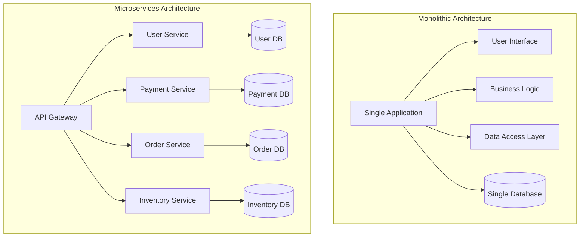

**Real-World Scenario:**
Netflix uses microservices extensively. Their recommendation service, user authentication, video streaming, and billing are all separate services. When they update their recommendation algorithm, it doesn't affect video playback or user login functionality.

### Question 2: What are the main benefits and challenges of implementing microservices?

**Technical Explanation:**
Benefits include independent deployability allowing faster release cycles, technology diversity enabling teams to choose optimal tools, improved fault isolation where service failures don't cascade, better scalability through targeted resource allocation, and organizational alignment with small, focused teams.

Challenges encompass distributed system complexity, network latency and communication overhead, data consistency across services, operational complexity requiring sophisticated monitoring and deployment tools, increased security surface area, and the need for comprehensive testing strategies including contract testing and end-to-end integration testing.

**Simple Explanation:**
Think of microservices like having separate specialists for different jobs versus one person doing everything. Benefits: Each specialist is really good at their job, if one gets sick others keep working, and you can hire more specialists for busy areas. Challenges: Specialists need to talk to each other more, coordination becomes harder, and you need a manager to keep track of everyone.

**Visualization:**
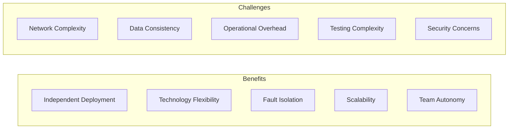

**Real-World Scenario:**
Amazon's transition from monolith to microservices allowed them to scale different parts independently. During Black Friday, they can scale payment processing services without scaling their recommendation engine, saving costs while maintaining performance.

### Question 3: How do microservices communicate with each other?

**Technical Explanation:**
Microservices communication occurs through two primary patterns: synchronous and asynchronous. Synchronous communication uses HTTP/REST APIs or gRPC for request-response interactions, providing immediate feedback but creating tight coupling. Asynchronous communication employs message queues (RabbitMQ, Apache Kafka) or event streaming, enabling loose coupling and better resilience but with eventual consistency challenges.

Communication patterns include API Gateway for external access, service mesh for internal communication management, event-driven architecture for loosely coupled interactions, and service discovery mechanisms for dynamic service location.

**Simple Explanation:**
Services talk like people do - sometimes they have direct conversations (synchronous) and sometimes they leave messages (asynchronous). Direct talking is like phone calls - you get immediate answers but both people need to be available. Leaving messages is like email - you send it when convenient, and they respond when they can. An API Gateway is like a receptionist who directs calls to the right person.

**Visualization:**
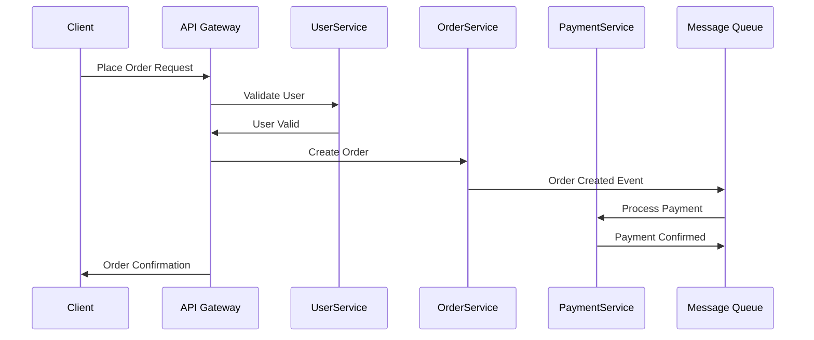

**Real-World Scenario:**
Uber's microservices communicate through multiple patterns. The ride request service synchronously calls the driver matching service for immediate responses, while payment processing happens asynchronously through message queues to handle high volumes without blocking the ride booking process.

### Question 4: What is Service Discovery and why is it important?

**Technical Explanation:**
Service Discovery is a mechanism that enables services to find and communicate with each other without hardcoding network locations. It consists of a service registry where services register their network locations and health status, and a discovery mechanism for clients to query available services.

Two main patterns exist: client-side discovery where clients query the registry directly and perform load balancing, and server-side discovery where a load balancer queries the registry. Popular tools include Eureka, Consul, etcd, and Zookeeper. Service Discovery handles dynamic scaling, failure recovery, and network changes automatically.

**Simple Explanation:**
Think of Service Discovery like a phone book that updates itself automatically. In a big office building, instead of remembering everyone's desk number, you call reception and ask "Where is the payment department today?" They tell you the current location. If the payment team moves to a different floor, the phone book updates automatically, so you always reach them without needing to remember their exact location.

**Visualization:**
```mermaid
graph TB
    subgraph "Service Discovery Flow"
        SR[Service Registry]
        S1[Service A] --> SR : Register
        S2[Service B] --> SR : Register
        S3[Service C] --> SR : Register
        
        Client --> SR : Discover Services
        SR --> Client : Return Service Locations
        Client --> S2 : Make Request
    end
    
    subgraph "Health Checking"
        SR --> S1 : Health Check
        SR --> S2 : Health Check
        SR --> S3 : Health Check
    end
```

**Real-World Scenario:**
In AWS, services use ELB (Elastic Load Balancer) with Auto Scaling Groups. When new instances spin up or down based on traffic, they automatically register/deregister with the load balancer, ensuring traffic only goes to healthy instances without manual configuration updates.

### Question 5: What are the different deployment strategies for microservices?

**Technical Explanation:**
Deployment strategies for microservices include Blue-Green deployment where two identical production environments alternate, providing zero-downtime deployments and easy rollbacks. Canary deployment gradually routes traffic to new versions, enabling risk mitigation through incremental exposure. Rolling deployment updates services incrementally across instances, maintaining availability while updating.

Container orchestration platforms like Kubernetes provide sophisticated deployment controls including readiness probes, liveness checks, and automated rollbacks. Infrastructure as Code ensures consistency across environments, while CI/CD pipelines automate the entire deployment process with proper testing gates.

**Simple Explanation:**
Think of deployment strategies like moving to a new house. Blue-Green is like having two identical houses - you move everything to the new house, and if something's wrong, you go back to the old one. Canary is like moving one room at a time and checking if everything works before moving the next room. Rolling deployment is like gradually replacing furniture piece by piece while still living in the house.

**Visualization:**
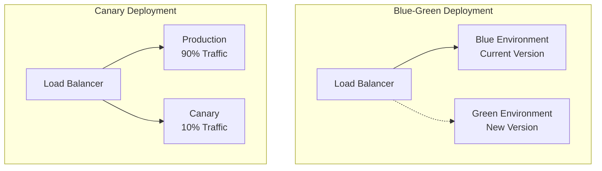

**Real-World Scenario:**
Netflix uses sophisticated deployment strategies with their Spinnaker platform. They perform canary deployments where new code gets 1% of traffic initially. If metrics look good, they gradually increase to 5%, then 25%, then 100%. If any issues arise, they automatically rollback to the previous version.

### Question 6: How do you handle data consistency in microservices?

**Technical Explanation:**
Data consistency in microservices involves managing ACID properties across distributed services. The CAP theorem forces trade-offs between Consistency, Availability, and Partition tolerance. Eventual consistency becomes acceptable for many use cases, implemented through event sourcing and CQRS patterns.

Saga pattern manages distributed transactions through choreography (services coordinate through events) or orchestration (central coordinator manages the transaction). Two-phase commit provides strong consistency but reduces availability. Event sourcing stores all changes as events, enabling audit trails and replay capabilities.

**Simple Explanation:**
Imagine coordinating a group project where everyone works on different parts. Strong consistency is like everyone waiting for approval before making any change - very safe but slow. Eventual consistency is like everyone working independently and syncing up regularly - faster but sometimes things are temporarily out of sync. The Saga pattern is like having a project plan that says "if this step fails, undo these other steps."

**Visualization:**
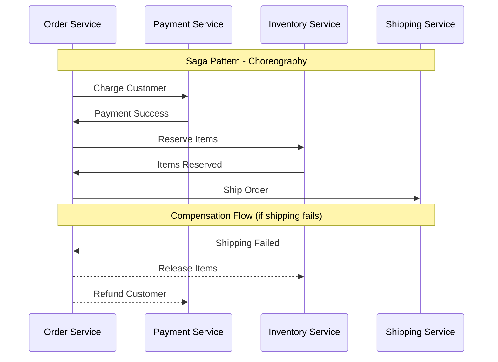

**Real-World Scenario:**
Amazon's order processing uses the Saga pattern. When you place an order, it charges your card, reserves inventory, and creates shipping labels as separate steps. If shipping fails (maybe the item is damaged), it automatically reverses the previous steps - releases inventory and refunds your payment.

### Question 7: What is an API Gateway and what problems does it solve?

**Technical Explanation:**
An API Gateway serves as a single entry point for all client requests to microservices, providing cross-cutting concerns like authentication, authorization, rate limiting, request/response transformation, and load balancing. It decouples clients from service implementations, enabling service evolution without breaking existing clients.

Key features include protocol translation (HTTP to gRPC), request aggregation for multiple service calls, circuit breaking for fault tolerance, monitoring and analytics, SSL termination, and request/response caching. Popular solutions include Kong, Zuul, AWS API Gateway, and Istio Gateway.

**Simple Explanation:**
An API Gateway is like a hotel concierge. Instead of guests wandering around looking for different services (restaurant, gym, spa), they ask the concierge who knows where everything is and can help with special requests. The concierge also checks if you're a registered guest (authentication) and might limit how many towels you can get (rate limiting). This makes the guest experience better and the hotel more organized.

**Visualization:**
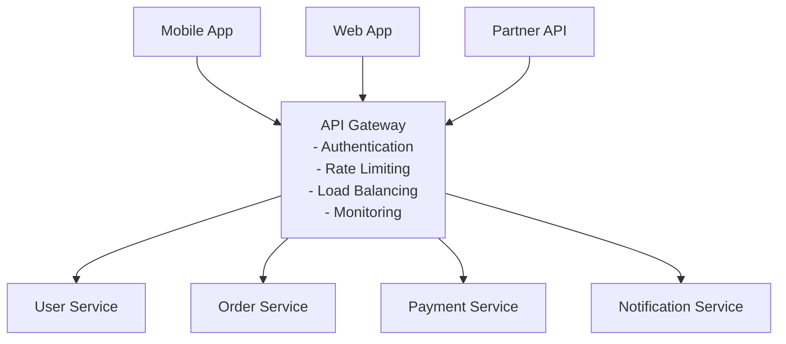

**Real-World Scenario:**
Spotify uses API Gateways to manage requests from their mobile apps, web players, and partner integrations. The gateway handles user authentication, applies different rate limits for free vs premium users, and routes music streaming requests to different services based on geographic location and content licensing.

### Question 8: What is Circuit Breaker pattern and when should you use it?

**Technical Explanation:**
The Circuit Breaker pattern prevents cascading failures in distributed systems by monitoring service calls and "opening" the circuit when failure rates exceed thresholds. It has three states: Closed (normal operation), Open (failing fast without calling the service), and Half-Open (testing if the service has recovered).

Parameters include failure threshold, timeout period, and recovery timeout. It provides fail-fast behavior, prevents resource exhaustion, and enables graceful degradation. Libraries like Hystrix, Resilience4j, and Polly implement this pattern with metrics and dashboards for monitoring.

**Simple Explanation:**
A Circuit Breaker works like the electrical circuit breakers in your house. When there's a problem (like too much electricity), the breaker "trips" and stops the electricity flow to prevent damage. In software, when a service keeps failing, the circuit breaker stops sending requests to that service temporarily, preventing your whole system from getting overwhelmed. After a while, it tries again to see if the service is working.

**Visualization:**
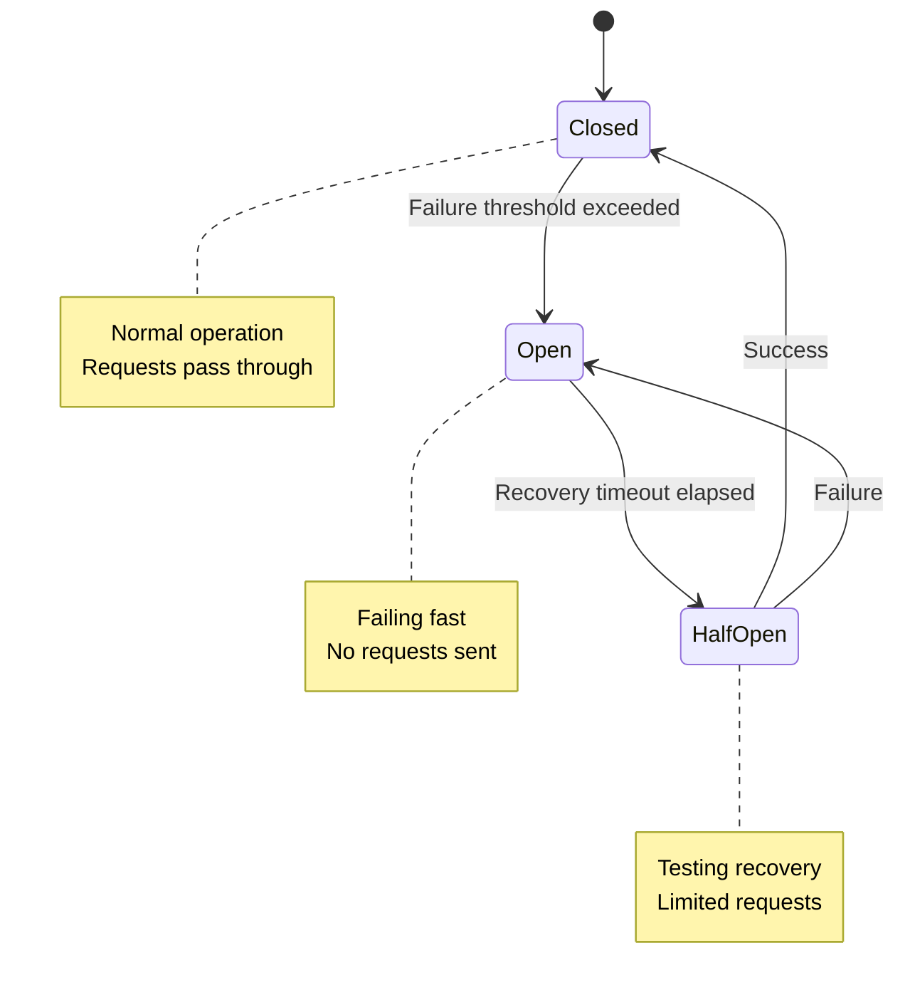

**Real-World Scenario:**
Netflix's Hystrix library implements circuit breakers for their streaming service. If their recommendation service starts failing, the circuit breaker opens and the main page shows a generic "Popular Movies" list instead of personalized recommendations, keeping the core streaming functionality available while the recommendation service recovers.

### Question 9: How do you implement monitoring and logging in microservices?

**Technical Explanation:**
Microservices monitoring requires distributed tracing to track requests across multiple services, centralized logging for aggregated analysis, and comprehensive metrics collection. The Three Pillars of Observability are Metrics (quantitative measurements), Logs (discrete events), and Traces (request flow across services).

Tools include Jaeger or Zipkin for distributed tracing, ELK Stack (Elasticsearch, Logstash, Kibana) or Splunk for logging, and Prometheus with Grafana for metrics. Correlation IDs link related operations across services, while structured logging enables efficient searching and analysis.

**Simple Explanation:**
Monitoring microservices is like tracking a package delivery across multiple companies. You need to see the entire journey (tracing), collect information from each step (logging), and measure how long each step takes (metrics). Correlation IDs are like tracking numbers that let you follow one request through all the different services it touches, just like following a package from sender to receiver.

**Visualization:**
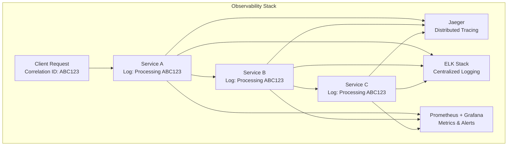

**Real-World Scenario:**
Uber uses comprehensive observability with distributed tracing to monitor ride requests. When a user requests a ride, they can trace the request through user authentication, driver matching, route calculation, and payment processing services. If the ride request is slow, they can pinpoint exactly which service is causing the delay.

### Question 10: What are the security considerations for microservices?

**Technical Explanation:**
Microservices security involves multiple layers: network security through service mesh and VPCs, authentication and authorization using JWT tokens or OAuth2, API security with rate limiting and input validation, and secrets management through tools like HashiCorp Vault. Zero-trust architecture assumes no implicit trust between services.

Security patterns include mutual TLS for service-to-service communication, API Gateway for centralized security policies, container security scanning, and security monitoring with SIEM tools. Principle of least privilege ensures services only have necessary permissions.

**Simple Explanation:**
Securing microservices is like securing a large apartment building. You need security at multiple levels: building entrance (API Gateway), apartment doors (service authentication), and room locks (data encryption). You also need security cameras (monitoring), visitor logs (audit trails), and you don't automatically trust someone just because they're inside the building (zero-trust).

**Visualization:**
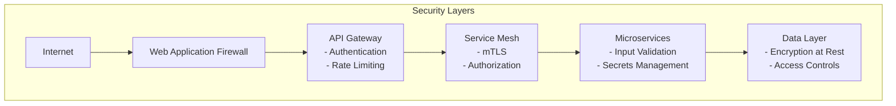

**Real-World Scenario:**
Google's microservices use their BeyondCorp zero-trust model where every service request is authenticated and authorized regardless of source. Their services communicate using mutual TLS, and access decisions are based on device state, user credentials, and request context rather than network location.

### Question 11: How do you handle configuration management in microservices?

**Technical Explanation:**
Configuration management in microservices involves centralizing configuration data while maintaining service autonomy. External configuration servers like Spring Cloud Config, Consul, or etcd provide versioned, environment-specific configurations. The Twelve-Factor App methodology advocates storing configuration in environment variables.

Patterns include configuration as code with GitOps workflows, secrets management with dedicated vaults, feature flags for runtime configuration changes, and configuration validation to prevent deployment of invalid configurations. Hot reloading enables configuration updates without service restarts.

**Simple Explanation:**
Configuration management is like having a central instruction manual that all services can read. Instead of each service having its own copy of instructions that might get out of sync, they all check the same central manual. This manual can be updated for different environments (like having different instructions for home vs office), and services can be told when the instructions change.

**Visualization:**
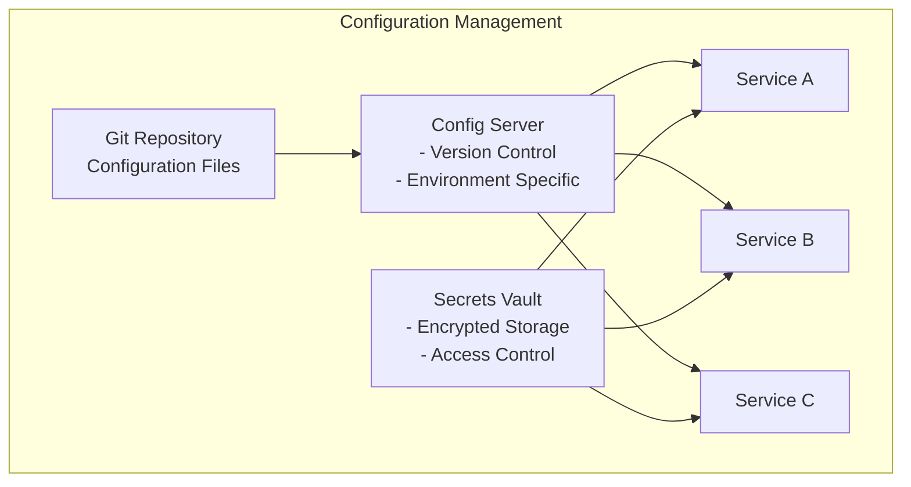

**Real-World Scenario:**
Netflix uses a sophisticated configuration management system where services fetch configuration from a central service at startup and periodically poll for updates. They use Archaius for dynamic configuration that can change feature flags and circuit breaker settings without redeploying services.

### Question 12: What is Event-Driven Architecture in microservices?

**Technical Explanation:**
Event-Driven Architecture (EDA) uses events as the primary communication mechanism between microservices. Services publish events when their state changes and subscribe to events they're interested in. This creates loose coupling and enables asynchronous processing, improving system resilience and scalability.

Key components include event producers, event consumers, event brokers (Kafka, RabbitMQ), and event stores. Patterns include event sourcing (storing all changes as events), CQRS (Command Query Responsibility Segregation), and event choreography vs orchestration for complex workflows.

**Simple Explanation:**
Event-Driven Architecture is like a school announcement system. When something important happens (like a fire drill), the principal makes an announcement over the PA system. Different people respond differently - teachers stop classes, students line up, office staff secure files. Nobody has to directly tell each person what to do; they all know how to respond to the announcement.

**Visualization:**
```mermaid
graph TB
    subgraph "Event-Driven Architecture"
        OrderService[Order Service]
        PaymentService[Payment Service]
        InventoryService[Inventory Service]
        NotificationService[Notification Service]
        
        EventBus[Event Bus<br/>Kafka/RabbitMQ]
        
        OrderService --> EventBus : Order Created Event
        EventBus --> PaymentService : Process Payment
        EventBus --> InventoryService : Update Inventory
        EventBus --> NotificationService : Send Confirmation
    end
```

**Real-World Scenario:**
Amazon's order processing is event-driven. When you place an order, it triggers events that flow through inventory management (reserve items), payment processing (charge card), shipping (create label), and notifications (send email). Each service reacts to events independently, making the system resilient to individual service failures.

### Question 13: How do you implement caching strategies in microservices?

**Technical Explanation:**
Caching in microservices involves multiple layers: client-side caching, API Gateway caching, application-level caching, and database caching. Strategies include cache-aside (application manages cache), write-through (write to cache and database simultaneously), and write-behind (write to cache first, database later).

Distributed caching with Redis or Hazelcast provides shared cache across service instances. Cache invalidation strategies include TTL (Time To Live), write-through invalidation, and event-based invalidation. CDNs cache static content globally, reducing latency and server load.

**Simple Explanation:**
Caching is like keeping frequently used items in easily accessible places. Instead of going to the main warehouse (database) every time, you keep popular items in a local storage room (cache). Different types of caching are like having storage at different levels - your desk drawer (client cache), department storage (service cache), and building storage (shared cache).

**Visualization:**
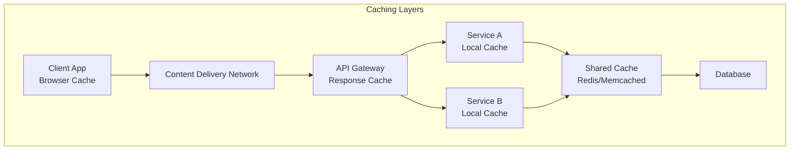

**Real-World Scenario:**
Twitter uses multi-level caching for their timeline service. User timelines are cached at CDN level for quick access, trending topics are cached in Redis for real-time updates, and user profile data is cached locally in services to reduce database load during high-traffic events.

### Question 14: What are the testing strategies for microservices?

**Technical Explanation:**
Microservices testing follows the testing pyramid: unit tests for individual service logic, integration tests for service interactions, and contract tests for API compatibility. Consumer-driven contract testing ensures backward compatibility using tools like Pact. End-to-end tests validate complete user journeys but should be minimal due to complexity and brittleness.

Testing strategies include test doubles (mocks, stubs) for external dependencies, testcontainers for integration testing with real databases, chaos engineering for resilience testing, and canary releases for production testing with real traffic.

**Simple Explanation:**
Testing microservices is like testing a car with multiple systems. You test each part individually (unit tests) - engine, brakes, lights. Then you test how parts work together (integration tests) - does the engine start when you turn the key? Finally, you test the whole car on a road trip (end-to-end tests) - does everything work together for the complete journey?

**Visualization:**
```mermaid
pyramid
    title Testing Pyramid for Microservices
    section E2E Tests
        desc: Few tests, high confidence, slow, expensive
    section Contract Tests
        desc: Medium tests, API compatibility, fast
    section Integration Tests
        desc: More tests, service interactions, moderate speed
    section Unit Tests
        desc: Many tests, fast, cheap, individual components
```

**Real-World Scenario:**
Spotify uses comprehensive testing strategies where each microservice has extensive unit tests, contract tests ensure API compatibility between teams, and they use chaos engineering (deliberately breaking services) to test system resilience during their weekly "Failure Friday" sessions.

### Question 15: How do you handle versioning in microservices?

**Technical Explanation:**
API versioning in microservices involves semantic versioning (MAJOR.MINOR.PATCH), backward compatibility considerations, and deployment strategies. Versioning approaches include URI versioning (/v1/users), header versioning (Accept: application/vnd.api+json;version=1), and query parameter versioning (?version=1).

Service versioning strategies include simultaneous running of multiple versions, deprecation policies with migration timelines, and consumer-driven contracts to understand version usage. Blue-green deployments enable safe version transitions with rollback capabilities.

**Simple Explanation:**
API versioning is like having different editions of a textbook. When you update content, you create a new edition but keep the old one available until everyone can upgrade. Students (other services) can keep using the old edition until they're ready to switch. You announce when old editions will stop being supported, giving everyone time to upgrade.

**Visualization:**
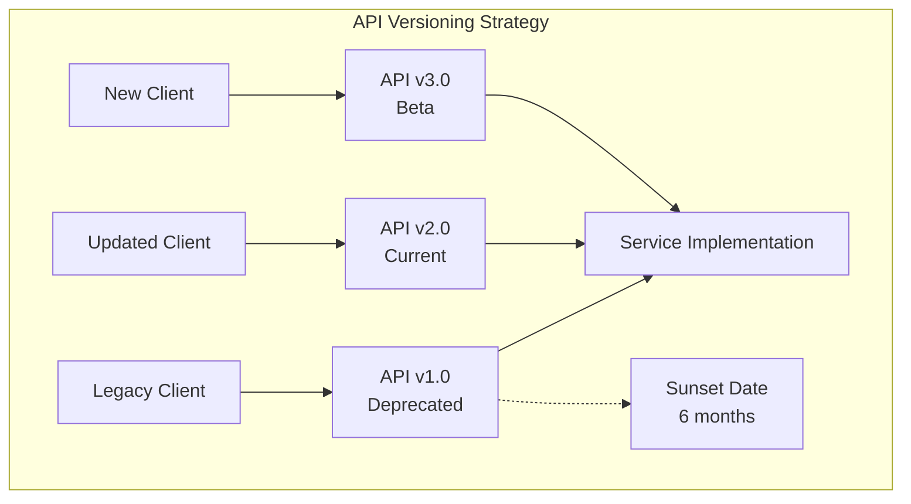

**Real-World Scenario:**
Stripe maintains multiple API versions simultaneously. They support older versions for years, giving developers time to migrate. When they release new features in v2020-08-27, existing integrations using v2019-12-03 continue working, but new features are only available in newer versions.

### Question 16: What is Service Mesh and how does it help microservices?

**Technical Explanation:**
Service Mesh is a dedicated infrastructure layer for service-to-service communication, providing features like load balancing, service discovery, failure recovery, metrics collection, and A/B testing without requiring application code changes. It consists of data plane (proxies handling traffic) and control plane (managing configuration).

Popular implementations include Istio, Linkerd, and Consul Connect. Features include mutual TLS for security, circuit breaking for resilience, distributed tracing for observability, and traffic management for deployments. The sidecar pattern deploys proxies alongside each service instance.

**Simple Explanation:**
Service Mesh is like having a smart postal system for your services. Instead of services talking directly to each other, they use smart mailboxes (proxies) that handle delivery, security checks, tracking, and even rerouting if a service is busy. The postal system (control plane) manages all the mailboxes and provides reports on mail delivery.

**Visualization:**
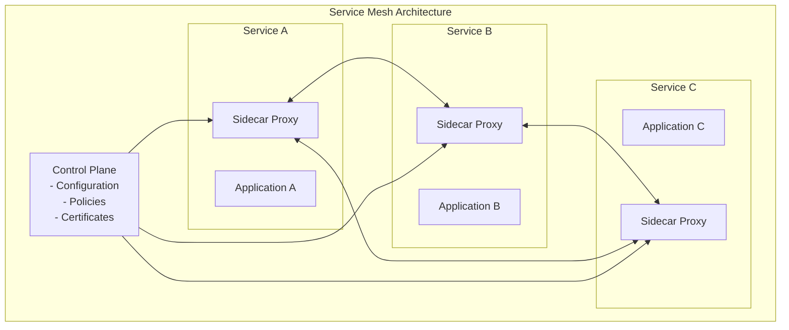

**Real-World Scenario:**
Lyft developed Envoy proxy and uses Istio service mesh to manage communication between hundreds of microservices. The mesh automatically handles load balancing, security, and observability, allowing developers to focus on business logic while the infrastructure handles cross-cutting concerns.

### Question 17: How do you implement Rate Limiting in microservices?

**Technical Explanation:**
Rate limiting controls the number of requests a client can make within a specific time window, preventing abuse and ensuring fair resource usage. Algorithms include token bucket (replenishes tokens at fixed rate), leaky bucket (processes requests at steady rate), fixed window (resets counter at intervals), and sliding window (more accurate but complex).

Implementation locations include API Gateway (centralized control), individual services (fine-grained control), and CDN level (global protection). Distributed rate limiting requires shared state management using Redis or similar systems to track limits across service instances.

**Simple Explanation:**
Rate limiting is like controlling how fast people can enter a popular restaurant. You might give each customer a certain number of "entry tokens" per hour. When they use all tokens, they wait until more tokens are available. This prevents the restaurant from being overwhelmed and ensures everyone gets fair access.

**Visualization:**
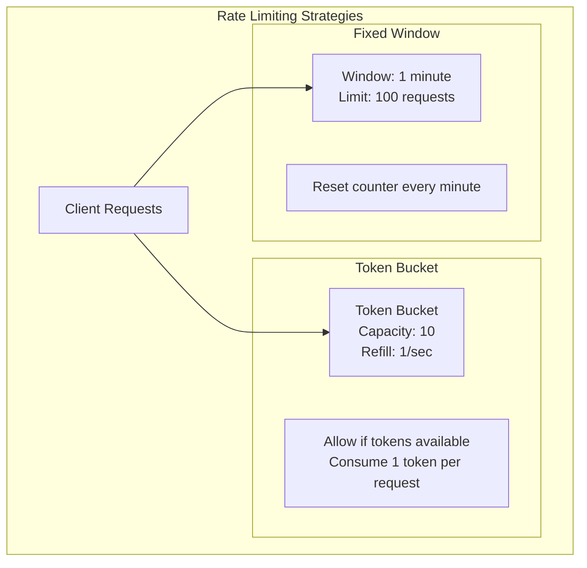

**Real-World Scenario:**
GitHub API implements sophisticated rate limiting with different limits for different endpoints and user types. Authenticated users get 5000 requests per hour, while unauthenticated requests are limited to 60 per hour. They use sliding windows and provide headers showing remaining quota and reset time.

### Question 18: What is Database per Service pattern and its implications?

**Technical Explanation:**
Database per Service pattern ensures each microservice owns its data and database schema, preventing tight coupling through shared databases. Services can choose optimal database technologies for their needs (polyglot persistence). This enables independent development, deployment, and scaling but introduces challenges in maintaining data consistency and implementing cross-service queries.

Implications include eventual consistency across services, need for distributed transaction patterns like Saga, data duplication for performance, and complex reporting requiring data aggregation strategies. Event sourcing and CQRS patterns often accompany this approach.

**Simple Explanation:**
Database per Service is like each department in a company having its own filing cabinet instead of sharing one big cabinet. Each department can organize their files the way they want and work independently. However, when you need information from multiple departments, you can't just look in one place - you need to ask each department and combine the information yourself.

**Visualization:**
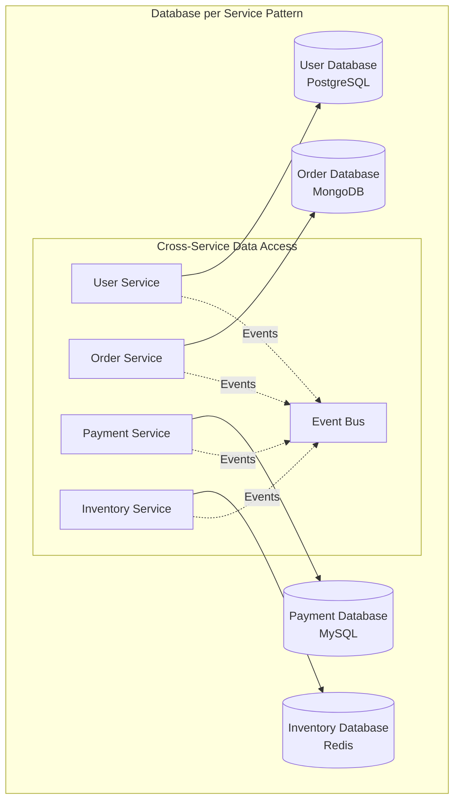

**Real-World Scenario:**
Netflix uses database per service extensively. Their user profiles are in Cassandra for high availability, viewing history in a different NoSQL database optimized for time-series data, and billing information in a traditional SQL database for ACID compliance. Data synchronization happens through event streams.

### Question 19: How do you handle Cross-Cutting Concerns in microservices?

**Technical Explanation:**
Cross-cutting concerns are aspects that affect multiple services like logging, security, monitoring, and caching. Solutions include aspect-oriented programming, service mesh for infrastructure concerns, shared libraries for common functionality, and centralized services for shared capabilities.

Patterns include sidecar pattern (deploy concerns alongside services), API Gateway pattern (centralize external concerns), and shared kernel pattern (common libraries). However, shared libraries can create coupling, so careful versioning and backward compatibility are essential.

**Simple Explanation:**
Cross-cutting concerns are like utilities in a neighborhood - everyone needs electricity, water, and internet, but you don't want each house to have its own power plant. Instead, you have shared utilities (like service mesh for networking) or standard equipment (like shared libraries for logging) that every house uses in the same way.

**Visualization:**
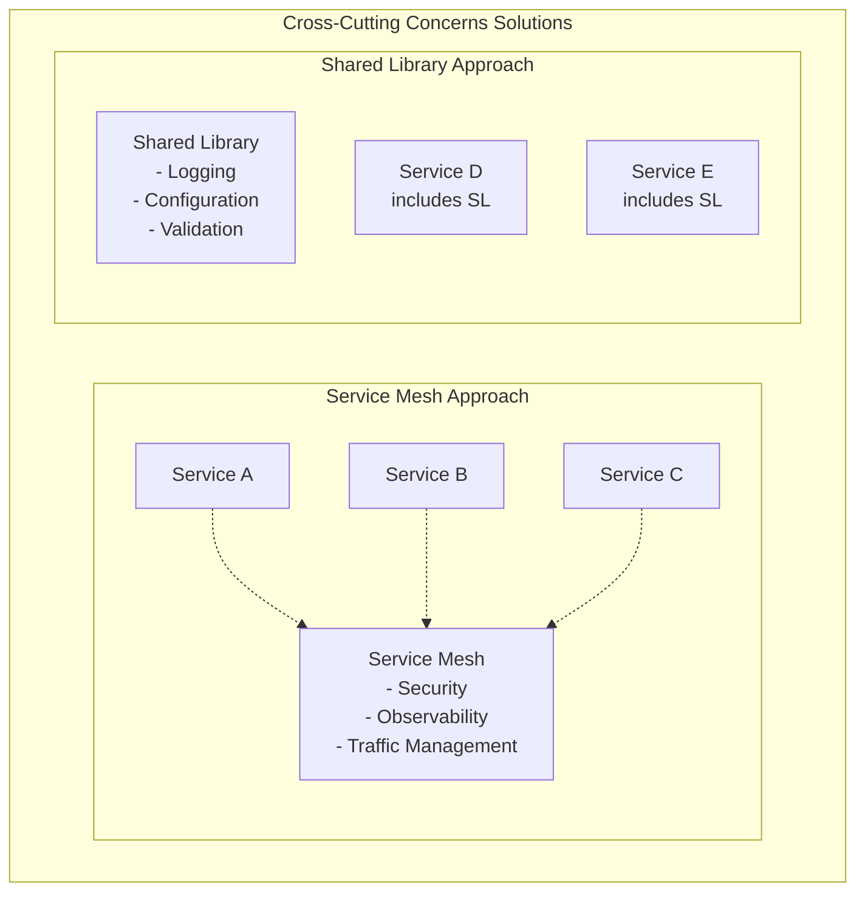

**Real-World Scenario:**
Google handles cross-cutting concerns through their service mesh (Istio) for networking and security, while using shared libraries for consistent logging formats and monitoring across all services. This allows central policy management while maintaining service autonomy.

### Question 20: What are the data management patterns in microservices?

**Technical Explanation:**
Data management patterns include Database per Service for service autonomy, Shared Database (anti-pattern) creating tight coupling, Data Lake for analytics across services, and Event Sourcing for audit trails and temporal queries. CQRS separates read and write models for optimized performance.

Patterns for data consistency include Saga for distributed transactions, Outbox pattern for reliable event publishing, and Two-Phase Commit for strong consistency. Data synchronization strategies include real-time streaming, batch processing, and change data capture (CDC).

**Simple Explanation:**
Data management in microservices is like organizing a library system across multiple buildings. Each building (service) has its own catalog (database), but sometimes you need to find information across all buildings. You might have a central index (data lake), or librarians send notifications when new books arrive (events), or have special reading rooms that combine information from multiple buildings (CQRS read models).

**Visualization:**
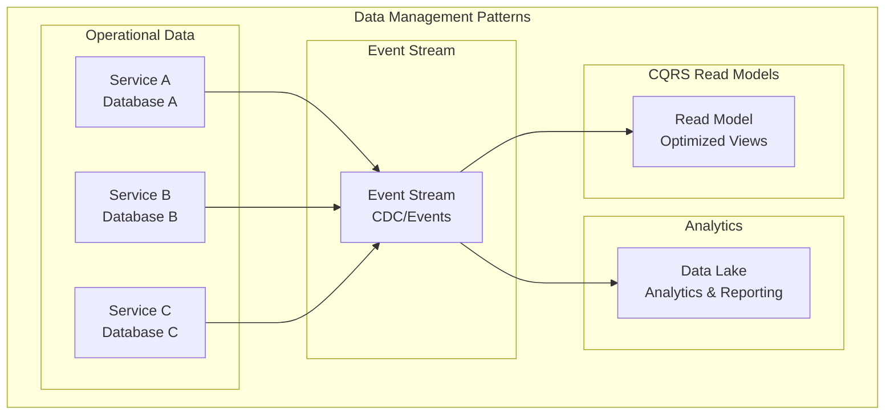

**Real-World Scenario:**
LinkedIn uses various data management patterns. Each service has its own operational database, but they stream all changes to Kafka for real-time processing. Their data lake aggregates information for analytics, and they maintain specialized read models for features like "People You May Know" that need data from multiple services.

---

## RESTful APIs

### Question 1: What is REST and what are its core principles?

**Technical Explanation:**
REST (Representational State Transfer) is an architectural style for designing networked applications, based on six constraints: Client-Server separation, Statelessness, Cacheability, Uniform Interface, Layered System, and Code-on-Demand (optional). The uniform interface constraint includes resource identification through URIs, resource manipulation through representations, self-descriptive messages, and HATEOAS.

REST uses HTTP methods semantically: GET for retrieval, POST for creation, PUT for updates, DELETE for removal, and PATCH for partial updates. Resources are identified by URIs, and representations (JSON, XML) transfer state between client and server. Status codes provide standardized response meanings.

**Simple Explanation:**
REST is like a well-organized library system with clear rules. Every book (resource) has a unique address (URI), you use standard actions (GET to read, POST to add, PUT to replace, DELETE to remove), the librarian doesn't remember your previous visits (stateless), and you get clear responses about whether your request worked (status codes). The system is organized in layers - you talk to the front desk, they might check with different departments, but you don't need to know the internal process.

**Visualization:**
```mermaid
graph TB
    subgraph "REST Principles"
        CS[Client-Server<br/>Separation of concerns]
        SL[Stateless<br/>No client state on server]
        CA[Cacheable<br/>Responses can be cached]
        UI[Uniform Interface<br/>Standard methods & URIs]
        LS[Layered System<br/>Hierarchical layers]
        COD[Code-on-Demand<br/>Optional executable code]
        
        HTTP[HTTP Methods]
        GET[GET - Retrieve]
        POST[POST - Create]
        PUT[PUT - Update/Replace]
        DELETE[DELETE - Remove]
        PATCH[PATCH - Partial Update]
        
        HTTP --> GET
        HTTP --> POST
        HTTP --> PUT
        HTTP --> DELETE
        HTTP --> PATCH
    end
```

**Real-World Scenario:**
Twitter's REST API follows these principles: GET /tweets/123 retrieves a specific tweet, POST /tweets creates a new tweet, DELETE /tweets/123 removes a tweet. The API is stateless (each request contains all necessary information), cacheable (tweets can be cached), and uses standard HTTP status codes (200 for success, 404 for not found).

### Question 2: How do you design RESTful URLs and what are the best practices?

**Technical Explanation:**
RESTful URL design follows resource-oriented architecture using nouns (not verbs) to represent resources, with hierarchical relationships reflected in URL structure. Best practices include using plural nouns (/users, not /user), meaningful resource names, consistent naming conventions, and avoiding deep nesting (maximum 2-3 levels).

URL patterns include collection resources (/users), singleton resources (/users/123), sub-collection resources (/users/123/orders), and avoiding RPC-style URLs (/getUser or /createUser). Query parameters handle filtering, sorting, and pagination. Version information can be in URLs (/v1/users) or headers.

**Simple Explanation:**
Designing RESTful URLs is like creating a clear addressing system for a city. Streets are resources (users, orders), house numbers are specific items (user 123), and you can have sub-addresses (user 123's orders). You use simple, clear names that everyone understands, keep the structure shallow so addresses aren't too long, and use consistent patterns throughout the city.

**Visualization:**
```mermaid
graph TB
    subgraph "RESTful URL Design"
        subgraph "Good Examples"
            G1[GET /users<br/>Get all users]
            G2[GET /users/123<br/>Get specific user]
            G3[POST /users<br/>Create new user]
            G4[GET /users/123/orders<br/>Get user's orders]
            G5[PUT /users/123<br/>Update user]
        end
        
        subgraph "Bad Examples"
            B1[GET /getUsers<br/>RPC-style]
            B2[POST /users/create<br/>Verb in URL]
            B3[GET /user<br/>Singular noun]
            B4[GET /users/123/orders/456/items/789<br/>Too deep nesting]
        end
    end
```

**Real-World Scenario:**
GitHub's API exemplifies good RESTful design: GET /repos/owner/repo retrieves repository information, GET /repos/owner/repo/issues gets issues for that repository, POST /repos/owner/repo/issues creates a new issue. The URLs clearly represent the hierarchical relationship between repositories and their issues.

### Question 3: How do you handle error responses and status codes in REST APIs?

**Technical Explanation:**
HTTP status codes provide standardized meanings: 2xx for success (200 OK, 201 Created, 204 No Content), 3xx for redirection (301 Moved Permanently, 304 Not Modified), 4xx for client errors (400 Bad Request, 401 Unauthorized, 404 Not Found, 409 Conflict), and 5xx for server errors (500 Internal Server Error, 503 Service Unavailable).

Error responses should include structured error information with error codes, human-readable messages, and details for debugging. Consistent error formats across the API improve client development experience. Rate limiting uses 429 status code, and validation errors use 400 with detailed field-level error information.

**Simple Explanation:**
HTTP status codes are like traffic signals for your API. Green light (2xx) means "go ahead, everything worked," yellow light (3xx) means "slow down, something changed," red light (4xx) means "stop, you did something wrong," and flashing red (5xx) means "stop, we have a problem." Error messages are like helpful signs that tell you exactly what went wrong and how to fix it.

**Visualization:**
```mermaid
graph TB
    subgraph "HTTP Status Code Categories"
        subgraph "2xx Success"
            S200[200 OK<br/>Request successful]
            S201[201 Created<br/>Resource created]
            S204[204 No Content<br/>Success, no response body]
        end
        
        subgraph "4xx Client Errors"
            E400[400 Bad Request<br/>Invalid request syntax]
            E401[401 Unauthorized<br/>Authentication required]
            E404[404 Not Found<br/>Resource doesn't exist]
            E409[409 Conflict<br/>Resource state conflict]
        end
        
        subgraph "5xx Server Errors"
            E500[500 Internal Server Error<br/>Generic server error]
            E503[503 Service Unavailable<br/>Server overloaded]
        end
    end
```

**Real-World Scenario:**
Stripe's API provides excellent error handling. When a payment fails due to insufficient funds, they return a 402 status code with a detailed error object including error type, code, message, and parameter information, helping developers understand exactly what went wrong and how to handle it programmatically.

### Question 4: What is HATEOAS and how do you implement it?

**Technical Explanation:**
HATEOAS (Hypermedia as the Engine of Application State) is a REST constraint where responses include links to related actions and resources, making the API self-descriptive and discoverable. Clients navigate the API through provided links rather than constructing URLs manually, reducing coupling between client and server.

Implementation includes embedding links in response payloads with rel (relationship) attributes, href (URLs), and methods. Common link relations include self, next, prev for pagination, edit for modification, and delete for removal. Standards like HAL (Hypertext Application Language) provide structured formats for hypermedia.

**Simple Explanation:**
HATEOAS is like having a helpful guide in a museum. Instead of giving you a map and expecting you to find everything yourself, each exhibit (resource) includes signs pointing to related exhibits and telling you what you can do there. If you're looking at a painting, the sign might say "click here to see more by this artist" or "click here to buy a print." You don't need to know the museum layout; just follow the signs.

**Visualization:**
```mermaid
graph TB
    subgraph "HATEOAS Example"
        Request[GET /users/123]
        
        Response["{
          'id': 123,
          'name': 'John Doe',
          'email': 'john@example.com',
          '_links': {
            'self': { 'href': '/users/123' },
            'edit': { 'href': '/users/123', 'method': 'PUT' },
            'delete': { 'href': '/users/123', 'method': 'DELETE' },
            'orders': { 'href': '/users/123/orders' },
            'profile': { 'href': '/users/123/profile' }
          }
        }"]
        
        Request --> Response
        
        subgraph "Available Actions"
            Edit[Edit User<br/>PUT /users/123]
            Delete[Delete User<br/>DELETE /users/123]
            Orders[View Orders<br/>GET /users/123/orders]
            Profile[View Profile<br/>GET /users/123/profile]
        end
        
        Response --> Edit
        Response --> Delete
        Response --> Orders
        Response --> Profile
    end
```

**Real-World Scenario:**
PayPal's REST API uses HATEOAS extensively. When you retrieve a payment, the response includes links for actions like "approve", "execute", "cancel" depending on the payment state. This allows client applications to dynamically present available actions without hardcoding business logic about payment workflows.

### Question 5: How do you implement pagination, filtering, and sorting in REST APIs?

**Technical Explanation:**
Pagination prevents large datasets from overwhelming clients and servers, using query parameters like limit/offset (offset-based), cursor-based pagination for large datasets, or page/size parameters. Response headers or body include pagination metadata (total count, next/previous links).

Filtering uses query parameters with various patterns: exact matches (?status=active), ranges (?created_after=2023-01-01), and complex queries (?filter=name:John,age>25). Sorting typically uses sort parameter with field names and direction (?sort=name,-created_at for ascending name, descending created_at).

**Simple Explanation:**
API pagination is like reading a book with bookmarks. Instead of trying to read the whole book at once (which would be overwhelming), you read page by page (pagination), look for specific topics in the index (filtering), and might read chapters in a different order (sorting). The API tells you what page you're on and how to get to the next page, just like page numbers in a book.

**Visualization:**
```mermaid
graph TB
    subgraph "API Query Parameters"
        Base[GET /users]
        
        Pagination[?page=2&size=10<br/>Get page 2, 10 items per page]
        Filtering[?status=active&role=admin<br/>Filter by status and role]
        Sorting[?sort=name,-created_at<br/>Sort by name ASC, created_at DESC]
        Combined[?page=1&size=20&status=active&sort=name<br/>Combined parameters]
        
        Base --> Pagination
        Base --> Filtering
        Base --> Sorting
        Base --> Combined
    end
    
    subgraph "Response Structure"
        ResponseData["{
          'data': [...],
          'pagination': {
            'page': 2,
            'size': 10,
            'total': 150,
            'totalPages': 15,
            'hasNext': true,
            'hasPrev': true
          }
        }"]
    end
```

**Real-World Scenario:**
GitHub's API implements comprehensive query capabilities: GET /search/repositories?q=language:javascript&sort=stars&order=desc&page=2 searches for JavaScript repositories, sorts by stars in descending order, and returns page 2. The response includes pagination links in headers and metadata about total results.

---

## Swagger

### Question 1: What is Swagger/OpenAPI and why is it important for API development?

**Technical Explanation:**
Swagger, now known as OpenAPI Specification, is a language-agnostic specification for describing REST APIs. It provides a standardized format for documenting API endpoints, request/response schemas, authentication methods, and error responses. The specification enables code generation, interactive documentation, automated testing, and API governance.

OpenAPI 3.0+ includes features like callbacks, links between operations, anyOf/oneOf schema composition, and improved security definitions. Tools in the ecosystem include Swagger UI for interactive documentation, Swagger Codegen for client/server generation, and Swagger Editor for specification authoring.

**Simple Explanation:**
Swagger is like creating a detailed instruction manual for your API. Instead of writing separate documentation that might get outdated, you write a special file that describes exactly how your API works - what endpoints exist, what data they expect, what they return, and what can go wrong. This file can then automatically create beautiful web documentation, generate client code in different programming languages, and even test your API.

**Visualization:**
```mermaid
graph TB
    subgraph "OpenAPI Ecosystem"
        Spec[OpenAPI Specification<br/>YAML/JSON file describing API]
        
        SwaggerUI[Swagger UI<br/>Interactive Documentation]
        Codegen[Code Generation<br/>Client SDKs & Server Stubs]
        Testing[API Testing<br/>Automated validation]
        Mocking[API Mocking<br/>Development & Testing]
        
        Spec --> SwaggerUI
        Spec --> Codegen
        Spec --> Testing
        Spec --> Mocking
        
        subgraph "Generated Artifacts"
            Docs[Interactive Docs]
            ClientSDK[Client SDKs]
            ServerStub[Server Code]
            Tests[Test Cases]
        end
        
        SwaggerUI --> Docs
        Codegen --> ClientSDK
        Codegen --> ServerStub
        Testing --> Tests
    end
```

**Real-World Scenario:**
Spotify uses OpenAPI specifications for all their public APIs. Developers can explore the API interactively through Swagger UI, automatically generate client libraries in their preferred programming language, and the specification serves as the single source of truth for both internal teams and external developers building integrations.

### Question 2: How do you document complex API schemas and relationships in OpenAPI?

**Technical Explanation:**
OpenAPI supports complex schemas through JSON Schema vocabulary including object composition (allOf, anyOf, oneOf), inheritance patterns, nested objects, arrays, and conditional schemas. Schema reusability is achieved through components section with reusable schemas, parameters, responses, and security schemes.

Advanced features include discriminator for polymorphism, examples for better documentation, external documentation links, and callback definitions for webhook-style APIs. Schema validation rules include data types, formats, constraints (minimum, maximum, pattern), and required fields.

**Simple Explanation:**
Documenting complex APIs in OpenAPI is like creating a detailed parts catalog for a complex machine. You define reusable components (like standard bolts and screws), show how parts fit together (relationships), provide examples of assembled sections, and include different variations of the same part type. This makes it easy for anyone to understand both individual pieces and how they work together.

**Visualization:**
```mermaid
graph TB
    subgraph "OpenAPI Schema Composition"
        subgraph "Base Components"
            Person[Person Schema<br/>name, email, id]
            Address[Address Schema<br/>street, city, country]
            Contact[Contact Schema<br/>phone, email]
        end
        
        subgraph "Composed Schemas"
            Employee[Employee Schema<br/>allOf: [Person, Contact]<br/>+ employeeId, department]
            Customer[Customer Schema<br/>allOf: [Person, Address]<br/>+ customerId, preferences]
        end
        
        subgraph "Complex Relationships"
            Order[Order Schema<br/>- customer: Customer<br/>- items: [OrderItem]<br/>- shipping: Address]
            OrderItem[OrderItem Schema<br/>- product: Product<br/>- quantity: integer]
        end
        
        Person --> Employee
        Person --> Customer
        Contact --> Employee
        Address --> Customer
        Customer --> Order
        Address --> Order
    end
```

**Real-World Scenario:**
Slack's API documentation uses OpenAPI to describe complex message schemas that can contain various block types (text, images, interactive components). They use composition patterns to show how different block types inherit from base schemas while adding their specific properties, making it easy for developers to understand the flexible message structure.

### Question 3: How do you implement API versioning and documentation maintenance with OpenAPI?

**Technical Explanation:**
API versioning in OpenAPI can be handled through separate specification files for each version, server URL templating, or path-based versioning. Version management strategies include maintaining multiple OpenAPI specifications, using overlays for version-specific changes, or automated generation from annotated code.

Documentation maintenance involves CI/CD integration for automatic specification validation, linting for consistency, automated testing against live APIs, and synchronization between code and documentation. Tools like Spectral provide linting rules, while Prism enables mock server generation for testing.

**Simple Explanation:**
Managing API versions with OpenAPI is like maintaining different editions of a software manual. Each version gets its own complete manual (OpenAPI spec), but you can also create "change sheets" that show what's different between versions. Automated tools check that your manual matches your actual software and warn you if they get out of sync, just like spell-check for APIs.

**Visualization:**
```mermaid
graph TB
    subgraph "API Version Management"
        subgraph "Version Strategy"
            V1[API v1.0<br/>openapi-v1.yaml]
            V2[API v2.0<br/>openapi-v2.yaml]
            V3[API v3.0<br/>openapi-v3.yaml]
        end
        
        subgraph "Automated Pipeline"
            Code[API Code Changes]
            Generate[Auto-generate Specs]
            Validate[Validate Specs]
            Deploy[Deploy Documentation]
            
            Code --> Generate
            Generate --> Validate
            Validate --> Deploy
        end
        
        subgraph "Documentation Sites"
            DevPortal[Developer Portal<br/>All Versions Available]
            V1Doc[v1.0 Documentation]
            V2Doc[v2.0 Documentation]
            V3Doc[v3.0 Documentation]
            
            Deploy --> DevPortal
            DevPortal --> V1Doc
            DevPortal --> V2Doc
            DevPortal --> V3Doc
        end
    end
```

**Real-World Scenario:**
Stripe maintains comprehensive OpenAPI specifications for all API versions. Their developer portal automatically generates documentation from OpenAPI specs, provides version switching, shows migration guides between versions, and includes interactive examples. Their CI/CD pipeline validates that code changes match the OpenAPI specifications before deployment.

---

## JUnit/Testing

### Question 1: What are the different types of testing in software development and how does JUnit support them?

**Technical Explanation:**
Software testing includes unit tests (testing individual components in isolation), integration tests (testing component interactions), and end-to-end tests (testing complete user workflows). JUnit supports unit testing directly and integration testing through extensions like TestContainers. Test doubles (mocks, stubs, spies) isolate components under test.

JUnit 5 architecture consists of Platform (foundation for test frameworks), Jupiter (programming and extension model), and Vintage (backward compatibility). Features include parameterized tests, dynamic tests, nested test classes, conditional test execution, and lifecycle management through annotations (@BeforeEach, @AfterEach, @BeforeAll, @AfterAll).

**Simple Explanation:**
Testing software is like quality control in a factory. Unit tests check individual parts (like testing each screw separately), integration tests check how parts work together (like testing how the wheel attaches to the car), and end-to-end tests check the complete product (like test driving the finished car). JUnit is like a testing toolkit that provides standard ways to run these tests and report results.

**Visualization:**
```mermaid
pyramid
    title Testing Pyramid with JUnit
    section E2E Tests
        desc: Full application workflows, fewer tests, slow
        example: Selenium WebDriver tests
    section Integration Tests
        desc: Component interactions, moderate number, medium speed  
        example: @TestContainer, @SpringBootTest
    section Unit Tests
        desc: Individual methods/classes, many tests, fast
        example: @Test, @Mock, @ParameterizedTest
```

**Real-World Scenario:**
Netflix uses JUnit extensively with their testing pyramid approach. They have thousands of unit tests for individual service methods, integration tests using TestContainers to test database interactions, and end-to-end tests for critical user journeys like video playback. Their CI pipeline runs unit tests on every commit and integration tests on pull requests.

### Question 2: How do you use Mockito for mocking dependencies in unit tests?

**Technical Explanation:**
Mockito creates test doubles (mocks, spies, stubs) to isolate the unit under test from its dependencies. Mock objects simulate real dependencies with programmable behavior using when().thenReturn() for stubbing and verify() for interaction verification. Argument matchers (any(), eq(), argThat()) provide flexible parameter matching.

Advanced features include spy objects (partial mocks), argument captors for capturing method arguments, mock injection (@Mock, @InjectMocks), and behavior verification (times(), never(), atLeast()). Mockito integrates seamlessly with JUnit through MockitoExtension.

**Simple Explanation:**
Mockito is like having stunt doubles for your code's dependencies. When testing a class that depends on a database, instead of using the real database (which would be slow and unreliable), you create a "mock database" that acts exactly how you want for your test. You can tell the mock what to return when specific methods are called, and later check if the right methods were called with the right parameters.

**Visualization:**
```mermaid
graph TB
    subgraph "Without Mocking"
        ClassA1[Class Under Test] --> RealDB[Real Database]
        ClassA1 --> RealAPI[Real External API]
        ClassA1 --> RealFile[Real File System]
        
        Issues1[Issues:<br/>- Slow<br/>- Unreliable<br/>- Hard to test edge cases]
    end
    
    subgraph "With Mockito"
        ClassA2[Class Under Test] --> MockDB[Mock Database<br/>@Mock]
        ClassA2 --> MockAPI[Mock API<br/>@Mock]
        ClassA2 --> MockFile[Mock File System<br/>@Mock]
        
        Benefits[Benefits:<br/>- Fast<br/>- Reliable<br/>- Test any scenario]
        
        TestControl[Test Controls:<br/>when().thenReturn()<br/>verify()<br/>ArgumentCaptor]
    end
```

**Real-World Scenario:**
Airbnb uses Mockito to test their booking service. When testing the reservation logic, they mock the payment service, email notification service, and inventory system. This allows them to test various scenarios like payment failures or inventory conflicts without actually processing payments or sending emails during testing.

### Question 3: What are parameterized tests and how do you implement them with JUnit 5?

**Technical Explanation:**
Parameterized tests execute the same test method multiple times with different arguments, reducing code duplication and increasing test coverage. JUnit 5 provides various parameter sources: @ValueSource for primitive values, @CsvSource for CSV data, @MethodSource for method-provided arguments, @ArgumentsSource for custom providers, and @EnumSource for enum values.

Advanced features include argument conversion (@ConvertWith), argument aggregation (@AggregateWith), display name customization, and dynamic test generation. This approach enables data-driven testing and boundary value testing with minimal code duplication.

**Simple Explanation:**
Parameterized tests are like testing a calculator with different numbers instead of writing separate tests for each calculation. Instead of writing one test for 2+2=4, another for 3+3=6, and another for 5+5=10, you write one test method and tell JUnit to run it with different sets of numbers. This saves time and ensures you test many different scenarios without writing repetitive code.

**Visualization:**
```mermaid
graph TB
    subgraph "Traditional Approach"
        T1[testAdd2Plus2()]
        T2[testAdd3Plus3()]
        T3[testAdd5Plus5()]
        T4[testAdd10Plus10()]
        
        Code1[Repetitive test code<br/>Similar logic repeated]
    end
    
    subgraph "Parameterized Tests"
        PT[testAddition(int a, int b, int expected)]
        
        Sources[@ValueSource<br/>@CsvSource<br/>@MethodSource<br/>@EnumSource]
        
        Data[Test Data:<br/>(2,2,4)<br/>(3,3,6)<br/>(5,5,10)<br/>(10,10,20)]
        
        Sources --> PT
        Data --> PT
        
        Benefits[Benefits:<br/>- Less code duplication<br/>- Easy to add test cases<br/>- Clear test data separation]
    end
```

**Real-World Scenario:**
Amazon uses parameterized tests extensively for their pricing engine. They test discount calculations with hundreds of different scenarios (various product types, customer tiers, promotional codes) using @CsvFileSource to load test data from external files, making it easy to add new test cases without code changes.

### Question 4: How do you write effective integration tests using TestContainers?

**Technical Explanation:**
TestContainers provides lightweight, disposable instances of databases, message queues, web browsers, or any Docker container for integration testing. It eliminates environment differences between development, testing, and production by using the same database/service versions in tests.

Key features include automatic container lifecycle management, network isolation, custom images, compose file support, and integration with testing frameworks. Common patterns include database testing with @TestContainer annotation, service communication testing, and testing against real external service implementations.

**Simple Explanation:**
TestContainers is like having a magic box that can create any service you need for testing and automatically clean up afterward. Instead of installing and managing a test database on your machine, TestContainers spins up a real database in a container just for your test, runs your test against it, then throws it away. It's like having a fresh, clean testing environment every time.

**Visualization:**
```mermaid
graph TB
    subgraph "Integration Test with TestContainers"
        Test[Integration Test<br/>@Testcontainers]
        
        subgraph "Test Containers"
            PostgresContainer[PostgreSQL Container<br/>@Container]
            RedisContainer[Redis Container<br/>@Container]
            KafkaContainer[Kafka Container<br/>@Container]
        end
        
        Application[Application Under Test<br/>Connects to test containers]
        
        Test --> Application
        Application --> PostgresContainer
        Application --> RedisContainer
        Application --> KafkaContainer
        
        Lifecycle[Container Lifecycle:<br/>1. Start containers<br/>2. Run tests<br/>3. Stop containers<br/>4. Cleanup]
    end
```

**Real-World Scenario:**
Spotify uses TestContainers for testing their playlist service. Their integration tests spin up PostgreSQL containers for playlist storage, Redis containers for caching, and Kafka containers for event streaming. This ensures tests run against the same database versions used in production, catching compatibility issues early.

### Question 5: What are the best practices for writing maintainable test code?

**Technical Explanation:**
Maintainable test code follows principles like Test Readability (clear naming, descriptive assertions), Test Independence (no shared state between tests), and Single Responsibility (one assertion per test concept). The AAA pattern (Arrange, Act, Assert) structures tests clearly.

Best practices include using test builders/factories for complex object creation, extracting common setup to helper methods, avoiding test logic duplication, using meaningful test names that describe behavior, and keeping tests close to the code they test. Test data should be minimal and focused on the specific behavior being tested.

**Simple Explanation:**
Writing good test code is like writing a good recipe. The recipe should be clear about what ingredients you need (Arrange), what steps to follow (Act), and how to know if it worked (Assert). Each recipe should be independent - you shouldn't need to make bread before making soup. Use descriptive names so anyone can understand what you're testing, and keep each test focused on one specific thing.


## JWT (JSON Web Tokens) - 3 Questions

### Question 1: What is JWT and how does its structure work?

**Technical Explanation:**
JSON Web Token (JWT) is a compact, URL-safe means of representing claims to be transferred between two parties. The token consists of three Base64URL-encoded parts separated by dots: Header.Payload.Signature. The header typically contains the algorithm used for signing (like HMAC SHA256 or RSA) and the token type. The payload contains claims - statements about an entity (typically the user) and additional metadata. Claims can be registered (predefined like 'iss' for issuer, 'exp' for expiration), public (defined at will), or private (custom claims agreed upon by parties). The signature is created by taking the encoded header, encoded payload, a secret key, and applying the algorithm specified in the header. This ensures the token hasn't been tampered with and, if signed with a private key, can verify the sender's identity.

**Simple Explanation:**
Think of JWT like a special ID card that you get when you log into a website. This ID card has three parts: first, it says what kind of card it is and how it was made secure. Second, it contains information about you, like your username and when the card expires. Third, it has a special signature that proves the card is real and hasn't been changed by anyone else. When you want to access something on the website, you show this card instead of typing your password again and again.

**Visualization:**
```mermaid
graph TB
    A[JWT Token Structure] --> B[Header]
    A --> C[Payload]
    A --> D[Signature]
    
    B --> B1[Algorithm: HS256]
    B --> B2[Type: JWT]
    
    C --> C1[User ID: 123]
    C --> C2[Username: john_doe]
    C --> C3[Expiry: 2025-07-23]
    C --> C4[Role: user]
    
    D --> D1[HMACSHA256 of Header + Payload + Secret]
    
    E[Flow] --> F[1. User Login]
    F --> G[2. Server Validates Credentials]
    G --> H[3. Server Creates JWT]
    H --> I[4. Client Receives JWT]
    I --> J[5. Client Sends JWT with Requests]
    J --> K[6. Server Validates JWT]
```

**Real-world Scenario:**
Netflix uses JWT tokens when you log in. After entering your credentials, Netflix's server creates a JWT containing your user ID, subscription plan, preferred language, and an expiration time. This token is stored in your browser and sent with every request to load movies, update your watchlist, or change settings. The token allows Netflix to quickly verify your identity without checking the database every time, enabling smooth streaming experiences across millions of users.

### Question 2: How does JWT authentication flow work in microservices architecture?

**Technical Explanation:**
In a microservices architecture, JWT enables stateless authentication across distributed services. The authentication service validates user credentials and issues a JWT containing user claims and permissions. This token is then passed to subsequent service calls via HTTP headers (typically Authorization: Bearer <token>). Each microservice can independently validate the JWT without contacting the authentication service by verifying the signature using the shared public key or secret. The payload contains all necessary authorization information, enabling each service to make access control decisions locally. Token expiration and refresh mechanisms prevent indefinite token validity. Services can extract user context from the token payload, eliminating the need for service-to-service calls to fetch user data.

**Simple Explanation:**
Imagine you're visiting a large theme park with many different rides and attractions. Instead of checking your ticket at every single ride, you get a special wristband at the entrance that proves you've paid. Each ride operator can look at your wristband and immediately know you're allowed in without calling the ticket office. The wristband also shows what rides you can access based on your ticket type. JWT works the same way - once you log in, you get a digital wristband that all the different parts of a website can check independently.

**Visualization:**
```mermaid
sequenceDiagram
    participant User
    participant AuthService
    participant APIGateway
    participant ServiceA
    participant ServiceB
    
    User->>AuthService: Login Request
    AuthService->>AuthService: Validate Credentials
    AuthService->>User: JWT Token
    User->>APIGateway: Request + JWT
    APIGateway->>APIGateway: Validate JWT
    APIGateway->>ServiceA: Forward Request + JWT
    ServiceA->>ServiceA: Extract User Info from JWT
    ServiceA->>ServiceB: Internal Call + JWT
    ServiceB->>ServiceB: Validate JWT & Process
    ServiceB->>ServiceA: Response
    ServiceA->>APIGateway: Response
    APIGateway->>User: Final Response
```

**Real-world Scenario:**
Uber's platform uses JWT tokens across their microservices ecosystem. When a driver logs into the Uber driver app, the authentication service issues a JWT containing the driver's ID, current location permissions, vehicle information, and rating status. When the driver accepts a ride request, this JWT is passed to the trip management service, payment service, and location tracking service. Each service can independently verify the driver's identity and permissions without making additional database calls, enabling real-time ride matching and tracking for millions of concurrent users.

### Question 3: What are JWT security considerations and best practices?

**Technical Explanation:**
JWT security involves multiple considerations: Algorithm confusion attacks can occur when services accept both symmetric (HS256) and asymmetric (RS256) algorithms, potentially allowing attackers to sign tokens with the public key. Token storage must be secure - storing JWTs in localStorage exposes them to XSS attacks, while httpOnly cookies provide better protection but require CSRF protection. Token expiration should be short-lived with refresh token mechanisms to limit exposure window. Sensitive information should never be stored in JWT payload as it's only Base64 encoded, not encrypted. The 'none' algorithm should be explicitly rejected to prevent unsigned token acceptance. Key rotation strategies are essential for long-term security. Rate limiting and token blacklisting mechanisms should be implemented for compromised tokens.

**Simple Explanation:**
Using JWT tokens safely is like handling a house key that has your address written on it. You need to be very careful about where you keep this key because if someone bad finds it, they can pretend to be you. The key should only work for a short time before you need a new one, just like how some hotel keys stop working after checkout time. You shouldn't write secret information on the key because anyone who finds it can read what's written. You also need to make sure the key is real and not a fake copy someone made.

**Visualization:**
```mermaid
graph TD
    A[JWT Security Best Practices] --> B[Token Storage]
    A --> C[Algorithm Security]
    A --> D[Token Lifecycle]
    A --> E[Payload Security]
    
    B --> B1[Use httpOnly Cookies]
    B --> B2[Avoid localStorage for sensitive tokens]
    B --> B3[Implement CSRF Protection]
    
    C --> C1[Reject 'none' algorithm]
    C --> C2[Use RS256 over HS256 for distributed systems]
    C --> C3[Implement key rotation]
    
    D --> D1[Short expiration times 15-30 min]
    D --> D2[Implement refresh tokens]
    D --> D3[Token blacklisting for logout]
    
    E --> E1[Never store passwords in payload]
    E --> E2[Minimize sensitive data]
    E --> E3[Use HTTPS always]
```

**Real-world Scenario:**
GitHub's JWT implementation demonstrates security best practices. When you authenticate with GitHub, they issue short-lived access tokens (1 hour) paired with longer-lived refresh tokens. The JWT payload contains only non-sensitive information like user ID and permissions scope. Tokens are transmitted over HTTPS and stored in httpOnly cookies to prevent XSS attacks. GitHub implements algorithm whitelisting to prevent algorithm confusion attacks and uses RS256 signatures with regular key rotation. They maintain a token revocation system that immediately invalidates tokens when users change passwords or revoke application access.

## GraphQL - 8 Questions

### Question 1: What is GraphQL and how does it differ from REST?

**Technical Explanation:**
GraphQL is a query language and runtime for APIs that enables clients to request exactly the data they need. Unlike REST's resource-based architecture with multiple endpoints, GraphQL exposes a single endpoint and allows clients to specify their data requirements through a query structure that mirrors the desired response format. The schema defines available types, fields, and operations (queries, mutations, subscriptions) using a type system. Resolvers are functions that fetch data for each field in the schema. GraphQL eliminates over-fetching by allowing field-level data selection and under-fetching by enabling related data retrieval in a single request through nested queries. The introspection system allows clients to discover schema capabilities at runtime.

**Simple Explanation:**
Imagine REST API like ordering from a restaurant with a fixed menu - if you want a burger, you get the whole meal with fries and a drink even if you only want the burger. GraphQL is like having a custom kitchen where you can ask for exactly what you want: "I want a burger with only cheese and lettuce, plus just the fries, but no drink." You tell the kitchen exactly what you want, and they give you only those items in one order, nothing more, nothing less.

**Visualization:**
```mermaid
graph TB
    A[REST vs GraphQL] --> B[REST Approach]
    A --> C[GraphQL Approach]
    
    B --> B1[Multiple Endpoints]
    B --> B2[/users/123]
    B --> B3[/users/123/posts]
    B --> B4[/posts/456/comments]
    B --> B5[Fixed Response Structure]
    B --> B6[Over-fetching Common]
    
    C --> C1[Single Endpoint /graphql]
    C --> C2[Custom Query Structure]
    C --> C3[Exact Data Selection]
    C --> C4[Nested Data in One Request]
    
    D[GraphQL Query Example] --> E["query {<br/>  user(id: 123) {<br/>    name<br/>    posts {<br/>      title<br/>      comments {<br/>        text<br/>      }<br/>    }<br/>  }<br/>}"]
```

**Real-world Scenario:**
Facebook (now Meta) developed GraphQL to solve mobile data efficiency problems. Their mobile apps needed to display user feeds with posts, comments, reactions, and user information, but REST APIs required multiple requests and returned excessive data. With GraphQL, the mobile app sends one query specifying exactly which fields are needed for the current screen. For a user profile, the app requests only name, profile picture, and recent post titles, reducing data transfer by 70% and improving load times on slow mobile connections.

### Question 2: How does GraphQL schema design and type system work?

**Technical Explanation:**
GraphQL schemas are built using a type system that defines the structure and capabilities of an API. Scalar types include built-in types like String, Int, Float, Boolean, and ID, plus custom scalars for dates, emails, etc. Object types represent entities with fields that can be scalars, other objects, or lists. Interfaces define common fields shared by multiple types, while unions allow fields to return one of several types. Enums restrict values to a specific set. Input types are used for mutation arguments and differ from output types. The schema defines three root operation types: Query for reads, Mutation for writes, and Subscription for real-time updates. Field arguments enable parameterization, and directives like @include and @skip provide conditional logic.

**Simple Explanation:**
Think of a GraphQL schema like a blueprint for a toy store catalog. The blueprint shows all the types of toys available (action figures, dolls, cars), what information each toy has (name, price, age recommendation), and how toys relate to each other (which accessories work with which toys). The schema also defines what actions customers can take: browsing toys (queries), buying toys (mutations), and getting notified when new toys arrive (subscriptions). Every piece of information and every action possible in the store is clearly defined in this blueprint.

**Visualization:**
```mermaid
graph TD
    A[GraphQL Schema] --> B[Types]
    A --> C[Operations]
    A --> D[Directives]
    
    B --> B1[Scalar Types]
    B --> B2[Object Types]
    B --> B3[Interface Types]
    B --> B4[Union Types]
    B --> B5[Enum Types]
    B --> B6[Input Types]
    
    B1 --> B1a[String, Int, Float, Boolean, ID]
    B1 --> B1b[Custom: Date, Email, URL]
    
    B2 --> B2a[User { id, name, email }]
    B2 --> B2b[Post { title, content, author }]
    
    C --> C1[Query - Read Operations]
    C --> C2[Mutation - Write Operations]
    C --> C3[Subscription - Real-time Updates]
    
    D --> D1[@include - Conditional Inclusion]
    D --> D2[@skip - Conditional Exclusion]
    D --> D3[@deprecated - Mark Fields]
```

**Real-world Scenario:**
Shopify's GraphQL schema demonstrates sophisticated type system usage. Their Product type includes scalar fields (title, price), object relationships (vendor, collections), and custom scalars for money amounts with currency codes. They use interfaces like Node to provide consistent ID fields across all objects, and unions like SearchResult to return mixed content types. Their schema includes over 200 types covering products, orders, customers, and store management, with field-level permissions ensuring customers can't access admin-only data while maintaining a single, comprehensive schema.

### Question 3: What are GraphQL resolvers and how do they work?

**Technical Explanation:**
Resolvers are functions that fetch data for each field in a GraphQL schema. Each field in the schema has a corresponding resolver function that receives four arguments: parent (the result of the parent field), args (field arguments), context (shared data like database connections and user authentication), and info (query execution metadata). Resolvers can be synchronous or asynchronous and can fetch data from databases, REST APIs, files, or any data source. The execution engine calls resolvers in a specific order based on the query structure, waiting for async resolvers before proceeding to dependent fields. Resolver chaining allows complex data relationships where one resolver's output becomes another's input. DataLoader pattern helps solve N+1 query problems by batching and caching database requests.

**Simple Explanation:**
Resolvers are like helpful assistants in a library. When you ask for a book (make a GraphQL query), different assistants are responsible for finding different pieces of information. One assistant finds the book's title and author, another finds which shelf it's on, and another checks if it's currently available. Each assistant knows exactly where to look for their specific information. They work together in order - first finding the book, then getting its details, then checking its availability. This teamwork ensures you get complete information efficiently.

**Visualization:**
```mermaid
graph TB
    A[GraphQL Query Execution] --> B[Resolver Chain]
    
    B --> C[Root Resolver]
    C --> D[user resolver]
    D --> E[User Object]
    
    E --> F[name resolver]
    E --> G[posts resolver]
    
    G --> H[Post Objects Array]
    H --> I[title resolver for each post]
    H --> J[author resolver for each post]
    
    K[Resolver Function Structure] --> L[function resolver parent, args, context, info]
    L --> M[Parent: Previous resolver result]
    L --> N[Args: Field arguments from query]
    L --> O[Context: Shared data database, user auth]
    L --> P[Info: Query metadata and schema info]
```

**Real-world Scenario:**
Netflix's GraphQL implementation uses sophisticated resolver patterns for their recommendation engine. When a user requests their homepage, the root resolver authenticates the user and fetches their profile. The recommendations resolver calls multiple microservices: one for trending content, another for personalized suggestions based on viewing history, and a third for new releases. Each content item resolver then fetches metadata from different sources - movie details from their content database, ratings from their analytics service, and availability from their licensing system. DataLoader batches these requests to prevent the N+1 problem when loading hundreds of movie details simultaneously.

### Question 4: How does GraphQL handle mutations and real-time subscriptions?

**Technical Explanation:**
GraphQL mutations handle write operations with guaranteed sequential execution order within a single mutation request, unlike queries which execute in parallel. Mutations follow input validation, business logic execution, and response formatting patterns. Input types define mutation arguments, often including required fields and validation rules. Mutations return output types that can include the modified object, operation status, and error details. Subscriptions enable real-time data updates using WebSockets, Server-Sent Events, or other persistent connection protocols. Subscription resolvers return AsyncIterator objects that yield values when events occur. Subscription filtering allows clients to receive only relevant updates based on arguments or user permissions. Connection management handles subscription lifecycle, including connection establishment, event publishing, and cleanup.

**Simple Explanation:**
Mutations are like filling out forms at a government office - they happen one at a time in the order you submit them, ensuring no conflicts occur. If you're updating your address and phone number, GraphQL makes sure the address change completes before starting the phone number change. Subscriptions are like having a notification system - you tell GraphQL "let me know whenever something specific happens," and it sends you updates in real-time. It's like subscribing to notifications about your favorite sports team's scores; you get updates immediately when games end, but only for the team you care about.

**Visualization:**
```mermaid
sequenceDiagram
    participant Client
    participant GraphQLServer
    participant Database
    participant PubSub
    
    Note over Client,PubSub: Mutation Flow
    Client->>GraphQLServer: Mutation Request
    GraphQLServer->>GraphQLServer: Validate Input
    GraphQLServer->>Database: Execute Changes
    Database->>GraphQLServer: Confirm Changes
    GraphQLServer->>PubSub: Publish Event
    GraphQLServer->>Client: Mutation Response
    
    Note over Client,PubSub: Subscription Flow
    Client->>GraphQLServer: Subscription Request
    GraphQLServer->>GraphQLServer: Setup Listener
    GraphQLServer->>Client: Acknowledge Subscription
    PubSub->>GraphQLServer: Event Triggered
    GraphQLServer->>GraphQLServer: Filter & Process Event
    GraphQLServer->>Client: Real-time Update
```

**Real-world Scenario:**
Slack's GraphQL implementation demonstrates sophisticated mutation and subscription patterns. When you send a message, a mutation creates the message record, updates the channel's last activity timestamp, and increments unread counts for other members. The mutation returns the complete message object including metadata like timestamp and delivery status. Simultaneously, the mutation triggers subscription events to all channel members' connected clients, delivering real-time message updates. Subscription filtering ensures users only receive messages for channels they're members of, and presence subscriptions update typing indicators and online status across the workspace in real-time.

### Question 5: What are GraphQL performance optimization techniques?

**Technical Explanation:**
GraphQL performance optimization involves query complexity analysis to prevent resource-intensive queries, implementing query depth limiting and cost analysis algorithms. DataLoader pattern solves N+1 query problems by batching and caching database requests within a single request execution. Query caching operates at multiple levels: persisted queries reduce bandwidth by storing common queries server-side, response caching stores complete query results, and field-level caching caches individual resolver results. Connection-based pagination uses cursor-based pagination for efficient large dataset navigation. Query whitelisting in production environments prevents arbitrary query execution. Monitoring and tracing tools track resolver performance, database query patterns, and overall request metrics. Schema stitching and federation enable distributed GraphQL architectures while maintaining performance.

**Simple Explanation:**
Optimizing GraphQL is like organizing a very efficient restaurant kitchen. You prevent customers from ordering too much food at once (query limiting), you batch similar cooking tasks together instead of cooking one item at a time (DataLoader), and you keep popular dishes prepared in advance (caching). You also train your staff to work together efficiently (monitoring) and have different kitchen stations handle different types of food (schema federation). This ensures even when the restaurant is very busy, everyone gets their food quickly and the kitchen doesn't get overwhelmed.

**Visualization:**
```mermaid
graph TD
    A[GraphQL Performance] --> B[Query Analysis]
    A --> C[Data Loading]
    A --> D[Caching Strategies]
    A --> E[Monitoring]
    
    B --> B1[Depth Limiting max 10 levels]
    B --> B2[Query Complexity Analysis]
    B --> B3[Query Timeout 30s]
    B --> B4[Rate Limiting per user]
    
    C --> C1[DataLoader Batching]
    C --> C2[Connection Pagination]
    C --> C3[Lazy Loading]
    
    D --> D1[Persisted Queries]
    D --> D2[Response Caching]
    D --> D3[Field-Level Caching]
    D --> D4[CDN Integration]
    
    E --> E1[Resolver Performance Tracking]
    E --> E2[Database Query Monitoring]
    E --> E3[Error Rate Analysis]
```

**Real-world Scenario:**
GitHub's GraphQL API implements comprehensive performance optimization. They use query complexity analysis to prevent expensive operations, with each field assigned a complexity score and queries limited to 1000 points total. Their DataLoader implementation batches repository lookups, reducing database queries from hundreds to single-digit numbers for complex organization queries. Response caching stores popular queries like trending repositories, while field-level caching stores expensive computations like commit statistics. They use persisted queries for their web interface, reducing query size by 90% and enabling aggressive CDN caching of GraphQL responses.

### Question 6: How does GraphQL error handling and validation work?

**Technical Explanation:**
GraphQL error handling operates on multiple levels with structured error responses that maintain partial success capabilities. Syntax errors occur during query parsing and return immediate rejection. Validation errors check queries against the schema, verifying field existence, argument types, and operation structure before execution begins. Runtime errors occur during resolver execution and are collected without stopping query execution, allowing partial results with error details. Error objects include message, locations (line/column numbers), path (field location in query), and extensions for additional metadata. Custom error types can extend base GraphQL errors with application-specific information. Error masking prevents sensitive internal error details from reaching clients in production. Resolver error handling can throw errors, return null, or use union types for explicit error states.

**Simple Explanation:**
GraphQL error handling is like a helpful teacher grading a test with multiple questions. If you make a spelling mistake in one answer (syntax error), the teacher tells you before you even start. If you answer questions that don't exist (validation error), the teacher points that out too. But if you get some answers right and some wrong during the actual test (runtime errors), the teacher gives you credit for the correct answers and explains what went wrong with the incorrect ones. You get partial credit instead of failing the entire test, and the teacher tells you exactly where each mistake happened.

**Visualization:**
```mermaid
graph TD
    A[GraphQL Error Types] --> B[Parse Errors]
    A --> C[Validation Errors]
    A --> D[Runtime Errors]
    
    B --> B1[Invalid Syntax]
    B --> B2[Malformed Query]
    B --> B3[Complete Failure]
    
    C --> C1[Unknown Fields]
    C --> C2[Invalid Arguments]
    C --> C3[Type Mismatches]
    C --> C4[Complete Failure]
    
    D --> D1[Resolver Exceptions]
    D --> D2[Database Errors]
    D --> D3[Permission Denied]
    D --> D4[Partial Results with Errors]
    
    E[Error Response Structure] --> F[Data: Partial Results]
    E --> G[Errors Array]
    G --> H[Message]
    G --> I[Locations line, column]
    G --> J[Path field path]
    G --> K[Extensions metadata]
```

**Real-world Scenario:**
Airbnb's GraphQL error handling demonstrates production-ready error management. When a user searches for accommodations, if the payment service is temporarily unavailable, the query still returns listing details, photos, and availability but includes an error in the response indicating payment options couldn't be loaded. Their error system masks sensitive database errors from clients while logging detailed information for debugging. They use custom error codes like 'RATE_LIMITED', 'INSUFFICIENT_PERMISSIONS', and 'EXTERNAL_SERVICE_UNAVAILABLE' to help client applications handle specific error conditions gracefully, maintaining user experience even during partial service outages.

### Question 7: What are GraphQL security considerations and best practices?

**Technical Explanation:**
GraphQL security requires multiple defense layers due to its flexible query nature. Query depth limiting prevents deeply nested queries that could cause exponential resource consumption. Query complexity analysis assigns cost scores to fields and limits total query cost. Rate limiting should be implemented both at the query level and resolver level to prevent abuse. Authorization occurs at the field level within resolvers, checking user permissions for each requested field. Query whitelisting in production prevents arbitrary query execution. Introspection should be disabled in production to prevent schema discovery. Input validation must sanitize all arguments to prevent injection attacks. Timeout mechanisms prevent long-running queries from consuming resources indefinitely. Audit logging tracks query patterns and potential security incidents.

**Simple Explanation:**
Securing GraphQL is like managing a public library with flexible borrowing rules. You need to prevent people from asking for too many books at once (query limiting), check that each person can only access books they're allowed to read (authorization), and make sure people can't spend forever in the library blocking others (timeouts). You also shouldn't give out the complete catalog to everyone (disable introspection) and should keep track of unusual borrowing patterns (monitoring). It's about being helpful and flexible while protecting the library's resources and following the rules.

**Visualization:**
```mermaid
graph TD
    A[GraphQL Security] --> B[Query Protection]
    A --> C[Access Control]
    A --> D[Input Security]
    A --> E[Monitoring]
    
    B --> B1[Depth Limiting max 15 levels]
    B --> B2[Query Complexity Analysis]
    B --> B3[Timeout Protection 30s]
    B --> B4[Rate Limiting 100 req/min]
    
    C --> C1[Field-Level Authorization]
    C --> C2[Role-Based Permissions]
    C --> C3[Resource-Based Access]
    C --> C4[Disable Introspection in Prod]
    
    D --> D1[Argument Sanitization]
    D --> D2[SQL Injection Prevention]
    D --> D3[Input Type Validation]
    
    E --> E1[Query Pattern Analysis]
    E --> E2[Abuse Detection]
    E --> E3[Performance Metrics]
```

**Real-world Scenario:**
Pinterest's GraphQL security implementation showcases enterprise-level protection. They implement query complexity analysis where image operations cost more points than text fields, preventing expensive image processing abuse. Field-level authorization checks ensure users can only access their own private boards while allowing public board discovery. Query whitelisting in production allows only pre-approved queries from their mobile and web applications, preventing arbitrary query execution. They monitor query patterns to detect potential scraping attempts and automatically rate-limit suspicious IP addresses. Introspection is disabled in production, and they use query timeouts to prevent resource exhaustion from complex relationship queries across their massive dataset of pins and boards.

### Question 8: How does GraphQL federation and schema stitching work?

**Technical Explanation:**
GraphQL federation enables building a unified API from multiple independent GraphQL services, each owning specific domains. The Apollo Federation specification defines directives like @key for entity identification, @external for fields owned by other services, and @requires/@provides for field dependencies. The gateway service handles query planning, breaking complex queries into subqueries for appropriate services and merging results. Entity references enable cross-service relationships using entity representations that contain enough information for services to fetch complete objects. Schema composition occurs at the gateway level, creating a unified schema from multiple subschemas. Schema stitching, the predecessor to federation, merges schemas by delegating field resolution to remote services but requires more manual configuration and has less sophisticated query planning.

**Simple Explanation:**
GraphQL federation is like having multiple specialized departments in a large company that work together to serve customers. The customer service department (gateway) receives all customer requests and knows which department handles what. If a customer asks about their order status and billing information, customer service contacts both the shipping department and accounting department, then combines the information into one complete response. Each department is an expert in their area and can work independently, but they cooperate when needed to give customers everything they want in one conversation.

**Visualization:**
```mermaid
graph TB
    A[GraphQL Federation] --> B[Gateway]
    A --> C[Service A Users]
    A --> D[Service B Products]
    A --> E[Service C Orders]
    
    B --> B1[Query Planning]
    B --> B2[Schema Composition]
    B --> B3[Response Merging]
    
    C --> C1[User Entity with @key id]
    C --> C2[name, email, preferences]
    
    D --> D1[Product Entity with @key sku]
    D --> D2[title, price, inventory]
    
    E --> E1[Order Entity with @key id]
    E --> E2[Extends User @external]
    E --> E3[Extends Product @external]
    
    F[Federation Flow] --> G[Client Query]
    G --> H[Gateway Receives Query]
    H --> I[Query Planning Split by Service]
    I --> J[Parallel Service Calls]
    J --> K[Entity Resolution]
    K --> L[Response Merging]
    L --> M[Unified Response to Client]
```

**Real-world Scenario:**
Netflix's GraphQL federation architecture demonstrates enterprise-scale implementation. Their gateway federates over 20 microservices: user service manages profiles and preferences, content service handles movie/show metadata, recommendation service provides personalized suggestions, and viewing service tracks watch history. When loading a user's homepage, the gateway creates a query plan that fetches user preferences, gets personalized recommendations based on viewing history, and enriches each recommendation with content metadata and availability information. The federation layer handles millions of requests daily, with each service team independently deploying schema changes while maintaining the unified API contract for Netflix's web and mobile applications.

## Key Technical Concepts

## Nexus - 2 Questions

### Question 1: What is Nexus and how does it work as a repository manager?

**Technical Explanation:**
Nexus Repository Manager is an artifact repository manager that serves as a central hub for storing, organizing, and distributing software components and dependencies. It supports multiple package formats including Maven, npm, Docker, PyPI, NuGet, and others through format-specific repositories. Nexus operates with three repository types: hosted repositories store artifacts directly uploaded to Nexus, proxy repositories cache artifacts from remote repositories like Maven Central, and group repositories aggregate multiple repositories into a single URL. The repository manager implements security through role-based access control, allowing fine-grained permissions on repositories, formats, and operations. Blob stores provide underlying storage abstraction, supporting file system, S3, and Azure storage backends. Cleanup policies automatically remove old artifacts based on criteria like age, usage, or versioning patterns.

**Simple Explanation:**
Think of Nexus like a smart warehouse for software parts. Just like a warehouse stores different types of products in organized sections, Nexus stores different types of software components (like Java libraries, JavaScript packages, or Docker images) in separate areas. It can also order parts from other warehouses when you need them (proxy repositories) and create combined catalogs that show parts from multiple locations (group repositories). The warehouse has security guards who check if people are allowed to take or add specific items, and it has automatic cleaning systems that remove old or unused items to keep the warehouse organized.

**Visualization:**
```mermaid
graph TD
    A[Nexus Repository Manager] --> B[Repository Types]
    A --> C[Security & Access]
    A --> D[Storage Backend]
    A --> E[Supported Formats]
    
    B --> B1[Hosted Repositories]
    B --> B2[Proxy Repositories]
    B --> B3[Group Repositories]
    
    B1 --> B1a[Internal Artifacts]
    B1 --> B1b[Custom Libraries]
    
    B2 --> B2a[Cache Maven Central]
    B2 --> B2b[Cache npm Registry]
    
    B3 --> B3a[Combine Multiple Repos]
    B3 --> B3b[Single Access URL]
    
    E --> E1[Maven JAR/WAR]
    E --> E2[npm JavaScript]
    E --> E3[Docker Images]
    E --> E4[Python PyPI]
    E --> E5[NuGet .NET]
```

**Real-world Scenario:**
A large enterprise development team uses Nexus to manage their software supply chain. Their hosted repositories store proprietary Java libraries and internal Docker images built by development teams. Proxy repositories cache dependencies from Maven Central and npm registry, ensuring builds continue working even if external services are down and reducing bandwidth costs by avoiding repeated downloads. Group repositories provide developers with single URLs that combine internal libraries with cached external dependencies. Security policies ensure only authorized teams can deploy to production repositories, while automated cleanup policies remove old snapshot versions to manage storage costs across hundreds of projects and thousands of artifacts.

----------------------------------------------------------------------------------------------------------------------------------------------------------------------------------------------------------------------------------------------------------------------------------------------------------------------------------------------------------------------------------------------------------------------------

## Spring Framework

### Question 1: What is Spring Framework and explain its core concepts?

**Technical Explanation:**
Spring Framework is a comprehensive application framework for Java that provides infrastructure support for developing Java applications. It's built on two fundamental design principles: Inversion of Control (IoC) and Aspect-Oriented Programming (AOP). The IoC container manages object creation and dependency injection, where dependencies are injected into objects rather than objects creating their dependencies. Spring uses ApplicationContext as its IoC container, which loads bean definitions from configuration files (XML, Java-based, or annotations) and manages the complete lifecycle of beans. The framework supports various modules including Core Container, Data Access/Integration, Web, AOP, Instrumentation, and Test modules.

**Simple Explanation (10-year-old level):**
Imagine Spring as a super helpful assistant that manages all your toys (objects) and their relationships. Instead of you having to remember which toys go together and getting them yourself, Spring remembers everything and brings you exactly what you need when you need it. It's like having a smart toy organizer that knows your teddy bear needs its blanket, and automatically gives both to you when you ask for the teddy bear.

**Visualization:**
```mermaid
graph TB
    A[Spring IoC Container] --> B[Bean Factory]
    A --> C[Application Context]
    B --> D[Bean Creation]
    B --> E[Dependency Injection]
    C --> F[Configuration Loading]
    C --> G[Bean Lifecycle Management]
    D --> H[Singleton Beans]
    D --> I[Prototype Beans]
    E --> J[Constructor Injection]
    E --> K[Setter Injection]
    E --> L[Field Injection]
```

**Real-world Scenario:**
In a banking application, Spring manages all components like UserService, AccountService, and TransactionService. When the system needs to process a money transfer, Spring automatically provides UserService with the required AccountService and DatabaseConnection, without the developer manually creating these connections.

### Question 2: How does Dependency Injection work in Spring?

**Technical Explanation:**
Dependency Injection (DI) in Spring is a design pattern where objects don't create their dependencies directly but receive them from an external source (the Spring container). Spring supports three types of DI: Constructor injection (dependencies provided through class constructor), Setter injection (dependencies provided through setter methods), and Field injection (dependencies injected directly into fields using @Autowired). The container uses reflection to inject dependencies based on type, name, or qualifier annotations. This promotes loose coupling, easier testing, and better maintainability.

**Simple Explanation:**
Think of DI like a restaurant where you don't go to the kitchen to get your ingredients and cook. Instead, you tell the waiter (Spring) what you want, and they bring you a complete meal. The chef (Spring container) knows exactly what ingredients each dish needs and prepares everything for you. You just enjoy the food without worrying about how it was made.

**Visualization:**
```mermaid
graph LR
    A[Client Class] --> B[Spring Container]
    B --> C[Dependency A]
    B --> D[Dependency B]
    B --> E[Dependency C]
    C --> F[Injected into Client]
    D --> F
    E --> F
    
    subgraph "Injection Types"
        G[Constructor Injection]
        H[Setter Injection]
        I[Field Injection]
    end
```

**Real-world Scenario:**
In an e-commerce system, OrderService needs PaymentService and InventoryService. Instead of OrderService creating these services, Spring injects them automatically. This makes testing easier because you can inject mock services during testing.

### Question 3: Explain Spring AOP (Aspect-Oriented Programming)?

**Technical Explanation:**
Spring AOP enables separation of cross-cutting concerns (like logging, security, transaction management) from business logic. It works through proxies, creating wrapper objects around target beans at runtime. Key concepts include Aspects (classes containing advice), Advice (code executed at specific join points - @Before, @After, @Around, @AfterReturning, @AfterThrowing), Join Points (execution points where advice can be applied), Pointcuts (expressions defining where advice should be applied), and Weaving (process of applying aspects). Spring AOP uses either JDK dynamic proxies (for interfaces) or CGLIB proxies (for classes).

**Simple Explanation:**
Imagine you want to measure how long it takes to complete different activities in your day. Instead of manually starting and stopping a timer for each activity, you have a magical helper that automatically starts timing when you begin any activity and stops when you finish, then tells you how long it took. That helper is like AOP - it adds extra functionality (timing) without you having to modify each activity.

**Visualization:**
```mermaid
graph TB
    A[Business Method Call] --> B[Proxy Object]
    B --> C[@Before Advice]
    C --> D[Target Method Execution]
    D --> E[@After Advice]
    E --> F[@AfterReturning/@AfterThrowing]
    
    subgraph "Cross-cutting Concerns"
        G[Logging]
        H[Security]
        I[Transaction Management]
        J[Performance Monitoring]
    end
```

**Real-world Scenario:**
In a banking system, every method needs logging and security checks. Instead of adding these concerns to every method, AOP automatically adds logging before and after each method execution, and performs security checks, keeping the business logic clean and focused.

## Java Beans

### Question 1: What are Java Beans and their specifications?

**Technical Explanation:**
Java Beans are reusable software components that follow specific design conventions. They must have a public no-argument constructor, private fields with public getter and setter methods following naming conventions (getFieldName/setFieldName for boolean fields, isFieldName), and should implement Serializable interface for persistence. Beans can fire property change events to notify listeners when property values change. The JavaBeans specification defines introspection capabilities allowing tools to analyze bean properties, methods, and events at runtime using reflection.

**Simple Explanation:**
A Java Bean is like a standardized LEGO block. All LEGO blocks follow the same connection rules - they have bumps on top and hollow spaces underneath that fit together perfectly. Similarly, Java Beans follow specific rules (like having getters and setters) so they can easily connect and work with other parts of your program or tools.

**Visualization:**
```mermaid
graph TB
    A[Java Bean] --> B[Private Fields]
    A --> C[Public Getters]
    A --> D[Public Setters]
    A --> E[No-arg Constructor]
    A --> F[Serializable]
    
    B --> G[name: String]
    B --> H[age: int]
    C --> I[getName()]
    C --> J[getAge()]
    D --> K[setName(String)]
    D --> L[setAge(int)]
```

**Real-world Scenario:**
User profile information in a web application is stored as a UserBean with properties like username, email, and preferences. Development tools can automatically generate forms and database mappings because the bean follows standard conventions.

### Question 2: How do Java Beans work with Spring Framework?

**Technical Explanation:**
Spring treats Java Beans as managed objects within its IoC container. Spring uses JavaBeans conventions for property injection, automatically matching bean properties with configuration parameters. The framework leverages Java reflection API to instantiate beans, inject dependencies through setters, and manage lifecycle callbacks. Spring's BeanWrapper interface provides programmatic access to bean properties, enabling features like property editors for type conversion and validation. Bean scopes (singleton, prototype, request, session) control instance creation and lifecycle.

**Simple Explanation:**
Spring is like a smart factory that knows how to build and manage toy robots (Java Beans). The factory reads instruction manuals (configuration) that tell it what parts each robot needs, how to put them together, and when to build new robots. The factory can even upgrade robots by adding new parts without breaking them.

**Visualization:**
```mermaid
graph LR
    A[Spring Container] --> B[Bean Definition]
    B --> C[Bean Instantiation]
    C --> D[Property Injection]
    D --> E[Initialization]
    E --> F[Ready Bean]
    F --> G[Application Use]
    G --> H[Destruction]
    
    subgraph "Bean Scopes"
        I[Singleton]
        J[Prototype]
        K[Request]
        L[Session]
    end
```

**Real-world Scenario:**
In an online shopping system, ProductBean contains product information. Spring automatically populates ProductBean instances from database results and injects them into ShoppingCartService, handling all the complex wiring behind the scenes.

## Hibernate

### Question 1: What is Hibernate and how does Object-Relational Mapping work?

**Technical Explanation:**
Hibernate is an Object-Relational Mapping (ORM) framework that bridges the impedance mismatch between object-oriented programming and relational databases. It maps Java classes to database tables, class properties to table columns, and provides automatic CRUD operations. Hibernate uses SessionFactory (thread-safe factory for Session objects), Session (represents database connection and provides persistence operations), Transaction (represents database transaction), Query/Criteria API for database queries, and caching mechanisms (first-level cache per session, second-level cache across sessions). It generates SQL automatically and handles connection pooling, lazy loading, and cascade operations.

**Simple Explanation:**
Imagine you speak English but need to communicate with someone who only speaks French. Hibernate is like a translator that automatically converts everything you say in English (Java objects) into French (database language) and translates their responses back to English. You just talk normally, and the translator handles all the complex conversion work.

**Visualization:**
```mermaid
graph TB
    A[Java Objects] --> B[Hibernate ORM]
    B --> C[SQL Generation]
    C --> D[Database Tables]
    D --> E[Result Processing]
    E --> F[Object Mapping]
    F --> A
    
    subgraph "Hibernate Components"
        G[SessionFactory]
        H[Session]
        I[Transaction]
        J[Query API]
    end
    
    subgraph "Mapping"
        K[Class → Table]
        L[Property → Column]
        M[Object → Row]
    end
```

**Real-world Scenario:**
In a hospital management system, Patient objects in Java automatically map to patient records in the database. When you save a Patient object, Hibernate generates the appropriate INSERT/UPDATE SQL and handles all database interactions without you writing any SQL code.

### Question 2: Explain Hibernate caching mechanisms?

**Technical Explanation:**
Hibernate implements multi-level caching to improve performance. First-level cache is mandatory and session-scoped, automatically caching all objects loaded within a session to ensure object identity and reduce database calls. Second-level cache is optional and SessionFactory-scoped, shared across sessions, and configurable with providers like EhCache or Redis. Query cache stores query results and parameters, automatically invalidating when related entities change. Cache strategies include read-only, read-write, nonstrict-read-write, and transactional, each with different consistency guarantees and performance characteristics.

**Simple Explanation:**
Caching is like having a personal assistant with an excellent memory. The first time you ask for something (first-level cache), the assistant goes to get it and remembers it for the rest of the day. The second-level cache is like a shared notebook that all assistants can read - if one assistant learns something, all others can use that information. This way, they don't have to keep asking the same questions repeatedly.

**Visualization:**
```mermaid
graph TB
    A[Application Request] --> B[First Level Cache Session]
    B --> C{Object Found?}
    C -->|Yes| D[Return from Session Cache]
    C -->|No| E[Check Second Level Cache]
    E --> F{Object Found?}
    F -->|Yes| G[Return from L2 Cache]
    F -->|No| H[Query Database]
    H --> I[Store in Caches]
    I --> J[Return to Application]
    
    subgraph "Cache Levels"
        K[L1: Session Cache Mandatory]
        L[L2: SessionFactory Cache Optional]
        M[Query Cache Optional]
    end
```

**Real-world Scenario:**
In a product catalog system, frequently accessed product information is cached. The first user's request loads data from database into cache, and subsequent users get lightning-fast responses from cache until the product information changes.

### Question 3: What are Hibernate lazy loading and cascade operations?

**Technical Explanation:**
Lazy loading is a design pattern where related objects are loaded from database only when accessed, improving performance by avoiding unnecessary database queries. Hibernate implements lazy loading through proxy objects and bytecode enhancement. Cascade operations automatically propagate persistence operations (save, update, delete, refresh, merge, persist) from parent to child entities. Cascade types include ALL, PERSIST, MERGE, REMOVE, REFRESH, and DETACH. FetchType.LAZY defers loading until property access, while FetchType.EAGER loads immediately. N+1 query problem occurs with improper lazy loading configuration.

**Simple Explanation:**
Lazy loading is like reading a book with footnotes. You don't read all the footnotes when you start the book - you only read them when you encounter a reference and decide you need more information. Cascade operations are like dominos - when you push the first domino (save a parent), all connected dominos (child objects) automatically fall in the right sequence.

**Visualization:**
```mermaid
graph TB
    A[Parent Entity] --> B[Child Collection]
    B --> C{Lazy Loading}
    C -->|Not Accessed| D[Proxy Object No DB Call]
    C -->|Accessed| E[Database Query]
    E --> F[Load Child Objects]
    
    subgraph "Cascade Operations"
        G[PERSIST] --> H[Save Parent + Children]
        I[REMOVE] --> J[Delete Parent + Children]
        K[MERGE] --> L[Update Parent + Children]
    end
```

**Real-world Scenario:**
In a social media system, User entity has lazy-loaded Posts collection. When displaying user profile, posts aren't loaded until the user clicks "View Posts". When deleting a user account with CASCADE.REMOVE, all their posts and comments are automatically deleted too.

## MVC Architecture

### Question 1: Explain the Model-View-Controller (MVC) pattern and its components?

**Technical Explanation:**
MVC is an architectural pattern that separates application logic into three interconnected components. Model represents data and business logic, managing application state and rules. View handles presentation layer, rendering data to users and capturing user input. Controller acts as intermediary, processing user requests, manipulating model, and selecting appropriate views. In Spring MVC, DispatcherServlet acts as front controller, HandlerMapping maps requests to controllers, HandlerAdapter invokes controller methods, ViewResolver resolves view names to actual views, and ModelAndView carries model data and view information between components.

**Simple Explanation:**
MVC is like a restaurant system. The Model is the kitchen where food (data) is prepared and stored according to recipes (business rules). The View is the dining area where customers see and interact with the food (user interface). The Controller is the waiter who takes orders from customers (user requests), tells the kitchen what to prepare (processes requests), and brings the food to the right table (returns responses).

**Visualization:**
```mermaid
graph TB
    A[User Request] --> B[Controller]
    B --> C[Model Business Logic]
    C --> D[Data Processing]
    D --> E[Model Data]
    B --> F[View Selection]
    E --> G[View Rendering]
    F --> G
    G --> H[Response to User]
    
    subgraph "MVC Components"
        I[Model: Data + Logic]
        J[View: Presentation]
        K[Controller: Request Handling]
    end
```

**Real-world Scenario:**
In an online banking application, the Model contains account balance calculations and transaction logic, the View displays account information and transaction forms to users, and the Controller processes login requests, validates credentials, and decides whether to show the account dashboard or login error page.

### Question 2: How does Spring MVC handle request processing?

**Technical Explanation:**
Spring MVC request processing follows a well-defined flow: DispatcherServlet receives HTTP requests and consults HandlerMapping to find appropriate controller. HandlerAdapter invokes the controller method, which processes the request and returns ModelAndView. ViewResolver maps logical view names to actual view implementations. View renders the final response using model data. The framework supports multiple view technologies (JSP, Thymeleaf, JSON), content negotiation, exception handling through @ExceptionHandler, interceptors for cross-cutting concerns, and data binding from request parameters to method parameters.

**Simple Explanation:**
Think of Spring MVC like a postal service. When you send a letter (request), the main post office (DispatcherServlet) looks at the address and decides which delivery route (HandlerMapping) to use. The mail truck (HandlerAdapter) picks up the letter and delivers it to the right house (Controller). The house processes the letter and sends a reply back through the same system, ensuring it reaches you in the right format.

**Visualization:**
```mermaid
graph LR
    A[HTTP Request] --> B[DispatcherServlet]
    B --> C[HandlerMapping]
    C --> D[Controller]
    D --> E[ModelAndView]
    E --> F[ViewResolver]
    F --> G[View]
    G --> H[HTTP Response]
    
    subgraph "Processing Steps"
        I[1. Request Reception]
        J[2. Handler Selection]
        K[3. Controller Execution]
        L[4. View Resolution]
        M[5. Response Generation]
    end
```

**Real-world Scenario:**
When a user submits a product search on an e-commerce website, DispatcherServlet receives the request, routes it to ProductController, which queries the database through ProductService, creates a ModelAndView with search results, and ViewResolver renders the results page showing matching products.

## Web Services

### Question 1: What are web services and their types?

**Technical Explanation:**
Web services are software systems designed to support interoperable machine-to-machine interaction over a network. They use standard protocols (HTTP/HTTPS) and data formats (XML/JSON) for communication. Two main types exist: SOAP (Simple Object Access Protocol) web services use XML messaging with strict standards including WSDL (Web Service Description Language) for interface definition and UDDI for discovery. REST (Representational State Transfer) web services use HTTP methods (GET, POST, PUT, DELETE) and are stateless, cacheable, and support multiple data formats. Web services enable platform-independent integration between disparate systems.

**Simple Explanation:**
Web services are like universal translators for computer programs. Just like humans from different countries can communicate through a common language (English), programs written in different languages and running on different computers can talk to each other through web services. SOAP is like formal diplomatic communication with strict rules and protocols, while REST is like casual conversation that's easier and more flexible.

**Visualization:**
```mermaid
graph TB
    A[Client Application] --> B{Web Service Type}
    B --> C[SOAP Web Service]
    B --> D[REST Web Service]
    
    C --> E[XML Message]
    C --> F[WSDL Contract]
    C --> G[HTTP/SMTP Transport]
    
    D --> H[HTTP Methods]
    D --> I[JSON/XML Data]
    D --> J[Stateless Operations]
    
    subgraph "Communication Standards"
        K[HTTP Protocol]
        L[Standard Data Formats]
        M[Platform Independence]
    end
```

**Real-world Scenario:**
A travel booking website uses web services to communicate with airline systems (SOAP for complex transactions with strict security) and hotel APIs (REST for simple data retrieval) to provide real-time availability and pricing information to customers.

### Question 2: Compare SOAP vs REST web services?

**Technical Explanation:**
SOAP is a protocol with strict standards, using XML exclusively, supporting complex operations, built-in error handling (SOAP faults), WS-Security for enterprise security, and stateful operations. It requires more bandwidth due to XML overhead but provides guaranteed message delivery and transaction support. REST is an architectural style using multiple data formats (JSON, XML, HTML), HTTP methods for operations, stateless design, better cacheability, and simpler implementation. REST is more suitable for public APIs and mobile applications due to its lightweight nature, while SOAP excels in enterprise environments requiring high security and reliability.

**Simple Explanation:**
SOAP is like sending an official registered letter - lots of paperwork, strict format, guaranteed delivery, but slow and expensive. REST is like sending a text message - quick, simple, easy to understand, and works well for most everyday communication needs. You choose based on how formal and secure your communication needs to be.

**Visualization:**
```mermaid
graph TB
    A[Web Service Comparison] --> B[SOAP]
    A --> C[REST]
    
    B --> D[XML Only]
    B --> E[Complex Standards]
    B --> F[High Security]
    B --> G[Stateful]
    B --> H[Enterprise Focus]
    
    C --> I[Multiple Formats]
    C --> J[Simple HTTP]
    C --> K[Lightweight]
    C --> L[Stateless]
    C --> M[Web/Mobile Friendly]
    
    subgraph "Use Cases"
        N[SOAP: Banking, Healthcare]
        O[REST: Social Media, E-commerce]
    end
```

**Real-world Scenario:**
A bank uses SOAP web services for secure money transfers between branches (requiring encryption, authentication, and transaction guarantees) and REST APIs for mobile apps to check account balances (simple, fast, and mobile-friendly).

## SOAP

### Question 1: What is SOAP and its structure?

**Technical Explanation:**
SOAP (Simple Object Access Protocol) is a messaging protocol specification for exchanging structured information in web services using XML. A SOAP message consists of an Envelope (root element defining XML namespace), Header (optional element for metadata like authentication, routing, transaction context), Body (contains actual message payload), and optional Fault element for error information. SOAP supports different transport protocols (HTTP, SMTP, TCP) and message exchange patterns (request-response, one-way, notification, solicit-response). WS-* standards extend SOAP with security (WS-Security), reliability (WS-ReliableMessaging), and coordination (WS-Coordination).

**Simple Explanation:**
SOAP is like sending a very formal business letter. The envelope has your return address and recipient address (SOAP Envelope), the letter might have special instructions or priority stamps (Header), the main content is your actual message (Body), and if there's a problem, there's a specific way to report errors (Fault). Everything follows strict postal service rules so it arrives safely and the recipient knows exactly how to handle it.

**Visualization:**
```mermaid
graph TB
    A[SOAP Message] --> B[Envelope]
    B --> C[Header Optional]
    B --> D[Body Mandatory]
    
    C --> E[Authentication Info]
    C --> F[Routing Data]
    C --> G[Transaction Context]
    
    D --> H[Method Call]
    D --> I[Parameters]
    D --> J[Fault Optional]
    
    subgraph "SOAP Features"
        K[Platform Independent]
        L[Protocol Independent]
        M[Built-in Error Handling]
        N[Extensible Headers]
    end
```

**Real-world Scenario:**
An insurance company's claim processing system uses SOAP to communicate with hospitals. The SOAP header contains security credentials and claim reference numbers, the body contains patient information and treatment details, and faults report any processing errors back to the hospital system.

### Question 2: How does SOAP security work?

**Technical Explanation:**
SOAP security is implemented through WS-Security specification, providing message-level security independent of transport protocols. It supports authentication through username/password tokens, X.509 certificates, or SAML tokens placed in SOAP headers. Confidentiality is achieved through XML encryption of sensitive message parts. Message integrity uses XML digital signatures to detect tampering. WS-Trust establishes security context between parties, WS-SecureConversation enables secure sessions with key derivation, and WS-SecurityPolicy declares security requirements. SOAP security works end-to-end, unlike transport-level security (HTTPS) which only secures point-to-point communication.

**Simple Explanation:**
SOAP security is like sending a valuable package through multiple post offices. You put the package in a special lockbox (encryption) that only the recipient can open, attach your signature (digital signature) so they know it's really from you, and include your ID (authentication token). Even if the package passes through many hands, each person can verify it's genuine but can't see or change the contents.

**Visualization:**
```mermaid
graph TB
    A[SOAP Security] --> B[Authentication]
    A --> C[Encryption]
    A --> D[Digital Signatures]
    
    B --> E[Username/Password]
    B --> F[X.509 Certificates]
    B --> G[SAML Tokens]
    
    C --> H[XML Encryption]
    C --> I[Message Confidentiality]
    
    D --> J[XML Signatures]
    D --> K[Message Integrity]
    
    subgraph "Security Standards"
        L[WS-Security]
        M[WS-Trust]
        N[WS-SecureConversation]
    end
```

**Real-world Scenario:**
A healthcare system exchanging patient records uses SOAP security where each message is encrypted with the recipient hospital's public key, signed with the sender's digital certificate, and includes authentication tokens verified against a central identity provider, ensuring HIPAA compliance.

## Data Sources Configuration

### Question 1: What is data source configuration in enterprise applications?

**Technical Explanation:**
Data source configuration defines how applications connect to databases, managing connection parameters, pooling settings, and transaction behavior. In Java EE applications, data sources are JNDI resources configured in application servers, providing connection pooling, connection lifecycle management, and transaction integration. Key configuration parameters include URL, username, password, driver class, pool size limits (minimum, maximum, initial), connection validation queries, timeout settings, and isolation levels. Modern applications use connection pools like HikariCP, Apache DBCP, or C3P0 to efficiently manage database connections, reducing connection overhead and improving scalability.

**Simple Explanation:**
Data source configuration is like setting up a taxi service for your application. Instead of each person (application request) having to find and rent their own car (database connection) every time they need to go somewhere, you set up a taxi company (connection pool) with a fleet of cars ready to use. You decide how many taxis to keep available, where they can go (which databases), and the rules drivers must follow.

**Visualization:**
```mermaid
graph TB
    A[Application] --> B[Data Source]
    B --> C[Connection Pool]
    C --> D[Database Connections]
    
    subgraph "Configuration Parameters"
        E[URL]
        F[Username/Password]
        G[Driver Class]
        H[Pool Settings]
    end
    
    subgraph "Connection Pool"
        I[Min Pool Size]
        J[Max Pool Size]
        K[Connection Validation]
        L[Timeout Settings]
    end
    
    D --> M[Database Server]
```

**Real-world Scenario:**
An e-commerce application configures separate data sources for the product catalog (read-heavy, larger connection pool), order processing (transactional, smaller pool with strict timeout), and analytics (batch processing, dedicated pool with long timeouts), optimizing performance for each use case.

### Question 2: How do you configure data sources in Spring Boot?

**Technical Explanation:**
Spring Boot provides autoconfiguration for data sources through properties-based configuration in application.properties or application.yml. Default configuration creates HikariCP connection pool automatically when database dependencies are detected. Custom configuration involves defining DataSource beans with @Bean annotation, configuring multiple data sources with @Primary and @Qualifier annotations, and setting up transaction managers for each data source. Spring Boot supports externalized configuration through profiles, allowing different settings for development, testing, and production environments. Advanced features include connection pool monitoring, health checks, and metrics collection through Actuator.

**Simple Explanation:**
Spring Boot configuring data sources is like a smart hotel manager who automatically sets up all the services (pool, restaurant, gym) based on what type of guests are expected. You just tell the manager basic information (which database, how many guests), and they automatically figure out the best setup, but you can still give specific instructions if you have special requirements.

**Visualization:**
```mermaid
graph TB
    A[Spring Boot Application] --> B[Auto Configuration]
    B --> C[HikariCP Pool]
    C --> D[Database Connection]
    
    subgraph "Configuration Sources"
        E[application.properties]
        F[Environment Variables]
        G[Command Line Args]
    end
    
    subgraph "Multiple DataSources"
        H[@Primary DataSource]
        I[@Qualifier DataSource]
        J[Separate TransactionManager]
    end
    
    E --> B
    F --> B
    G --> B
```

**Real-world Scenario:**
A microservice application uses Spring Boot to configure a primary data source for user management (MySQL with 20 connections) and a secondary read-only data source for reporting (PostgreSQL replica with 5 connections), automatically switching between environments using Spring profiles.

## API Gateway

### Question 1: What is an API Gateway and its core functions?

**Technical Explanation:**
An API Gateway is a management tool that acts as a reverse proxy, sitting between clients and backend services, providing a single entry point for API requests. Core functions include request routing based on paths, headers, or parameters, protocol translation (HTTP to gRPC, REST to GraphQL), authentication and authorization using JWT tokens, OAuth, or API keys, rate limiting and throttling to prevent abuse, request/response transformation, caching for performance optimization, logging and monitoring for observability, and circuit breaker patterns for fault tolerance. Popular implementations include AWS API Gateway, Kong, Zuul, and Spring Cloud Gateway.

**Simple Explanation:**
An API Gateway is like a smart receptionist at a big office building. When visitors (API requests) arrive, the receptionist checks their ID (authentication), decides which floor they can visit (authorization), gives directions to the right office (routing), keeps track of who visits when (logging), and can even hold messages if an office is busy (rate limiting and caching).

**Visualization:**
```mermaid
graph TB
    A[Client Applications] --> B[API Gateway]
    B --> C[Authentication & Authorization]
    B --> D[Rate Limiting]
    B --> E[Request Routing]
    B --> F[Load Balancing]
    
    E --> G[Microservice A]
    E --> H[Microservice B]
    E --> I[Microservice C]
    
    subgraph "Gateway Features"
        J[Protocol Translation]
        K[Request/Response Transform]
        L[Caching]
        M[Circuit Breaker]
        N[Monitoring & Logging]
    end
```

**Real-world Scenario:**
An e-commerce platform uses API Gateway to route mobile app requests to product services, web requests to user services, and partner integration requests to order services, while applying different rate limits, authentication methods, and caching strategies for each client type.

### Question 2: How does API Gateway handle cross-cutting concerns?

**Technical Explanation:**
API Gateway centralizes cross-cutting concerns that would otherwise be scattered across multiple services. Security implementation includes token validation, certificate-based authentication, and policy enforcement. Rate limiting uses algorithms like token bucket or leaky bucket to control request rates per client, API key, or IP address. Circuit breaker pattern monitors service health and fails fast when services are unavailable. Request/response transformation handles data format conversion, header manipulation, and payload modification. Monitoring collects metrics on latency, error rates, and throughput, while distributed tracing tracks requests across services. Caching reduces backend load and improves response times.

**Simple Explanation:**
Cross-cutting concerns are like common rules that apply everywhere in a school - security guards check everyone's ID, there's a speed limit in hallways, and announcements go to all classrooms. Instead of having each classroom handle these separately, the main office (API Gateway) manages all these common functions, making everything more organized and consistent.

**Visualization:**
```mermaid
graph TB
    A[API Gateway Cross-Cutting Concerns] --> B[Security]
    A --> C[Rate Limiting]
    A --> D[Circuit Breaking]
    A --> E[Monitoring]
    A --> F[Caching]
    
    B --> G[Authentication]
    B --> H[Authorization]
    B --> I[SSL Termination]
    
    C --> J[Token Bucket]
    C --> K[Per-Client Limits]
    
    D --> L[Health Checks]
    D --> M[Failover Logic]
    
    E --> N[Metrics Collection]
    E --> O[Distributed Tracing]
```

**Real-world Scenario:**
A banking API Gateway applies consistent security policies across all financial services, implements different rate limits for retail vs corporate clients, uses circuit breakers to prevent cascading failures during high traffic, and provides unified monitoring dashboards for all API operations.

## Eureka Service Discovery

### Question 1: What is Eureka Service Discovery and how does it work?

**Technical Explanation:**
Eureka is a service discovery tool developed by Netflix, consisting of Eureka Server (service registry) and Eureka Client (embedded in microservices). Services register themselves with Eureka Server upon startup, sending heartbeats every 30 seconds to maintain registration. Clients query Eureka Server to discover service instances and cache the registry locally for fault tolerance. Eureka supports zone-aware load balancing, where services prefer instances in the same availability zone. It provides self-preservation mode during network partitions, preventing mass de-registration of services. Eureka integrates with Spring Cloud for automatic service registration and client-side load balancing through Ribbon.

**Simple Explanation:**
Eureka Service Discovery is like a phone directory for computer programs. When new services (like restaurants) open, they register their address and phone number in the directory. When other services (like customers) need to find a restaurant, they look it up in the directory. The directory is smart - it regularly calls each restaurant to make sure they're still open, and removes closed ones from the list.

**Visualization:**
```mermaid
graph TB
    A[Microservice A] --> B[Eureka Server]
    C[Microservice B] --> B
    D[Microservice C] --> B
    
    B --> E[Service Registry]
    E --> F[Service A: IP:Port]
    E --> G[Service B: IP:Port]
    E --> H[Service C: IP:Port]
    
    I[Client Service] --> B
    B --> I
    
    subgraph "Discovery Process"
        J[1. Service Registration]
        K[2. Heartbeat Maintenance]
        L[3. Service Query]
        M[4. Instance Selection]
    end
```

**Real-world Scenario:**
In a microservices-based food delivery app, when a new payment service instance starts up, it registers with Eureka Server. When the order service needs to process payment, it queries Eureka to find all available payment service instances and selects the healthiest one for processing.

### Question 2: How does Eureka handle service failures and network partitions?

**Technical Explanation:**
Eureka implements several fault tolerance mechanisms. Self-preservation mode activates when the heartbeat renewal rate drops below a threshold (typically 85%), preventing mass evictions during network issues. Services are marked as DOWN after missing heartbeats but aren't immediately removed from registry. Eureka uses eventual consistency model with peer-to-peer replication between server instances. Clients maintain local cache of service registry and use it when Eureka Server is unavailable. Delta fetches optimize network usage by sending only registry changes. Eureka prefers availability over consistency (AP in CAP theorem), allowing stale service information rather than complete unavailability.

**Simple Explanation:**
Eureka handles failures like a smart phone directory during a phone system outage. If many restaurants can't be reached, instead of removing them all from the directory (which might be a phone problem, not restaurant closures), it keeps them listed but marks them as "might be temporarily unreachable." People keep their old phone books at home, so even if the main directory is down, they can still try calling restaurants from their saved lists.

**Visualization:**
```mermaid
graph TB
    A[Normal Operation] --> B{Heartbeat Rate Check}
    B -->|>85%| C[Normal Mode]
    B -->|<85%| D[Self-Preservation Mode]
    
    C --> E[Remove Failed Services]
    D --> F[Keep All Services]
    D --> G[Log Warnings]
    
    H[Network Partition] --> I[Client Local Cache]
    I --> J[Continue Operations]
    
    subgraph "Fault Tolerance"
        K[Self-Preservation]
        L[Client-Side Caching]
        M[Peer Replication]
        N[Delta Updates]
    end
```

**Real-world Scenario:**
During a network outage in an AWS region, Eureka servers can't communicate with half of the microservices. Self-preservation mode prevents removing these services, allowing clients to continue using cached service information, maintaining partial functionality instead of complete system failure.

## Rate Limiting

### Question 1: What is rate limiting and its common algorithms?

**Technical Explanation:**
Rate limiting is a technique to control the rate of requests sent or received by a system, preventing abuse and ensuring fair usage. Common algorithms include Token Bucket (tokens added at fixed rate, requests consume tokens, allows burst traffic up to bucket size), Leaky Bucket (requests processed at fixed rate regardless of input rate, smooths traffic), Fixed Window Counter (counts requests in fixed time windows, simple but allows traffic spikes at window boundaries), Sliding Window Log (maintains log of request timestamps, more accurate but memory-intensive), and Sliding Window Counter (hybrid approach combining fixed window efficiency with sliding window accuracy). Implementation considerations include distributed rate limiting using Redis, per-user vs per-API quotas, and graceful degradation strategies.

**Simple Explanation:**
Rate limiting is like controlling water flow from a tap. Token Bucket is like having a bucket that slowly fills with tokens (permission slips) - you can use multiple tokens quickly for a burst of activity, but once empty, you must wait. Leaky Bucket is like a bucket with a small hole - water (requests) goes in at any speed but drips out at a steady rate. This prevents flooding while keeping a steady flow.

**Visualization:**
```mermaid
graph TB
    A[Rate Limiting Algorithms] --> B[Token Bucket]
    A --> C[Leaky Bucket]
    A --> D[Fixed Window]
    A --> E[Sliding Window]
    
    B --> F[Tokens Added at Rate R]
    B --> G[Bucket Capacity B]
    B --> H[Allows Bursts]
    
    C --> I[Fixed Processing Rate]
    C --> J[Queue Requests]
    C --> K[Smooth Traffic]
    
    D --> L[Reset Counter Every Window]
    L --> M[Simple Implementation]
    
    E --> N[Rolling Time Window]
    N --> O[More Accurate]
```

**Real-world Scenario:**
An API serving weather data uses token bucket rate limiting, allowing mobile apps to make 100 requests per minute with burst capability of 20 requests at once for initial app loading, while background services get steady 10 requests per minute using leaky bucket to prevent overwhelming the weather service providers.

### Question 2: How do you implement distributed rate limiting?

**Technical Explanation:**
Distributed rate limiting requires coordination across multiple service instances to maintain global rate limits. Redis-based implementation uses atomic operations (INCR, EXPIRE) with Lua scripts for consistency. Key design patterns include sliding window counters stored as Redis sorted sets, token bucket simulation using Redis hash maps with TTL, and distributed locks for critical sections. Challenges include network latency affecting accuracy, Redis failover handling, and balancing consistency vs performance. Advanced patterns include rate limiting hierarchies (global, per-tenant, per-user), geographic distribution with eventual consistency, and adaptive rate limiting based on system health metrics.

**Simple Explanation:**
Distributed rate limiting is like having multiple ticket booths at a concert that all need to coordinate to not oversell tickets. Each booth (service instance) needs to quickly check with the central system (Redis) how many tickets are left and update the count. They use special procedures (atomic operations) to make sure two booths don't accidentally sell the last ticket to different people at the same time.

**Visualization:**
```mermaid
graph TB
    A[Client Requests] --> B[Load Balancer]
    B --> C[Service Instance 1]
    B --> D[Service Instance 2]
    B --> E[Service Instance 3]
    
    C --> F[Redis Cluster]
    D --> F
    E --> F
    
    F --> G[Global Rate Counters]
    G --> H[User: 100/min]
    G --> I[API: 1000/min]
    G --> J[Tenant: 5000/min]
    
    subgraph "Coordination Mechanisms"
        K[Atomic Operations]
        L[Lua Scripts]
        M[Distributed Locks]
    end
```

**Real-world Scenario:**
A payment processing system with multiple server instances uses Redis to enforce a global limit of 1000 transactions per minute per merchant, ensuring that even if requests are distributed across different servers, the combined rate never exceeds the limit, preventing merchant account suspension.

## Circuit Breaker

### Question 1: What is the Circuit Breaker pattern and its states?

**Technical Explanation:**
Circuit Breaker is a design pattern used in distributed systems to handle failures gracefully by wrapping service calls and monitoring for failures. It has three states: Closed (normal operation, requests pass through, failures are counted), Open (circuit is tripped, requests fail fast without calling the service, after timeout period transitions to Half-Open), and Half-Open (limited requests are allowed to test if service has recovered, success transitions to Closed, failure returns to Open). Key parameters include failure threshold (number/percentage of failures to trip circuit), timeout duration (how long circuit stays open), and success threshold for recovery. Popular implementations include Netflix Hystrix, Resilience4j, and Spring Cloud Circuit Breaker.

**Simple Explanation:**
A circuit breaker in software works like an electrical circuit breaker in your house. When there are too many electrical problems (service failures), the circuit breaker "trips" and cuts off electricity (stops sending requests) to prevent damage (system overload). After some time, it allows a little bit of electricity through (test requests) to see if the problem is fixed. If everything works well, it turns back on completely.

**Visualization:**
```mermaid
stateDiagram-v2
    [*] --> Closed
    Closed --> Open: Failure threshold reached
    Open --> HalfOpen: Timeout elapsed
    HalfOpen --> Closed: Success threshold met
    HalfOpen --> Open: Any failure occurs
    
    state Closed {
        [*] --> Normal_Operation
        Normal_Operation --> Count_Failures
    }
    
    state Open {
        [*] --> Fail_Fast
        Fail_Fast --> Wait_Timeout
    }
    
    state HalfOpen {
        [*] --> Test_Requests
        Test_Requests --> Evaluate_Health
    }
```

**Real-world Scenario:**
An e-commerce application uses circuit breaker for the payment service. When the payment service starts failing (network issues), after 5 failures in 1 minute, the circuit breaker opens and shows users "Payment temporarily unavailable" instead of waiting 30 seconds for each timeout, providing better user experience.

### Question 2: How do you implement circuit breaker with fallback mechanisms?

**Technical Explanation:**
Circuit breaker implementation with fallbacks involves defining primary service calls, fallback methods for when circuits are open, and recovery strategies. Fallback mechanisms include default responses (cached data, static content), alternative service calls (backup payment processor), degraded functionality (simplified features), and user-friendly error messages. Advanced features include bulkhead pattern (isolating critical resources), metrics collection for monitoring circuit health, configuration management for threshold adjustment, and custom exception handling. Integration with service meshes like Istio provides infrastructure-level circuit breaking with observability and policy management.

**Simple Explanation:**
Implementing circuit breaker with fallbacks is like having backup plans when your favorite restaurant is closed. Your primary plan is the fancy restaurant (main service), but if it's closed (circuit open), you have fallback options: order from a different restaurant (alternative service), eat leftovers from the fridge (cached data), or make a simple sandwich (degraded functionality). You always have something to eat even when your first choice isn't available.

**Visualization:**
```mermaid
graph TB
    A[Service Request] --> B[Circuit Breaker]
    B --> C{Circuit State?}
    
    C -->|Closed| D[Primary Service Call]
    C -->|Open/Half-Open| E[Fallback Mechanism]
    
    D --> F{Service Response}
    F -->|Success| G[Return Response]
    F -->|Failure| H[Record Failure]
    H --> I[Check Threshold]
    I --> J[Open Circuit]
    J --> E
    
    E --> K[Cached Data]
    E --> L[Alternative Service]
    E --> M[Default Response]
    E --> N[Error Message]
```

**Real-world Scenario:**
A news application uses circuit breaker for external news APIs. When the primary news service fails, it falls back to cached articles for trending topics, uses a secondary news provider for breaking news, and shows a simplified layout with basic local news from the database, ensuring users always see relevant content.

## Load Balancing

### Question 1: What is load balancing and its algorithms?

**Technical Explanation:**
Load balancing distributes incoming network traffic across multiple servers to ensure no single server bears too much demand, improving application availability and responsiveness. Common algorithms include Round Robin (requests distributed sequentially), Weighted Round Robin (servers assigned weights based on capacity), Least Connections (requests sent to server with fewest active connections), Weighted Least Connections (combines connection count with server weights), IP Hash (client IP determines server assignment for session persistence), and Least Response Time (considers server response time and connection count). Load balancers operate at different layers: L4 (transport layer, routing based on IP and ports) and L7 (application layer, routing based on content like HTTP headers, URLs).

**Simple Explanation:**
Load balancing is like having multiple cashiers at a grocery store. Instead of everyone waiting in one long line for one cashier (which would be slow), a manager (load balancer) directs customers to different cashiers. The manager might use different strategies: send people to cashiers in order (round robin), send more people to faster cashiers (weighted), or send people to the cashier with the shortest line (least connections).

**Visualization:**
```mermaid
graph TB
    A[Client Requests] --> B[Load Balancer]
    B --> C[Server 1]
    B --> D[Server 2]
    B --> E[Server 3]
    
    subgraph "Load Balancing Algorithms"
        F[Round Robin: 1→2→3→1]
        G[Least Connections: Choose server with fewest active connections]
        H[Weighted: Server capacity-based distribution]
        I[IP Hash: Client IP determines server]
    end
    
    subgraph "Health Checks"
        J[Monitor Server Health]
        K[Remove Failed Servers]
        L[Automatic Failover]
    end
```

**Real-world Scenario:**
An online gaming platform uses weighted least connections load balancing for game servers, where high-performance servers get more weight and handle more players, while the load balancer continuously monitors server health and player connections to ensure optimal gaming experience.

### Question 2: How do you implement session persistence in load balancing?

**Technical Explanation:**
Session persistence (sticky sessions) ensures that requests from a particular client are always directed to the same server, maintaining session state. Implementation methods include cookie-based persistence (load balancer inserts cookies to track server assignment), IP-based persistence (client IP mapped to specific server), and URL rewriting (server identifier embedded in URLs). Challenges include server failure handling (session loss), uneven load distribution (popular clients may overwhelm servers), and scaling difficulties. Alternative approaches include session externalization (storing session data in shared databases/caches like Redis), stateless design with JWT tokens, and session replication across servers.

**Simple Explanation:**
Session persistence is like going to a doctor's office where you always see the same doctor who knows your medical history. The receptionist (load balancer) makes sure you always go to Dr. Smith's room because he has your file and knows your previous visits. If Dr. Smith is sick, you might have to see a different doctor, but they'll need to look up your history from the shared filing system.

**Visualization:**
```mermaid
graph TB
    A[Client with Session] --> B[Load Balancer]
    B --> C{Session Persistence}
    
    C --> D[Cookie-Based]
    C --> E[IP-Based]  
    C --> F[URL Rewriting]
    
    D --> G[Same Server Every Time]
    E --> G
    F --> G
    
    H[Alternative: Shared Session Store] --> I[Redis/Database]
    I --> J[Server 1 can access any session]
    I --> K[Server 2 can access any session]
    I --> L[Server 3 can access any session]
    
    subgraph "Session Storage Options"
        M[Sticky Sessions: Server Memory]
        N[Shared Storage: External Cache]
        O[Stateless: JWT Tokens]
    end
```

**Real-world Scenario:**
An e-commerce website implements cookie-based session persistence to maintain shopping cart contents, but also stores cart data in Redis so if a server fails, users don't lose their items and can continue shopping seamlessly when redirected to another server.

## Caching

### Question 1: What are different types of caching and their strategies?

**Technical Explanation:**
Caching stores frequently accessed data in fast storage to reduce latency and system load. Types include browser caching (HTTP headers control client-side caching), proxy/gateway caching (shared cache between clients and servers), application-level caching (in-memory caches like Redis, Memcached), database query result caching, and CDN caching for static content. Cache strategies include Cache-Aside/Lazy Loading (application manages cache, reads check cache first), Write-Through (write to cache and database simultaneously), Write-Behind/Write-Back (write to cache immediately, database asynchronously), and Refresh-Ahead (proactively refresh cache before expiration). Cache eviction policies include LRU (Least Recently Used), LFU (Least Frequently Used), FIFO, and TTL (Time To Live).

**Simple Explanation:**
Caching is like keeping snacks in your desk drawer instead of walking to the kitchen every time you're hungry. Different types are like having snacks in different places: your desk drawer (application cache), shared office snack area (proxy cache), and vending machines throughout the building (CDN). Different strategies are like deciding when to restock: get snacks when drawer is empty (cache-aside), always keep drawer and kitchen stocked together (write-through), or quickly grab snacks for your drawer and restock kitchen later (write-behind).

**Visualization:**
```mermaid
graph TB
    A[Client Request] --> B{Cache Hit?}
    B -->|Yes| C[Return Cached Data]
    B -->|No| D[Fetch from Database]
    D --> E[Store in Cache]
    E --> F[Return Data to Client]
    
    subgraph "Cache Types"
        G[Browser Cache]
        H[Application Cache]
        I[Database Cache]
        J[CDN Cache]
    end
    
    subgraph "Eviction Policies"
        K[LRU: Remove Least Recently Used]
        L[LFU: Remove Least Frequently Used]
        M[TTL: Time-based Expiration]
    end
    
    subgraph "Cache Strategies"
        N[Cache-Aside]
        O[Write-Through]
        P[Write-Behind]
    end
```

**Real-world Scenario:**
A social media platform uses multiple caching layers: CDN caches profile images globally, Redis caches user timeline data for 15 minutes using LRU eviction, and application cache stores frequently accessed user preferences, reducing database load from millions of requests to thousands.

### Question 2: How do you handle cache invalidation and consistency?

**Technical Explanation:**
Cache invalidation ensures cached data remains consistent with source data. Strategies include TTL-based expiration (automatic cache expiry), manual invalidation (explicit cache removal on data changes), event-driven invalidation (cache updates triggered by database changes), and cache tags/dependencies (logical grouping for bulk invalidation). Consistency models include eventual consistency (acceptable for social media feeds), strong consistency (required for financial data), and read-your-writes consistency (user sees their own changes immediately). Distributed cache challenges include cache coherence across multiple nodes, invalidation message propagation delays, and handling network partitions. Solutions include versioning, cache warming, and graceful degradation strategies.

**Simple Explanation:**
Cache invalidation is like updating all the calendars in an office when a meeting is rescheduled. You need to make sure everyone's calendar shows the correct information. You can set automatic reminders to check calendars daily (TTL), immediately update all calendars when changes happen (event-driven), or group related meetings and update them together (cache tags). The challenge is making sure everyone gets the update message, especially if someone's computer is turned off.

**Visualization:**
```mermaid
graph TB
    A[Data Update] --> B[Database]
    B --> C[Invalidation Strategy]
    
    C --> D[TTL Expiration]
    C --> E[Event-Driven]
    C --> F[Manual Invalidation]
    
    E --> G[Message Queue]
    G --> H[Cache Update Event]
    H --> I[Cache Node 1]
    H --> J[Cache Node 2]
    H --> K[Cache Node 3]
    
    subgraph "Consistency Challenges"
        L[Network Delays]
        M[Partial Failures]
        N[Message Loss]
        O[Cache Coherence]
    end
```

**Real-world Scenario:**
An e-commerce platform handles cache invalidation by immediately invalidating product price caches when prices change (strong consistency for pricing), using TTL for product descriptions (eventual consistency acceptable), and employing cache tags to invalidate all category-related caches when category structure changes.

## CDN (Content Delivery Network)

### Question 1: What is a CDN and how does it work?

**Technical Explanation:**
CDN is a geographically distributed network of proxy servers that cache and deliver content from locations closest to users, reducing latency and server load. CDN architecture includes origin servers (original content source), edge servers (geographically distributed cache servers), Points of Presence (PoPs) in multiple locations, and intelligent routing systems. Content delivery process involves DNS resolution to nearest edge server, cache hit/miss decisions, origin fetch for cache misses, and content caching based on HTTP headers. CDNs handle static content (images, CSS, JavaScript), dynamic content acceleration through connection optimization, and streaming media delivery with adaptive bitrate streaming.

**Simple Explanation:**
A CDN is like having multiple libraries in different neighborhoods instead of one central library downtown. When you need a book (website content), you go to your nearest neighborhood library (edge server) which is much faster than traveling downtown. If your local library doesn't have the book, they quickly get it from the main library (origin server) and keep a copy for other neighbors who might want the same book.

**Visualization:**
```mermaid
graph TB
    A[User in Asia] --> B[CDN Edge Server Asia]
    C[User in Europe] --> D[CDN Edge Server Europe]  
    E[User in US] --> F[CDN Edge Server US]
    
    B --> G{Content in Cache?}
    D --> H{Content in Cache?}
    F --> I{Content in Cache?}
    
    G -->|Yes| J[Serve from Cache]
    G -->|No| K[Origin Server]
    H -->|Yes| L[Serve from Cache]
    H -->|No| K
    I -->|Yes| M[Serve from Cache]
    I -->|No| K
    
    K --> N[Fetch Content]
    N --> O[Cache at Edge]
    O --> P[Serve to User]
```

**Real-world Scenario:**
Netflix uses CDN to store popular movies and shows on servers worldwide. When you watch a movie in Tokyo, it streams from a server in Japan rather than from Netflix's headquarters in California, providing smooth playback without buffering delays.

### Question 2: How do you implement CDN caching strategies and optimization?

**Technical Explanation:**
CDN caching strategies involve configuring cache headers (Cache-Control, ETag, Last-Modified), setting appropriate TTL values based on content types, and implementing cache purging/invalidation workflows. Optimization techniques include content compression (Gzip, Brotli), image optimization (WebP format, responsive images), HTTP/2 and HTTP/3 protocol benefits, and edge computing capabilities for dynamic content processing. Cache behavior configuration includes origin shield (intermediate caching layer), cache hierarchies (regional caches), and intelligent content prefetching. Performance monitoring involves cache hit ratios, origin load reduction metrics, and user experience improvements through reduced latency.

**Simple Explanation:**
CDN optimization is like organizing a very efficient delivery service. You decide what items to keep in each local warehouse (cache strategies), how long to keep them before checking if there's a newer version (TTL), and how to pack them efficiently (compression). You also set up smart systems that predict what people will want and pre-deliver popular items to local warehouses (prefetching).

**Visualization:**
```mermaid
graph TB
    A[CDN Optimization Strategies] --> B[Cache Headers]
    A --> C[Content Compression]
    A --> D[Protocol Optimization]
    A --> E[Edge Computing]
    
    B --> F[Cache-Control: max-age]
    B --> G[ETag: Version Control]
    B --> H[Vary: Content Negotiation]
    
    C --> I[Gzip Compression]
    C --> J[Image Optimization]
    C --> K[Minification]
    
    D --> L[HTTP/2 Multiplexing]
    D --> M[HTTP/3 QUIC]
    
    E --> N[Edge Functions]
    E --> O[Dynamic Content Processing]
```

**Real-world Scenario:**
An e-commerce site optimizes CDN by caching product images for 1 year with versioned URLs, compressing CSS/JavaScript files, using WebP images for modern browsers, and running edge functions to personalize content based on user location without hitting origin servers.

## XSD (XML Schema Definition)

### Question 1: What is XSD and how does it validate XML documents?

**Technical Explanation:**
XSD (XML Schema Definition) is a W3C standard for describing the structure, data types, and constraints of XML documents. XSD provides more powerful validation than DTD, including built-in data types (string, integer, date, boolean), custom data types through restriction and extension, complex type definitions with sequences, choices, and attributes, namespace support, and occurrence constraints (minOccurs, maxOccurs). Validation process involves parsing XSD schema, building validation rules, parsing XML document against schema, and reporting validation errors with specific location information. XSD supports inheritance, polymorphism, and reusable type definitions through import and include mechanisms.

**Simple Explanation:**
XSD is like a detailed blueprint or template for XML documents. Just as a house blueprint specifies exactly where rooms go, what size they should be, and what materials to use, XSD specifies exactly what elements an XML document can contain, in what order, what type of data goes in each part, and how many times elements can appear. It's quality control for XML documents.

**Visualization:**
```mermaid
graph TB
    A[XSD Schema] --> B[Element Definitions]
    A --> C[Data Type Definitions]
    A --> D[Constraint Rules]
    
    B --> E[Required Elements]
    B --> F[Optional Elements]
    B --> G[Element Order sequence/choice]
    
    C --> H[Built-in Types string, int, date]
    C --> I[Custom Types]
    C --> J[Complex Types]
    
    D --> K[Value Restrictions]
    D --> L[Occurrence Constraints]
    D --> M[Pattern Matching]
    
    N[XML Document] --> O[XSD Validator]
    A --> O
    O --> P[Validation Result]
```

**Real-world Scenario:**
A healthcare system uses XSD to validate patient record XML files before processing. The XSD ensures patient ID is exactly 10 digits, birthdate is in correct format, required fields like name and social security number are present, and medication dosages are within safe numeric ranges.

### Question 2: How do you design complex XSD schemas with reusability?

**Technical Explanation:**
Complex XSD design involves creating reusable type definitions through complexType and simpleType elements, organizing schemas with namespaces for modular design, using import and include for schema composition, implementing inheritance through extension and restriction, defining abstract types for polymorphic structures, and creating substitution groups for element alternatives. Best practices include separating common types into separate schema files, using meaningful naming conventions, documenting schema with annotations, versioning schemas for backward compatibility, and designing for extensibility through choice groups and any elements.

**Simple Explanation:**
Designing complex XSD schemas is like creating a set of LEGO instruction manuals for building different models. You create common building blocks (reusable types) that can be used in multiple designs, organize instructions into different booklets (namespaces) for different model categories, and allow builders to substitute certain pieces with compatible alternatives (substitution groups) while following the basic construction rules.

**Visualization:**
```mermaid
graph TB
    A[Main Schema] --> B[Import Common Types]
    A --> C[Define Complex Elements]
    
    B --> D[Address Type Schema]
    B --> E[Person Type Schema]
    B --> F[Date Type Schema]
    
    C --> G[Customer Element]
    C --> H[Order Element]
    C --> I[Product Element]
    
    G --> J[Uses Person Type]
    G --> K[Uses Address Type]
    H --> L[Uses Date Type]
    
    subgraph "Schema Reusability Features"
        M[Complex Types]
        N[Simple Types]
        O[Abstract Types]
        P[Substitution Groups]
        Q[Import/Include]
    end
```

**Real-world Scenario:**
A financial services company creates modular XSD schemas where common types (PersonType, AddressType, CurrencyType) are defined in separate schemas and imported by specific schemas for loans, accounts, and transactions, enabling consistent data validation across different financial products while allowing product-specific customizations.

## XML

### Question 1: What is XML and its core concepts?

**Technical Explanation:**
XML (eXtensible Markup Language) is a markup language designed to store and transport data in a human-readable format. Core concepts include well-formed documents (proper tag nesting, attribute quoting, single root element), elements (data containers with start/end tags), attributes (name-value pairs within elements), CDATA sections for literal text, processing instructions for application-specific information, and namespaces for element/attribute qualification. XML parsing involves SAX (Simple API for XML) for event-driven streaming parsing, DOM (Document Object Model) for tree-based parsing and manipulation, and StAX (Streaming API for XML) for pull-based parsing. XML technologies include XPath for element selection, XSLT for transformation, and XML Schema/DTD for validation.

**Simple Explanation:**
XML is like a very organized filing system with strict rules. Every piece of information must be properly labeled and filed in the right folder (elements), with additional notes (attributes) attached to folders. Everything must be nested properly - smaller folders go inside bigger folders, and every folder must have a clear opening and closing label. This makes it easy for any computer program to read and understand the information.

**Visualization:**
```mermaid
graph TB
    A[XML Document] --> B[XML Declaration]
    A --> C[Root Element]
    
    C --> D[Child Elements]
    D --> E[Text Content]
    D --> F[Attributes]
    D --> G[Nested Elements]
    
    H[XML Processing] --> I[DOM Parser]
    H --> J[SAX Parser]
    H --> K[StAX Parser]
    
    I --> L[Memory Tree Model]
    J --> M[Event-Driven Streaming]
    K --> N[Pull-Based Reading]
    
    subgraph "XML Technologies"
        O[XPath: Element Selection]
        P[XSLT: Transformation]
        Q[XSD: Validation]
    end
```

**Real-world Scenario:**
An online bookstore uses XML to exchange book catalog information with publishers. Each book is represented as an XML element with child elements for title, author, price, and ISBN, plus attributes for language and format, allowing different systems to easily parse and process book data regardless of the platform.

### Question 2: How do you process and transform XML data?

**Technical Explanation:**
XML processing involves parsing strategies based on document size and usage patterns. DOM parsing loads entire document into memory as tree structure, suitable for small documents requiring random access and modification. SAX parsing processes documents sequentially through events (startElement, characters, endElement), memory-efficient for large documents. StAX provides pull-based parsing for selective processing. XSLT (XSL Transformations) transforms XML to other formats (XML, HTML, text) using template matching and XPath expressions. XPath provides powerful query language for element selection using axes, predicates, and functions. Modern alternatives include JSON for simpler data exchange and streaming JSON parsers for performance.

**Simple Explanation:**
Processing XML is like reading a very long book in different ways. DOM is like reading the whole book and keeping it open on your desk so you can flip to any page (good for reference). SAX is like listening to someone read the book aloud - you hear each word in order but can't go back (good for large books). XSLT is like having a magic translator that can convert the book to different languages or formats while keeping the same meaning.

**Visualization:**
```mermaid
graph TB
    A[XML Input] --> B[Processing Method Choice]
    
    B --> C[DOM Parser]
    B --> D[SAX Parser]
    B --> E[StAX Parser]
    B --> F[XSLT Transformation]
    
    C --> G[Memory Tree]
    G --> H[Random Access Modification]
    
    D --> I[Sequential Events]
    I --> J[Memory Efficient Streaming]
    
    E --> K[Pull-based Reading]
    K --> L[Selective Processing]
    
    F --> M[Template Matching]
    M --> N[Output Format HTML/XML/Text]
    
    subgraph "Use Cases"
        O[Small Documents: DOM]
        P[Large Documents: SAX/StAX]
        Q[Transformation: XSLT]
    end
```